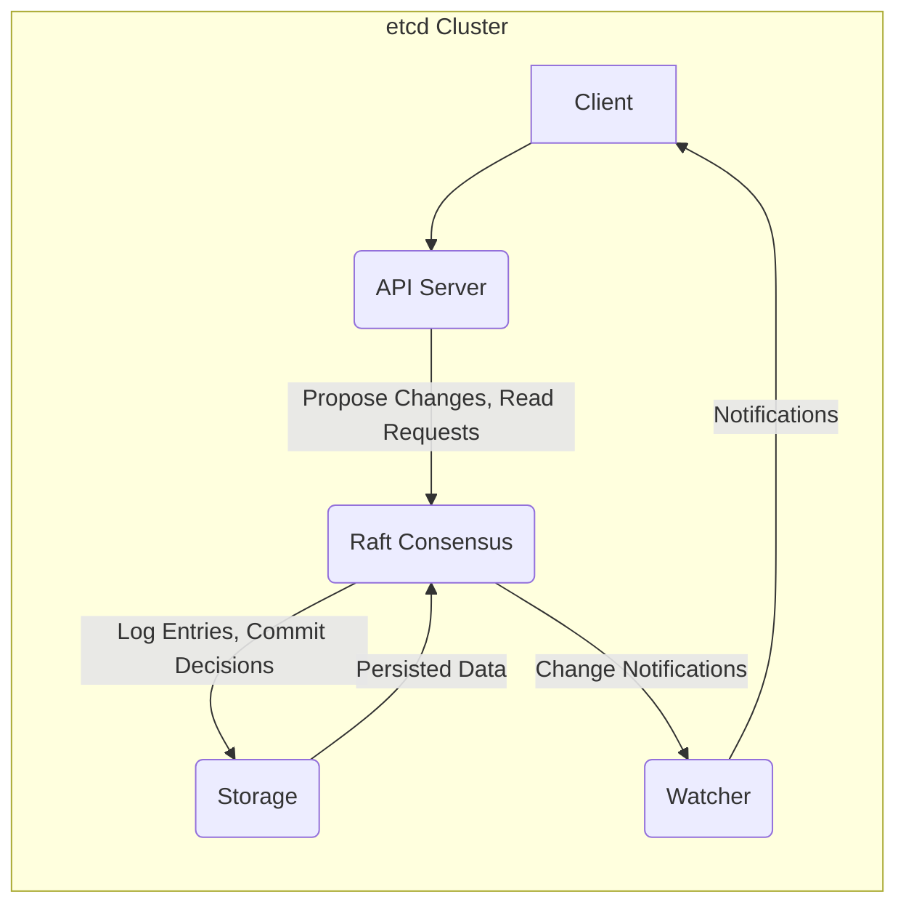
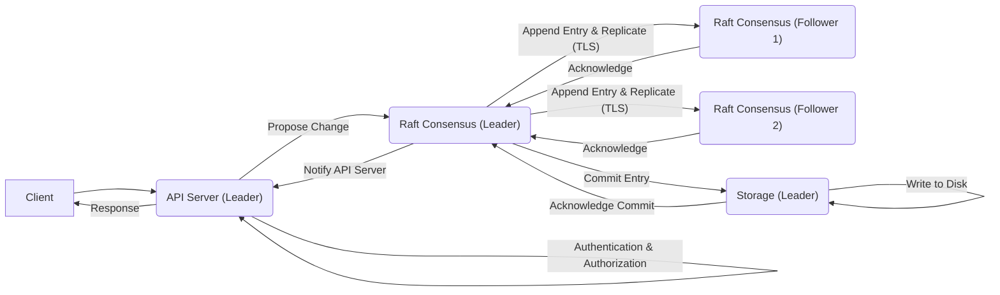
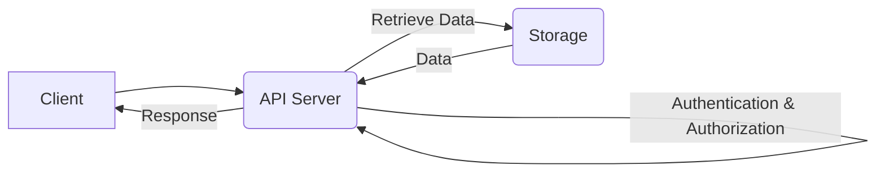
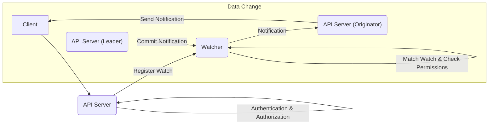

# Project Design Document: etcd (Improved)

**Version:** 2.0
**Date:** October 26, 2023
**Author:** Gemini (AI Language Model)

## 1. Introduction

This document provides an enhanced and more detailed design overview of the etcd project, focusing on aspects relevant to security considerations and threat modeling. etcd is a distributed, reliable key-value store crucial for the most sensitive data in distributed systems. This improved document aims to offer a deeper understanding of etcd's architecture, component interactions, and data flow, specifically tailored for identifying potential security vulnerabilities.

## 2. Goals and Non-Goals

### 2.1. Goals

*   Provide a clear and *more detailed* architectural overview of etcd, emphasizing security-relevant aspects.
*   Describe the key components of etcd and their interactions with a focus on potential attack surfaces.
*   Outline the data flow within the etcd system, highlighting points where data integrity or confidentiality could be compromised.
*   Identify *specific* areas of interest for security considerations and potential threats.
*   Serve as a robust and detailed foundational document for threat modeling activities.

### 2.2. Non-Goals

*   Provide a comprehensive security analysis or a fully realized threat model.
*   Detail *every* implementation detail, focusing on architectural aspects relevant to security.
*   Include operational procedures, deployment guides, or specific configuration instructions.
*   Discuss performance benchmarks, optimization strategies, or non-security related operational aspects.

## 3. High-Level Architecture

etcd operates as a clustered system where multiple nodes collaborate to offer a highly available and consistent key-value store. The interaction between core components is crucial for understanding potential vulnerabilities.

*   **Client:** External applications, services, or command-line tools that interact with etcd to manage key-value data and subscribe to changes.
*   **API Server:** The primary interface for client interactions, responsible for authentication, authorization, request handling, and communication with internal components.
*   **Raft Consensus:** Implements the Raft consensus algorithm to ensure data consistency and fault tolerance across the cluster, managing log replication, leader election, and membership changes.
*   **Storage:** The persistence layer responsible for storing the key-value data and the Raft log on disk.
*   **Watcher:** Enables clients to subscribe to changes on specific keys or prefixes, receiving real-time notifications of modifications.

## 4. Detailed Component Description

### 4.1. Client

*   **Description:** Clients interact with etcd primarily through gRPC or HTTP/JSON APIs.
*   **Responsibilities:**
    *   Submitting requests to create, read, update, and delete key-value pairs.
    *   Establishing and maintaining watch streams for specific keys or prefixes.
    *   Participating in distributed locking and leader election scenarios (if the client is part of a larger distributed system).
*   **Security Considerations:**
    *   Client authentication mechanisms (e.g., TLS client certificates, basic authentication).
    *   Authorization policies enforced on the API Server based on client identity.
    *   Secure storage of client credentials.
    *   Potential for malicious clients to send excessive or malformed requests (DoS).
*   **Key Interactions:** Communicates directly with the API Server over a network.

### 4.2. API Server

*   **Description:** The front-end service of each etcd node, handling all incoming client requests and internal communication.
*   **Responsibilities:**
    *   Receiving and parsing client requests via gRPC or HTTP/JSON.
    *   Authenticating clients using configured mechanisms (e.g., TLS client certificates, static usernames/passwords).
    *   Authorizing client requests based on configured roles and permissions (RBAC).
    *   Validating client requests to prevent malformed or malicious input.
    *   Routing write requests to the Raft Consensus module of the leader node.
    *   Serving read requests from the local Storage module or potentially a read-only replica.
    *   Managing client watch registrations and delivering notifications from the Watcher module.
    *   Exposing metrics and health endpoints.
*   **Security Considerations:**
    *   Vulnerabilities in the API handling logic (e.g., buffer overflows, injection attacks).
    *   Effectiveness of authentication and authorization mechanisms.
    *   Exposure of sensitive information through error messages or API responses.
    *   Protection against unauthorized access to administrative endpoints.
    *   Security of the TLS configuration (e.g., cipher suites, certificate management).
*   **Key Interactions:**
    *   Receives requests from Clients.
    *   Communicates with the Raft Consensus module (especially the leader) for write operations.
    *   Interacts with the local Storage module for read operations.
    *   Manages watch registrations and notifications with the Watcher module.

### 4.3. Raft Consensus

*   **Description:** The core of etcd's fault tolerance and data consistency, implementing the Raft consensus algorithm.
*   **Responsibilities:**
    *   Leader election: Electing a single leader among the healthy nodes in the cluster.
    *   Log replication: Replicating proposed changes (log entries) from the leader to the follower nodes.
    *   Commitment: Ensuring that changes are durably stored and agreed upon by a quorum of nodes before being considered committed.
    *   Membership management: Handling the addition and removal of nodes from the cluster configuration.
*   **Security Considerations:**
    *   Potential for "split-brain" scenarios if network partitioning occurs.
    *   Vulnerabilities in the Raft implementation itself that could lead to data inconsistency or denial of service.
    *   Security of inter-node communication (e.g., using TLS for communication between Raft members).
    *   Protection against malicious nodes attempting to disrupt the consensus process.
    *   The impact of node compromise on the integrity of the consensus.
*   **Key Interactions:**
    *   Receives proposed changes from the API Server of the leader node.
    *   Communicates with other Raft nodes for log replication, voting during leader election, and heartbeat signals.
    *   Writes committed log entries to the local Storage module.
    *   Notifies the local API Server about committed changes.

### 4.4. Storage

*   **Description:** The persistent storage layer responsible for durably storing the key-value data and the Raft log.
*   **Responsibilities:**
    *   Storing and retrieving key-value pairs.
    *   Storing and retrieving Raft log entries in a durable and ordered manner.
    *   Providing transactional guarantees for data modifications within a single node.
    *   Typically uses a disk-based embedded key-value store like BoltDB or a similar solution.
    *   Potentially supporting features like snapshots for backup and recovery.
*   **Security Considerations:**
    *   Security of the underlying storage medium (e.g., disk encryption).
    *   Access control to the storage files to prevent unauthorized modification.
    *   Potential for data corruption due to hardware failures or software bugs.
    *   Security implications of snapshot creation and storage.
    *   Protection against unauthorized access to the storage by compromised processes on the same node.
*   **Key Interactions:**
    *   Receives committed Raft log entries from the local Raft Consensus module.
    *   Provides data for read requests from the local API Server.

### 4.5. Watcher

*   **Description:** Manages client watch requests and efficiently notifies clients of relevant changes.
*   **Responsibilities:**
    *   Maintaining a registry of active watch requests, including the keys or prefixes being watched.
    *   Monitoring committed changes reported by the local Raft Consensus module.
    *   Matching committed changes against the registered watch requests.
    *   Sending notifications to the registered clients about the changes.
    *   Managing the lifecycle of watch streams and handling disconnections.
*   **Security Considerations:**
    *   Potential for information leakage if a client can watch keys they are not authorized to access directly.
    *   Resource consumption by excessive or broad watch requests (DoS potential).
    *   Security of the notification mechanism to prevent tampering or eavesdropping.
    *   Ensuring that notifications are delivered only to authorized clients.
*   **Key Interactions:**
    *   Receives watch registration requests from the local API Server.
    *   Receives notifications of committed changes from the local Raft Consensus module.
    *   Sends notifications to Clients, typically through long-lived connections established by the API Server.

## 5. Data Flow

The following diagrams illustrate the typical data flow for write, read, and watch operations, highlighting potential security checkpoints.

### 5.1. Write Operation (Focus on Leader)

*   Emphasis on authentication/authorization at the API Server and secure communication (TLS) between Raft nodes.

### 5.2. Read Operation

*   Highlights the authentication/authorization check before accessing the storage layer.

### 5.3. Watch Operation

*   Illustrates the permission check before sending notifications to clients.

## 6. Security Considerations (Detailed)

This section provides more specific security considerations and potential threats for each component.

*   **Client:**
    *   **Threat:** Credential compromise leading to unauthorized access.
    *   **Threat:** Malicious clients sending DoS attacks.
    *   **Mitigation:** Strong client authentication, rate limiting, input validation.
*   **API Server:**
    *   **Threat:** Authentication bypass allowing unauthorized access.
    *   **Threat:** Authorization flaws leading to privilege escalation.
    *   **Threat:** Exploitation of vulnerabilities in the API handling logic.
    *   **Threat:** Exposure of sensitive data through insecure API responses.
    *   **Mitigation:** Robust authentication and authorization mechanisms, secure coding practices, input validation, TLS encryption, regular security audits.
*   **Raft Consensus:**
    *   **Threat:** Man-in-the-middle attacks on inter-node communication.
    *   **Threat:** Malicious nodes disrupting the consensus process.
    *   **Threat:** Data inconsistency due to vulnerabilities in the Raft implementation.
    *   **Mitigation:** TLS encryption for inter-node communication, node authentication, quorum requirements, regular security reviews of the Raft implementation.
*   **Storage:**
    *   **Threat:** Unauthorized access to the storage files.
    *   **Threat:** Data corruption or loss due to storage failures or malicious activity.
    *   **Threat:** Exposure of sensitive data if storage is not encrypted.
    *   **Mitigation:** Disk encryption, file system permissions, regular backups, integrity checks.
*   **Watcher:**
    *   **Threat:** Information leakage through unauthorized watch subscriptions.
    *   **Threat:** Resource exhaustion due to excessive watch requests.
    *   **Threat:** Tampering with watch notifications.
    *   **Mitigation:** Enforce authorization on watch requests, implement rate limiting for watch registrations, secure notification channels.

## 7. Deployment Considerations

Security is significantly impacted by deployment choices:

*   **Single-Node Deployment:** Minimal fault tolerance, security relies entirely on the security of the single node.
*   **Clustered Deployment (Within a Trusted Network):** Assumes a secure network environment, but inter-node communication should still be encrypted.
*   **Clustered Deployment (Across Untrusted Networks):** Requires strong authentication and encryption for all communication channels.
*   **Cloud-Based Deployment:** Leverages cloud provider security features, but requires careful management of cloud credentials and network configurations.

## 8. Future Considerations

Potential future changes with security implications:

*   **Integration with External Authentication/Authorization Providers:** Requires careful consideration of trust boundaries and protocol security.
*   **Support for Hardware Security Modules (HSMs):** Introduces new attack vectors related to HSM compromise.
*   **Addition of New API Features:** Requires thorough security review of new endpoints and functionalities.

## 9. Conclusion

This improved design document provides a more detailed and security-focused overview of the etcd project. By elaborating on component responsibilities, interactions, and data flow, and by outlining specific security considerations and potential threats, this document serves as a more robust foundation for conducting comprehensive threat modeling activities. Understanding these architectural details is crucial for identifying and mitigating potential security risks in systems that rely on etcd.