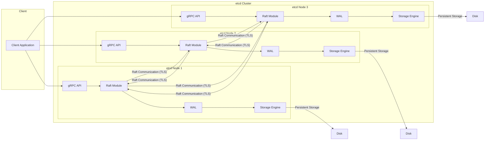

# Project Design Document: etcd - Distributed Key-Value Store

**Version:** 1.1
**Date:** October 26, 2023
**Author:** AI Software Architecture Expert
**Project:** etcd - Distributed Reliable Key-Value Store for distributed systems.
**GitHub Repository:** [https://github.com/etcd-io/etcd](https://github.com/etcd-io/etcd)

## 1. Introduction

This document provides a detailed design overview of etcd, a distributed, reliable key-value store for distributed systems. It is specifically crafted to serve as a foundational document for threat modeling and security analysis. This document meticulously outlines the system's architecture, components, data flow, and critical security considerations. The primary objective is to deliver a comprehensive understanding of etcd's internal workings from both architectural and security standpoints, enabling effective threat identification and mitigation planning.

## 2. Goals and Objectives

The core design goals of etcd are centered around providing a robust and dependable distributed key-value store:

* **Reliability (Data Consistency and Durability):** Guarantee data consistency across the cluster and ensure data persistence even in the face of network disruptions, hardware failures, and software errors. This is achieved through the Raft consensus algorithm.
* **Availability (Continuous Service):** Maintain continuous service availability to client applications, minimizing downtime and ensuring uninterrupted access to the key-value store.
* **Scalability (Horizontal Scaling):** Support horizontal scalability to accommodate increasing data volumes, client request rates, and cluster size. etcd is designed to scale by adding more nodes to the cluster.
* **Simplicity (Ease of Use and Operation):** Offer a straightforward and intuitive API for developers and a simplified operational model for administrators, reducing complexity in integration and management.
* **Security (Confidentiality, Integrity, Availability):** Protect data confidentiality through encryption, ensure data integrity against corruption or unauthorized modification, and maintain system availability against denial-of-service attacks and other threats.

This design document is specifically focused on supporting security analysis, with the primary objective of facilitating effective threat modeling. The key objectives of this document are:

* **Detailed and Granular Architectural Description:** Provide an in-depth description of etcd's architecture, clearly defining all components, their interactions, and the flow of data within the system. This includes both logical and physical aspects where relevant.
* **Precise Identification of Trust Boundaries:** Clearly delineate the trust boundaries within the etcd system. This highlights areas where security controls are paramount and where trust assumptions are made between different components and actors.
* **Comprehensive Data Flow Mapping:** Trace the complete flow of data through the system for various operations (read, write, cluster management). This mapping is crucial for identifying potential points of data interception, manipulation, or leakage.
* **Robust Foundation for Threat Modeling:** Deliver a well-structured, detailed, and comprehensive description of etcd that serves as a solid foundation for conducting thorough and effective threat modeling exercises. This document aims to provide all necessary information for security experts to identify potential vulnerabilities and design mitigations.
* **Security Feature Inventory:** Document the built-in security features and mechanisms within etcd, such as authentication, authorization, encryption, and audit logging, to understand the existing security posture.

## 3. System Architecture

etcd's architecture is based on a distributed, clustered design leveraging the Raft consensus algorithm to achieve strong consistency and high fault tolerance.  The system is conceptually layered to separate concerns:

* **Client API Layer (gRPC):**  Provides the external interface for client applications to interact with the etcd cluster. This layer handles client requests and responses using the gRPC framework.
* **Raft Consensus Layer (Raft Module):** Implements the core Raft consensus algorithm. This layer is responsible for leader election, log replication, ensuring data consistency across the cluster, and managing cluster membership changes.
* **Storage Layer (Storage Engine):** Manages the persistent storage of data on disk and provides efficient in-memory data structures for fast access. This layer is responsible for data durability and retrieval.
* **WAL (Write-Ahead Log):**  A critical component for durability in Raft. All proposed changes are first written to the WAL before being applied to the storage engine. This ensures that even in case of crashes, committed changes are not lost.
* **Snapshotting:**  A mechanism to compact the Raft log by periodically taking snapshots of the current state. This reduces log size and improves recovery time.

### 3.1. High-Level Architecture Diagram



**Diagram Description Enhancements:**

* **Client Application:** Represents external applications (services, tools, etc.) that interact with the etcd cluster to store and retrieve configuration data, coordination information, or service discovery details.
* **etcd Cluster:** A group of etcd nodes working collaboratively to provide a highly available and consistent key-value store. The cluster size is typically odd (e.g., 3, 5, 7 nodes) to ensure quorum in leader election and consensus.
* **etcd Node:** An individual server instance running the etcd software. Each node is a peer in the cluster and participates in Raft consensus.
    * **gRPC API:** The entry point for client requests. It handles gRPC requests, performs authentication and authorization, and forwards requests to the Raft module.
    * **Raft Module:** The core consensus engine. It manages leader election, log replication, and ensures consistency across the cluster.  Communication between Raft modules is secured with TLS.
    * **WAL (Write-Ahead Log):**  Ensures durability of committed transactions. Every transaction is written to the WAL before being applied to the storage engine.
    * **Storage Engine:**  Persists the key-value data to disk.  Typically uses bbolt, an embedded key-value database.
* **Raft Communication (TLS):** Network communication between Raft modules on different etcd nodes. This communication is secured using TLS to protect the confidentiality and integrity of Raft messages.
* **Persistent Storage (Disk):** Local disk storage for each etcd node. Stores the WAL, snapshots, and the data managed by the storage engine.

## 4. Component Details and Interactions

### 4.1. Client API Layer (gRPC API)

* **Functionality (Detailed):**
    * **gRPC Interface:** Exposes a well-defined gRPC API for client interaction, ensuring language independence and efficient communication.
    * **Request Handling:** Receives client requests (Put, Get, Delete, Watch, Txn, Lease, etc.) over gRPC.
    * **Authentication:** Enforces client authentication using various methods:
        * **TLS Client Certificates (Mutual TLS - mTLS):**  Strongest form of authentication, verifying both client and server identities using certificates.
        * **Username/Password Authentication:**  Basic authentication using username and password credentials.
        * **JWT (JSON Web Tokens):** Supports token-based authentication using JWT for stateless and scalable authentication.
    * **Authorization (RBAC):** Implements Role-Based Access Control (RBAC) to manage client permissions. Defines roles and associates permissions (read, write, admin) with these roles. Clients are assigned roles, and access is granted based on their assigned roles and the requested operation.
    * **Request Validation:** Performs input validation on client requests to prevent common vulnerabilities like injection attacks and ensure data integrity. Validates data types, sizes, and formats.
    * **Rate Limiting and Request Quotas:** Can be configured to limit the rate of client requests and enforce quotas to prevent resource exhaustion and denial-of-service attacks.
    * **TLS Termination:** Handles TLS termination for incoming client connections, decrypting traffic and ensuring secure communication from client to etcd node.
    * **API Versioning:** Supports API versioning to allow for backward compatibility and controlled evolution of the API.

* **Security Considerations (Enhanced):**
    * **Authentication Bypass:** Vulnerabilities in authentication mechanisms could allow unauthorized clients to access etcd. Thorough testing and secure configuration are crucial.
    * **Authorization Bypass:** Flaws in RBAC implementation or configuration could lead to clients gaining unauthorized access to data or operations. Regular audits of RBAC policies are necessary.
    * **Injection Attacks:**  Insufficient input validation could expose etcd to injection attacks (e.g., command injection, NoSQL injection). Robust input validation is essential.
    * **Denial of Service (DoS):**  Lack of rate limiting or resource quotas could make etcd vulnerable to DoS attacks from malicious clients or compromised accounts. Proper configuration of rate limiting and resource management is critical.
    * **Man-in-the-Middle (MitM) Attacks:**  Failure to use TLS or weak TLS configurations can expose client-etcd communication to MitM attacks, compromising confidentiality and integrity. Enforce strong TLS configurations and certificate validation.
    * **Credential Theft/Compromise:** Weak password policies or insecure storage of credentials can lead to credential theft and unauthorized access. Enforce strong password policies and consider using certificate-based authentication where possible.

### 4.2. Raft Consensus Layer (Raft Module)

* **Functionality (Detailed):**
    * **Leader Election (Lease-based):**  Uses a lease-based leader election mechanism to ensure that only one leader exists at any time. Leaders are elected for a specific term, and followers must renew the leader's lease to maintain leadership.
    * **Log Replication (Append Entries):** Replicates proposed changes (log entries) from the leader to followers using `AppendEntries` messages. Ensures that a majority of nodes have the same log.
    * **Commitment (Quorum-based):**  Commits log entries once a quorum (majority) of followers have acknowledged receipt and persistence of the entry. This guarantees strong consistency.
    * **Membership Management (Add/Remove Nodes):**  Handles cluster membership changes dynamically, allowing nodes to be added or removed without service interruption. Raft ensures that membership changes are also part of the consensus process.
    * **Snapshotting (Log Compaction):** Periodically creates snapshots of the current etcd state to truncate the Raft log. This reduces log size, improves performance, and speeds up recovery. Snapshots are also replicated to new followers joining the cluster.
    * **Data Consistency (Linearizability):**  Raft ensures linearizability, meaning that operations appear to be executed instantaneously and in a consistent order across all clients.
    * **Fault Tolerance:**  Tolerates node failures (up to (N-1)/2 failures in a cluster of N nodes) without losing data or compromising consistency.

* **Security Considerations (Enhanced):**
    * **Raft Message Interception/Manipulation:**  Unencrypted Raft communication could allow attackers to intercept and potentially manipulate Raft messages, disrupting consensus or injecting malicious data. **Mutual TLS (mTLS) for Raft communication is mandatory for secure deployments.**
    * **Replay Attacks:**  Without proper sequencing and integrity checks, attackers might replay old Raft messages to revert the state of the cluster. Raft protocol includes mechanisms to prevent replay attacks, but implementation vulnerabilities could exist.
    * **Denial of Service (DoS) on Raft Communication:**  Flooding Raft communication channels with excessive messages could disrupt consensus and lead to DoS. Network security measures and rate limiting at the network level are important.
    * **Leader Compromise:**  Compromise of the leader node is a critical security risk. An attacker controlling the leader could potentially manipulate data, disrupt the cluster, or leak sensitive information. Strong node security and access control are essential.
    * **Split-Brain Scenarios:**  Although Raft is designed to prevent split-brain, misconfigurations or network partitions could theoretically lead to scenarios where the cluster becomes partitioned and data consistency is compromised. Proper network configuration and monitoring are crucial.
    * **Membership Change Vulnerabilities:**  Vulnerabilities in the membership change protocol could be exploited to disrupt the cluster or gain unauthorized access. Secure implementation and testing of membership change procedures are important.

### 4.3. Storage Layer (Storage Engine)

* **Functionality (Detailed):**
    * **Persistent Key-Value Storage:** Provides durable storage for key-value data, ensuring data persistence across restarts and failures.
    * **Efficient Data Retrieval:**  Optimized for fast key-based lookups and range queries.
    * **Transactional Operations (Within a Node):** Supports transactional operations within a single etcd node, ensuring atomicity and consistency of local data modifications.
    * **Data Compaction and Defragmentation:**  Performs data compaction and defragmentation to reclaim storage space and improve performance over time.
    * **Snapshot Management:**  Handles the storage and retrieval of snapshots for Raft log compaction and cluster recovery.
    * **Data Integrity Checks:**  Implements checksums and other mechanisms to ensure data integrity and detect data corruption.

* **Security Considerations (Enhanced):**
    * **Data at Rest Exposure:**  Unencrypted data at rest on disk is vulnerable to exposure if the storage media is physically compromised or if there is unauthorized access to the server's file system. **Data at rest encryption is highly recommended for sensitive data.**
    * **Unauthorized File System Access:**  Incorrect file system permissions on etcd's data directory could allow unauthorized users or processes on the server to access or modify etcd data directly, bypassing authentication and authorization. **Restrict file system permissions to the etcd process user only.**
    * **Data Corruption:**  Storage engine vulnerabilities or hardware failures could lead to data corruption. Data integrity checks and regular backups are essential to mitigate this risk.
    * **Backup Security:**  Backups of etcd data also need to be secured. Unencrypted backups stored in insecure locations could expose sensitive data. **Encrypt backups and store them in secure locations with appropriate access controls.**
    * **Secrets Management (Encryption Keys):**  If data at rest encryption is used, the encryption keys themselves need to be securely managed. Weak key management practices can negate the benefits of encryption. **Use secure key management solutions (e.g., dedicated key management systems, hardware security modules) for encryption keys.**
    * **Vulnerabilities in Storage Engine:**  Vulnerabilities in the underlying storage engine (e.g., bbolt) could be exploited to compromise data integrity or confidentiality. Keep the storage engine updated and monitor for security advisories.

## 5. Data Flow (Detailed and Security Focused)

### 5.1. Secure Write Request Flow (Put Operation with TLS)

```mermaid
sequenceDiagram
    participant Client
    participant TLS Channel (Client -> gRPC API)
    participant gRPC API (Leader)
    participant Raft Module (Leader)
    participant WAL (Leader)
    participant Storage Engine (Leader)
    participant TLS Channel (Raft Leader -> Raft Follower)
    participant Raft Module (Follower)
    participant WAL (Follower)
    participant Storage Engine (Follower)

    Client->>TLS Channel (Client -> gRPC API): Put Request (key, value) - Encrypted
    TLS Channel (Client -> gRPC API) ->> gRPC API (Leader): Put Request (key, value) - Decrypted
    gRPC API (Leader) -->> Raft Module (Leader): Authentication & Authorization
    Raft Module (Leader)->>WAL (Leader): Append Entry (key, value)
    WAL (Leader) ->> Storage Engine (Leader): (Async) Apply Log Entry
    Raft Module (Leader)->>TLS Channel (Raft Leader -> Raft Follower): Append Entries (Log Entry) - Encrypted
    TLS Channel (Raft Leader -> Raft Follower) ->> Raft Module (Follower): Append Entries (Log Entry) - Decrypted
    Raft Module (Follower) ->> WAL (Follower): Append Entry (Log Entry)
    WAL (Follower) ->> Storage Engine (Follower): (Async) Apply Log Entry
    Storage Engine (Follower) -->> Raft Module (Follower): Ack
    Raft Module (Leader) -->> gRPC API (Leader): Commit Success
    gRPC API (Leader) -->> TLS Channel (Client -> gRPC API): Put Response (Success) - Encrypted
    TLS Channel (Client -> gRPC API) -->> Client: Put Response (Success) - Decrypted
```

**Data Flow Description Enhancements (Security Focus):**

1. **Client sends Encrypted Put Request:** Client initiates a TLS-encrypted connection to the etcd gRPC API and sends a `Put` request. TLS ensures confidentiality and integrity of data in transit.
2. **TLS Decryption at gRPC API:** The gRPC API layer terminates the TLS connection, decrypts the request, and verifies the TLS certificate if using mTLS for client authentication.
3. **Authentication and Authorization:** The gRPC API performs authentication of the client (e.g., using TLS client certificates, username/password, JWT) and authorization based on RBAC policies to ensure the client has permission to perform the `Put` operation.
4. **Append to Leader WAL:** The Raft module on the leader appends the proposed `Put` operation as a log entry to its Write-Ahead Log (WAL). Writing to WAL ensures durability before further processing.
5. **Asynchronous Apply to Leader Storage:**  The Storage Engine asynchronously applies the committed log entry from the WAL to the persistent storage.
6. **Encrypted Raft Replication:** The Raft leader initiates a TLS-encrypted connection to follower nodes and sends `AppendEntries` messages containing the log entry to be replicated. TLS secures Raft inter-node communication.
7. **TLS Decryption at Follower Raft Module:** Follower nodes' Raft modules decrypt the `AppendEntries` messages received over TLS.
8. **Append to Follower WAL:** Follower nodes append the received log entry to their local WALs.
9. **Asynchronous Apply to Follower Storage:** Follower Storage Engines asynchronously apply the committed log entry from their WALs to persistent storage.
10. **Acknowledgement from Followers:** Followers send acknowledgements back to the leader upon successful persistence of the log entry.
11. **Commit Success and Response:** Once the leader receives acknowledgements from a quorum of followers, the Raft module marks the entry as committed and informs the gRPC API. The gRPC API sends an encrypted success response back to the client over the TLS channel.
12. **TLS Decryption at Client:** The client receives the TLS-encrypted response and decrypts it.

### 5.2. Secure Read Request Flow (Get Operation with TLS)

```mermaid
sequenceDiagram
    participant Client
    participant TLS Channel (Client -> gRPC API)
    participant gRPC API (Any Node)
    participant Storage Engine (Any Node)
    participant TLS Channel (gRPC API -> Client)

    Client->>TLS Channel (Client -> gRPC API): Get Request (key) - Encrypted
    TLS Channel (Client -> gRPC API) ->> gRPC API (Any Node): Get Request (key) - Decrypted
    gRPC API (Any Node) -->> Storage Engine (Any Node): Authentication & Authorization (Read)
    Storage Engine (Any Node) -->> gRPC API (Any Node): Value
    gRPC API (Any Node) -->> TLS Channel (gRPC API -> Client): Get Response (Value) - Encrypted
    TLS Channel (gRPC API -> Client) -->> Client: Get Response (Value) - Decrypted
```

**Data Flow Description Enhancements (Security Focus):**

1. **Client sends Encrypted Get Request:** Client initiates a TLS-encrypted connection and sends a `Get` request.
2. **TLS Decryption at gRPC API:** The gRPC API layer decrypts the request.
3. **Authentication and Authorization (Read):** The gRPC API performs authentication and authorization to ensure the client has read access to the requested key. RBAC policies are enforced.
4. **Retrieve Value from Storage Engine:** The gRPC API retrieves the value associated with the key from the local Storage Engine.
5. **Encrypted Get Response:** The gRPC API encrypts the retrieved value and constructs a gRPC response.
6. **TLS Encryption and Response to Client:** The gRPC API sends the TLS-encrypted response back to the client.
7. **TLS Decryption at Client:** The client receives and decrypts the TLS-encrypted response to access the requested value.

## 6. Trust Boundaries (Refined)

* **Client Application <-> etcd Cluster (gRPC API):**  This is a critical trust boundary. Security controls here include:
    * **Mutual TLS (mTLS) for strong authentication.**
    * **RBAC for fine-grained authorization.**
    * **Input validation to prevent injection attacks.**
    * **Rate limiting to mitigate DoS attacks.**
    * **Audit logging of API access.**
* **etcd Node <-> etcd Node (Raft Communication):**  Another critical trust boundary. Security controls:
    * **Mutual TLS (mTLS) for Raft communication to secure inter-node traffic.**
    * **Raft protocol's inherent integrity checks.**
    * **Network segmentation to isolate Raft traffic.**
    * **Monitoring of Raft communication for anomalies.**
* **etcd Node (gRPC API) <-> etcd Node (Raft Module):** Internal trust boundary within a node.  Assumed to be a high-trust zone, but vulnerabilities within the node could still be exploited. Security considerations:
    * **Secure coding practices within etcd codebase.**
    * **Process isolation within the node (if applicable).**
    * **Regular security audits of etcd code.**
* **etcd Node (Raft Module) <-> etcd Node (WAL/Storage Engine):** Internal trust boundary.  High-trust zone, but local vulnerabilities are possible. Security considerations:
    * **Secure coding practices in Raft and Storage Engine modules.**
    * **Data integrity checks within the storage layer.**
    * **Protection against local privilege escalation.**
* **etcd Node (Storage Engine) <-> Persistent Storage (Disk):** Trust boundary related to data at rest. Security controls:
    * **Data at rest encryption to protect data on disk.**
    * **File system permissions to restrict access to data files.**
    * **Physical security of the storage media.**
* **Operator/Administrator <-> etcd Cluster (Admin API/etcdctl):** Trust boundary for administrative access. Security controls:
    * **Strong authentication for administrative access (e.g., certificate-based authentication).**
    * **Authorization for administrative operations.**
    * **Audit logging of administrative actions.**
    * **Secure channels for administrative tools (e.g., TLS for etcdctl).**
    * **Principle of least privilege for administrative roles.**

## 7. Security Considerations (Detailed)

This section expands on the initial security considerations and provides more granular details.

* **Authentication and Authorization (In-depth):**
    * **Authentication Mechanisms:** etcd supports TLS client certificates (mTLS), username/password, and JWT tokens. mTLS is the strongest option for production environments. Choose the authentication method based on security requirements and operational complexity.
    * **RBAC Implementation:** etcd's RBAC system allows defining roles with specific permissions (e.g., read-only, read-write, admin) and assigning these roles to users or clients. Properly configure RBAC policies to enforce the principle of least privilege. Regularly review and update RBAC policies as needed.
    * **Credential Management:** Securely manage credentials (passwords, private keys for certificates, JWT secrets). Avoid storing credentials in plaintext. Use secrets management solutions where appropriate. Rotate credentials regularly.
* **Data in Transit Protection (TLS Configuration):**
    * **TLS for Client-to-etcd Communication:** Enforce TLS for all client connections to etcd. Use strong TLS versions (TLS 1.2 or higher) and cipher suites. Disable weak or insecure cipher suites.
    * **TLS for Inter-Node (Raft) Communication:** **Mandatory to enable TLS for Raft communication in production environments.** Configure mutual TLS (mTLS) for Raft to ensure both confidentiality and authentication between etcd nodes.
    * **Certificate Management:** Implement a robust certificate management process for issuing, distributing, and rotating TLS certificates. Use a trusted Certificate Authority (CA) or a self-signed CA with secure distribution mechanisms.
* **Data at Rest Protection (Encryption):**
    * **Data at Rest Encryption Options:** etcd supports data at rest encryption. Explore available options and choose an appropriate encryption method based on performance and security requirements. Consider using encryption at the storage engine level or at the file system level.
    * **Key Management for Data at Rest Encryption:** Securely manage encryption keys for data at rest. Use dedicated key management systems (KMS) or hardware security modules (HSM) for key storage and management. Implement key rotation policies.
* **Access Control to Storage (File System Permissions):**
    * **Restrict File System Permissions:**  Configure file system permissions on etcd's data directory to restrict access to the etcd process user and root user only. Prevent unauthorized users or processes from accessing or modifying etcd data files directly.
    * **Regularly Audit File System Permissions:** Periodically audit file system permissions to ensure they are correctly configured and haven't been inadvertently changed.
* **Secure Configuration (Hardening):**
    * **Minimize Exposed Ports and Services:**  Only expose necessary ports and services. Disable any unnecessary features or services to reduce the attack surface.
    * **Disable Unnecessary APIs:** If certain APIs are not required, disable them to limit potential attack vectors.
    * **Security Auditing and Logging:** Enable comprehensive audit logging to track API access, administrative actions, and security-related events. Regularly review audit logs for suspicious activity.
    * **Security Updates and Patching:**  Keep etcd and its dependencies up-to-date with the latest security patches. Regularly monitor for security advisories and apply patches promptly.
    * **Security Benchmarking and Hardening Guides:** Follow security benchmarking guidelines (e.g., CIS benchmarks) and hardening guides for etcd to configure it securely.
* **Operational Security (Best Practices):**
    * **Principle of Least Privilege:** Apply the principle of least privilege to all accounts and roles accessing etcd. Grant only the necessary permissions required for each user or application.
    * **Regular Security Audits and Penetration Testing:** Conduct regular security audits and penetration testing to identify vulnerabilities and weaknesses in etcd deployments.
    * **Incident Response Plan:** Develop and maintain an incident response plan for security incidents related to etcd.
    * **Monitoring and Alerting:** Implement robust monitoring and alerting for etcd health, performance, and security events. Set up alerts for suspicious activity or security violations.
    * **Backup and Disaster Recovery:** Implement regular backups of etcd data and have a disaster recovery plan in place to restore etcd in case of failures or data loss. Secure backup procedures are crucial.
* **Denial of Service (DoS) Mitigation:**
    * **Rate Limiting:** Configure rate limiting at the gRPC API layer to limit the number of requests from clients, preventing DoS attacks.
    * **Resource Quotas:** Set resource quotas to limit the resources consumed by individual clients or operations, preventing resource exhaustion.
    * **Network Security Measures:** Implement network security measures (firewalls, intrusion detection/prevention systems) to protect etcd from network-based DoS attacks.
* **Supply Chain Security (Dependency Management):**
    * **Dependency Scanning:** Regularly scan etcd dependencies for known vulnerabilities.
    * **Secure Build Pipeline:** Ensure a secure build pipeline for etcd to prevent the introduction of malicious code during the build process.
    * **Verification of Binaries:** Verify the integrity and authenticity of etcd binaries using checksums and digital signatures.

## 8. Deployment Model (Security Implications)

The chosen deployment model significantly impacts security considerations:

* **On-Premise Deployment:**
    * **Security Responsibility:** Organization has full responsibility for securing the entire etcd stack, including infrastructure, network, servers, and etcd software.
    * **Network Security:** Requires careful network segmentation, firewall configuration, and intrusion detection/prevention systems to protect etcd.
    * **Physical Security:** Physical security of the data center and servers hosting etcd is crucial.
    * **Access Control:** Organization manages all access control mechanisms.
* **Cloud Deployment (IaaS):**
    * **Shared Responsibility Model:** Cloud provider manages the underlying infrastructure security, while the organization is responsible for securing the etcd instances, network configuration within the cloud environment, and access control.
    * **Cloud Security Features:** Leverage cloud provider security features (e.g., security groups, network ACLs, IAM) to enhance etcd security.
    * **Data Location and Compliance:** Consider data location and compliance requirements when choosing a cloud region.
* **Managed Kubernetes (e.g., EKS, GKE, AKS):**
    * **Simplified Deployment and Management:** Managed Kubernetes simplifies etcd deployment and management. Cloud provider often handles some aspects of etcd management.
    * **Security Integration with Kubernetes:** etcd security can be integrated with Kubernetes security mechanisms (e.g., Kubernetes RBAC, network policies, secrets management).
    * **Provider Security Posture:** Rely on the security posture of the managed Kubernetes provider.
    * **Configuration Complexity:**  Security configuration can be more complex within a Kubernetes environment.
* **Self-Managed Kubernetes:**
    * **Flexibility and Control:** Offers maximum flexibility and control over etcd deployment and security configuration.
    * **Increased Management Overhead:** Requires more effort for deployment, management, and security configuration compared to managed Kubernetes.
    * **Security Responsibility:** Organization is responsible for securing both the Kubernetes cluster and the etcd deployment within it.

## 9. Technologies Used (Security Relevance)

* **Go (Golang):** Memory-safe language, reducing the risk of certain types of vulnerabilities (e.g., buffer overflows). Security of Go standard library and dependencies is important.
* **gRPC:**  Uses Protocol Buffers for serialization, which is generally considered efficient and secure. gRPC supports TLS for secure communication. Security of gRPC implementation and dependencies is relevant.
* **Raft:**  Well-established consensus algorithm with known security properties. Security depends on correct implementation and secure communication channels.
* **bbolt (or BoltDB):** Embedded key-value store. Security considerations include data at rest encryption, file system access control, and potential vulnerabilities in bbolt itself.
* **Protocol Buffers (protobuf):** Efficient serialization format. Security considerations are generally less critical compared to other components, but vulnerabilities in protobuf libraries could still have impact.
* **TLS, x509 certificates, RBAC:** Core security technologies used by etcd. Proper configuration and management of these technologies are crucial for overall etcd security.

## 10. Threat Modeling Process using this Document

This design document is structured to directly support the threat modeling process. Here's how each section contributes:

* **Introduction, Goals and Objectives:** Provides context and scope for the threat model. Defines what etcd is, its purpose, and key security goals.
* **System Architecture and Component Details:**  These sections are crucial for **decomposition** in threat modeling methodologies like STRIDE or PASTA. They provide a detailed breakdown of the system into components, their functionalities, and interactions. This allows for identifying attack surfaces and potential entry points.
* **Data Flow Diagrams:**  Essential for understanding **data flow** and identifying potential points of data interception, modification, or leakage. Data flow diagrams help visualize how data moves through the system and where security controls are needed.
* **Trust Boundaries:** Explicitly identifying trust boundaries is a core part of threat modeling. These boundaries highlight areas where security controls are most critical and where trust assumptions need to be carefully examined.
* **Security Considerations (Detailed):** This section provides a preliminary list of potential threats and security concerns. It serves as a starting point for brainstorming and identifying more specific threats during the threat modeling exercise.
* **Deployment Model and Technologies Used:**  These sections provide context about the environment in which etcd operates and the technologies it relies on. This information is important for understanding the overall threat landscape and potential vulnerabilities related to the deployment environment and underlying technologies.

**Using this document for STRIDE Threat Modeling:**

1. **Identify Components:** Use Section 4 (Component Details) to list all etcd components (gRPC API, Raft Module, Storage Engine, WAL).
2. **Identify Data Flows:** Use Section 5 (Data Flow) and diagrams to map data flows for different operations (Put, Get).
3. **Apply STRIDE Categories to each Component and Data Flow:** For each component and data flow, brainstorm potential threats based on the STRIDE categories:
    * **Spoofing:** Can an attacker impersonate a legitimate component or user? (e.g., Spoofing a client, spoofing an etcd node).
    * **Tampering:** Can data be modified in transit or at rest without detection? (e.g., Tampering with Raft messages, tampering with data on disk).
    * **Repudiation:** Can a user deny performing an action? (Less relevant for etcd core, more relevant for audit logging and access control).
    * **Information Disclosure:** Can sensitive information be leaked to unauthorized parties? (e.g., Data breaches, exposure of secrets, logging sensitive data).
    * **Denial of Service:** Can the system be made unavailable to legitimate users? (e.g., DoS attacks on API, DoS attacks on Raft communication, resource exhaustion).
    * **Elevation of Privilege:** Can an attacker gain higher privileges than intended? (e.g., Exploiting authorization bypass vulnerabilities, privilege escalation within the node).
4. **Document Threats and Mitigations:**  For each identified threat, document it clearly and propose potential mitigations. This document provides a starting point for mitigation strategies in Section 7 and 8.

## 11. Conclusion

This enhanced design document provides a more detailed and security-focused overview of etcd. It is intended to be a valuable resource for security professionals conducting threat modeling and security assessments of etcd deployments. By leveraging the information presented here, organizations can better understand the security architecture of etcd, identify potential threats, and implement appropriate security controls to protect their etcd clusters and the critical data they store.

---
**Disclaimer:** This document is based on publicly available information and general understanding of etcd architecture as of the document creation date. For the most accurate and up-to-date information, please refer to the official etcd documentation and source code repository. Always consult with security experts for specific security assessments and recommendations tailored to your environment.