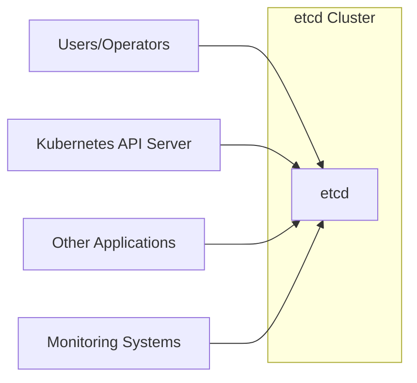
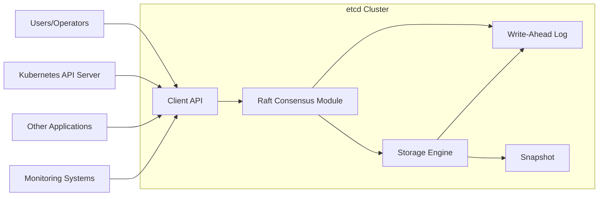
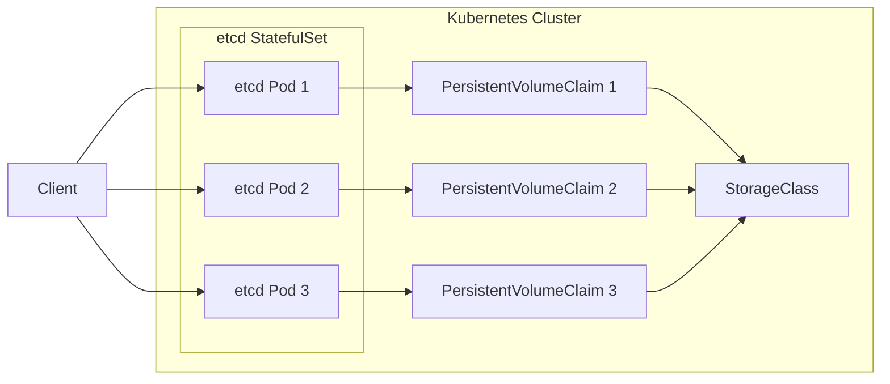

Okay, let's create a design document for etcd based on the provided GitHub repository.

# BUSINESS POSTURE

etcd is a distributed key-value store designed to provide a reliable way to store data across a cluster of machines. It's a critical component for many distributed systems, particularly those built on Kubernetes.

Priorities and Goals:

*   Provide a highly available and consistent data store for configuration management, service discovery, and distributed synchronization.
*   Ensure data durability and fault tolerance.
*   Offer a simple, well-defined API for interacting with the store.
*   Maintain strong consistency guarantees (linearizability).
*   Support a watch mechanism for real-time updates.
*   Be performant under various workloads.

Business Risks:

*   Data Loss or Corruption: As a critical data store, any loss or corruption of data within etcd can have cascading effects on the systems that rely on it, potentially leading to widespread outages or incorrect behavior.
*   Availability Outages: Downtime of the etcd cluster can render dependent systems unable to function correctly, especially in dynamic environments where configuration changes and service discovery are frequent.
*   Security Breaches: Unauthorized access to etcd could expose sensitive configuration data, secrets, or allow malicious actors to manipulate the state of the distributed system.
*   Performance Bottlenecks: Slow performance of etcd can impact the responsiveness and scalability of the entire system relying on it.
*   Inconsistency Issues: Violations of consistency guarantees can lead to unpredictable behavior in distributed systems, making debugging and recovery extremely difficult.
*   Operational Complexity: Difficulty in managing, monitoring, and operating the etcd cluster can increase operational overhead and the risk of human error.

# SECURITY POSTURE

Existing Security Controls (based on the repository and common practices):

*   security control: TLS Encryption: etcd supports TLS for both client-to-server and peer-to-peer communication, encrypting data in transit. Implemented via configuration options and command-line flags.
*   security control: Authentication: etcd supports client certificate authentication, preventing unauthorized access to the cluster. Implemented via configuration options and command-line flags.
*   security control: Role-Based Access Control (RBAC): etcd provides RBAC to limit the operations that authenticated users can perform. Implemented via etcd's authentication and authorization mechanisms. Described in the security documentation.
*   security control: Auditing: etcd can be configured to log all requests, providing an audit trail for security analysis. Implemented via configuration options.
*   security control: Regular Security Audits and Penetration Testing: The etcd project undergoes periodic security audits and penetration testing. Described in security reports and community discussions.
*   security control: Dependency Management: The project uses Go modules, which helps manage dependencies and their vulnerabilities. Described in `go.mod` and `go.sum` files.
*   security control: Static Analysis: The project likely uses static analysis tools to identify potential security vulnerabilities in the codebase. Inferred from best practices and CI/CD pipelines.
*   security control: Fuzz Testing: etcd uses fuzz testing to find potential bugs and vulnerabilities. Described in the fuzzing documentation.

Accepted Risks:

*   accepted risk: Complexity of Secure Configuration: Properly configuring etcd for secure operation (TLS, authentication, RBAC) can be complex, and misconfigurations can lead to security vulnerabilities.
*   accepted risk: Operational Overhead: Managing a secure etcd cluster requires ongoing monitoring, maintenance, and security updates.
*   accepted risk: Potential for Zero-Day Exploits: Like any software, etcd is susceptible to zero-day vulnerabilities that may be exploited before patches are available.

Recommended Security Controls:

*   Network Segmentation: Isolate the etcd cluster on a dedicated network segment to limit exposure to other systems.
*   Regular Vulnerability Scanning: Implement automated vulnerability scanning of the etcd cluster and its dependencies.
*   Intrusion Detection System (IDS): Deploy an IDS to monitor network traffic to and from the etcd cluster for suspicious activity.
*   Secrets Management: Integrate etcd with a secrets management solution (e.g., HashiCorp Vault) to securely store and manage sensitive configuration data.

Security Requirements:

*   Authentication:
    *   All clients and peers must authenticate using strong authentication mechanisms (e.g., client certificates).
    *   Support for multiple authentication providers (e.g., static users, external identity providers).
*   Authorization:
    *   Implement fine-grained RBAC to control access to specific keys and operations.
    *   Regularly review and update access control policies.
*   Input Validation:
    *   Validate all client inputs to prevent injection attacks or unexpected behavior.
    *   Enforce key naming conventions and data size limits.
*   Cryptography:
    *   Use strong cryptographic algorithms and protocols (e.g., TLS 1.3 or higher).
    *   Regularly rotate cryptographic keys.
    *   Protect private keys using secure storage mechanisms (e.g., HSMs).
*   Auditing:
    *   Log all successful and failed requests, including user, operation, and data accessed.
    *   Securely store and protect audit logs.

# DESIGN

## C4 CONTEXT



Element Descriptions:

*   Element:
    *   Name: etcd
    *   Type: Distributed key-value store
    *   Description: The core etcd system, providing a consistent and highly available data store.
    *   Responsibilities: Storing data, managing cluster membership, handling client requests, ensuring data consistency and durability.
    *   Security controls: TLS encryption, authentication, RBAC, auditing.

*   Element:
    *   Name: Users/Operators
    *   Type: Human users or automated systems
    *   Description: Individuals or systems that directly interact with etcd using command-line tools (etcdctl) or client libraries.
    *   Responsibilities: Managing etcd configuration, performing administrative tasks, reading and writing data.
    *   Security controls: Authentication, RBAC.

*   Element:
    *   Name: Kubernetes API Server
    *   Type: Software System
    *   Description: The central control plane component of Kubernetes, which uses etcd as its primary data store.
    *   Responsibilities: Managing Kubernetes resources, scheduling workloads, interacting with etcd to store and retrieve cluster state.
    *   Security controls: Authentication, RBAC (within Kubernetes), TLS communication with etcd.

*   Element:
    *   Name: Other Applications
    *   Type: Software Systems
    *   Description: Other applications that use etcd for service discovery, configuration management, or distributed coordination.
    *   Responsibilities: Reading and writing data to etcd, watching for changes.
    *   Security controls: Authentication, RBAC, TLS communication with etcd.

*   Element:
    *   Name: Monitoring Systems
    *   Type: Software System
    *   Description: Systems that monitor the health and performance of the etcd cluster.
    *   Responsibilities: Collecting metrics, generating alerts, providing dashboards.
    *   Security controls: Authentication, TLS communication with etcd.

## C4 CONTAINER



Element Descriptions:

*   Element:
    *   Name: Client API
    *   Type: API
    *   Description: The interface through which clients interact with etcd.  Provides gRPC endpoints for key-value operations, watch, lease, and maintenance operations.
    *   Responsibilities: Handling client requests, validating inputs, forwarding requests to the Raft module.
    *   Security controls: TLS encryption, authentication, RBAC, input validation.

*   Element:
    *   Name: Raft Consensus Module
    *   Type: Algorithm Implementation
    *   Description: Implements the Raft consensus algorithm to ensure data consistency and fault tolerance across the cluster.
    *   Responsibilities: Managing leader election, log replication, and state machine updates.
    *   Security controls: Secure communication between Raft peers (TLS).

*   Element:
    *   Name: Storage Engine
    *   Type: Database
    *   Description: The underlying storage engine that persists data to disk.  etcd uses a bbolt based backend.
    *   Responsibilities: Storing data, providing read and write access, managing transactions.
    *   Security controls: Data encryption at rest (if configured).

*   Element:
    *   Name: WAL (Write-Ahead Log)
    *   Type: Log File
    *   Description: A persistent log of all changes made to the etcd cluster. Used for recovery and data durability.
    *   Responsibilities: Recording all operations before they are applied to the storage engine.
    *   Security controls: File system permissions, data integrity checks.

*   Element:
    *   Name: Snapshot
    *   Type: Data Snapshot
    *   Description: A point-in-time snapshot of the etcd data. Used for faster recovery and reducing the size of the WAL.
    *   Responsibilities: Storing a consistent view of the data at a specific point in time.
    *   Security controls: File system permissions, data integrity checks.

## DEPLOYMENT

Possible Deployment Solutions:

1.  Static: Manually configure each etcd member with static IP addresses and cluster information.
2.  etcd Discovery: Use a separate etcd cluster (or a single instance) for bootstrapping the main etcd cluster.
3.  DNS Discovery: Use DNS SRV records to allow etcd members to discover each other.
4.  Kubernetes: Deploy etcd as a StatefulSet within a Kubernetes cluster.

Chosen Solution (Kubernetes):



Element Descriptions:

*   Element:
    *   Name: etcd Pod 1, etcd Pod 2, etcd Pod 3
    *   Type: Kubernetes Pod
    *   Description: Instances of the etcd container running within Kubernetes.
    *   Responsibilities: Running the etcd server process, handling client requests, participating in the Raft consensus.
    *   Security controls: Kubernetes network policies, pod security policies, container image security scanning.

*   Element:
    *   Name: PersistentVolumeClaim 1, PersistentVolumeClaim 2, PersistentVolumeClaim 3
    *   Type: Kubernetes PersistentVolumeClaim
    *   Description: Requests for persistent storage to store etcd data.
    *   Responsibilities: Providing persistent storage to the etcd pods.
    *   Security controls: Storage encryption (if supported by the storage provider), access controls on the storage provider.

*   Element:
    *   Name: StorageClass
    *   Type: Kubernetes StorageClass
    *   Description: Defines the type of storage to be used for the PersistentVolumeClaims.
    *   Responsibilities: Provisioning persistent volumes based on the defined storage class.
    *   Security controls: Depends on the specific storage provider and its configuration.

*   Element:
    *   Name: Client
    *   Type: External System or User
    *   Description: Represents any client connecting to the etcd cluster.
    *   Responsibilities: Interacting with the etcd cluster.
    *   Security controls: Authentication, authorization, TLS encryption.

## BUILD

The etcd build process leverages Go modules, Makefiles, and CI/CD pipelines (likely GitHub Actions, though not explicitly stated in the provided link, it's a common practice).

```mermaid
graph LR
    Developer[Developer] --> GitHub[GitHub Repository]
    GitHub --> BuildServer[Build Server (e.g., GitHub Actions)]
    BuildServer --> Linting[Linting (e.g., gofmt, go vet)]
    BuildServer --> UnitTests[Unit Tests]
    BuildServer --> IntegrationTests[Integration Tests]
    BuildServer --> FuzzTests[Fuzz Tests]
    BuildServer --> SAST[Static Analysis (SAST)]
    BuildServer --> BuildArtifacts[Build Artifacts (etcd binaries)]
    BuildArtifacts --> Release[Release (e.g., GitHub Releases)]

```

Security Controls in Build Process:

*   Dependency Management: Go modules (`go.mod`, `go.sum`) ensure consistent and verifiable dependencies, reducing the risk of supply chain attacks.
*   Linting: Tools like `gofmt` and `go vet` enforce code style and identify potential errors, improving code quality and reducing vulnerabilities.
*   Unit Tests: Extensive unit tests verify the correctness of individual components.
*   Integration Tests: Integration tests ensure that different parts of the system work together correctly.
*   Fuzz Tests: Fuzzing helps discover edge cases and potential vulnerabilities by providing random inputs to the system.
*   Static Analysis (SAST): Static analysis tools scan the codebase for potential security vulnerabilities.
*   Build Automation: CI/CD pipelines automate the build process, ensuring consistency and repeatability.
*   Signed Releases: etcd releases are likely signed with a GPG key, allowing users to verify the authenticity of the binaries. (Common practice, but needs confirmation from the repository).

# RISK ASSESSMENT

Critical Business Processes:

*   Configuration Management: Storing and retrieving configuration data for distributed systems.
*   Service Discovery: Enabling services to find and communicate with each other.
*   Distributed Coordination: Providing primitives for distributed consensus and locking.
*   Kubernetes Cluster State Management: Storing the entire state of a Kubernetes cluster.

Data Sensitivity:

*   Configuration Data: Can range from non-sensitive to highly sensitive, depending on the specific application. May include API keys, database credentials, and other secrets.
*   Service Discovery Information: May reveal the internal network topology and services running within an organization.
*   Kubernetes Cluster State: Contains all information about the Kubernetes cluster, including deployments, secrets, configurations, and more. This is highly sensitive data.

Data Sensitivity Levels:

*   Configuration Data: Variable (Non-sensitive to Highly Sensitive)
*   Service Discovery Information: Moderately Sensitive
*   Kubernetes Cluster State: Highly Sensitive

# QUESTIONS & ASSUMPTIONS

Questions:

*   What specific static analysis tools are used in the CI/CD pipeline?
*   Are there any specific compliance requirements (e.g., PCI DSS, HIPAA) that need to be considered?
*   What is the process for handling security vulnerabilities and releasing patches?
*   Are there any plans to integrate with external secrets management solutions?
*   What is the key rotation policy for TLS certificates and other cryptographic keys?
*   Is there a documented incident response plan for security breaches?
*   Are there regular backups of etcd data, and are these backups tested?
*   What is the exact mechanism for signing releases?

Assumptions:

*   BUSINESS POSTURE: The primary business goal is to provide a reliable and secure distributed key-value store.
*   SECURITY POSTURE: The etcd project follows security best practices, including regular audits and penetration testing.
*   DESIGN: The deployment model will be within a Kubernetes cluster using a StatefulSet. The build process uses GitHub Actions.
*   The etcd project has a process for handling security vulnerabilities.
*   Regular backups of etcd data are performed.