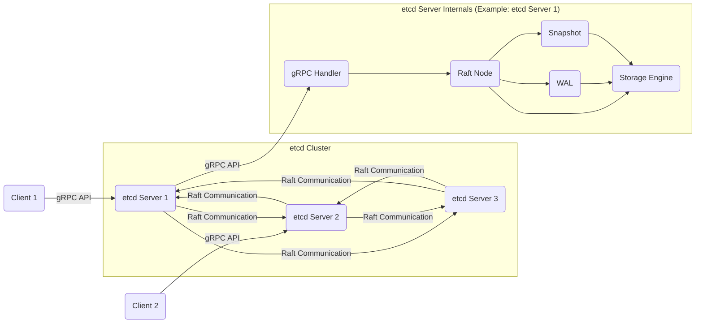
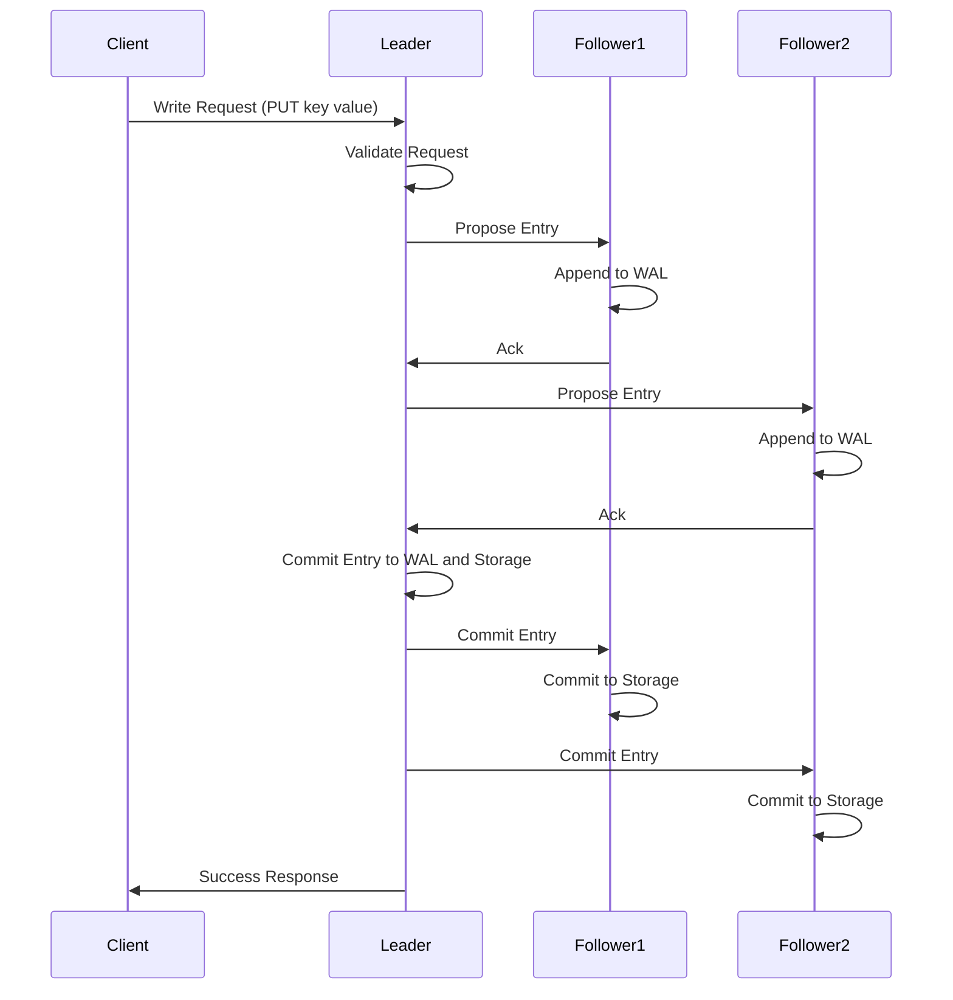
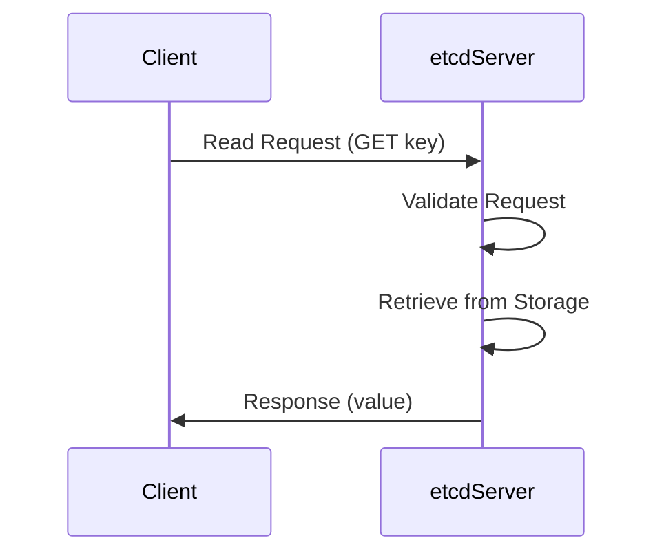

# Project Design Document: etcd

**Version:** 1.1
**Date:** October 26, 2023
**Author:** AI Software Architect

## 1. Introduction

This document provides a detailed design overview of the etcd project, a distributed reliable key-value store for distributed systems. This document is intended to serve as a foundation for subsequent threat modeling activities, providing a comprehensive understanding of etcd's architecture, components, and interactions.

## 2. Goals and Scope

The primary goal of this document is to clearly articulate the design of etcd, focusing on aspects relevant to security and potential vulnerabilities. This includes:

*   Identifying key components and their responsibilities.
*   Describing the interactions between components.
*   Outlining the data flow within the system.
*   Highlighting security-relevant features and mechanisms.
*   Providing a basis for identifying potential threats and attack vectors.

The scope of this document covers the core architecture and functionality of etcd. It does not delve into specific implementation details or the intricacies of the Raft consensus algorithm beyond a high-level overview.

## 3. Overview of etcd

etcd is a strongly consistent, distributed key-value store that provides a reliable way to store data across a cluster of machines. It is commonly used for shared configuration, service discovery, and leader election in distributed systems. Key characteristics of etcd include:

*   **Strong Consistency:**  Guarantees that all reads return the latest committed value.
*   **High Availability:** Tolerates machine failures through replication and consensus.
*   **Reliability:** Persists data to disk and recovers from failures.
*   **Simple API:** Provides a straightforward gRPC API for interacting with the store.
*   **Secure:** Supports TLS for secure communication and authentication/authorization mechanisms.

## 4. Architectural Design

The etcd architecture consists of several key components that work together to provide its core functionality.

### 4.1. Key Components

The following table summarizes the key components of etcd:

| Component                 | Description                                                                                                |
| ------------------------- | ---------------------------------------------------------------------------------------------------------- |
| **etcd Server**           | The core process of etcd. Each member of the etcd cluster runs an etcd server.                             |
| **Client**                | Applications or other services that interact with the etcd cluster to read and write data.                 |
| **Raft Consensus Module** | Implements the Raft consensus algorithm, ensuring agreement on data changes across the cluster.           |
| &nbsp;&nbsp;**Leader**    | The server elected to propose and commit changes to the cluster.                                          |
| &nbsp;&nbsp;**Follower**  | Servers that replicate the leader's log and vote on proposals.                                             |
| &nbsp;&nbsp;**Candidate** | Servers that campaign to become the leader.                                                                |
| **WAL (Write-Ahead Log)** | A persistent log of all proposed changes to the etcd store. Used for recovery and replication.             |
| **Snapshot**              | A point-in-time snapshot of the etcd data store, used to compact the WAL and speed up recovery.           |
| **Storage Engine**        | The underlying key-value store where the actual data is persisted (e.g., boltdb).                         |
| **gRPC API**              | The primary interface for clients to interact with etcd.                                                    |

### 4.2. Component Diagram

### 4.3. Interactions Between Components

*   **Client Request:** A client sends a read or write request to an etcd server via the gRPC API.
*   **Request Handling:** The receiving etcd server's gRPC handler processes the request.
*   **Raft Proposal (Write):** For write requests, the server (if it's the leader) proposes the change to the Raft module.
*   **Raft Consensus:** The Raft module communicates with other servers in the cluster to achieve consensus on the proposed change.
*   **WAL Logging:** Once consensus is reached, the change is appended to the WAL on each server.
*   **Data Persistence:** The change is then applied to the storage engine.
*   **Response:** The server sends a response back to the client.
*   **Read Request:** For read requests, the server directly retrieves the data from the storage engine and returns it to the client.

## 5. Data Flow

This section describes the typical flow of data during write and read operations.

### 5.1. Write Operation Flow

1. A client sends a write request (e.g., `PUT key value`) to an etcd server.
2. The receiving server's gRPC handler validates the request.
3. If the receiving server is the leader, it proposes the change to the Raft module.
4. The leader sends a proposal (an "entry") to the followers.
5. Followers append the entry to their local WAL.
6. Followers send an acknowledgement back to the leader.
7. Once a quorum of followers have acknowledged, the leader commits the entry to its WAL and storage engine.
8. The leader informs the followers to commit the entry.
9. Followers commit the entry to their storage engines.
10. The leader sends a success response to the client.

### 5.2. Read Operation Flow

1. A client sends a read request (e.g., `GET key`) to an etcd server.
2. The receiving server's gRPC handler validates the request.
3. The server retrieves the value associated with the key from its local storage engine.
4. The server sends the value back to the client.

## 6. Security Considerations

etcd incorporates several security features to protect the integrity and confidentiality of data.

The following table summarizes the key security considerations for etcd:

| Feature/Mechanism             | Description                                                                                                                               |
| ----------------------------- | ----------------------------------------------------------------------------------------------------------------------------------------- |
| **Authentication**            | etcd supports client authentication using TLS client certificates and username/password authentication.                                  |
| **Authorization (RBAC)**      | Role-Based Access Control allows administrators to define roles with specific permissions and assign them to users, controlling access. |
| **TLS Encryption**            | Communication between clients and servers, and between servers, can be encrypted using TLS, protecting data in transit.                 |
| **Secure Secrets Storage**    | While etcd stores data, managing secrets used for authentication and encryption securely is crucial (often requires external solutions). |
| **Audit Logging**             | etcd can log significant events, including client requests and authentication attempts, for security monitoring and auditing.           |
| **Quorum and Consensus**      | The Raft consensus algorithm ensures data integrity and consistency by requiring a majority agreement on changes.                       |
| **Secure Configuration**      | Proper configuration, including strong TLS certificates and enabled authentication/authorization, is essential for security.           |

### 6.1. Detailed Security Aspects

*   **Authentication:** etcd supports client authentication using various methods, including:
    *   **TLS Client Certificates:** Clients present certificates signed by a trusted Certificate Authority (CA).
    *   **Username/Password Authentication:** Clients provide credentials for authentication.
*   **Authorization (RBAC):** etcd implements Role-Based Access Control, allowing administrators to define roles with specific permissions and assign those roles to users. This controls which clients can access and modify specific keys or ranges of keys.
*   **TLS Encryption:**  Communication between clients and etcd servers, as well as communication between etcd servers within the cluster, can be encrypted using TLS. This protects data in transit from eavesdropping and tampering.
*   **Secure Secrets Storage:** While etcd itself is a key-value store, it's crucial to manage secrets used for authentication and encryption securely. External secret management solutions are often recommended.
*   **Audit Logging:** etcd can be configured to log significant events, including client requests, authentication attempts, and changes to the data store. These logs can be used for security monitoring and auditing.
*   **Quorum and Consensus:** The Raft consensus algorithm ensures that a majority of the cluster must agree on changes before they are committed. This protects against data corruption and ensures consistency even in the presence of failures.
*   **Secure Configuration:** Proper configuration of etcd is essential for security. This includes:
    *   Using strong TLS certificates.
    *   Enabling authentication and authorization.
    *   Restricting network access to the etcd cluster.
    *   Regularly rotating secrets and certificates.

## 7. Deployment Considerations

etcd is typically deployed as a cluster of odd-numbered servers (e.g., 3, 5, or 7) to ensure fault tolerance and availability. Common deployment patterns include:

*   **Co-located with Applications:** etcd can be deployed alongside the applications it supports, often within the same infrastructure or container orchestration platform.
*   **Dedicated Cluster:** A dedicated etcd cluster can be provisioned to serve multiple applications or services.
*   **Cloud-Managed Services:** Cloud providers offer managed etcd services, simplifying deployment and management.

Key deployment considerations for security include:

*   **Network Segmentation:** Isolating the etcd cluster on a private network segment can limit exposure to unauthorized access.
*   **Firewall Rules:** Configuring firewalls to allow only necessary traffic to and from the etcd cluster.
*   **Access Control Lists (ACLs):** Implementing network ACLs to further restrict access to the etcd cluster.
*   **Monitoring and Alerting:** Setting up monitoring and alerting for the etcd cluster to detect potential security incidents or performance issues.

## 8. Future Considerations

*   **Enhanced Audit Logging:**  Exploring more granular audit logging capabilities.
*   **Integration with Hardware Security Modules (HSMs):**  Investigating the possibility of integrating with HSMs for enhanced key management.
*   **Further Security Hardening:** Continuously reviewing and implementing security best practices.

## 9. Conclusion

This document provides a comprehensive design overview of the etcd project, highlighting its key components, data flow, and security features. This information serves as a crucial foundation for conducting thorough threat modeling exercises to identify potential vulnerabilities and implement appropriate security mitigations. By understanding the architecture and interactions within etcd, security professionals can effectively assess and address potential risks, ensuring the reliability and security of systems relying on this critical component.
