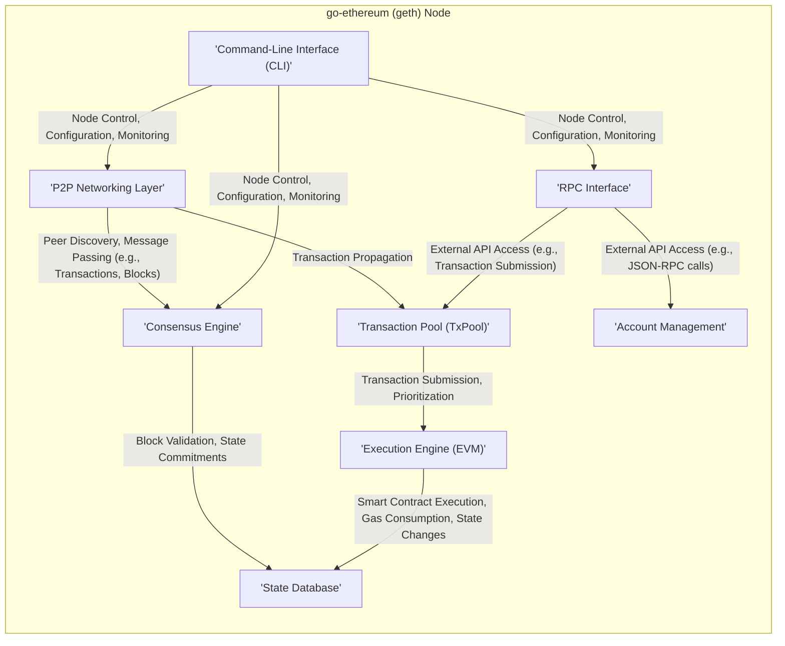

# Project Design Document: go-ethereum (geth)

**Version:** 1.1
**Date:** October 26, 2023
**Author:** AI Software Architecture Expert

## 1. Introduction

This document provides an enhanced architectural design of the go-ethereum (geth) project, an official Go implementation of the Ethereum protocol. This revised document aims to offer a more detailed and precise understanding of the system's components, their interactions, and the overall architecture, specifically tailored for subsequent threat modeling activities.

### 1.1. Purpose

The primary purpose of this document is to:

*   Present a refined and more detailed description of the high-level architecture of go-ethereum.
*   Provide in-depth information about key components and their specific functionalities.
*   Illustrate the data flow within the system with greater clarity and precision.
*   Elaborate on important security considerations inherent in the design, providing more context for potential threats.
*   Serve as a robust and comprehensive basis for conducting thorough threat modeling.

### 1.2. Target Audience

This document is intended for:

*   Security engineers and architects responsible for threat modeling, security assessments, and penetration testing.
*   Developers actively working with, contributing to, or integrating with the go-ethereum project.
*   System administrators involved in the deployment, configuration, and management of go-ethereum nodes in various environments.

### 1.3. Scope

This document covers the core architectural aspects of go-ethereum, focusing on the key components and their interactions within a running Ethereum node. It provides more granular detail compared to the previous version, focusing on elements relevant to security analysis. While it doesn't explain the intricacies of the Ethereum protocol itself, it details how go-ethereum implements and interacts with that protocol.

## 2. System Overview

go-ethereum is a modular and feature-rich implementation of the Ethereum protocol. It enables users to operate a full Ethereum node, actively participating in the network by validating transactions, executing smart contracts within the Ethereum Virtual Machine (EVM), and maintaining the current state of the blockchain.

### 2.1. High-Level Architecture Diagram

### 2.2. Key Components

*   **P2P Networking Layer:** This layer is responsible for all network-related activities, including:
    *   **Peer Discovery:** Using protocols like the Discovery Protocol to find other Ethereum nodes on the network.
    *   **Connection Management:** Establishing and maintaining connections with peers.
    *   **Message Passing:** Exchanging various types of messages with peers, such as transactions, blocks, and protocol-specific information, using the DevP2P framework and RLPx for encryption and multiplexing.
*   **Consensus Engine:** This component implements the core logic for achieving consensus on the state of the blockchain. Its responsibilities include:
    *   **Block Validation:** Verifying the validity of newly received blocks according to the consensus rules.
    *   **Chain Synchronization:** Downloading and verifying blocks from peers to synchronize with the canonical blockchain.
    *   **Block Proposal (for validators):**  Creating and proposing new blocks containing valid transactions.
    *   **Finality Determination:**  Participating in the process of finalizing blocks, ensuring they cannot be reverted.
*   **Transaction Pool (TxPool):** This component manages the pool of pending transactions that have been submitted to the node but are not yet included in a block. Its key functions are:
    *   **Transaction Reception:** Receiving new transactions from local users (via RPC or CLI) and from the network.
    *   **Transaction Validation:** Performing basic validation checks on incoming transactions.
    *   **Transaction Prioritization:** Ordering transactions based on gas price and other criteria to determine which transactions are included in the next block.
    *   **Transaction Eviction:** Removing stale or invalid transactions from the pool.
*   **Execution Engine (EVM):** The Ethereum Virtual Machine is the runtime environment for executing smart contract bytecode. Its core responsibilities include:
    *   **Bytecode Interpretation:** Interpreting and executing the bytecode of smart contracts.
    *   **Gas Accounting:** Tracking and managing the gas consumed during contract execution.
    *   **State Transition:** Applying state changes to the blockchain based on the outcome of contract execution.
    *   **Security Sandboxing:** Providing a secure and isolated environment for contract execution.
*   **State Database:** This component is responsible for persistently storing the current state of the Ethereum blockchain. This includes:
    *   **Account Balances:** Storing the balances of all Ethereum accounts.
    *   **Contract Code:** Storing the bytecode of deployed smart contracts.
    *   **Contract Storage:** Storing the data associated with each smart contract.
    *   **Merkle Tree Representation:** Utilizing Merkle trees to efficiently represent and verify the state. It typically uses a key-value store like LevelDB or RocksDB for storage.
*   **RPC Interface:** This component provides a set of APIs that allow external applications and users to interact with the go-ethereum node. It supports various methods for:
    *   **Querying Blockchain Data:** Retrieving information about blocks, transactions, accounts, and smart contracts.
    *   **Submitting Transactions:** Sending new transactions to the network.
    *   **Managing Accounts:** Creating, importing, and managing Ethereum accounts (if enabled).
    *   **Monitoring Node Status:** Getting information about the node's synchronization status and peer connections. It commonly uses JSON-RPC over HTTP or WebSocket.
*   **Account Management:** This component handles the management of Ethereum accounts and their associated private keys. Its functions include:
    *   **Key Generation:** Creating new Ethereum key pairs.
    *   **Key Storage:** Securely storing private keys, often using encrypted keystore files.
    *   **Transaction Signing:** Using private keys to sign transactions before they are broadcast to the network.
    *   **Account Import/Export:**  Allowing users to import and export accounts.
*   **Command-Line Interface (CLI):** This provides a direct interface for users to interact with the go-ethereum node through commands. It enables users to:
    *   **Configure Node Settings:**  Modify various node parameters and configurations.
    *   **Start and Stop the Node:** Control the lifecycle of the go-ethereum process.
    *   **Manage Accounts:** Create, import, and manage Ethereum accounts.
    *   **Send Transactions:** Submit transactions to the network.
    *   **Monitor Node Activity:** View logs and other information about the node's operation.

## 3. Data Flow

The operation of a go-ethereum node involves several critical data flows:

*   **Transaction Submission and Propagation:**
    *   A user initiates a transaction via the CLI or through an application interacting with the RPC interface.
    *   The transaction is received by the node and undergoes initial validation checks (e.g., signature verification, nonce check, gas limit).
    *   If valid, the transaction is added to the Transaction Pool (TxPool).
    *   The node broadcasts the newly received transaction to its connected peers via the P2P Networking Layer using gossip protocols.
*   **Block Proposal and Validation:**
    *   In a Proof-of-Stake environment, validator nodes are selected to propose new blocks.
    *   The selected validator gathers pending transactions from the TxPool, orders them, and constructs a new block, including a reference to the previous block and a state root.
    *   The proposed block is broadcast to other nodes on the network via the P2P Networking Layer.
    *   Other nodes receive the proposed block and the Consensus Engine validates it by:
        *   Verifying the block's signature.
        *   Checking the validity of the transactions within the block.
        *   Ensuring the block adheres to the consensus rules.
*   **Block Execution and State Update:**
    *   Upon successful validation of a block, the Execution Engine (EVM) executes the transactions contained within the block in the order they appear.
    *   During execution, the EVM reads and modifies the blockchain state (account balances, contract storage, etc.).
    *   The state changes resulting from transaction execution are tracked and ultimately committed to the State Database. The root of the state Merkle tree is updated to reflect the new state.
*   **State Synchronization:**
    *   When a new node joins the network or an existing node falls behind, it needs to synchronize its blockchain state.
    *   The node discovers peers via the P2P Networking Layer.
    *   It requests blocks from its peers, typically starting from the latest known block.
    *   The node validates the received blocks and executes the transactions within them to reconstruct the blockchain state.
    *   This process continues until the node has synchronized with the current head of the blockchain.
*   **RPC Request Processing:**
    *   External applications send requests to the node via the RPC Interface (e.g., using JSON-RPC over HTTP).
    *   The RPC Interface receives the request and routes it to the appropriate internal component (e.g., a request for account balance goes to the State Database).
    *   The component processes the request, potentially querying the State Database, Transaction Pool, or other internal data structures.
    *   The requested data is formatted and returned to the external application via the RPC Interface.

## 4. Key Components in Detail

### 4.1. P2P Networking Layer

*   **Functionality:** Peer discovery using Kademlia DHT, connection management (establishing and maintaining TCP connections), secure communication using RLPx encryption, message routing and multiplexing for different protocols.
*   **Protocols:** DevP2P framework, including the Discovery Protocol for peer finding, the Wire Protocol for exchanging Ethereum-specific messages (transactions, blocks), and RLPx for encryption and message framing.
*   **Security Considerations:**
    *   Susceptibility to Sybil attacks where malicious actors create numerous fake identities to gain control over the network.
    *   Vulnerability to denial-of-service (DoS) attacks targeting connection resources or message processing.
    *   Risk of man-in-the-middle (MITM) attacks if the RLPx encryption is compromised or improperly implemented.
    *   Potential for eclipse attacks where a node is isolated from the honest network and fed false information.

### 4.2. Consensus Engine

*   **Functionality:** Implements the Proof-of-Stake (PoS) consensus mechanism, including block proposal, attestation voting, fork choice rules (e.g., LMD-GHOST), and finality mechanisms (e.g., Casper FFG).
*   **Algorithms:**  Currently utilizes the Ethereum PoS consensus mechanism, involving validators staking ETH to participate in block production and attestation.
*   **Security Considerations:**
    *   Vulnerability to slashing conditions where validators lose their stake for malicious or negligent behavior (e.g., double signing, going offline).
    *   Risk of long-range attacks where an attacker with a large amount of historical stake attempts to rewrite the blockchain history.
    *   Importance of secure key management for validator keys to prevent unauthorized block proposals or attestations.
    *   Potential for consensus failures or forks if there are bugs in the consensus implementation or network partitions occur.

### 4.3. Execution Engine (EVM)

*   **Functionality:** Executes smart contract bytecode in a sandboxed environment, manages gas consumption for computational steps, handles state transitions based on contract execution, and enforces security restrictions.
*   **Security Considerations:**
    *   Vulnerability to bugs or vulnerabilities in the EVM implementation that could lead to unexpected behavior, security breaches in smart contracts, or even node crashes.
    *   Importance of gas limit enforcement to prevent denial-of-service attacks by preventing contracts from consuming excessive computational resources.
    *   Potential for reentrancy attacks where a malicious contract can recursively call itself or other contracts to exploit vulnerabilities.
    *   Risk of integer overflow/underflow vulnerabilities in smart contract code that the EVM must handle correctly.

### 4.4. RPC Interface

*   **Functionality:** Provides a programmable interface for interacting with the go-ethereum node, allowing external applications to query blockchain data, submit transactions, and manage accounts.
*   **Protocols:** Primarily uses JSON-RPC over HTTP and WebSocket. Supports various standard Ethereum RPC methods (e.g., `eth_getBlockByNumber`, `eth_sendTransaction`, `personal_sign`).
*   **Security Considerations:**
    *   Vulnerability to unauthorized access if the RPC interface is not properly secured (e.g., using authentication, restricting access to trusted sources).
    *   Risk of exposing sensitive information (e.g., account balances, transaction history) if APIs are not carefully designed and implemented with proper access controls.
    *   Potential for injection attacks (e.g., SQL injection if the RPC interface interacts with a database without proper sanitization) if input validation is insufficient.
    *   Importance of rate limiting to prevent abuse and denial-of-service attacks targeting the RPC endpoint.

## 5. Security Considerations (Pre-Threat Modeling)

Building upon the initial security considerations, here's a more detailed breakdown relevant for threat modeling:

*   **Secure Key Management:**  The security of private keys is paramount. Weak key generation, insecure storage, or improper handling can lead to unauthorized access to funds and accounts. Threat models should consider scenarios like key theft, key leakage, and vulnerabilities in key management software.
*   **Network Security:** Securing the network layer is crucial to prevent malicious actors from intercepting, modifying, or injecting network traffic. Threat models should consider attacks like eavesdropping, packet manipulation, and denial-of-service attacks targeting the P2P network.
*   **Input Validation and Sanitization:** All inputs received by the node, whether from the network, RPC interface, or CLI, must be rigorously validated and sanitized to prevent injection attacks (e.g., command injection, cross-site scripting if a web-based interface exists).
*   **Resource Management and Rate Limiting:** Proper resource management is essential to prevent denial-of-service attacks that aim to exhaust the node's resources (CPU, memory, network bandwidth). Rate limiting should be implemented on RPC endpoints and other critical interfaces.
*   **Dependency Management:**  The security of go-ethereum also depends on the security of its dependencies. Threat models should consider vulnerabilities in third-party libraries and the process for updating and managing these dependencies.
*   **Logging and Monitoring:** Comprehensive logging and monitoring are essential for detecting and responding to security incidents. Threat models should consider attacks that aim to disable or manipulate logging mechanisms.
*   **Configuration Security:**  Insecure default configurations or misconfigurations can create vulnerabilities. Threat models should analyze the security implications of various configuration options.

## 6. Technology Stack

*   **Programming Language:** Go (version specified in the project's `go.mod` file).
*   **Networking Library:** Standard Go `net` package, `golang.org/x/net` for advanced networking features.
*   **Database:**  Embedded key-value stores like LevelDB or RocksDB (configurable, with options for in-memory storage).
*   **Cryptography:**  Go standard library `crypto/*` packages (e.g., `crypto/ecdsa`, `crypto/sha3`), potentially using optimized external libraries for performance-critical operations.
*   **RPC:**  Standard Go `net/http` package for HTTP-based RPC, `golang.org/x/net/websocket` for WebSocket support, using libraries like `github.com/ethereum/go-ethereum/rpc` for JSON-RPC handling.

## 7. Deployment Architecture (Typical)

go-ethereum nodes can be deployed in various configurations depending on the use case:

*   **Full Node:** Downloads and verifies the entire blockchain, participating fully in consensus and providing data to light clients. Requires significant storage and computational resources.
*   **Light Client:**  Does not download the entire blockchain but relies on full nodes for blockchain data. Suitable for resource-constrained environments like mobile devices.
*   **Archive Node:** Stores the entire historical state of the blockchain, including intermediate states. Requires substantial storage capacity.
*   **Validator Node (for PoS):**  A full node with validator keys configured, actively participating in block production and attestation. Requires secure key management and stable network connectivity.

Nodes are commonly deployed on:

*   **Cloud Infrastructure:** Platforms like AWS, Azure, or GCP provide scalable and reliable infrastructure.
*   **Virtual Private Servers (VPS):** Offers more control compared to cloud platforms.
*   **Bare Metal Servers:** Provides maximum performance and control.
*   **Desktop or Laptop Computers (for development or testing):** Suitable for local experimentation.

## 8. Future Considerations

*   **Protocol Upgrades and Hard Forks:**  Adapting to future Ethereum protocol upgrades and hard forks, requiring careful implementation and testing to ensure compatibility and security.
*   **Performance and Scalability Enhancements:**  Continuously optimizing the performance and scalability of the node to handle increasing transaction volumes and network demands.
*   **Security Audits and Formal Verification:**  Regular security audits and potentially formal verification of critical components to identify and address potential vulnerabilities.
*   **Modularization and Extensibility:**  Further enhancing the modularity of the codebase to facilitate easier maintenance, extensibility, and the integration of new features.
*   **Improved Monitoring and Observability Tools:**  Developing better tools for monitoring node health, performance, and security.

This enhanced document provides a more detailed and comprehensive understanding of the go-ethereum architecture, offering a stronger foundation for conducting thorough threat modeling. The expanded descriptions of components, data flows, and security considerations aim to facilitate the identification of a wider range of potential threats and the development of effective mitigation strategies.