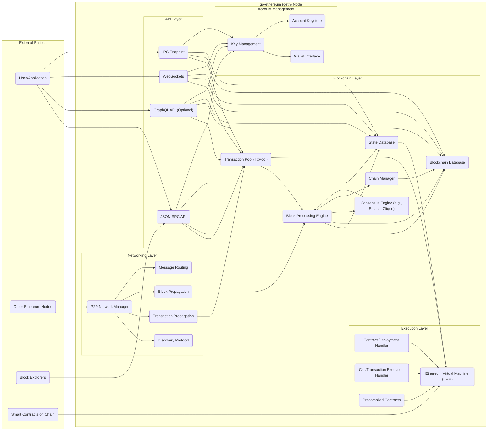

## Project Design Document: go-ethereum (geth) - Improved

**1. Introduction**

This document provides an enhanced architectural design overview of the go-ethereum (geth) client, a leading implementation of the Ethereum protocol written in Go. This detailed design serves as a crucial foundation for subsequent threat modeling activities, offering a comprehensive understanding of the system's components, their interactions, and the flow of data within the geth client.

**2. Goals and Objectives**

The primary goal of go-ethereum is to deliver a robust, secure, and highly efficient implementation of the Ethereum protocol specifications. Key objectives include:

*   **Blockchain Synchronization:**  Actively participate in the Ethereum network by seamlessly synchronizing the entire blockchain or a relevant portion thereof.
*   **Transaction and Block Validation:** Rigorously validate both incoming transactions and newly proposed blocks against the Ethereum protocol rules.
*   **Smart Contract Execution:**  Execute smart contract bytecode within the isolated environment of the Ethereum Virtual Machine (EVM).
*   **Network Interaction APIs:** Provide well-defined APIs, primarily JSON-RPC, for external applications and users to interact with the Ethereum network through the geth client.
*   **Cryptographic Key and Account Management:** Securely manage cryptographic keys associated with Ethereum accounts.
*   **Consensus Mechanism Participation:** Support and implement various Ethereum consensus mechanisms, such as Proof-of-Work (Ethash) and Proof-of-Authority (Clique), enabling participation in network consensus.
*   **Node Type Flexibility:** Offer different node types (full, light, archive) to accommodate diverse user requirements and resource constraints.

**3. High-Level Architecture**

The go-ethereum client is structured as a collection of interconnected subsystems working in concert. The following diagram illustrates the high-level architecture, highlighting the key interactions between these subsystems and external entities:

**4. Component Details**

This section provides a more in-depth description of the key components within the go-ethereum architecture, elaborating on their specific functions and responsibilities.

*   **Networking Layer:**
    *   **P2P Network Manager:**  The central component responsible for managing the peer-to-peer network connections. This includes establishing new connections, maintaining existing ones, handling disconnections, and managing peer reputation.
    *   **Discovery Protocol:** Implements the peer discovery mechanism (e.g., using a Distributed Hash Table or bootnodes), enabling the node to find and connect to other Ethereum nodes on the network.
    *   **Transaction Propagation:**  Handles the efficient broadcasting of newly created and received transactions to the network, ensuring timely dissemination to other peers.
    *   **Block Propagation:** Manages the broadcasting and receiving of newly mined or discovered blocks, ensuring all nodes stay synchronized with the latest state of the blockchain.
    *   **Message Routing:**  Responsible for directing incoming and outgoing network messages to the appropriate internal components based on the message type.

*   **Blockchain Layer:**
    *   **Blockchain Database:**  A persistent storage mechanism (typically a key-value store like LevelDB or RocksDB) for storing the validated blocks of the Ethereum blockchain, including block headers, transaction data, and associated metadata.
    *   **Block Processing Engine:**  The core logic for validating and processing newly received blocks. This involves verifying block headers, transaction signatures, and executing transactions to update the state.
    *   **State Database:** Stores the current state of the Ethereum network, representing the balances, contract code, and storage of all accounts and contracts. This is a crucial component for EVM execution.
    *   **Transaction Pool (TxPool):**  A temporary holding area for pending transactions that have been received but not yet included in a block. It manages transaction prioritization based on gas price and other factors.
    *   **Consensus Engine (e.g., Ethash, Clique):** Implements the specific consensus algorithm used by the Ethereum network. This component is responsible for participating in the block creation process (for mining nodes) or verifying the validity of proposed blocks.
    *   **Chain Manager:**  Oversees the overall management of the blockchain, including handling chain reorganizations (forks) and managing the canonical chain.

*   **Execution Layer:**
    *   **Ethereum Virtual Machine (EVM):** A sandboxed, bytecode-based virtual machine responsible for executing smart contract code. It provides a deterministic environment for contract execution.
    *   **Contract Deployment Handler:** Manages the process of deploying new smart contracts to the blockchain, including validating the deployment transaction and initializing the contract's state.
    *   **Call/Transaction Execution Handler:** Executes the code associated with regular transactions and calls to smart contracts, updating the state according to the contract logic.
    *   **Precompiled Contracts:**  A set of built-in contracts that provide frequently used functionalities (e.g., cryptographic functions) more efficiently than regular smart contracts.

*   **API Layer:**
    *   **JSON-RPC API:**  Provides a standardized interface for external applications to interact with the go-ethereum node over HTTP or IPC. It exposes methods for querying blockchain data, sending transactions, and interacting with contracts.
    *   **GraphQL API (Optional):** An alternative API for querying blockchain data, offering more flexibility and efficiency in data retrieval compared to JSON-RPC.
    *   **WebSockets:** Enables persistent, bidirectional communication channels between the node and clients, facilitating real-time event subscriptions and data streaming.
    *   **IPC Endpoint:** Allows local processes on the same machine to communicate with the go-ethereum node using inter-process communication mechanisms.

*   **Account Management:**
    *   **Key Management:**  Handles the generation, secure storage, and management of private keys used to sign transactions. This often involves using encrypted keystore files.
    *   **Wallet Interface:** Provides a higher-level abstraction for managing accounts and interacting with the blockchain, often integrating with the Key Management component.
    *   **Account Keystore:**  The local storage mechanism (typically encrypted files) for storing private keys associated with user accounts.

**5. Data Flow**

This section details the typical flow of data through the go-ethereum client for several key operations, providing a clearer understanding of component interactions.

*   **Transaction Submission:**
    *   A User/Application creates and signs a transaction using their private key.
    *   The signed transaction is submitted to the go-ethereum node via the JSON-RPC, GraphQL API, or IPC endpoint.
    *   The API layer receives the transaction and forwards it to the **Transaction Pool (TxPool)**.
    *   The TxPool validates the transaction (e.g., signature, nonce, gas limit) and, if valid, adds it to the pool of pending transactions.
    *   The TxPool broadcasts the transaction to connected peers via the **Transaction Propagation** component of the Networking Layer.
    *   Mining nodes (if the node is configured for mining) or other validating nodes receive the transaction.
    *   The **Consensus Engine** selects transactions from the TxPool based on factors like gas price to include in a new block proposal.
    *   The **Block Processing Engine** validates the newly proposed block and the transactions it contains.
    *   The **EVM** executes the transactions within the block, updating the **State Database**.
    *   The new block is appended to the **Blockchain Database** and propagated to other nodes via the **Block Propagation** component.

*   **Block Synchronization:**
    *   A go-ethereum node connects to peers using the **P2P Network Manager** and the **Discovery Protocol**.
    *   The node requests block headers from its peers to identify the current chain tip.
    *   The node downloads block bodies from peers, starting from where its local chain diverges.
    *   The **Block Processing Engine** validates each received block, ensuring it adheres to the consensus rules and builds upon the existing chain.
    *   The **EVM** executes the transactions within each newly received block, updating the **State Database** accordingly.
    *   Validated blocks are appended to the **Blockchain Database**, ensuring the node stays synchronized with the network.

*   **Smart Contract Interaction:**
    *   A User/Application creates a transaction specifying the target smart contract address and the function to call, along with any necessary parameters.
    *   The transaction is submitted to the go-ethereum node via the API.
    *   The transaction is processed as described in "Transaction Submission."
    *   When the block containing the transaction is processed, the **EVM** is invoked by the **Call/Transaction Execution Handler**.
    *   The EVM loads the bytecode of the target smart contract from the **State Database**.
    *   The EVM executes the specified function, reading and writing data to the contract's storage within the **State Database**.
    *   The results of the contract execution (e.g., state changes, emitted events) are reflected in the updated state and potentially returned to the caller.

*   **API Request:**
    *   A User/Application sends a request to the go-ethereum node via the JSON-RPC, GraphQL API, or IPC endpoint.
    *   The appropriate API handler receives the request and parses the parameters.
    *   The API handler interacts with various components, such as the **Blockchain Database**, **State Database**, or **Transaction Pool**, to retrieve the requested information.
    *   The API handler formats the response and sends it back to the User/Application.

**6. Security Considerations (Pre-Threat Modeling)**

Before conducting a formal threat model, several inherent security considerations within the go-ethereum architecture are readily apparent and warrant careful attention:

*   **P2P Network Vulnerabilities:** The decentralized peer-to-peer networking layer is susceptible to various attacks, including:
    *   **Denial-of-Service (DoS) attacks:** Malicious peers could flood the node with requests, overwhelming its resources.
    *   **Sybil attacks:** An attacker could create multiple fake identities to gain undue influence over the network.
    *   **Eclipse attacks:** An attacker could isolate a node from the rest of the network, feeding it false information.
    *   **Message spoofing/manipulation:** Attackers might attempt to forge or alter network messages.
*   **Consensus Mechanism Weaknesses:** The security of the chosen consensus mechanism is paramount. Potential vulnerabilities include:
    *   **51% attacks (Proof-of-Work):** An attacker controlling a majority of the network's hashing power could manipulate the blockchain.
    *   **Byzantine Fault Tolerance issues (Proof-of-Authority):** Compromised authority nodes could collude to disrupt the network.
*   **EVM Security Risks:** The EVM, while designed for security, can still be a source of vulnerabilities:
    *   **Smart contract vulnerabilities:** Poorly written smart contracts can contain bugs that attackers can exploit (e.g., reentrancy attacks, integer overflows).
    *   **EVM implementation bugs:**  Vulnerabilities in the go-ethereum's EVM implementation itself could be exploited.
*   **Key Management Security:** The secure storage and handling of private keys are critical:
    *   **Key theft:** If private keys are compromised, attackers can gain control of associated accounts and funds.
    *   **Weak key generation:**  Using weak or predictable methods for key generation can make them vulnerable to cracking.
*   **API Security Concerns:** The exposed APIs (JSON-RPC, GraphQL) present potential attack vectors:
    *   **Unauthorized access:**  Lack of proper authentication and authorization can allow unauthorized users to access sensitive data or execute privileged actions.
    *   **Injection attacks:**  Improperly sanitized input could lead to injection vulnerabilities (e.g., command injection).
    *   **Information disclosure:**  APIs might inadvertently expose sensitive information.
*   **Database Security:** The integrity and availability of the Blockchain and State Databases are essential:
    *   **Data corruption:**  Attacks or errors could lead to corruption of the blockchain data.
    *   **Data tampering:**  Attackers might attempt to alter historical blockchain data.
    *   **Database access control:**  Unauthorized access to the database could lead to data breaches or manipulation.
*   **Code Vulnerabilities in go-ethereum:**  Bugs or security flaws in the go-ethereum codebase itself can be exploited by attackers.

**7. Deployment Considerations**

The deployment configuration of go-ethereum significantly impacts its resource requirements and security posture. Common deployment options include:

*   **Full Node:**  Downloads and validates the entire blockchain, participating fully in network consensus. This requires substantial storage, bandwidth, and computational resources but offers the highest level of security and trustlessness.
*   **Light Node:**  Downloads only block headers and requests specific data on demand. This significantly reduces storage and resource requirements but relies on full nodes for data availability and integrity.
*   **Archive Node:**  Similar to a full node but also stores historical state data, enabling queries about past states of the blockchain. This demands even greater storage capacity.
*   **Private Networks:** go-ethereum can be configured to operate on private or permissioned Ethereum networks, where access is controlled and consensus mechanisms might differ.

Deployment environments can range from personal computers and servers to cloud infrastructure (e.g., AWS, Azure, GCP). Security measures should be tailored to the specific deployment environment.

**8. Future Considerations**

The go-ethereum project is under active development, with ongoing efforts to improve its functionality, performance, and security. Future considerations that may impact the architecture and security landscape include:

*   **Implementation of Ethereum Protocol Upgrades:**  Staying current with the latest Ethereum protocol upgrades (e.g., The Merge, future sharding implementations) will require architectural changes and careful security analysis.
*   **Performance and Scalability Enhancements:**  Ongoing efforts to improve transaction processing speed and network scalability may introduce new components or modify existing ones.
*   **Enhanced Security Features:**  The project may incorporate new security features, such as improved key management solutions or enhanced network security protocols.
*   **Support for New Consensus Mechanisms:**  Future Ethereum developments might introduce or transition to new consensus algorithms, requiring modifications to the Consensus Engine.
*   **Integration with Layer-2 Scaling Solutions:**  Integration with layer-2 technologies (e.g., rollups, state channels) could introduce new interaction patterns and security considerations.

These future developments will necessitate continuous review and updates to this design document and the associated threat model.

This improved design document provides a more detailed and nuanced understanding of the go-ethereum architecture, serving as a robust foundation for comprehensive threat modeling activities. By thoroughly examining the components, data flows, and inherent security considerations, potential vulnerabilities can be proactively identified and mitigated, contributing to the overall security and resilience of the Ethereum ecosystem.