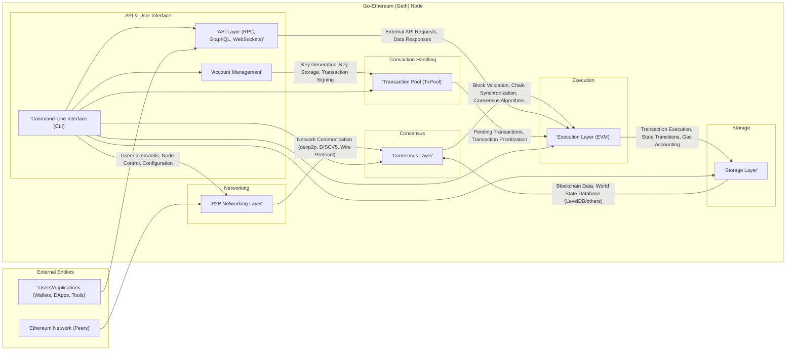
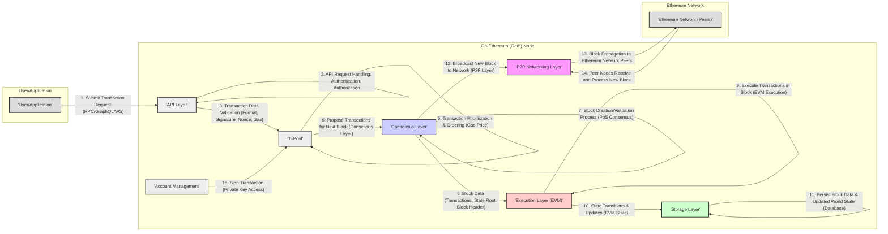

# Project Design Document: Go-Ethereum (Geth) for Threat Modeling

**Project Name:** Go-Ethereum (Geth)

**Project Repository:** [https://github.com/ethereum/go-ethereum](https://github.com/ethereum/go-ethereum)

**Document Version:** 1.1
**Date:** October 27, 2023
**Author:** AI Software Architecture Expert

## 1. Introduction

This document provides an enhanced and more detailed design overview of the Go-Ethereum (Geth) project, an official Go implementation of the Ethereum protocol. This document is specifically created to facilitate comprehensive threat modeling activities. Building upon the previous version, this iteration further elaborates on key components, functionalities, data flows, and technologies involved in Geth, providing a stronger foundation for identifying potential security vulnerabilities and risks.

### 1.1. Purpose of this Document

This document serves the following purposes:

*   **Provide a comprehensive and clear overview of the Go-Ethereum architecture.** It aims to be easily understandable for a wider range of security professionals, developers, and stakeholders involved in threat modeling, regardless of their depth of Ethereum protocol expertise.
*   **Deeply analyze key components and their interactions.** This detailed breakdown is crucial for a thorough understanding of the attack surface, potential threat vectors, and points of failure.
*   **Elaborate on data flow within the system and across external interfaces.** A more granular understanding of data flow is essential for identifying data-centric threats, data leakage possibilities, and vulnerabilities related to data manipulation.
*   **Serve as a robust and detailed basis for threat modeling exercises.** This document will be the primary input for workshops, security assessments, and analyses to systematically identify, classify, and prioritize potential threats to the Go-Ethereum project. It will support various threat modeling methodologies.

### 1.2. Target Audience

This document is intended for:

*   **Security Engineers, Security Architects, and Penetration Testers:** Responsible for conducting threat modeling, performing security assessments, and executing penetration testing on Go-Ethereum deployments.
*   **Software Developers and Blockchain Engineers:** Working on Go-Ethereum core development, contributing to the project, or integrating with Geth in their applications. Understanding the security architecture is crucial for secure development practices.
*   **System Administrators, DevOps Engineers, and Cloud Infrastructure Teams:** Deploying, configuring, and managing Go-Ethereum nodes in various environments, including cloud and on-premises. Understanding security implications of configurations and deployment models is vital.
*   **Project Managers, Product Owners, and Stakeholders:**  Requiring a high-level and detailed understanding of the system's architecture, security considerations, and potential risks to make informed decisions about project direction and resource allocation.
*   **Auditors and Compliance Officers:** Evaluating the security posture of Go-Ethereum deployments for regulatory compliance and security audits.

## 2. Project Overview: Go-Ethereum (Geth)

Go-Ethereum (Geth) is a production-ready, open-source command-line interface (CLI) client written in Go for running a full Ethereum node. It is a foundational piece of the Ethereum ecosystem, enabling interaction with the Ethereum blockchain. Geth provides a wide array of functionalities critical for participating in and utilizing the Ethereum network:

*   **Full Ethereum Node Operation:**  Geth enables participation in the decentralized Ethereum network by performing crucial functions such as:
    *   **Blockchain Synchronization:** Downloading and maintaining a local copy of the entire Ethereum blockchain, ensuring data consistency and access to historical data.
    *   **Transaction and Block Validation:** Verifying the validity of transactions and blocks according to Ethereum protocol rules, ensuring network integrity.
    *   **State Management:** Maintaining the current state of the Ethereum Virtual Machine (EVM), including account balances, contract code, and storage.
*   **Mining (Proof-of-Work - Historical) and Staking (Proof-of-Stake - Current):** Depending on the Ethereum network's consensus mechanism (historically Proof-of-Work, currently Proof-of-Stake), Geth can participate in block production:
    *   **Pre-Merge (Proof-of-Work):** Geth supported Ethash mining, contributing to network security by solving computationally intensive puzzles to propose new blocks.
    *   **Post-Merge (Proof-of-Stake):** Geth now supports Proof-of-Stake consensus, allowing users to stake ETH and participate in block production and network validation.
*   **Smart Contract Deployment and Interaction:**  Geth facilitates the lifecycle of smart contracts on Ethereum:
    *   **Deployment:**  Allows users to deploy new smart contracts written in languages like Solidity onto the Ethereum blockchain.
    *   **Interaction:** Enables users and applications to interact with deployed smart contracts by sending transactions to invoke contract functions.
*   **Comprehensive Account Management:** Geth provides robust account management features:
    *   **Account Creation and Management:** Generating new Ethereum accounts (key pairs) and managing existing accounts.
    *   **Private Key Security:** Securely storing and managing private keys, which control access to Ethereum accounts and assets.
    *   **Key Import/Export:**  Allows importing and exporting accounts and private keys in various formats.
*   **Flexible Transaction Management:** Geth handles all aspects of transaction management:
    *   **Transaction Creation:**  Constructing transactions to send ETH, interact with contracts, or perform other Ethereum operations.
    *   **Transaction Signing:**  Digitally signing transactions using private keys to authorize actions on the blockchain.
    *   **Transaction Broadcasting:**  Broadcasting signed transactions to the Ethereum network for inclusion in blocks.
*   **Versatile Local API Access (RPC, GraphQL, WebSockets):** Geth exposes a rich set of APIs for external interaction:
    *   **JSON-RPC API:**  Provides a standard JSON-RPC interface for programmatic interaction with the node, widely used by wallets, DApps, and other tools.
    *   **GraphQL API (Optional):** Offers a more flexible and efficient query language for retrieving blockchain data, improving data access for certain use cases.
    *   **WebSockets API:** Enables real-time, bidirectional communication, allowing applications to receive push notifications for blockchain events and updates.

Geth's role as a fundamental building block of the Ethereum ecosystem makes its security of paramount importance.  Vulnerabilities in Geth could have widespread consequences for the Ethereum network and its users.

## 3. System Architecture

Geth's architecture is designed with modularity and layered design principles to manage the complexity of the Ethereum protocol. This architecture promotes maintainability, scalability, and security. The following diagram provides a more detailed overview of the key components and their interactions, expanding on the previous version.

### 3.1. Component Breakdown

This section provides a more in-depth breakdown of each component, highlighting security-relevant aspects and technologies.

*   **3.1.1. P2P Networking Layer:**
    *   **Functionality:**  The entry point for Geth into the decentralized Ethereum network. Manages peer discovery, connection establishment, secure communication, and message routing using Ethereum's peer-to-peer protocols.
    *   **Detailed Responsibilities:**
        *   **Peer Discovery (DISCV5):** Utilizes the DISCV5 protocol to discover and locate other Ethereum nodes on the network. This process needs to be robust against node spoofing and manipulation.
        *   **Connection Management (devp2p):** Establishes and maintains secure, authenticated connections with peers using the `devp2p` protocol suite. This includes handshake mechanisms and session management.
        *   **Message Routing and Multiplexing (devp2p Wire Protocol):**  Handles the efficient routing and multiplexing of various Ethereum protocol messages (ETH, LES, etc.) over established connections.
        *   **Network Protocol Implementation (ETH, LES, etc.):** Implements specific Ethereum network protocols for block propagation, transaction dissemination, and state synchronization.
        *   **Network Security and Resilience:**  Implements measures to mitigate network-level attacks such as DoS, DDoS, Sybil attacks, and eclipse attacks. This includes connection limits, rate limiting, and peer reputation management.
    *   **Key Technologies:** `devp2p` protocol suite (including RLPx for encryption and authentication), Node Discovery Protocol v5 (DISCV5), TCP/UDP, Wire Protocol, various Ethereum sub-protocols (ETH, LES, etc.), Noise Protocol Framework (for secure handshakes).

*   **3.1.2. Consensus Layer:**
    *   **Functionality:**  The core of Ethereum's security and decentralization. Implements the consensus mechanism that ensures agreement among nodes on the state of the blockchain. Responsible for block validation, chain synchronization, and block production (staking in Proof-of-Stake).
    *   **Detailed Responsibilities:**
        *   **Block Validation:** Rigorously verifies the validity of received blocks according to the Ethereum consensus rules. This includes checking block headers, transaction validity, state transitions, and cryptographic proofs.
        *   **Chain Synchronization:**  Downloads and synchronizes with the longest valid blockchain from the network, ensuring the node is up-to-date with the latest state. This process must be secure against chain manipulation and rollback attacks.
        *   **Consensus Algorithm Implementation (Proof-of-Stake):** Implements the current Ethereum Proof-of-Stake consensus mechanism (post-Merge). This involves managing validator duties, participating in block proposal and attestation, and handling slashing conditions.
        *   **Fork Choice (LMD-GHOST, Gasper):** Implements fork choice rules (e.g., LMD-GHOST, Gasper) to determine the canonical chain in case of forks or network partitions. This is crucial for preventing double-spending and ensuring chain stability.
        *   **Justification and Finalization:**  Participates in the justification and finalization process of blocks in Proof-of-Stake, providing stronger guarantees of immutability and preventing reversions.
        *   **Slashing Protection:** Implements mechanisms to prevent validators from being slashed for equivocating or other malicious behavior.
    *   **Key Technologies:** Proof-of-Stake consensus algorithms (e.g., Casper FFG, LMD-GHOST), BLS Signatures (for validator aggregation), Ethereum consensus specifications, Merkle Trees (for block integrity), cryptographic hash functions (Keccak-256).

*   **3.1.3. Execution Layer (EVM):**
    *   **Functionality:** The computational engine of Ethereum. Executes transactions and smart contracts within the sandboxed Ethereum Virtual Machine (EVM). Responsible for state transitions, gas accounting, and enforcing execution limits.
    *   **Detailed Responsibilities:**
        *   **Transaction Processing and Execution:** Executes transactions sequentially within blocks, applying state changes to the EVM state based on transaction instructions and smart contract code.
        *   **Smart Contract Execution (EVM Interpretation):** Interprets and executes smart contract bytecode within the EVM's secure and deterministic environment. This requires robust sandboxing to prevent malicious contracts from compromising the node.
        *   **State Management and Updates:**  Manages the Ethereum world state (accounts, balances, contract storage) and updates it based on transaction execution results. State transitions must be atomic and consistent.
        *   **Gas Accounting and Limits:**  Meters gas consumption for each operation during transaction execution and enforces gas limits to prevent denial-of-service attacks and resource exhaustion.
        *   **EVM Security and Sandboxing:**  Ensures the security and isolation of the EVM environment to prevent vulnerabilities in smart contracts or the EVM itself from compromising the node or the network.
        *   **Precompiled Contracts:** Executes precompiled contracts for common cryptographic operations and other functionalities, optimizing performance and security.
    *   **Key Technologies:** Ethereum Virtual Machine (EVM), Solidity (smart contract language - indirectly, as EVM executes bytecode), Go implementation of EVM, Gas metering mechanisms, state transition logic, precompiled contracts.

*   **3.1.4. Storage Layer:**
    *   **Functionality:**  Provides persistent storage for all blockchain data, including blocks, transactions, world state, and node configurations. Ensures data integrity, availability, and efficient retrieval.
    *   **Detailed Responsibilities:**
        *   **Blockchain Storage (Block Database):** Stores the chain of blocks in a structured and indexed manner, allowing efficient retrieval of blocks by hash, number, or other criteria.
        *   **World State Database (State DB):** Persistently stores the current Ethereum world state, including account balances, contract code, and contract storage.  This database needs to be highly performant and ACID-compliant.
        *   **Data Indexing and Querying:**  Provides indexing mechanisms for efficient querying and retrieval of blockchain data, supporting API requests and internal node operations.
        *   **Data Integrity and Consistency:**  Ensures the integrity and consistency of stored data using checksums, Merkle proofs, and database transaction mechanisms. Prevents data corruption and tampering.
        *   **Data Backup and Recovery:**  Supports mechanisms for backing up and restoring blockchain data and state, ensuring data durability and disaster recovery capabilities.
        *   **Database Security:**  Secures the underlying database system against unauthorized access, data breaches, and data manipulation.
    *   **Key Technologies:** LevelDB (default key-value store), other configurable database backends (e.g., RocksDB, in-memory databases for specific use cases), Merkle Trees (for data integrity verification), database transaction management, data serialization formats (RLP).

*   **3.1.5. API Layer (RPC, GraphQL, WebSockets):**
    *   **Functionality:**  Provides external interfaces for users, applications, wallets, and other tools to interact with the Geth node and the Ethereum network. Enables programmatic access to blockchain data and node functionalities.
    *   **Detailed Responsibilities:**
        *   **JSON-RPC API Endpoint:**  Exposes a standard JSON-RPC interface over HTTP/HTTPS for remote procedure calls. This API needs to be secured against unauthorized access and abuse.
        *   **GraphQL API Endpoint (Optional):**  Provides a GraphQL endpoint for more flexible and efficient data querying. GraphQL endpoints also require security considerations.
        *   **WebSockets API Endpoint:**  Offers a WebSockets interface for real-time, bidirectional communication, enabling push notifications and event streaming. WebSocket connections need to be managed securely.
        *   **API Request Handling and Validation:**  Handles incoming API requests, validates parameters, and performs necessary authorization checks before processing requests. Input validation is crucial to prevent injection attacks.
        *   **API Rate Limiting and DoS Protection:**  Implements rate limiting and other mechanisms to protect the API endpoints from abuse and denial-of-service attacks.
        *   **API Authentication and Authorization:**  Provides mechanisms for authenticating and authorizing API clients, controlling access to sensitive API methods and data. This can include API keys, JWT, or other authentication schemes.
        *   **API Security Auditing and Logging:**  Logs API requests and responses for security auditing and monitoring purposes.
    *   **Key Technologies:** JSON-RPC protocol, GraphQL specification, WebSockets protocol, HTTP/HTTPS protocols, API framework (likely custom built within Geth), authentication and authorization libraries, rate limiting algorithms.

*   **3.1.6. Transaction Pool (TxPool):**
    *   **Functionality:**  Manages a pool of pending transactions received from users or applications, waiting to be included in the next block. Acts as a buffer between transaction submission and block inclusion.
    *   **Detailed Responsibilities:**
        *   **Transaction Reception and Validation:** Receives incoming transactions from the API layer or P2P network, performs initial validation (signature verification, nonce checks, gas limit checks, etc.) to filter out invalid or malicious transactions.
        *   **Transaction Storage and Management:** Stores valid pending transactions in a memory pool (TxPool). Manages the pool size and eviction policies to prevent memory exhaustion.
        *   **Transaction Ordering and Prioritization:** Orders transactions within the pool based on gas price and other criteria to prioritize transactions for inclusion in blocks.
        *   **Transaction Propagation (Optional):** May propagate received transactions to other peers in the network (depending on configuration and network conditions).
        *   **DoS Protection and Anti-Spam Measures:** Implements mechanisms to prevent transaction pool flooding, spam transactions, and denial-of-service attacks targeting the transaction pool. This includes transaction limits, gas price thresholds, and anti-spam filters.
        *   **Transaction Replacement and Cancellation:**  Handles transaction replacement (e.g., speed up transactions by resubmitting with higher gas price) and potentially transaction cancellation mechanisms.
    *   **Key Technologies:** In-memory data structures for transaction storage, priority queue algorithms for transaction ordering, transaction validation logic, DoS protection mechanisms, transaction propagation logic.

*   **3.1.7. Account Management:**
    *   **Functionality:**  Manages Ethereum accounts, including key generation, secure key storage, and transaction signing. Crucial for user identity and control of assets on the Ethereum network.
    *   **Detailed Responsibilities:**
        *   **Key Generation (secp256k1):** Generates new Ethereum key pairs (public and private keys) using secure random number generators and the secp256k1 elliptic curve algorithm.
        *   **Key Storage (Keystore):** Securely stores private keys, typically in encrypted keystore files protected by passwords. Keystore security is paramount to prevent private key compromise.
        *   **Transaction Signing:**  Signs transactions using private keys, authorizing actions on the blockchain. Secure signing processes are essential to prevent unauthorized transaction execution.
        *   **Account Import/Export (Keystore, Private Key Formats):**  Allows importing and exporting accounts and private keys in various formats, including keystore files and raw private keys (with appropriate security warnings).
        *   **Hardware Wallet Integration (Optional):** May support integration with hardware wallets for enhanced private key security.
        *   **Account Security Best Practices Enforcement:**  Guides users towards secure account management practices, such as strong password usage and secure key backup.
    *   **Key Technologies:** Elliptic Curve Cryptography (secp256k1), Keystore file format (encrypted private key storage using AES-128-CTR or similar), password-based key derivation functions (e.g., scrypt), hardware wallet integration libraries (if supported).

*   **3.1.8. Command-Line Interface (CLI):**
    *   **Functionality:**  Provides a command-line interface for users and administrators to interact with and control the Geth node. Offers a wide range of commands for node configuration, management, and interaction with the Ethereum network.
    *   **Detailed Responsibilities:**
        *   **Node Configuration Management:**  Allows users to configure node parameters through command-line flags and configuration files (e.g., network selection, ports, data directory, API settings, logging levels).
        *   **Node Lifecycle Management:**  Provides commands to start, stop, restart, and monitor the Geth node process.
        *   **Account Management via CLI:**  Offers CLI commands for creating, listing, importing, exporting, and managing Ethereum accounts.
        *   **Transaction Sending via CLI:**  Enables users to send transactions directly from the command line, useful for testing and scripting.
        *   **Information Retrieval and Node Status:**  Provides commands to query node status, blockchain information, peer information, and other relevant data.
        *   **Debugging and Troubleshooting Tools:**  Includes commands and options for debugging, logging, and troubleshooting node issues.
        *   **CLI Security:**  Ensures the CLI itself does not introduce security vulnerabilities, such as command injection or insecure handling of user input.
    *   **Key Technologies:** Command-line parsing libraries (e.g., Cobra, Go standard library flags package), Go standard library for input/output and system interaction, logging frameworks, potentially interactive CLI libraries.

## 4. Data Flow

The following diagram provides a more detailed illustration of the data flow for transaction processing in Geth, breaking down the steps further and highlighting data interactions between components.

**Enhanced Data Flow Description (Transaction Processing):**

1.  **Transaction Submission Request:** A user or application initiates a transaction by sending a transaction request to the Geth node via one of the API endpoints (RPC, GraphQL, or WebSockets).
2.  **API Request Handling:** The API Layer receives the request, handles API-specific protocols (JSON-RPC, GraphQL, WS), performs initial authentication and authorization checks (if configured), and routes the transaction data.
3.  **Transaction Data Validation:** The API Layer or TxPool performs thorough validation of the transaction data. This includes:
    *   **Format Validation:** Checking if the transaction data conforms to the expected format and encoding.
    *   **Signature Verification:** Cryptographically verifying the transaction signature using the sender's public key to ensure authenticity and non-repudiation.
    *   **Nonce Check:** Verifying the transaction nonce to prevent replay attacks and ensure transaction ordering.
    *   **Gas Limit and Gas Price Validation:** Checking if the provided gas limit and gas price are within acceptable ranges and sufficient for transaction execution.
4.  **TxPool Storage:** If the transaction passes validation, it is stored as a pending transaction in the Transaction Pool (TxPool), which is typically an in-memory data structure for fast access.
5.  **Transaction Prioritization and Ordering:** The TxPool prioritizes and orders pending transactions based on their gas price. Transactions with higher gas prices are generally prioritized for inclusion in the next block.
6.  **Transaction Proposal for Block:** The Consensus Layer (specifically the block proposer in Proof-of-Stake) selects a set of prioritized transactions from the TxPool to propose for inclusion in the next block.
7.  **Block Creation/Validation Process:** The Consensus Layer initiates the block creation or validation process according to the Proof-of-Stake consensus mechanism. This involves assembling transactions, calculating the state root, constructing the block header, and generating necessary cryptographic proofs.
8.  **Block Data Transfer to Execution Layer:** Once a block is created or validated by the Consensus Layer, the block data (including transactions, state root, and block header) is passed to the Execution Layer (EVM).
9.  **Transaction Execution in EVM:** The Execution Layer (EVM) executes the transactions within the block sequentially. For each transaction, the EVM interprets and executes the transaction's instructions or smart contract bytecode, applying state changes to the EVM state.
10. **State Transitions and Updates:** As transactions are executed, the EVM generates state transitions and updates the Ethereum world state. These state changes are tracked and prepared for persistence.
11. **Persistence of Block and State Data:** The Storage Layer receives the newly created block data and the updated world state from the Execution Layer. It then persists this data to the database, ensuring data durability and consistency.
12. **Block Broadcast to Network:** After successful block creation and persistence, the Consensus Layer instructs the P2P Networking Layer to broadcast the newly created block to the Ethereum network.
13. **Block Propagation to Peers:** The P2P Networking Layer propagates the new block to connected peers in the Ethereum network using the Ethereum network protocols.
14. **Peer Node Block Reception and Processing:** Other Ethereum nodes (peers) receive the newly broadcast block via their P2P Networking Layer and initiate their own block validation and processing through their Consensus, Execution, and Storage Layers.
15. **Transaction Signing (Account Management Interaction):**  Prior to submitting a transaction (step 1), the User/Application typically interacts with the Account Management component (either within Geth or externally, e.g., via a wallet) to sign the transaction using the appropriate private key. This signing process is crucial for authorizing the transaction.

## 5. Technology Stack

This section expands on the technology stack, providing more specific details about libraries and tools used within Geth, especially those relevant to security.

*   **Programming Language:** Go (Golang) - Chosen for its performance, concurrency features, and strong standard library, suitable for building high-performance networking and cryptographic applications.
*   **Networking:**
    *   `devp2p` protocol suite:  Ethereum's custom peer-to-peer networking protocol suite, implemented in Go.
    *   Node Discovery Protocol v5 (DISCV5): For peer discovery, implemented in Go, designed for improved security and efficiency.
    *   TCP/UDP: Standard network protocols for communication.
    *   Wire Protocol:  Defines the message format and encoding for communication between Ethereum nodes.
    *   Noise Protocol Framework: Used within `devp2p` for secure handshakes and encrypted communication channels.
*   **Consensus Algorithms:**
    *   Proof-of-Stake (Post-Merge):  Ethereum's current consensus mechanism. Geth implements the necessary logic for participating in PoS.
    *   Ethash (Proof-of-Work - Historical):  Previously used consensus algorithm, code still present in Geth but not actively used on mainnet.
    *   Clique (Proof-of-Authority):  Consensus algorithm for private or consortium Ethereum networks, also implemented in Geth.
    *   BLS Signatures:  Used for validator signature aggregation in Proof-of-Stake, implemented using Go libraries.
*   **Execution Environment:**
    *   Ethereum Virtual Machine (EVM):  Go implementation of the EVM, responsible for executing smart contracts.
    *   Solidity (Smart Contract Language - Indirectly): Smart contracts are written in Solidity and compiled to EVM bytecode, which Geth executes.
*   **Storage:**
    *   LevelDB: Default key-value store for blockchain data and state.  Go wrapper libraries are used to interact with LevelDB.
    *   Configurable Database Backends: Geth supports other database backends like RocksDB, allowing for performance tuning and different storage characteristics.
    *   Merkle Trees (Patricia Merkle Trie):  Used extensively for data integrity and efficient state root calculation. Go implementations of Merkle Tree algorithms are used.
*   **APIs:**
    *   JSON-RPC: Standard JSON-RPC protocol implementation in Go for API endpoints. Libraries for JSON serialization/deserialization are used.
    *   GraphQL (Optional): GraphQL server implementation in Go (if GraphQL API is enabled). Libraries for GraphQL parsing and execution are used.
    *   WebSockets: Go libraries for WebSockets server implementation to provide real-time API access.
    *   HTTP/HTTPS: Go's standard `net/http` package for HTTP server functionality and TLS/SSL for HTTPS.
*   **Cryptography:**
    *   Elliptic Curve Cryptography (secp256k1):  Used for Ethereum addresses, transaction signatures, and key generation. Go cryptography libraries (`crypto/ecdsa`, `crypto/elliptic`) are used.
    *   Keccak-256:  Cryptographic hash function used extensively in Ethereum for hashing blocks, transactions, and state. Go implementations of Keccak-256 are used.
    *   AES-128-CTR (or similar):  Used for encrypting private keys in keystore files. Go cryptography libraries (`crypto/aes`, `crypto/cipher`) are used.
    *   scrypt: Password-based key derivation function used for keystore encryption. Go scrypt libraries are used.
    *   BLS Signatures:  Used in Proof-of-Stake for validator aggregation. Go BLS signature libraries are used.
*   **Data Serialization:**
    *   RLP (Recursive Length Prefix encoding):  Ethereum's custom serialization format for encoding data structures. Go RLP libraries are used for encoding and decoding.
*   **Other Libraries and Tools:**
    *   Go Standard Library:  Extensively used for various functionalities, including networking, concurrency, file I/O, and more.
    *   Logging Libraries:  Go logging libraries for structured logging and debugging.
    *   Testing Frameworks:  Go testing frameworks for unit testing, integration testing, and fuzzing.
    *   Build Tools: Go build tools (e.g., `go build`, `go mod`) for compiling and managing dependencies.

## 6. Deployment Model

This section elaborates on the security implications of different Geth deployment models.

*   **Standalone Node:**
    *   **Description:** A single Geth instance running on a server, desktop, or laptop, directly connected to the Ethereum network.
    *   **Security Implications:**
        *   **Single Point of Failure:**  The security of the node is entirely dependent on the security of the single instance and its environment.
        *   **Direct Exposure:**  Directly exposed to the public Ethereum network, requiring robust network security configurations (firewall rules, intrusion detection).
        *   **Resource Constraints:**  Performance and security can be limited by the resources of the single machine.
        *   **Management Overhead:**  Requires manual management of updates, security patches, and monitoring.
*   **Part of a Larger Infrastructure (BaaS, Enterprise Networks, DApp Infrastructure):**
    *   **Description:** Geth nodes deployed as part of a managed service (BaaS), within a private/consortium Ethereum network, or as backend infrastructure for DApps.
    *   **Security Implications:**
        *   **Shared Responsibility Model (BaaS):** Security responsibilities are shared between the BaaS provider and the user. Understanding the provider's security practices is crucial.
        *   **Internal Network Security (Enterprise/DApp Infra):** Security relies on the overall security of the internal network and infrastructure. Network segmentation, access control, and monitoring are important.
        *   **Scalability and Redundancy:**  Infrastructure can be designed for scalability and redundancy, improving availability and resilience to attacks.
        *   **Centralized Management:**  Centralized management tools can improve security management and patching across multiple nodes.
*   **Cloud Deployments (AWS, GCP, Azure):**
    *   **Description:** Geth deployed on cloud platforms using VMs, containers (Docker, Kubernetes), or managed Kubernetes services.
    *   **Security Implications:**
        *   **Cloud Provider Security:**  Leverages the underlying security infrastructure of the cloud provider. Understanding cloud security best practices and configurations is essential.
        *   **Cloud-Specific Threats:**  Introduces cloud-specific threats, such as misconfiguration of cloud services, IAM vulnerabilities, and data breaches in cloud storage.
        *   **Container Security (Docker/Kubernetes):**  Containerized deployments require careful container image security, vulnerability scanning, and secure container orchestration configurations.
        *   **Managed Kubernetes Security:**  Managed Kubernetes services simplify deployment but require understanding the security responsibilities and configurations of the managed service.
*   **Containerized Deployments (Docker):**
    *   **Description:** Geth packaged as Docker images for easy deployment and management in containerized environments.
    *   **Security Implications:**
        *   **Container Image Security:**  Security depends on the security of the base Docker image and the Geth Docker image itself. Regular image updates and vulnerability scanning are crucial.
        *   **Container Runtime Security:**  Secure container runtime environment configuration is important to prevent container escapes and host system compromise.
        *   **Orchestration Security (Kubernetes):**  If using Kubernetes, secure Kubernetes cluster configuration, RBAC, and network policies are essential.
        *   **Isolation and Resource Limits:**  Containers provide isolation and resource limits, which can improve security by limiting the impact of vulnerabilities.

## 7. Security Considerations (Detailed)

This section provides a more detailed and categorized breakdown of security considerations for threat modeling, organized by component and threat category. We will use a simplified STRIDE-like approach (Spoofing, Tampering, Repudiation, Information Disclosure, Denial of Service, Elevation of Privilege) to categorize threats where applicable.

**7.1. P2P Networking Layer Security Considerations:**

*   **Spoofing:**
    *   **Peer ID Spoofing:** Malicious nodes attempting to spoof legitimate peer IDs to gain unauthorized access or disrupt network operations.
    *   **Node Discovery Spoofing:**  Attacker nodes injecting false node information into the discovery protocol to isolate or control parts of the network.
*   **Tampering:**
    *   **Message Tampering (MitM):**  Man-in-the-Middle attacks to intercept and modify network messages, potentially altering blockchain data or disrupting consensus.
    *   **Protocol Manipulation:** Exploiting vulnerabilities in network protocols to manipulate network behavior or inject malicious data.
*   **Repudiation:** (Less relevant at the P2P layer, more relevant at higher layers like transaction signing)
*   **Information Disclosure:**
    *   **Network Scanning and Fingerprinting:** Attackers scanning the network to identify Geth nodes and potentially gather information about their versions or configurations.
    *   **Protocol Information Leakage:**  Information leakage through network protocol messages that could reveal node internals or network topology.
*   **Denial of Service (DoS):**
    *   **Peer Discovery DoS:**  Flooding the discovery protocol with requests to overwhelm nodes and prevent legitimate peer discovery.
    *   **Connection Exhaustion:**  Opening a large number of connections to a node to exhaust its resources and prevent legitimate peers from connecting.
    *   **Message Flooding:**  Flooding nodes with excessive network messages to overwhelm their processing capacity.
    *   **Protocol-Specific DoS:**  Exploiting vulnerabilities in specific network protocols to cause DoS.
*   **Elevation of Privilege:** (Less directly applicable at the P2P layer)

**7.2. Consensus Layer Security Considerations:**

*   **Spoofing:**
    *   **Validator Spoofing (PoS):**  Attackers attempting to impersonate legitimate validators to gain control over block production or consensus decisions.
*   **Tampering:**
    *   **Block Tampering:**  Attempting to modify block data (transactions, state root, etc.) after block creation, potentially leading to chain forks or invalid chain states.
    *   **Consensus Rule Manipulation:**  Exploiting vulnerabilities in the consensus algorithm implementation to manipulate consensus decisions or bypass validation rules.
*   **Repudiation:**
    *   **Validator Equivocation (PoS):**  Validators attempting to equivocate (sign conflicting blocks) to gain an advantage or disrupt consensus. Slashing mechanisms are designed to prevent this.
*   **Information Disclosure:**
    *   **Consensus State Leakage:**  Information leakage about the internal state of the consensus mechanism that could be exploited by attackers.
*   **Denial of Service (DoS):**
    *   **Consensus Algorithm DoS:**  Exploiting computational weaknesses in the consensus algorithm to cause DoS or slow down block production.
    *   **Block Validation DoS:**  Crafting blocks that are computationally expensive to validate, causing DoS on validating nodes.
*   **Elevation of Privilege:**
    *   **Consensus Takeover:**  In a Proof-of-Stake system, attackers accumulating enough stake to gain control over the consensus process and potentially rewrite history or censor transactions.

**7.3. Execution Layer (EVM) Security Considerations:**

*   **Spoofing:** (Less directly applicable to the EVM itself)
*   **Tampering:**
    *   **EVM State Tampering:**  Attempting to directly modify the EVM state database, bypassing transaction execution and consensus mechanisms.
    *   **EVM Code Injection (Unlikely in Geth core, more relevant to smart contract vulnerabilities):**  Exploiting vulnerabilities to inject malicious code into the EVM execution environment (less likely in Geth core, more relevant to smart contract vulnerabilities).
*   **Repudiation:** (Less directly applicable to the EVM itself)
*   **Information Disclosure:**
    *   **EVM State Information Leakage:**  Vulnerabilities in the EVM or state management that could lead to information leakage about account balances, contract storage, or other sensitive data.
*   **Denial of Service (DoS):**
    *   **Gas Limit Exploitation:**  Crafting transactions that consume excessive gas or exploit gas metering vulnerabilities to cause DoS.
    *   **EVM Execution Bugs:**  Exploiting bugs or vulnerabilities in the EVM implementation to cause crashes or resource exhaustion.
*   **Elevation of Privilege:**
    *   **EVM Escape (Sandboxing Issues):**  Exploiting vulnerabilities in the EVM sandboxing to escape the EVM environment and gain access to the underlying node system.

**7.4. Storage Layer Security Considerations:**

*   **Spoofing:** (Less directly applicable to the Storage Layer)
*   **Tampering:**
    *   **Data Corruption:**  Intentional or accidental data corruption in the blockchain database or state database, leading to chain inconsistencies or node failures.
    *   **Database Injection (Unlikely in typical Geth usage):**  Exploiting vulnerabilities in the database system to inject malicious data or commands (less likely in typical Geth usage with LevelDB).
*   **Repudiation:** (Less directly applicable to the Storage Layer)
*   **Information Disclosure:**
    *   **Data Breach:**  Unauthorized access to the storage layer, leading to the disclosure of sensitive blockchain data, private keys (if stored insecurely), or configuration information.
    *   **Backup Data Exposure:**  Insecure backups of blockchain data potentially exposing sensitive information.
*   **Denial of Service (DoS):**
    *   **Storage Exhaustion:**  Filling up the storage space with excessive data to cause DoS.
    *   **Database Performance Degradation:**  Attacks targeting database performance to slow down node operations or cause DoS.
*   **Elevation of Privilege:**
    *   **Database Access Control Bypass:**  Bypassing database access controls to gain unauthorized access to blockchain data or node configurations.

**7.5. API Layer Security Considerations:**

*   **Spoofing:**
    *   **API Key Spoofing (if API keys are used):**  Stealing or guessing API keys to impersonate legitimate API clients.
*   **Tampering:**
    *   **API Request Tampering:**  Modifying API requests in transit to alter intended actions or data.
    *   **API Response Tampering (MitM):**  Intercepting and modifying API responses to mislead API clients.
*   **Repudiation:**
    *   **Non-Repudiation of API Actions:**  Ensuring that API actions can be reliably attributed to the authenticated API client.
*   **Information Disclosure:**
    *   **API Data Leakage:**  API endpoints unintentionally exposing sensitive information through API responses or error messages.
    *   **Insecure API Endpoints:**  API endpoints that are not properly secured and allow unauthorized access to sensitive data or functionalities.
*   **Denial of Service (DoS):**
    *   **API Rate Limiting Bypass:**  Bypassing rate limiting mechanisms to flood API endpoints with requests and cause DoS.
    *   **API Endpoint DoS:**  Targeting specific API endpoints with excessive requests to overwhelm the API server.
*   **Elevation of Privilege:**
    *   **API Access Control Bypass:**  Bypassing API access controls to gain unauthorized access to privileged API methods or data.
    *   **API Injection Vulnerabilities:**  Exploiting injection vulnerabilities (e.g., command injection, code injection) in API endpoints to execute arbitrary code or commands on the node system.

**7.6. Transaction Pool (TxPool) Security Considerations:**

*   **Spoofing:** (Less directly applicable to the TxPool)
*   **Tampering:**
    *   **TxPool Manipulation:**  Attempting to manipulate the TxPool contents, e.g., by injecting or removing transactions, to influence block inclusion or transaction ordering.
*   **Repudiation:** (Less directly applicable to the TxPool)
*   **Information Disclosure:**
    *   **TxPool Transaction Leakage:**  Information leakage about pending transactions in the TxPool, potentially revealing sensitive information or trading strategies.
*   **Denial of Service (DoS):**
    *   **TxPool Flooding:**  Flooding the TxPool with a large number of transactions to exhaust memory resources and cause DoS.
    *   **Spam Transactions:**  Sending spam transactions to clog the TxPool and prevent legitimate transactions from being processed.
*   **Elevation of Privilege:** (Less directly applicable to the TxPool)

**7.7. Account Management Security Considerations:**

*   **Spoofing:**
    *   **Account Impersonation:**  Gaining access to private keys and impersonating legitimate accounts to perform unauthorized actions.
*   **Tampering:**
    *   **Private Key Tampering:**  Modifying or corrupting private keys, rendering accounts unusable or compromising security.
    *   **Keystore Tampering:**  Modifying or corrupting keystore files, potentially leading to data loss or security breaches.
*   **Repudiation:**
    *   **Transaction Signing Repudiation:**  Users attempting to deny signing transactions that were actually signed using their private keys (less likely with proper key management).
*   **Information Disclosure:**
    *   **Private Key Exposure:**  Accidental or intentional exposure of private keys, leading to complete account compromise.
    *   **Keystore Password Brute-Forcing:**  Attempting to brute-force keystore passwords to decrypt and access private keys.
    *   **Memory Dumping (Private Keys in Memory):**  Attacks targeting node memory to extract private keys that might be temporarily stored in memory during transaction signing.
*   **Denial of Service (DoS):**
    *   **Account Locking (Accidental or Malicious):**  Accidentally or maliciously locking accounts or keystores, preventing legitimate users from accessing their funds.
*   **Elevation of Privilege:** (Less directly applicable to Account Management itself)

**7.8. Command-Line Interface (CLI) Security Considerations:**

*   **Spoofing:** (Less directly applicable to the CLI)
*   **Tampering:**
    *   **Command Injection:**  Exploiting vulnerabilities in CLI command parsing to inject malicious commands and execute arbitrary code on the node system.
    *   **Configuration File Tampering:**  Modifying configuration files used by the CLI to alter node behavior or introduce vulnerabilities.
*   **Repudiation:** (Less directly applicable to the CLI)
*   **Information Disclosure:**
    *   **CLI Command History Leakage:**  Accidental or intentional leakage of CLI command history, potentially revealing sensitive information or commands.
    *   **Verbose Error Messages:**  CLI error messages that are too verbose and reveal sensitive information about the node system or configurations.
*   **Denial of Service (DoS):**
    *   **CLI Command DoS:**  Sending specially crafted CLI commands to cause resource exhaustion or crashes in the CLI or the node.
*   **Elevation of Privilege:**
    *   **Privilege Escalation via CLI:**  Exploiting vulnerabilities in the CLI to gain elevated privileges on the node system.

This detailed security considerations section provides a comprehensive starting point for threat modeling Go-Ethereum (Geth). Further threat modeling exercises should build upon this foundation to identify specific threats, assess their likelihood and impact, and develop appropriate mitigation strategies.