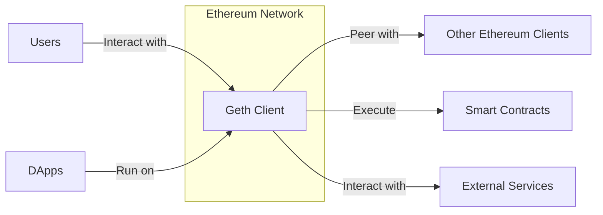
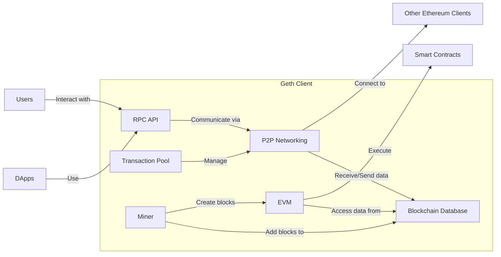
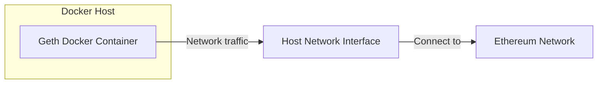
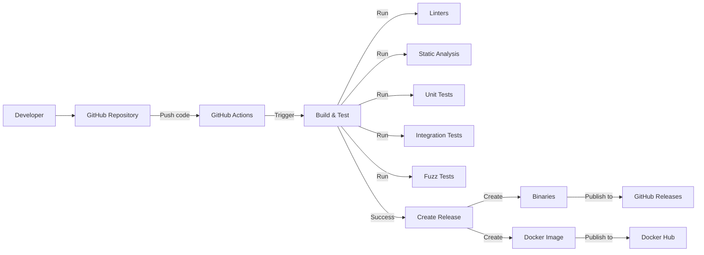

# BUSINESS POSTURE

Geth (Go Ethereum) is the official Golang implementation of the Ethereum protocol. It is one of the three original implementations (along with C++ and Python). It is the most popular and widely used client, serving as a critical piece of infrastructure for the entire Ethereum ecosystem.

Business Priorities and Goals:

*   Maintain a stable, secure, and performant node implementation for the Ethereum network.
*   Enable users to interact with the Ethereum blockchain: run nodes, mine blocks, create and manage accounts, deploy and interact with smart contracts, and transfer ether.
*   Provide a reliable platform for decentralized application (DApp) developers.
*   Keep up with the latest Ethereum Improvement Proposals (EIPs) and network upgrades.
*   Foster a strong open-source community and encourage contributions.
*   Ensure the long-term viability and decentralization of the Ethereum network.

Most Important Business Risks:

*   Critical software vulnerabilities that could lead to network instability, loss of funds, or chain splits.
*   Inability to keep up with Ethereum network upgrades, leading to incompatibility and potential forking.
*   Performance bottlenecks that limit scalability and usability.
*   Loss of developer and community trust due to security incidents or poor management.
*   Centralization risks if a single client implementation becomes overwhelmingly dominant.
*   Compromise of build and distribution infrastructure.

# SECURITY POSTURE

Existing Security Controls:

*   security control: Code Reviews: All changes to the codebase undergo mandatory code reviews by other developers. (Described in contribution guidelines and enforced by GitHub pull request mechanics).
*   security control: Static Analysis: The project uses static analysis tools like `go vet`, `staticcheck`, and other linters to identify potential bugs and security vulnerabilities. (Described in Makefiles and CI workflows).
*   security control: Fuzz Testing: Geth utilizes fuzz testing (e.g., go-fuzz) to discover edge cases and vulnerabilities that might be missed by traditional testing methods. (Described in specific fuzzing directories and CI workflows).
*   security control: Dependency Management: Go modules are used to manage dependencies and their versions, reducing the risk of supply chain attacks. (Described in `go.mod` and `go.sum` files).
*   security control: Cryptographic Libraries: Geth uses well-vetted cryptographic libraries for operations like key generation, signing, and encryption. (Described in code, using standard Go crypto libraries and custom implementations where necessary).
*   security control: Regular Audits: While not explicitly stated in every repository, major releases and critical components often undergo external security audits. (Referenced in blog posts and announcements).
*   security control: Bug Bounty Program: Ethereum, and by extension Geth, benefits from a bug bounty program that incentivizes security researchers to find and report vulnerabilities. (Referenced in Ethereum Foundation documentation).

Accepted Risks:

*   accepted risk: Complexity: The Ethereum protocol and Geth codebase are inherently complex, increasing the attack surface and the possibility of unforeseen vulnerabilities.
*   accepted risk: Rapid Evolution: The Ethereum ecosystem is constantly evolving, requiring frequent updates and changes to Geth, which introduces the risk of new bugs.
*   accepted risk: Decentralized Development: While beneficial for openness, decentralized development can make it challenging to enforce consistent security practices across all contributors.
*   accepted risk: Zero-Day Exploits: As with any software, there's always the risk of unknown zero-day vulnerabilities being exploited before they can be patched.

Recommended Security Controls:

*   security control: Formal Security Audits: Schedule regular, independent security audits of the entire codebase, not just specific components.
*   security control: Threat Modeling: Conduct regular threat modeling exercises to proactively identify and mitigate potential security risks.
*   security control: Enhanced Fuzzing: Expand fuzzing coverage to include more components and protocols.
*   security control: Supply Chain Security: Implement more robust measures to verify the integrity of dependencies and build processes, such as software bill of materials (SBOM) and in-toto.
*   security control: Memory Safety: Explore the use of memory-safe languages or techniques (e.g., Rust) for critical components to mitigate memory-related vulnerabilities.

Security Requirements:

*   Authentication:
    *   Secure key management for user accounts and node identities.
    *   Protection against unauthorized access to private keys.
    *   Support for hardware wallets and other secure key storage mechanisms.
*   Authorization:
    *   Access control mechanisms for RPC APIs and other interfaces.
    *   Protection against unauthorized execution of privileged operations.
*   Input Validation:
    *   Thorough validation of all inputs from external sources, including network messages, RPC calls, and user-provided data.
    *   Protection against common attack vectors like injection, buffer overflows, and denial-of-service.
*   Cryptography:
    *   Use of strong, well-vetted cryptographic algorithms and libraries.
    *   Secure implementation of cryptographic protocols, including key exchange, signing, and encryption.
    *   Protection against known cryptographic attacks.
    *   Regular review and updates of cryptographic implementations to address emerging threats.

# DESIGN

## C4 CONTEXT

Element Descriptions:

*   1.  Name: Geth Client
    *   Type: Software System
    *   Description: The Go Ethereum client, a command-line tool for interacting with the Ethereum blockchain.
    *   Responsibilities:
        *   Running a full Ethereum node.
        *   Connecting to and synchronizing with the Ethereum network.
        *   Mining new blocks (if configured).
        *   Creating and managing Ethereum accounts.
        *   Deploying and interacting with smart contracts.
        *   Sending and receiving transactions.
        *   Providing APIs for DApps and other tools.
    *   Security controls: Code Reviews, Static Analysis, Fuzz Testing, Dependency Management, Cryptographic Libraries, Regular Audits, Bug Bounty Program.

*   2.  Name: Users
    *   Type: Person
    *   Description: Individuals or organizations interacting with the Ethereum network through the Geth client.
    *   Responsibilities:
        *   Managing their own private keys.
        *   Initiating transactions.
        *   Interacting with DApps.
    *   Security controls: User education, secure key storage practices (e.g., hardware wallets).

*   3.  Name: DApps
    *   Type: Software System
    *   Description: Decentralized applications built on top of the Ethereum blockchain.
    *   Responsibilities:
        *   Providing specific functionalities to users.
        *   Interacting with smart contracts.
    *   Security controls: DApp-specific security measures, smart contract audits.

*   4.  Name: Other Ethereum Clients
    *   Type: Software System
    *   Description: Alternative implementations of the Ethereum protocol (e.g., Nethermind, Besu).
    *   Responsibilities:
        *   Participating in the Ethereum network.
        *   Maintaining consensus with other clients.
    *   Security controls: Client-specific security measures.

*   5.  Name: Smart Contracts
    *   Type: Software System
    *   Description: Self-executing contracts stored on the Ethereum blockchain.
    *   Responsibilities:
        *   Enforcing the rules of the contract.
        *   Managing digital assets.
    *   Security controls: Smart contract audits, formal verification.

*   6.  Name: External Services
    *   Type: Software System
    *   Description: Services outside the Ethereum network that Geth might interact with (e.g., block explorers, Infura).
    *   Responsibilities:
        *   Providing additional data or functionality.
    *   Security controls: Service-specific security measures.

## C4 CONTAINER

Element Descriptions:

*   1.  Name: RPC API
    *   Type: API
    *   Description: Interface for users and DApps to interact with the Geth client.
    *   Responsibilities:
        *   Handling requests from users and DApps.
        *   Providing access to blockchain data and functionality.
    *   Security controls: Access control, input validation, rate limiting.

*   2.  Name: P2P Networking
    *   Type: Component
    *   Description: Module responsible for communication with other Ethereum clients.
    *   Responsibilities:
        *   Discovering and connecting to peers.
        *   Synchronizing the blockchain.
        *   Propagating transactions and blocks.
    *   Security controls: Encryption, authentication, DoS protection.

*   3.  Name: EVM (Ethereum Virtual Machine)
    *   Type: Component
    *   Description: The runtime environment for executing smart contracts.
    *   Responsibilities:
        *   Executing smart contract bytecode.
        *   Managing state transitions.
    *   Security controls: Sandboxing, gas limits, opcode restrictions.

*   4.  Name: Blockchain Database
    *   Type: Database
    *   Description: Storage for the Ethereum blockchain data.
    *   Responsibilities:
        *   Storing blocks, transactions, and state data.
        *   Providing efficient access to blockchain data.
    *   Security controls: Data integrity checks, access control.

*   5.  Name: Transaction Pool
    *   Type: Component
    *   Description: A temporary storage for pending transactions before they are included in a block.
    *   Responsibilities:
        *   Receiving and validating transactions.
        *   Prioritizing transactions based on gas price.
    *   Security controls: Transaction validation, DoS protection.

*   6.  Name: Miner
    *   Type: Component
    *   Description: Optional component responsible for creating new blocks (if mining is enabled).
    *   Responsibilities:
        *   Solving the proof-of-work puzzle.
        *   Assembling transactions into blocks.
    *   Security controls: Algorithm-specific security measures.

*   7.  Name: Users
    *   Type: Person
    *   Description: Individuals or organizations interacting with the Ethereum network through the Geth client.
    *   Responsibilities: Managing keys, initiating transactions.
    *   Security controls: User education, secure key storage.

*   8.  Name: DApps
    *   Type: Software System
    *   Description: Decentralized applications.
    *   Responsibilities: Providing specific functionalities.
    *   Security controls: DApp-specific security.

*   9.  Name: Other Ethereum Clients
    *   Type: Software System
    *   Description: Alternative implementations of the Ethereum protocol.
    *   Responsibilities: Participating in the Ethereum network.
    *   Security controls: Client-specific security.

*   10. Name: Smart Contracts
    *   Type: Software System
    *   Description: Self-executing contracts on the blockchain.
    *   Responsibilities: Enforcing contract rules.
    *   Security controls: Smart contract audits.

## DEPLOYMENT

Possible Deployment Solutions:

1.  Manual Installation: Downloading the pre-built binaries or compiling from source and running the executable.
2.  Docker Container: Using the official Geth Docker image to run the client in a containerized environment.
3.  Cloud Provider (AWS, GCP, Azure): Deploying Geth on virtual machines or using managed Kubernetes services.
4.  Package Managers: Using system package managers (e.g., apt, brew) to install and manage Geth.

Chosen Solution (Docker Container):

Element Descriptions:

*   1.  Name: Geth Docker Container
    *   Type: Container
    *   Description: An isolated environment running the Geth client.
    *   Responsibilities:
        *   Running the Geth process.
        *   Managing its dependencies.
        *   Exposing necessary ports for communication.
    *   Security controls: Container isolation, image signing, vulnerability scanning.

*   2.  Name: Ethereum Network
    *   Type: Network
    *   Description: The global network of Ethereum nodes.
    *   Responsibilities:
        *   Maintaining the blockchain.
        *   Processing transactions.
    *   Security controls: Network-wide consensus mechanisms.

*   3.  Name: Host Network Interface
    *   Type: Network Interface
    *   Description: The network interface of the host machine running the Docker container.
    *   Responsibilities:
        *   Routing network traffic to and from the container.
    *   Security controls: Firewall rules, network segmentation.

## BUILD

Build Process Description:

1.  Developers write code and push changes to the GitHub repository.
2.  GitHub Actions, the CI/CD platform, is triggered by push events.
3.  The build and test workflow is initiated.
4.  Various checks are performed:
    *   Linters (e.g., `go vet`, `staticcheck`) ensure code style and identify potential errors.
    *   Static analysis tools scan for security vulnerabilities.
    *   Unit tests verify individual components.
    *   Integration tests check the interaction between different parts of the system.
    *   Fuzz tests discover edge cases and vulnerabilities.
5.  If all checks pass, a release is created.
6.  The release process generates:
    *   Pre-built binaries for various operating systems and architectures.
    *   A Docker image containing the Geth client.
7.  The binaries are published to GitHub Releases.
8.  The Docker image is published to Docker Hub.

Security Controls in Build Process:

*   security control: Automated Build: GitHub Actions ensures a consistent and reproducible build process.
*   security control: Code Analysis: Linters and static analysis tools are integrated into the build pipeline.
*   security control: Testing: Comprehensive testing (unit, integration, fuzz) helps identify bugs and vulnerabilities.
*   security control: Dependency Management: Go modules ensure that dependencies are tracked and managed securely.
*   security control: Signed Releases: Releases (binaries and Docker images) should be digitally signed to verify their authenticity and integrity. (Implementation details may vary).

# RISK ASSESSMENT

Critical Business Processes to Protect:

*   Maintaining the integrity and availability of the Ethereum network.
*   Ensuring the security of user funds and data.
*   Providing a reliable platform for DApp development.

Data to Protect and Sensitivity:

*   Private Keys: Highest sensitivity. Loss or compromise leads to direct loss of funds.
*   Blockchain Data: High sensitivity. Corruption or manipulation can disrupt the network.
*   Transaction Data: Medium sensitivity. Privacy concerns and potential for front-running.
*   User Account Data: Medium sensitivity. Privacy concerns and potential for identity theft.
*   Node Configuration Data: Medium sensitivity. Misconfiguration can lead to security vulnerabilities.

# QUESTIONS & ASSUMPTIONS

Questions:

*   What are the specific performance requirements for Geth (e.g., transactions per second, block propagation time)?
*   What are the target deployment environments (e.g., cloud providers, operating systems)?
*   What are the specific security audit requirements and frequency?
*   What is the process for handling security vulnerabilities and disclosing them responsibly?
*   What are the plans for implementing more advanced supply chain security measures?

Assumptions:

*   BUSINESS POSTURE: The Ethereum Foundation and the Geth development team prioritize security and are committed to addressing vulnerabilities promptly.
*   SECURITY POSTURE: Existing security controls are implemented and maintained effectively.
*   DESIGN: The design accurately reflects the current architecture of Geth. The Docker deployment model is representative of a common deployment scenario. The build process described is based on common practices and available information in the repository.