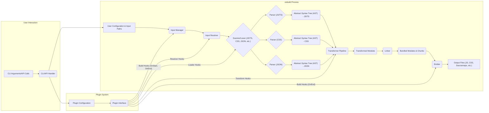

## Project Design Document: esbuild (Improved)

**1. Introduction**

This document provides an enhanced and detailed design overview of the esbuild project, a high-performance JavaScript bundler and minifier written in Go. This improved document aims to offer a more granular understanding of esbuild's architecture, components, and data flow, specifically tailored for effective threat modeling.

**1.1. Purpose**

The primary purpose of this document is to provide a comprehensive and detailed design description of esbuild, enabling thorough and accurate threat modeling. It meticulously outlines the key components, their interactions, the types of data they process, and potential security implications.

**1.2. Scope**

This document covers the core functionality and internal processes of esbuild, including:

*   Detailed input processing and parsing of various web asset formats (JavaScript, TypeScript, CSS, JSON, WASM, images, etc.).
*   In-depth explanation of transformation and optimization techniques (minification, tree-shaking, dead code elimination, constant folding, etc.).
*   Comprehensive description of the linking and bundling process, including dependency resolution strategies and code splitting mechanisms.
*   A thorough examination of the plugin system architecture and its interaction with the core functionalities.
*   Detailed explanation of the command-line interface (CLI) and programmatic API, including input and output mechanisms.
*   Handling of different module formats (ESM, CommonJS, AMD, UMD).
*   Sourcemap generation and its implications.

This document explicitly excludes:

*   The low-level implementation details of the Go runtime environment.
*   The specific algorithmic optimizations within the Go standard libraries used by esbuild.
*   Detailed performance benchmarking data or comparisons with other bundlers (unless directly relevant to security considerations).

**1.3. Goals**

*   Present a clear, detailed, and unambiguous description of esbuild's internal architecture.
*   Precisely identify the responsibilities and functionalities of each key component.
*   Illustrate the complete data flow through the system, including data transformations at each stage.
*   Proactively highlight potential areas of interest and specific concerns for security analysis and threat mitigation.

**2. Overview**

esbuild is a command-line tool and embeddable library designed to efficiently bundle and minify web assets. Written in Go for speed and concurrency, it takes multiple entry points and their dependencies as input and produces optimized output files suitable for deployment in browser and Node.js environments. Its architecture emphasizes parallelism and minimal memory allocation to achieve its performance goals.

**3. Architectural Design**

esbuild's architecture is modular and event-driven, with distinct components working in concert.

*   **Input Manager:**  A higher-level component responsible for orchestrating the initial stages of the build process. It receives user configurations and input paths, and delegates tasks to the Input Resolver.
*   **Input Resolver:**  This component is responsible for locating and resolving all input files based on import statements, module resolution algorithms (Node.js style, browser style), and user-defined configuration. It handles different module formats and virtual file systems.
*   **Scanner/Lexer:**  For each supported file type, a scanner (lexer) breaks down the input stream into a sequence of tokens. This is the first step in parsing.
*   **Parser (Language Specific):**  Dedicated parsers exist for each supported language (JavaScript/TypeScript, CSS, JSON, etc.). These parsers consume the token stream and generate an Abstract Syntax Tree (AST) representing the structure of the code.
*   **Transformer Pipeline:**  A series of transformation passes operate on the AST. These passes perform optimizations and code manipulations:
    *   **Minification Pass:** Removes whitespace, shortens identifiers, and applies other minification techniques.
    *   **Tree-Shaking/Dead Code Elimination Pass:** Analyzes the AST to identify and remove unused code.
    *   **JSX/TSX Compilation Pass:** Transforms JSX/TSX syntax into standard JavaScript.
    *   **CSS Processing Pass:** Applies CSS optimizations, prefixing, and transformations.
    *   **Loader Execution:** When a non-standard file type is encountered, configured loaders (either built-in or provided by plugins) are executed to transform the file content into a JavaScript module.
*   **Linker:**  The Linker is responsible for connecting the transformed modules. It performs:
    *   **Dependency Graph Construction:** Builds a graph representing the relationships between modules.
    *   **Scope Analysis:** Determines the scope and visibility of variables and functions.
    *   **Module Instantiation:** Creates instances of each module.
    *   **Code Splitting Logic:**  If configured, divides the code into multiple chunks for optimized loading.
    *   **Circular Dependency Detection:** Identifies and handles circular dependencies.
*   **Emitter:**  The Emitter takes the linked modules and generates the final output files:
    *   **Code Generation:** Converts the internal representation of the bundled code back into JavaScript, CSS, etc.
    *   **Formatting:** Applies code formatting based on configuration.
    *   **Sourcemap Generation:** Creates sourcemaps to facilitate debugging.
    *   **Output Writing:** Writes the generated files to the specified output directory.
*   **Plugin System:**  A core architectural component allowing users to extend esbuild's functionality. Plugins can hook into various stages of the build process:
    *   **Resolver Plugins:** Customize module resolution.
    *   **Loader Plugins:** Handle the loading and transformation of specific file types.
    *   **Transform Plugins:** Modify the AST of modules.
    *   **Build Plugins:** Perform actions at the beginning or end of the build process.
*   **CLI/API Handler:**  The entry point for user interaction. It parses command-line arguments or API calls, validates input, configures the build process, and invokes the Input Manager.

**4. Data Flow (Detailed)**

The data flow through esbuild involves the transformation of input files into optimized output.

1. **Initialization:** The CLI/API Handler receives user input and configuration.
2. **Input Resolution:** The Input Manager initiates the Input Resolver, which recursively traverses dependencies, locating all required files. Resolved file paths and contents are passed to the next stage.
3. **Lexing and Parsing:** For each resolved file, the appropriate Scanner/Lexer breaks the content into tokens. These tokens are then consumed by the corresponding Parser to generate an Abstract Syntax Tree (AST). The AST represents the code's structure in a hierarchical format.
4. **Transformation:** The AST is passed through the Transformer Pipeline. Each transformation pass manipulates the AST. For example, the minification pass modifies the AST to reduce code size, and the tree-shaking pass removes unused nodes from the AST. Loaders (either built-in or from plugins) transform the content of non-standard files into a JavaScript module representation (often by generating an AST).
5. **Linking:** The Linker receives the transformed modules (represented by their ASTs). It constructs a dependency graph, resolving imports and exports. Scope analysis is performed to understand variable visibility. Based on configuration, code splitting decisions are made, and the modules are organized into chunks.
6. **Emission:** The Emitter takes the linked modules and generates the final output. It traverses the internal representation of the bundled code and generates the corresponding JavaScript, CSS, or other output formats. Sourcemaps are generated by mapping the output code back to the original source code. The generated output is then written to the file system.
7. **Plugin Interaction:** At various stages (resolution, loading, transformation, build), the Plugin System allows registered plugins to intercept and modify the data. For example, a resolver plugin can change how modules are located, a loader plugin can transform the content of a specific file type, and a transform plugin can modify the AST before linking.

**5. Key Components and Responsibilities (Granular)**

*   **Input Manager:**
    *   Receives and validates user configuration.
    *   Orchestrates the initial file resolution process.
    *   Manages plugin initialization and registration.
*   **Input Resolver:**
    *   Implements module resolution algorithms (Node.js, browser).
    *   Handles different module specifier formats (relative, absolute, package names).
    *   Interacts with resolver plugins to customize resolution behavior.
    *   Manages a cache of resolved modules.
*   **Scanner/Lexer (Language Specific):**
    *   Performs lexical analysis, breaking the input stream into tokens.
    *   Identifies keywords, identifiers, operators, and literals.
    *   Handles comments and whitespace.
*   **Parser (Language Specific):**
    *   Performs syntax analysis, building the AST from the token stream.
    *   Enforces language grammar rules.
    *   Generates error messages for invalid syntax.
*   **Transformer Pipeline:**
    *   Executes a series of transformation passes on the AST.
    *   **Minification Pass:** Applies various minification techniques (identifier renaming, whitespace removal, etc.).
    *   **Tree-Shaking/Dead Code Elimination Pass:** Analyzes import/export relationships and removes unused code.
    *   **JSX/TSX Compilation Pass:** Transforms JSX/TSX syntax into standard JavaScript function calls.
    *   **CSS Processing Pass:** Applies CSS optimizations (minification, prefixing, etc.).
    *   **Loader Execution:** Invokes configured loaders to transform non-standard file types into JavaScript modules.
*   **Linker:**
    *   Constructs a directed graph representing module dependencies.
    *   Resolves import and export statements between modules.
    *   Performs scope analysis to determine variable binding and visibility.
    *   Implements code splitting logic based on configuration.
    *   Detects and handles circular dependencies.
    *   Determines the order of module initialization.
*   **Emitter:**
    *   Generates the final output code from the linked modules.
    *   Formats the output code according to user configuration.
    *   Generates sourcemaps by mapping output code positions to original source code positions.
    *   Writes the generated output files to the specified directory.
*   **Plugin System:**
    *   Provides a well-defined interface for extending esbuild's functionality.
    *   Allows plugins to register hooks that are executed at specific points in the build process.
    *   Manages the lifecycle of plugins.
    *   Provides mechanisms for plugins to interact with esbuild's internal state (with appropriate safeguards).
*   **CLI/API Handler:**
    *   Parses command-line arguments and options.
    *   Provides a programmatic API for integration with other tools.
    *   Validates user input and configuration.
    *   Orchestrates the overall build process by invoking the Input Manager and other components.

**6. Security Considerations (Enhanced)**

This section provides a more detailed examination of potential security concerns:

*   **Input Validation Vulnerabilities:**
    *   **Path Traversal:** Maliciously crafted input file paths or import specifiers could allow access to files outside the intended project directory.
    *   **Configuration Injection:**  Improper validation of configuration options could allow attackers to inject malicious commands or scripts.
    *   **Denial of Service (DoS) via Input:**  Extremely large or deeply nested input files could exhaust system resources during parsing or transformation.
    *   **Archive Extraction Vulnerabilities:** If esbuild handles archive files (e.g., for package dependencies), vulnerabilities in the extraction process could lead to arbitrary file write.
*   **Plugin Security Risks:**
    *   **Malicious Plugins:**  Plugins from untrusted sources could contain malicious code that could compromise the build process or the host system.
    *   **Plugin Sandboxing Limitations:**  If plugin execution is not properly sandboxed, plugins could gain unauthorized access to the file system, network, or other resources.
    *   **Data Exposure through Plugins:** Plugins might inadvertently log or expose sensitive information processed during the build.
    *   **Supply Chain Attacks via Plugins:**  Compromised plugin dependencies could introduce vulnerabilities.
*   **Dependency Management Security:**
    *   **Dependency Confusion:**  Attackers could introduce malicious packages with the same name as internal dependencies.
    *   **Compromised Dependencies:**  Legitimate dependencies could be compromised, introducing vulnerabilities into the build process.
    *   **Insecure Dependency Resolution:**  Flaws in the module resolution algorithm could lead to the loading of unintended or malicious files.
*   **Output Integrity Concerns:**
    *   **Tampering with Output Files:**  If the output directory is writable by an attacker, they could modify the generated code.
    *   **Sourcemap Security:**  Sourcemaps can expose the original source code, which might contain sensitive information or vulnerabilities. Secure handling and deployment of sourcemaps are crucial.
    *   **Injection into Output:**  Vulnerabilities in the transformation or emission stages could allow attackers to inject malicious code into the generated output.
*   **Resource Consumption and DoS:**
    *   **Algorithmic Complexity Attacks:**  Crafted input files could exploit inefficient algorithms in the parser or transformer, leading to excessive CPU or memory usage.
    *   **Memory Exhaustion:**  Processing very large input files or dependency graphs could lead to memory exhaustion and crashes.
*   **Build Process Security:**
    *   **Exposure of Secrets:**  Careless handling of environment variables or configuration files could expose sensitive credentials.
    *   **Build Toolchain Vulnerabilities:**  Vulnerabilities in the Go compiler or other build tools could be exploited.

**7. Technologies Used**

*   **Primary Programming Language:** Go
*   **Data Structures:**  Custom and standard Go data structures optimized for performance (e.g., maps, slices, graphs).
*   **Parsing Libraries:**  Custom-built, high-performance parsers for JavaScript, TypeScript, CSS, and JSON.
*   **File System Access:**  Standard Go `os` and `io` packages for file system operations.
*   **Concurrency:**  Go's built-in concurrency features (goroutines and channels) are heavily utilized for parallel processing.

**8. Deployment Considerations**

esbuild is typically deployed in the following ways:

*   **Command-line Interface (CLI):**  As a standalone executable invoked from the command line. This is the most common deployment method for local development and CI/CD pipelines.
*   **Node.js Package:**  As an npm package that can be installed and used programmatically within Node.js projects. This allows integration with existing JavaScript build systems.
*   **Embedded Library:**  esbuild's core functionality can be embedded and used as a library within other Go applications.

**9. Future Considerations**

*   Enhanced plugin API with more granular control and security features (e.g., stricter sandboxing).
*   Improved mechanisms for verifying the integrity of plugins and dependencies.
*   More robust input validation and sanitization to prevent various injection attacks.
*   Advanced security analysis tools and integration for identifying potential vulnerabilities.
*   Further optimizations to mitigate resource consumption and DoS risks.

This improved design document provides a more comprehensive and detailed understanding of esbuild's architecture and data flow, specifically tailored for thorough threat modeling activities. The enhanced security considerations section highlights specific areas that warrant further investigation and mitigation strategies.