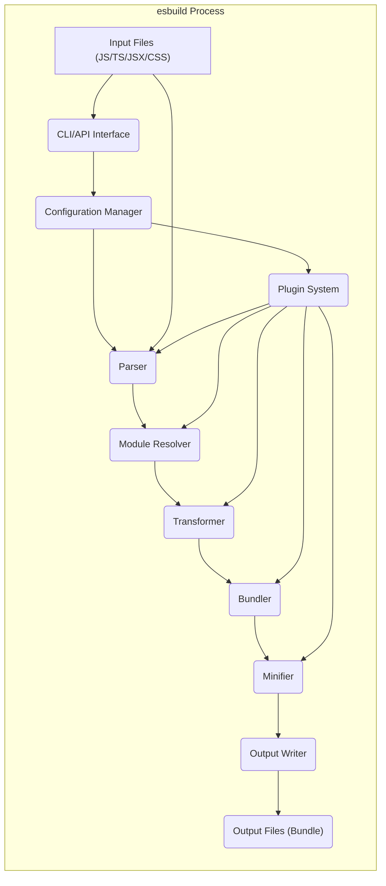

## Project Design Document: esbuild (Improved)

**1. Introduction**

This document provides an enhanced architectural design of the `esbuild` project, a high-performance JavaScript bundler and minifier implemented in Go. This iteration aims to offer a more granular understanding of the system's components, data flow, and core functionalities, specifically tailored for subsequent threat modeling activities.

**2. Goals**

*   Provide a detailed breakdown of the major components and their interactions within `esbuild`, including their specific responsibilities.
*   Elaborate on the data flow through the system, highlighting data transformations and key decision points.
*   Clearly define the core functionalities and their underlying processes.
*   Serve as a robust foundation for identifying potential security vulnerabilities, attack vectors, and areas requiring further security scrutiny.

**3. Scope**

This document encompasses the core architecture and functionality of `esbuild` as both a command-line tool and a JavaScript API. The focus remains on the bundling and minification processes, including parsing, resolving, transforming, bundling, and outputting code. The plugin system is described in greater detail due to its security implications.

**4. High-Level Overview**

`esbuild` is engineered for exceptional speed and efficiency in bundling and minifying JavaScript, TypeScript, and CSS code. Its Go implementation and parallel processing capabilities enable rapid build times. The fundamental process involves ingesting entry points, recursively resolving dependencies, applying necessary transformations and optimizations, and generating optimized output bundles. It offers both a direct command-line interface (CLI) and a programmatic JavaScript API for integration within build pipelines and Node.js environments.

**5. Architectural Design**

The following diagram provides a more detailed view of the `esbuild` architecture:

**5.1. Component Descriptions**

*   **"Input Files (JS/TS/JSX/CSS)"**: The source code files that `esbuild` processes. These can include JavaScript, TypeScript, JSX, and CSS files, representing the application's codebase and styling.
*   **"CLI/API Interface"**: The primary interaction point with `esbuild`.
    *   **CLI**: Interprets command-line arguments, validates input, and orchestrates the build process.
    *   **API**: Provides JavaScript functions for programmatic interaction, allowing integration into build tools and custom scripts. This involves receiving configuration objects and triggering the bundling process.
*   **"Configuration Manager"**: Responsible for loading, validating, and managing user-provided configuration options from both the CLI and API. This includes settings for output paths, target environments, module formats, and plugin configurations.
*   **"Parser"**:  Analyzes individual input files and constructs an Abstract Syntax Tree (AST) representing the code's structure. `esbuild` utilizes a custom-built parser optimized for speed and accuracy. This component is crucial for understanding the code's semantics.
*   **"Module Resolver"**:  Identifies and locates imported modules based on import specifiers and configured resolution rules (e.g., Node.js module resolution). This involves searching file system paths and applying specific resolution algorithms.
*   **"Transformer"**:  Applies various code transformations based on the configuration and file type. This component performs operations such as:
    *   **Language Feature Transpilation**: Converting modern JavaScript/TypeScript syntax to older ECMAScript versions.
    *   **JSX/TSX Transformation**: Converting JSX/TSX syntax into standard JavaScript function calls.
    *   **CSS Processing**: Handling CSS `@import` rules, applying transformations (e.g., vendor prefixing), and potentially performing initial minification steps.
*   **"Bundler"**:  Combines the transformed modules into one or more output bundles. Key responsibilities include:
    *   **Dependency Graph Construction**: Building a directed graph representing the relationships between modules.
    *   **Circular Dependency Detection**: Identifying and handling circular dependencies to prevent runtime errors.
    *   **Code Splitting Logic**: Dividing the bundle into smaller chunks based on configuration or dynamic import statements to optimize loading performance.
    *   **Module Wrapping**: Encapsulating modules within a specific format (e.g., IIFE, CommonJS, ES modules) according to the output configuration.
*   **"Minifier"**:  Optimizes the output code for reduced file size. This involves:
    *   **Whitespace Removal**: Removing unnecessary spaces, tabs, and newlines.
    *   **Identifier Renaming (Mangling)**: Shortening variable and function names to reduce file size.
    *   **Dead Code Elimination (Tree Shaking)**: Removing unused code based on static analysis of the dependency graph.
*   **"Output Writer"**:  Takes the final bundled and minified code and writes it to the specified output files on the file system. This component handles file creation and writing operations.
*   **"Output Files (Bundle)"**: The resulting bundled JavaScript, CSS, or other assets generated by `esbuild`. These are the final artifacts of the build process.
*   **"Plugin System"**:  Provides a mechanism for extending `esbuild`'s functionality by allowing users to inject custom logic at various stages of the build process. Plugins can interact with:
    *   **Loaders**: Customizing how specific file types are loaded and processed.
    *   **Resolvers**: Modifying the module resolution process.
    *   **Transformers**: Applying custom code transformations.
    *   **Build Hooks**: Executing custom code at specific points during the build lifecycle.

**5.2. Data Flow (Detailed)**

The data flow within `esbuild` can be broken down into the following steps:

1. **Initialization**: The process begins with the user invoking `esbuild` through the CLI or API, providing input files and configuration options.
2. **Configuration Loading**: The "Configuration Manager" parses and validates the provided configuration, merging defaults and user-specified settings.
3. **Parsing**: For each entry point and its dependencies, the "Parser" reads the file content and generates an Abstract Syntax Tree (AST).
4. **Module Resolution**: The "Module Resolver" analyzes import statements within the ASTs and determines the physical location of the imported modules. This process may involve traversing the file system according to configured resolution rules.
5. **Transformation**: The "Transformer" processes the ASTs, applying transformations based on the configuration and file type. This includes transpilation, JSX conversion, and CSS processing. Plugins registered as transformers can modify the AST at this stage.
6. **Bundling**: The "Bundler" constructs a dependency graph from the transformed modules. It then determines the optimal way to combine these modules into output bundles, potentially performing code splitting.
7. **Minification**: The "Minifier" operates on the bundled code, applying optimizations to reduce file size. Plugins can influence the minification process.
8. **Output Writing**: The "Output Writer" takes the final bundled and minified code and writes it to the specified output files.

**6. Key Functionalities (Detailed)**

*   **Bundling**:  The core function of combining multiple JavaScript, TypeScript, and CSS modules into optimized output files. This involves dependency analysis, graph construction, and module concatenation.
*   **Minification**:  Optimizing the output code for size by removing unnecessary characters, shortening identifiers, and performing dead code elimination.
*   **Transpilation**:  Converting modern JavaScript and TypeScript syntax to older ECMAScript versions to ensure compatibility with target environments.
*   **JSX/TSX Support**:  Parsing and transforming JSX and TSX syntax into standard JavaScript.
*   **CSS Processing**:  Handling CSS imports, and potentially performing transformations like vendor prefixing and minification.
*   **Code Splitting**:  Dividing the output bundle into multiple smaller chunks, often based on dynamic imports, to improve initial page load times and caching efficiency.
*   **Plugin System**:  A powerful extensibility mechanism allowing users to customize various stages of the build process, including module loading, resolution, transformation, and more.
*   **Watch Mode**:  Automatically rebuilding the bundle when changes are detected in the input files, facilitating rapid development cycles.
*   **Development Server**:  A built-in server for serving the bundled output during development, often with features like hot module replacement.

**7. Security Considerations (Expanded)**

This section expands on the initial security considerations, providing more specific examples and categorizations.

*   **Input Validation Vulnerabilities**:
    *   **Malicious Input Files**:  `esbuild` must robustly handle potentially malicious or malformed input files that could exploit vulnerabilities in the parser or other components, leading to denial-of-service or unexpected behavior.
    *   **Path Traversal**:  Improper validation of input file paths could allow attackers to access or process files outside the intended project directory.
*   **Dependency Management Risks**:
    *   **Dependency Confusion**:  If `esbuild` relies on external package managers, vulnerabilities in those systems could lead to the inclusion of malicious dependencies.
    *   **Vulnerable Dependencies**:  The resolved dependencies themselves might contain known security vulnerabilities that are then bundled into the output.
*   **Plugin Security Risks**:
    *   **Arbitrary Code Execution**:  Plugins execute arbitrary code within the `esbuild` process. Malicious or compromised plugins could perform actions like reading sensitive data, modifying files, or establishing network connections.
    *   **Plugin Injection**:  If the plugin configuration is not properly secured, attackers might be able to inject malicious plugins into the build process.
*   **Output Integrity Concerns**:
    *   **Tampering with Output Files**:  Ensuring the integrity of the generated output files is crucial. Attackers might attempt to modify the output to inject malicious code.
    *   **Supply Chain Attacks**:  Compromised build environments or processes could lead to the generation of malicious output.
*   **Resource Exhaustion Attacks**:
    *   **Denial of Service**:  Processing extremely large or complex projects, or crafted malicious input, could lead to excessive resource consumption (CPU, memory), causing denial of service.
*   **Configuration Security**:
    *   **Insecure Configuration**:  Misconfigured options could introduce vulnerabilities, such as allowing the inclusion of remote files or disabling security features.
    *   **Configuration Injection**:  If configuration values are derived from untrusted sources, attackers might be able to inject malicious configuration.

**8. Deployment**

`esbuild` is commonly deployed in the following scenarios:

*   **Local Development**: Used as a command-line tool or integrated into development workflows for building and bundling code during development.
*   **Continuous Integration/Continuous Deployment (CI/CD) Pipelines**:  Integrated into CI/CD pipelines to automate the build and bundling process as part of software delivery.
*   **Build Tool Integration**:  Used as a core component within build tools like npm scripts, yarn scripts, or more sophisticated build systems (e.g., Rollup, Parcel).
*   **Programmatic Usage**:  Utilized as a library within Node.js applications or build tools to programmatically trigger the bundling process.

**9. Future Considerations (Security Focused)**

*   Implementing mechanisms for verifying the integrity and trustworthiness of plugins.
*   Exploring options for sandboxing or isolating plugin execution environments to limit the impact of malicious plugins.
*   Enhancing error handling and reporting to provide more detailed information for security analysis and debugging.
*   Developing features for generating Software Bill of Materials (SBOM) to track dependencies and potential vulnerabilities.
*   Integrating with security scanning tools or linters to automatically identify potential security issues in the input code and plugin configurations.
*   Providing clearer guidance and best practices for secure configuration and usage of `esbuild`.

This improved design document provides a more detailed and nuanced understanding of the `esbuild` project's architecture and functionality, specifically tailored to facilitate comprehensive threat modeling and security analysis.