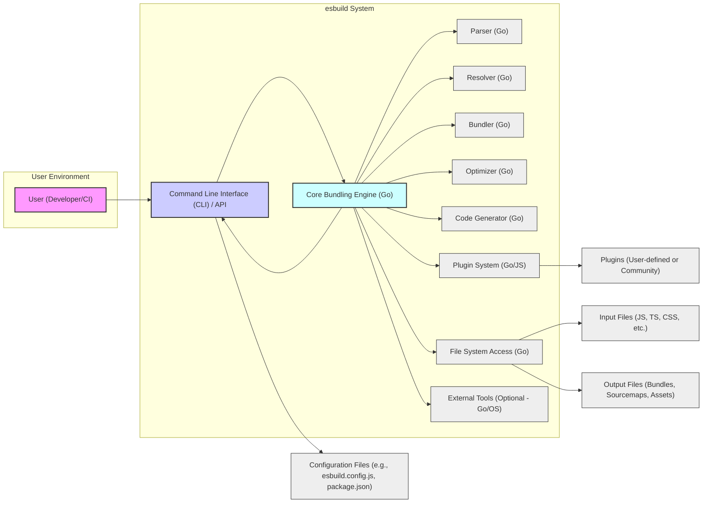

# Project Design Document: esbuild (Improved)

**Version:** 1.1
**Date:** October 26, 2023
**Author:** Gemini (AI Expert)
**Project:** esbuild - An extremely fast JavaScript bundler and minifier
**GitHub Repository:** [https://github.com/evanw/esbuild](https://github.com/evanw/esbuild)

## 1. Introduction

This document provides an enhanced design overview of the `esbuild` project, building upon the previous version to offer greater detail and clarity. It serves as a robust foundation for subsequent threat modeling activities. This document elaborates on the system's architecture, components, data flow, and technologies, with a stronger emphasis on security considerations. The information is derived from the public `esbuild` GitHub repository and general bundler expertise.

## 2. Goals and Objectives

The core objectives of `esbuild` remain focused on performance and correctness:

* **Extreme Speed:**  To significantly outperform existing JavaScript bundlers and minifiers in terms of build time.
* **Standards Compliance:** To generate accurate and standards-compliant output for JavaScript, CSS, and related web technologies.
* **Comprehensive Feature Set:** To support a wide array of modern JavaScript features, including ES modules, JSX, TypeScript, CSS processing, and more.
* **User-Friendly Interface:** To offer both a straightforward command-line interface and a flexible programmatic API for diverse use cases.
* **Plugin Extensibility:** To enable users to extend and customize `esbuild`'s functionality through a plugin architecture.

From a security perspective, while speed and correctness are paramount, `esbuild` implicitly aims to:

* **Minimize Attack Surface:** Design components and interactions to reduce potential vulnerabilities.
* **Prevent Common Vulnerabilities:**  Mitigate risks such as arbitrary code execution, path traversal, and denial-of-service attacks through secure design and implementation.
* **Promote Secure Usage:** Encourage secure configuration and usage patterns through documentation and defaults.
* **Enable Security Audits:**  Maintain a clear and understandable codebase to facilitate security audits and vulnerability assessments.

## 3. System Architecture

`esbuild`'s architecture is centered around a high-performance Go-based core, exposed through CLI and API interfaces.

**3.1. High-Level Architecture Diagram**



**3.2. Component Description (Enhanced)**

* **A. User (Developer/CI):**  Represents a developer using `esbuild` locally or a Continuous Integration/Continuous Deployment (CI/CD) system automating builds.
* **B. Command Line Interface (CLI) / API:**  The user interaction layer.
    * **CLI (Go):**  Parses command-line arguments using libraries like `flag` or `spf13/cobra` in Go.  Handles argument validation and error reporting.  Translates CLI commands into API calls.
    * **API (Go):**  Provides a programmatic interface for integration.  Defines data structures and functions for configuration and execution.  Includes input validation and sanitization at the API level.
    * **Configuration Handling (Go):**  Loads and parses configuration files (`esbuild.config.js`, `package.json`).  Handles different configuration formats (JSON, JavaScript).  Performs validation of configuration parameters.
* **C. Core Bundling Engine (Go):** The central processing unit of `esbuild`.
    * **Concurrency Management (Go):**  Utilizes Go's goroutines and channels for parallel parsing, resolving, and bundling, maximizing CPU utilization.  Employs synchronization primitives to ensure data consistency.
    * **Memory Management (Go):**  Leverages Go's automatic garbage collection and memory safety features to prevent memory leaks and buffer overflows.  Optimized memory allocation for performance.
    * **Error Handling (Go):**  Implements robust error handling throughout the bundling process.  Propagates errors to the CLI/API for user feedback.  Includes mechanisms for graceful degradation and informative error messages.
* **D. Parser (Go):**  Analyzes source code files.
    * **Lexing and Parsing (Go):**  Uses custom-built or Go-based parsing libraries to tokenize and parse JavaScript, TypeScript, CSS, and other supported languages.  Generates Abstract Syntax Trees (ASTs) representing the code structure.  Likely uses techniques like recursive descent parsing for efficiency.
    * **Syntax Error Detection (Go):**  Implements comprehensive syntax error detection and reporting, providing location information and error messages to the user.  Resilient to malformed input to prevent crashes.
    * **AST Representation (Go):**  Defines internal data structures (likely Go structs) to represent AST nodes for different language constructs.  AST is designed for efficient traversal and manipulation during bundling and optimization.
* **E. Resolver (Go):**  Locates module files based on import/require statements.
    * **Module Resolution Algorithms (Go):**  Implements Node.js-style module resolution algorithm, including handling `node_modules` directories, `package.json` `main` fields, and different module specifier types (relative, absolute, bare).  Potentially supports browser-style resolution as well.
    * **Path Normalization and Sanitization (Go):**  Normalizes and sanitizes file paths to prevent path traversal vulnerabilities.  Handles different operating system path conventions.  Limits file system access to project directories.
    * **Cache Management (Go):**  Implements caching mechanisms to speed up module resolution in subsequent builds.  Cache invalidation strategies to ensure correctness.
* **F. Bundler (Go):**  Combines parsed modules into bundles.
    * **Dependency Graph Construction (Go):**  Builds a dependency graph from the resolved modules, representing import relationships.  Detects circular dependencies and handles them appropriately.
    * **Chunking and Code Splitting (Go):**  Implements code splitting logic based on configuration or heuristics to create smaller bundles for better loading performance.  Manages chunk dependencies and entry points.
    * **Tree Shaking Implementation (Go):**  Performs static analysis of the dependency graph and ASTs to identify and remove unused code (dead code elimination).  Optimizes bundle size by excluding unnecessary code.
* **G. Optimizer (Go):**  Reduces bundle size and improves performance.
    * **Minification Techniques (Go):**  Applies various minification techniques, including:
        * **Whitespace Removal:** Removing unnecessary spaces, tabs, and newlines.
        * **Identifier Shortening (Mangling):**  Replacing variable and function names with shorter, obfuscated names.
        * **Constant Folding and Propagation:**  Evaluating constant expressions at build time and propagating constant values.
        * **Dead Code Elimination (Advanced):**  More aggressive dead code elimination beyond tree shaking, potentially using control flow analysis.
        * **Code Inlining:**  Inlining small functions to reduce function call overhead.
    * **AST Transformations (Go):**  Performs AST transformations to apply optimizations efficiently.  Ensures transformations are semantically correct and preserve program behavior.
* **H. Code Generator (Go):**  Transforms the optimized AST back into output code.
    * **Code Generation for Different Formats (Go):**  Generates code in various formats (ES modules, CommonJS, IIFE, CSS) based on configuration.  Handles format-specific syntax and semantics.
    * **Sourcemap Generation (Go):**  Generates sourcemaps that map the bundled code back to the original source files, enabling debugging.  Supports different sourcemap formats and options.
    * **Code Formatting (Minimal - Go):**  While primarily focused on minification, may include basic code formatting to ensure valid syntax and readability (e.g., adding semicolons where necessary).
* **I. Plugin System (Go/JS):**  Extends `esbuild`'s functionality.
    * **Plugin API (Go):**  Defines a Go API for plugins to interact with the bundling process.  Allows plugins to:
        * **Intercept File Loading:**  Customize how files are loaded and processed.
        * **Transform Code:**  Modify code during parsing, bundling, or optimization stages.
        * **Add Custom Output:**  Generate additional output files or assets.
        * **Extend Functionality:**  Implement custom loaders, resolvers, or optimizers.
    * **Plugin Execution Environment (Go/JS):**  Plugins can be implemented in Go for maximum performance or potentially in JavaScript for easier development and community contributions (likely using a mechanism to execute JS within Go, like `goja` or WASM).  Security considerations are crucial for plugin execution, especially for JS plugins.
    * **Plugin Registration and Configuration (Go):**  Provides mechanisms for users to register and configure plugins via CLI, API, or configuration files.
* **J. File System Access (Go):**  Handles all file system interactions.
    * **Secure File I/O (Go):**  Uses Go's standard library for file system operations.  Implements security best practices for file I/O, such as minimizing privileges and validating file paths.
    * **Access Control (Go):**  Restricts file system access to the project directory and configured output directories.  Prevents access to sensitive system files.
    * **File Watching (Optional - Go):**  May include file watching capabilities for development mode, triggering rebuilds on file changes.
* **K. External Tools (Optional - Go/OS):**  Integration with external tools.
    * **Process Execution (Go/OS):**  If external tools are used (e.g., via plugins or custom scripts), `esbuild` might execute external processes using Go's `os/exec` package.  Security considerations are paramount when executing external commands, including input sanitization and command injection prevention.
    * **Limited External Tool Scope (Go):**  The core `esbuild` engine likely minimizes reliance on external tools for performance and portability.  External tool integration is primarily intended for plugin extensibility.
* **L. Configuration Files (e.g., `esbuild.config.js`, `package.json`):**  Configuration sources.
    * **`esbuild.config.js` (JavaScript - V8/Go runtime):**  Allows programmatic configuration using JavaScript.  Requires a JavaScript runtime environment within `esbuild` (likely embedded V8 or a Go-based JS runtime).  Security risks associated with executing user-provided JavaScript configuration.
    * **`package.json` (JSON - Go parsing):**  Parses `package.json` files for dependency information and potentially some `esbuild` configuration.  Uses Go's JSON parsing libraries.
* **M. Input Files (JS, TS, CSS, etc.):**  Source code and assets.
* **N. Output Files (Bundles, Sourcemaps, Assets):**  Generated output.
* **O. Plugins (User-defined or Community):**  Extensible modules.

## 4. Data Flow Diagram (Improved)

```mermaid
graph LR
    A["Input Files (M)"] --> B["CLI/API (B)"];
    B --> C["Configuration (L)"];
    B --> D["Parser (D)"];
    D --> E["Resolver (E)"];
    E --> F["File System Access (J)"];
    F --> D;  // Loop: Resolve & Parse Dependencies
    D --> G["Bundler (F)"];
    G --> H["Optimizer (G)"];
    H --> I["Code Generator (H)"];
    I --> J["Output Files (N)"];
    B --> J; // Output Files via CLI/API
    B --> K["Plugin System (I)"];
    K --> D; // Plugins: Influence Parsing
    K --> E; // Plugins: Influence Resolving
    K --> G; // Plugins: Influence Bundling
    K --> H; // Plugins: Influence Optimization
    K --> I; // Plugins: Influence Code Gen
    K --> F; // Plugins: File System Access
    C --> D; // Configuration influences Parsing
    C --> E; // Configuration influences Resolving
    C --> G; // Configuration influences Bundling
    C --> H; // Configuration influences Optimization
    C --> I; // Configuration influences Code Gen
    C --> K; // Configuration influences Plugins

    style A fill:#eee,stroke:#333,stroke-width:1px
    style B fill:#ccf,stroke:#333,stroke-width:2px
    style C fill:#eee,stroke:#333,stroke-width:1px
    style D fill:#eee,stroke:#333,stroke-width:1px
    style E fill:#eee,stroke:#333,stroke-width:1px
    style F fill:#eee,stroke:#333,stroke-width:1px
    style G fill:#eee,stroke:#333,stroke-width:1px
    style H fill:#eee,stroke:#333,stroke-width:1px
    style I fill:#eee,stroke:#333,stroke-width:1px
    style J fill:#eee,stroke:#333,stroke-width:1px
    style K fill:#eee,stroke:#333,stroke-width:1px
```

**Data Flow Description (Enhanced):**

1. **Input & Configuration (A, L) to CLI/API (B):** User provides input files, entry points, and configuration via CLI arguments, API calls, or configuration files.
2. **Configuration Loading (B to C):** CLI/API loads and parses configuration files (`esbuild.config.js`, `package.json`). Configuration parameters are validated.
3. **Configuration Influence (C to D, E, G, H, I, K):** Configuration settings influence all stages of the bundling process: parsing, resolving, bundling, optimization, code generation, and plugin behavior.
4. **Parsing (B, C to D):** CLI/API initiates parsing of entry point files using the Parser component. Configuration settings (e.g., target environment, language features) affect parsing behavior.
5. **Resolving (D, C to E):** Parser identifies import statements, triggering the Resolver. Configuration (e.g., module paths, aliases) guides module resolution.
6. **File System Access (E to F and back to D):** Resolver uses File System Access to locate module files. Resolved files are then parsed (loop back to Parser). This recursive process continues until all dependencies are resolved and parsed.
7. **Bundling (D, C to G):** Parsed modules (ASTs) are passed to the Bundler. Configuration (e.g., code splitting settings, bundle formats) dictates bundling strategy.
8. **Optimization (G, C to H):** Bundler output is passed to the Optimizer. Configuration (e.g., minification level, optimization flags) controls optimization techniques.
9. **Code Generation (H, C to I):** Optimized AST is passed to the Code Generator. Configuration (e.g., output format, sourcemap options) determines code generation.
10. **Output Writing (I, B to J):** Code Generator produces output files. CLI/API handles writing these files to the file system via File System Access.
11. **Plugin System Interaction (B, C, K to D, E, G, H, I, F):** Plugins, configured via CLI/API and configuration, can intercept and modify data flow at various stages. Plugins can influence parsing, resolving, bundling, optimization, code generation, and even file system access.

## 5. Technology Stack (Detailed)

* **Core Language:** Go (version 1.x or later, leveraging modern Go features)
    * **Concurrency:** Goroutines and channels for parallel processing.
    * **Memory Management:** Automatic garbage collection.
    * **Standard Library:** Extensive use of Go's standard library (`os`, `io`, `path/filepath`, `encoding/json`, `net/http` (potentially for plugin communication), etc.).
    * **Parsing Libraries:** Potentially custom-built parsers in Go for JavaScript, TypeScript, CSS, or leveraging parser generator tools or existing Go parsing libraries.
    * **AST Manipulation:** Go data structures (structs, slices, maps) for representing and manipulating ASTs.
    * **Minification/Optimization Libraries:**  Custom Go code for optimization algorithms, potentially leveraging libraries for specific tasks.
* **Input Languages:** JavaScript (ESNext), TypeScript, JSX, CSS, JSON, HTML (for asset handling), and potentially others via plugins.
* **Output Languages:** JavaScript (ES Modules, CommonJS, IIFE, UMD), CSS, sourcemaps (v3), and potentially other asset formats.
* **Configuration:**
    * **JavaScript Configuration (`esbuild.config.js`):**  Requires a JavaScript runtime environment within `esbuild`.  Likely uses an embedded JavaScript engine like `goja` or a lightweight V8 binding for Go.
    * **JSON Configuration (`package.json`, other JSON files):**  Go's `encoding/json` package for parsing.
    * **Command-line Arguments:** Go's `flag` package or `spf13/cobra` for CLI argument parsing.
* **File System Access:** Go's `os` package for file I/O operations.
* **Plugin System:**
    * **Go Plugin Interface:**  Go interfaces and potentially Go's plugin system (`plugin` package) for defining plugin APIs.
    * **JavaScript Plugin Execution:**  If JavaScript plugins are supported, a JavaScript runtime environment (like `goja` or WASM-based JS runtime) embedded in Go.  Communication mechanism between Go core and JS plugins (e.g., function calls, message passing).
* **External Tool Integration:** Go's `os/exec` package for executing external commands (used sparingly and with security considerations).

## 6. Deployment Model (Clarified)

`esbuild` deployment remains primarily client-side, but with nuances:

* **Standalone Executable (Cross-Platform):**  Compiled Go binaries for Windows, macOS, and Linux.  Users download and execute directly.  Self-contained, requiring no external dependencies beyond the OS.
* **npm Package (Node.js Integration):**  Distributed via npm, enabling integration into Node.js projects and build tools (e.g., npm scripts, yarn scripts, build systems like Webpack, Rollup, Parcel).  Leverages Node.js environment for execution.
* **Programmatic API (Library):**  Usable as a library within other JavaScript/Node.js tools and applications.  Imported and used programmatically.
* **CI/CD Environments:**  Deployed and executed in CI/CD pipelines (e.g., GitHub Actions, GitLab CI, Jenkins) to automate build processes.  Can be used as a standalone executable or via npm package within CI environments.

`esbuild` is not designed as a server-side service. It's a build-time tool executed on the developer's machine or in build environments.

## 7. Security Considerations (Expanded and Categorized)

This section provides a more detailed and categorized analysis of security considerations for threat modeling.

**7.1. Input Validation & Configuration Security:**

* **Threat:** Arbitrary Code Execution (ACE), Configuration Injection, Denial of Service (DoS).
* **Vulnerabilities:**
    * **`esbuild.config.js` Execution:**  Malicious JavaScript code in `esbuild.config.js` could be executed, granting full system access to an attacker.
    * **Command-line Argument Injection:**  Improper sanitization of command-line arguments could allow injection of malicious commands or options.
    * **`package.json` Parsing Vulnerabilities:**  Bugs in JSON parsing of `package.json` could lead to DoS or unexpected behavior.
    * **Unvalidated Configuration Parameters:**  Lack of validation for configuration parameters could lead to unexpected behavior or vulnerabilities.
* **Mitigations:**
    * **Strict Input Validation:**  Thoroughly validate all configuration parameters, command-line arguments, and input file paths.
    * **Sandboxing `esbuild.config.js` (If Possible):**  If `esbuild.config.js` execution is necessary, explore sandboxing techniques to limit its capabilities.  Consider alternative configuration methods that are less risky.
    * **Secure JSON Parsing:**  Use robust and well-tested JSON parsing libraries in Go.
    * **Principle of Least Privilege:**  Run `esbuild` processes with minimal necessary privileges.

**7.2. Dependency Resolution & File System Security:**

* **Threat:** Path Traversal, Arbitrary File Read/Write, Dependency Confusion, Supply Chain Attacks.
* **Vulnerabilities:**
    * **Path Traversal in Module Resolution:**  Vulnerabilities in module resolution logic could allow attackers to read files outside the project directory.
    * **Symlink Exploits:**  Improper handling of symlinks could lead to path traversal or other file system vulnerabilities.
    * **Dependency Confusion:**  If `esbuild` relies on external package managers, it could be vulnerable to dependency confusion attacks.
    * **Malicious Dependencies:**  Compromised dependencies could introduce malicious code into the bundled output.
* **Mitigations:**
    * **Strict Path Sanitization and Normalization:**  Thoroughly sanitize and normalize all file paths during module resolution and file access.
    * **Restrict File System Access:**  Limit file system access to the project directory and explicitly configured output directories.
    * **Secure Symlink Handling:**  Implement secure handling of symlinks, potentially disabling symlink following or carefully validating symlink targets.
    * **Dependency Integrity Checks:**  Integrate with package managers to verify dependency integrity (e.g., using lock files, checksums).
    * **Subresource Integrity (SRI) Support (Output):**  Consider generating SRI hashes for bundled outputs to help verify integrity in browser environments.

**7.3. Plugin System Security:**

* **Threat:** Arbitrary Code Execution (ACE), Privilege Escalation, Data Exfiltration, DoS.
* **Vulnerabilities:**
    * **Unsandboxed Plugin Execution:**  If plugins are executed without proper sandboxing, malicious plugins could gain full system access.
    * **Plugin API Vulnerabilities:**  Vulnerabilities in the plugin API could be exploited by malicious plugins to bypass security controls.
    * **Malicious Plugins (Supply Chain):**  Users could install malicious plugins from untrusted sources.
* **Mitigations:**
    * **Plugin Sandboxing:**  Implement robust sandboxing for plugin execution, especially for JavaScript plugins.  Limit plugin capabilities and access to system resources.
    * **Secure Plugin API Design:**  Design the plugin API to minimize security risks.  Avoid exposing sensitive internal APIs to plugins.
    * **Plugin Validation and Auditing:**  Encourage plugin developers to follow security best practices.  Consider mechanisms for plugin validation or community auditing.
    * **Plugin Permissions Model:**  Implement a permissions model for plugins to control their access to resources and capabilities.
    * **Clear Plugin Security Documentation:**  Provide clear documentation to users about the security risks of using plugins and best practices for plugin management.

**7.4. Output Security:**

* **Threat:** Cross-Site Scripting (XSS), Information Disclosure.
* **Vulnerabilities:**
    * **XSS Introduction via Plugins:**  Plugins that manipulate code or generate output could inadvertently introduce XSS vulnerabilities into the bundled output.
    * **Sourcemap Information Disclosure:**  Sourcemaps, if not handled carefully, could expose sensitive source code information if deployed to production environments.
* **Mitigations:**
    * **Output Sanitization (Plugin Responsibility):**  Plugin developers should be responsible for sanitizing any user-controlled data they include in the output to prevent XSS.
    * **Secure Sourcemap Handling:**  Advise users to avoid deploying sourcemaps to production environments or to restrict access to them.  Consider options for stripping or obfuscating sourcemaps in production builds.
    * **Content Security Policy (CSP) Headers (Documentation):**  Encourage users to use Content Security Policy (CSP) headers in their web applications to mitigate XSS risks, regardless of the bundler used.

**7.5. Denial of Service (DoS):**

* **Threat:** Resource Exhaustion, Build Process Hang, Service Unavailability.
* **Vulnerabilities:**
    * **Recursive Dependency Resolution Loops:**  Circular dependencies or vulnerabilities in resolver logic could lead to infinite loops and DoS.
    * **Excessive Resource Consumption:**  Processing extremely large projects or crafted malicious input files could exhaust memory or CPU resources.
    * **Parser or Optimizer Complexity:**  Computational complexity of parsing or optimization algorithms could be exploited to cause DoS with specific input files.
* **Mitigations:**
    * **Circular Dependency Detection and Prevention:**  Implement robust circular dependency detection and prevention mechanisms in the bundler.
    * **Resource Limits and Throttling:**  Consider implementing resource limits or throttling mechanisms to prevent excessive resource consumption.
    * **Input Size Limits:**  Potentially impose limits on input file sizes or project complexity to prevent DoS attacks.
    * **Algorithm Complexity Analysis:**  Analyze the computational complexity of parsing, resolving, and optimization algorithms to identify and mitigate potential DoS vulnerabilities.

## 8. Assumptions and Constraints (Unchanged)

* **Assumptions:** (Same as Version 1.0)
* **Constraints:** (Same as Version 1.0)

## 9. Future Work (Unchanged)

* **Detailed Threat Modeling:** (Same as Version 1.0)
* **Code Review:** (Same as Version 1.0)
* **Penetration Testing:** (Same as Version 1.0)
* **Plugin Security Analysis:** (Same as Version 1.0)
* **Supply Chain Security Hardening:** (Same as Version 1.0)

This improved design document provides a more comprehensive and security-focused view of `esbuild`, enhancing its value for threat modeling and security analysis. The expanded security considerations section offers a more structured approach to identifying and mitigating potential vulnerabilities.