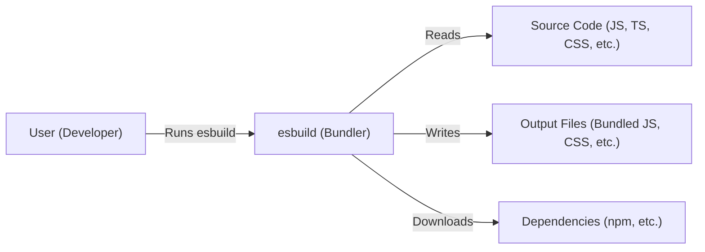
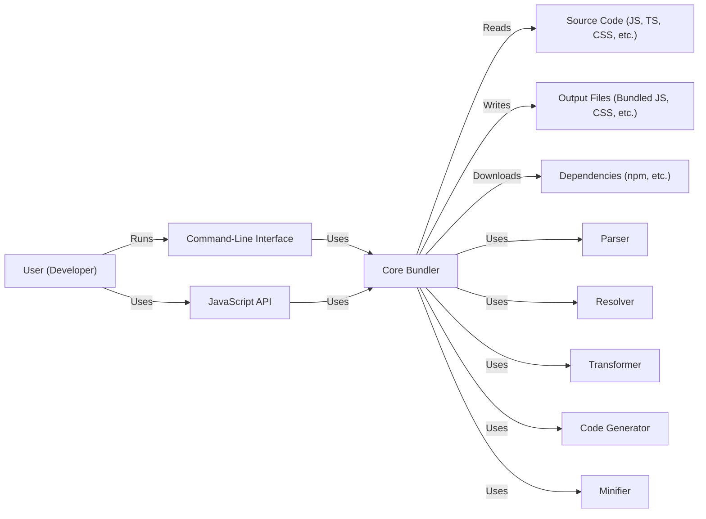
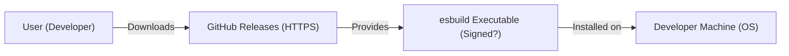
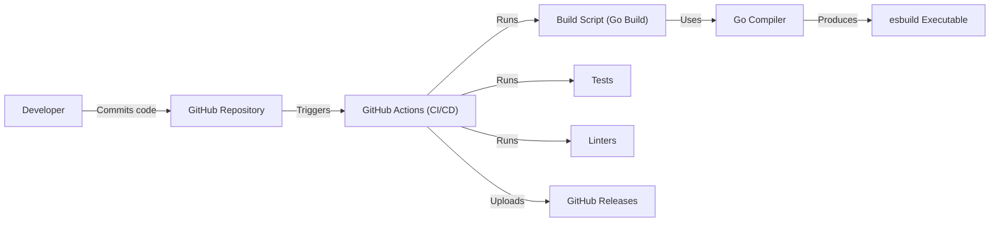

# Project Design Document: esbuild

## BUSINESS POSTURE

esbuild is a JavaScript bundler and minifier. It's designed to be extremely fast. The primary business goals and priorities for esbuild are:

*   Goal: Significantly reduce build times for JavaScript/TypeScript projects.
*   Goal: Provide a simpler, easier-to-configure alternative to existing bundlers (Webpack, Parcel, Rollup).
*   Goal: Minimize dependencies to reduce installation size and complexity.
*   Goal: Offer a command-line interface and a JavaScript API for flexible integration.
*   Priority: Performance is the absolute top priority.
*   Priority: Correctness (accurate bundling) is crucial.
*   Priority: Maintainability and ease of contribution are important for long-term sustainability.

Based on these, the most important business risks are:

*   Risk: Performance regressions could undermine the core value proposition.
*   Risk: Bundling errors (incorrect output) could break production applications.
*   Risk: Security vulnerabilities in esbuild or its dependencies could expose users to supply chain attacks.
*   Risk: Lack of essential features (compared to competitors) could limit adoption.
*   Risk: Difficulty of use or configuration could deter potential users.

## SECURITY POSTURE

*   security control: The project uses Go, which offers some memory safety advantages over C/C++. (Inherent to the language choice).
*   security control: The project appears to have a relatively small number of external dependencies, reducing the attack surface. (Observed from the repository).
*   security control: The project uses automated tests. (Observed from the repository).
*   security control: The project uses linters. (Observed from the repository).
*   accepted risk: The project does not appear to have formal security audits or penetration testing. This is acceptable given the project's nature (a build tool, not a network-facing service) and likely resource constraints, but should be revisited periodically.
*   accepted risk: The project does not currently implement any specific supply chain security measures (e.g., SLSA, SBOM generation). This is a moderate risk, given the increasing prevalence of supply chain attacks.

Recommended Security Controls (High Priority):

*   security control: Implement Software Bill of Materials (SBOM) generation during the build process.
*   security control: Integrate a Static Application Security Testing (SAST) tool into the CI/CD pipeline to scan for vulnerabilities in the Go code.
*   security control: Consider using a dependency vulnerability scanner (e.g., Dependabot or Snyk) to identify and address known vulnerabilities in dependencies.
*   security control: Implement code signing for released binaries to ensure authenticity and integrity.

Security Requirements:

*   Authentication: Not directly applicable, as esbuild is a command-line tool.
*   Authorization: Not directly applicable, as esbuild operates on local files based on the user's existing file system permissions.
*   Input Validation:
    *   esbuild must correctly handle various forms of JavaScript and TypeScript syntax, including potentially malicious or malformed code.  This is crucial to prevent code injection vulnerabilities.
    *   File paths provided to esbuild should be validated to prevent directory traversal attacks.
    *   Configuration files (if used) should be parsed securely to prevent injection of malicious options.
*   Cryptography:
    *   If esbuild implements any features involving cryptography (e.g., content hashing), it must use strong, well-vetted cryptographic libraries and algorithms.
    *   Any downloaded dependencies or plugins should be verified using checksums or digital signatures.

## DESIGN

### C4 CONTEXT

*   User (Developer):
    *   Name: User (Developer)
    *   Type: Person
    *   Description: A software developer who uses esbuild to bundle their code.
    *   Responsibilities:
        *   Writes the source code.
        *   Configures esbuild (if necessary).
        *   Runs esbuild via the command line or API.
        *   Integrates the bundled output into their application.
    *   Security controls:
        *   Operates within their own user account security context.
        *   Relies on operating system file permissions.

*   esbuild (Bundler):
    *   Name: esbuild (Bundler)
    *   Type: Software System
    *   Description: The esbuild bundler itself.
    *   Responsibilities:
        *   Parses and processes source code files.
        *   Resolves and downloads dependencies.
        *   Transforms code (e.g., minification, transpilation).
        *   Generates bundled output files.
    *   Security controls:
        *   Uses Go's memory safety features.
        *   Relatively small number of external dependencies.

*   Source Code (JS, TS, CSS, etc.):
    *   Name: Source Code (JS, TS, CSS, etc.)
    *   Type: Data
    *   Description: The input files to be bundled (JavaScript, TypeScript, CSS, etc.).
    *   Responsibilities:
        *   Contains the application's logic and assets.
    *   Security controls:
        *   Relies on operating system file permissions.

*   Output Files (Bundled JS, CSS, etc.):
    *   Name: Output Files (Bundled JS, CSS, etc.)
    *   Type: Data
    *   Description: The bundled output files generated by esbuild.
    *   Responsibilities:
        *   Contains the optimized and combined code ready for deployment.
    *   Security controls:
        *   Relies on operating system file permissions.

*   Dependencies (npm, etc.):
    *   Name: Dependencies (npm, etc.)
    *   Type: External System
    *   Description: External packages and libraries that the source code depends on.
    *   Responsibilities:
        *   Provides reusable functionality.
    *   Security controls:
        *   Downloaded via HTTPS.
        *   (Ideally) Verified via checksums or signatures.

### C4 CONTAINER

Since esbuild is a relatively simple, single-executable tool, the Container diagram is essentially an expansion of the Context diagram.

*   Command-Line Interface:
    *   Name: Command-Line Interface
    *   Type: Container (Executable)
    *   Description: The primary way users interact with esbuild.
    *   Responsibilities:
        *   Parses command-line arguments.
        *   Calls the Core Bundler.
        *   Handles output and error messages.
    *   Security controls:
        *   Input validation of command-line arguments.

*   JavaScript API:
    *   Name: JavaScript API
    *   Type: Container (Library)
    *   Description:  Allows programmatic use of esbuild from JavaScript code.
    *   Responsibilities:
        *   Provides a programmatic interface to the Core Bundler.
        *   Allows integration with other build tools and workflows.
    *   Security controls:
        *   Input validation of API parameters.

*   Core Bundler:
    *   Name: Core Bundler
    *   Type: Container (Component)
    *   Description: The core logic of esbuild.
    *   Responsibilities:
        *   Coordinates the bundling process.
        *   Manages dependencies.
        *   Calls the Parser, Resolver, Transformer, and Code Generator.
    *   Security controls:
        *   Go's memory safety features.

*   Parser:
    *   Name: Parser
    *   Type: Component
    *   Description: Parses source code into an Abstract Syntax Tree (AST).
    *   Responsibilities:
        *   Handles different file types (JS, TS, CSS, etc.).
        *   Performs syntax checking.
    *   Security controls: Robust parsing to prevent injection vulnerabilities.

*   Resolver:
    *   Name: Resolver
    *   Type: Component
    *   Description: Resolves module dependencies.
    *   Responsibilities:
        *   Finds and loads required modules.
        *   Handles module resolution logic (e.g., node_modules).
    *   Security controls: Secure file path handling to prevent directory traversal.

*   Transformer:
    *   Name: Transformer
    *   Type: Component
    *   Description: Transforms the AST (e.g., for minification, transpilation).
    *   Responsibilities:
        *   Applies various code transformations.
    *   Security controls: Secure transformation logic to prevent code injection.

*   Code Generator:
    *   Name: Code Generator
    *   Type: Component
    *   Description: Generates the final bundled code from the transformed AST.
    *   Responsibilities:
        *   Outputs the bundled code to files.
    *   Security controls: None specific.

*  Minifier:
    *   Name: Minifier
    *   Type: Component
    *   Description: Minifies the generated code.
    *   Responsibilities:
        *   Outputs the minified code to files.
    *   Security controls: None specific.

*   Source Code (JS, TS, CSS, etc.): (Same as in Context Diagram)

*   Output Files (Bundled JS, CSS, etc.): (Same as in Context Diagram)

*   Dependencies (npm, etc.): (Same as in Context Diagram)

### DEPLOYMENT

esbuild is distributed as a pre-compiled executable for various platforms (Windows, macOS, Linux).  It can also be installed via npm.  Therefore, there are several deployment scenarios:

1.  **Direct Download:** Users download the pre-compiled executable from the official website or GitHub releases.
2.  **npm Installation:** Users install esbuild as a global or local npm package.
3.  **Build from Source:** Users clone the repository and build esbuild themselves.

We'll describe the *Direct Download* scenario in detail, as it's the most common and security-relevant.

*   User (Developer): (Same as in Context Diagram)
*   GitHub Releases (HTTPS):
    *   Name: GitHub Releases (HTTPS)
    *   Type: Infrastructure
    *   Description: The official distribution point for esbuild releases.
    *   Responsibilities:
        *   Hosts the pre-compiled executables.
        *   Provides secure download via HTTPS.
    *   Security controls:
        *   HTTPS encryption.
        *   GitHub's infrastructure security.

*   esbuild Executable (Signed?):
    *   Name: esbuild Executable (Signed?)
    *   Type: Software
    *   Description: The downloaded esbuild executable.
    *   Responsibilities:
        *   Runs the bundling process.
    *   Security controls:
        *   (Ideally) Code signing to verify authenticity.

*   Developer Machine (OS):
    *   Name: Developer Machine (OS)
    *   Type: Infrastructure
    *   Description: The developer's computer where esbuild is installed and run.
    *   Responsibilities:
        *   Provides the execution environment for esbuild.
    *   Security controls:
        *   Operating system security features (e.g., file permissions, user accounts).
        *   Antivirus/antimalware software.

### BUILD

esbuild is built using Go. The repository includes build scripts and GitHub Actions workflows for automated builds and testing.

*   Developer: (Same as in Context Diagram)
*   GitHub Repository:
    *   Name: GitHub Repository
    *   Type: Infrastructure
    *   Description: The source code repository for esbuild.
    *   Responsibilities:
        *   Stores the code.
        *   Tracks changes.
        *   Triggers CI/CD workflows.
    *   Security controls:
        *   GitHub's access controls and security features.

*   GitHub Actions (CI/CD):
    *   Name: GitHub Actions (CI/CD)
    *   Type: Infrastructure
    *   Description: The CI/CD platform used to automate builds and tests.
    *   Responsibilities:
        *   Runs build scripts.
        *   Executes tests.
        *   Publishes releases.
    *   Security controls:
        *   GitHub Actions security features.
        *   (Ideally) Limited access to secrets and credentials.

*   Build Script (Go Build):
    *   Name: Build Script (Go Build)
    *   Type: Script
    *   Description: The script that compiles the Go code.
    *   Responsibilities:
        *   Invokes the Go compiler.
        *   Handles build flags and options.
    *   Security controls: None specific.

*   Go Compiler:
    *   Name: Go Compiler
    *   Type: Tool
    *   Description: The Go compiler.
    *   Responsibilities:
        *   Compiles the Go code into an executable.
    *   Security controls: Go compiler's built-in security features.

*   esbuild Executable: (Same as in Deployment Diagram)

*   Tests:
    *   Name: Tests
    *   Type: Software
    *   Description: Automated tests to verify esbuild's functionality.
    *   Responsibilities:
        *   Ensure code correctness.
        *   Prevent regressions.
    *   Security controls: None specific, but tests can help detect security-related bugs.

*   Linters:
     *   Name: Linters
     *   Type: Software
     *   Description: Linters check code for potential errors and style issues.
     *   Responsibilities:
         *   Ensure code quality.
         *   Prevent some classes of bugs.
     *   Security controls: None specific, but linters can help detect security-related bugs.

*   GitHub Releases: (Same as in Deployment Diagram)

## RISK ASSESSMENT

*   Critical Business Processes:
    *   Rapid and reliable JavaScript/TypeScript bundling.
    *   Providing a fast and efficient build tool for web development.

*   Data to Protect:
    *   Source code of esbuild itself (low sensitivity, but important for integrity).
    *   User's source code (variable sensitivity, depending on the user's project).  esbuild processes this code but does not store it persistently.
    *   Dependencies (low sensitivity, but important for supply chain security).

## QUESTIONS & ASSUMPTIONS

*   Questions:
    *   Are there any specific compliance requirements (e.g., for specific industries) that esbuild needs to consider?
    *   What is the expected scale of esbuild usage (number of users, projects, etc.)? This can influence the priority of certain security measures.
    *   What is the process for handling security vulnerability reports?
    *   Are there plans to add features that might introduce new security considerations (e.g., remote code execution, plugin systems)?
    *   Does esbuild collect any telemetry or usage data?

*   Assumptions:
    *   Business Posture: We assume a relatively small team with limited resources, prioritizing speed and simplicity.
    *   Security Posture: We assume a "best effort" approach to security, with a focus on preventing major vulnerabilities rather than achieving formal security certifications.
    *   Design: We assume that esbuild will remain primarily a command-line tool, with the JavaScript API serving as a secondary interface. We assume no network-facing components.
    *   Users have basic security hygiene on their development machines (e.g., running antivirus software).
    *   Users are responsible for the security of their own source code and dependencies.
    *   The primary threat model is supply chain attacks and vulnerabilities within esbuild itself that could lead to code execution or information disclosure.
    *   esbuild does not handle sensitive data directly (e.g., passwords, API keys) *except* potentially as part of the user's source code, which it processes but does not store.