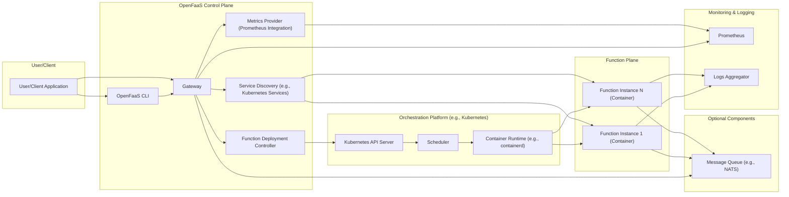
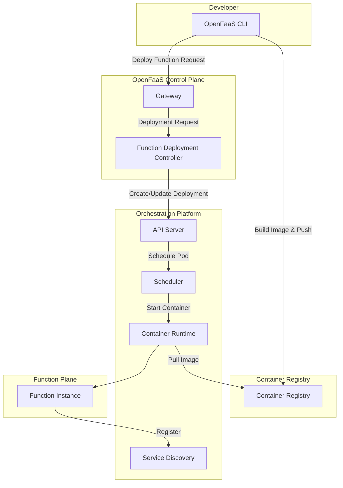
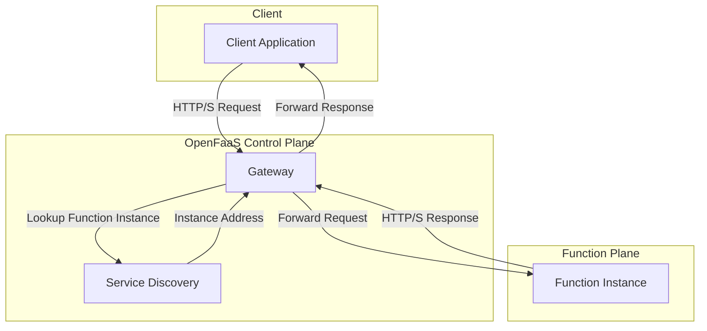

# Project Design Document: OpenFaaS

**Version:** 1.1
**Date:** October 26, 2023
**Author:** AI Software Architect

## 1. Introduction

This document provides a detailed architectural design of the OpenFaaS (Functions as a Service) project, based on the information available at [https://github.com/openfaas/faas](https://github.com/openfaas/faas). This document is intended to serve as a foundation for subsequent threat modeling activities. It outlines the key components, their interactions, and the data flow within the OpenFaaS system.

## 2. Goals and Objectives

The primary goal of OpenFaaS is to provide a simple and scalable platform for deploying and managing serverless functions on containers. Key objectives include:

*   Providing a developer-friendly experience for building and deploying functions.
*   Enabling portability across various infrastructure platforms like Kubernetes and Docker Swarm.
*   Facilitating automatic scaling of function instances based on real-time demand.
*   Leveraging existing container technologies and workflows.
*   Supporting a wide range of programming languages through containerization.

## 3. High-Level Architecture

OpenFaaS architecture centers around a core gateway responsible for managing function deployment and invocation. It relies on container orchestration platforms such as Kubernetes or Docker Swarm to handle the underlying infrastructure management.

## 4. Detailed Component Description

This section provides a detailed description of the key components within the OpenFaaS architecture:

*   **User/Client Application:** Any application, service, or user that initiates requests to invoke deployed functions. This can range from web browsers and mobile apps to other backend services.
*   **OpenFaaS CLI (Command Line Interface):** A command-line tool used by developers and operators to interact with the OpenFaaS platform. It facilitates building, deploying, managing, and invoking functions. The CLI communicates primarily with the Gateway.
*   **Gateway:** The central and most critical component of OpenFaaS. It acts as the single point of entry for all function-related operations, handling:
    *   Routing incoming requests to the appropriate function instances.
    *   Scaling function instances up or down based on demand and configured metrics.
    *   Authentication and authorization of requests (configurable).
    *   Exposing functions as standard HTTP/S endpoints.
    *   Collecting metrics for monitoring purposes.
*   **Function Deployment Controller:**  This component is responsible for managing the lifecycle of functions. It handles:
    *   Deploying new functions based on provided configurations.
    *   Updating existing functions with new versions or configurations.
    *   Removing functions from the platform.
    *   Interacting with the underlying orchestration platform to manage function containers.
*   **Service Discovery:**  A mechanism, typically provided by the underlying orchestration platform (e.g., Kubernetes Services), that allows the Gateway to dynamically discover the network locations of running function instances.
*   **Metrics Provider (Prometheus Integration):** OpenFaaS integrates with Prometheus to collect and expose metrics about the platform and individual functions. The Gateway and function instances expose metrics that Prometheus scrapes.
*   **Orchestration Platform (e.g., Kubernetes):**  The underlying infrastructure management layer responsible for:
    *   **API Server:** The central control plane interface for managing the orchestration platform.
    *   **Scheduler:**  Determines the optimal node to place function containers based on resource availability and constraints.
    *   **Container Runtime:**  The software (e.g., containerd, CRI-O) responsible for running container images.
*   **Function Instance (Container):** A running instance of a deployed function, packaged as a Docker container. Each instance is an isolated execution environment for the function's code.
*   **Prometheus:** A time-series database and monitoring system used to collect, store, and visualize metrics from OpenFaaS components and functions.
*   **Logs Aggregator:** A system (e.g., Elasticsearch, Fluentd, Loki) used to collect and centralize logs generated by function instances and other OpenFaaS components for monitoring, debugging, and auditing.
*   **Message Queue (e.g., NATS):** An optional component that enables asynchronous communication and event-driven function invocation. Functions can subscribe to topics on the message queue and be triggered by incoming messages.

## 5. Data Flow

This section details the typical data flow for two fundamental operations within OpenFaaS: function deployment and function invocation.

### 5.1. Function Deployment Flow

1. A developer utilizes the OpenFaaS CLI to build a container image containing the function code and dependencies.
2. The CLI pushes this function image to a designated container registry.
3. The developer uses the CLI to initiate the function deployment process, providing the image name and configuration details.
4. The CLI sends a deployment request to the OpenFaaS Gateway.
5. The Gateway forwards this request to the Function Deployment Controller.
6. The Function Deployment Controller interacts with the Orchestration Platform's API Server to create a new deployment or update an existing one based on the function's configuration.
7. The Orchestration Platform's Scheduler determines the appropriate node to run the function container.
8. The Container Runtime on the selected node pulls the function image from the container registry.
9. The Container Runtime starts the function container, creating a Function Instance.
10. The Service Discovery mechanism registers the newly deployed Function Instance, making it discoverable by the Gateway.

### 5.2. Function Invocation Flow

1. A client application sends an HTTP/S request to the OpenFaaS Gateway, targeting a specific function's endpoint.
2. The Gateway receives the incoming request.
3. The Gateway utilizes Service Discovery to locate available and healthy instances of the requested function.
4. The Gateway routes the request to one of the available Function Instances.
5. The selected Function Instance processes the incoming request.
6. The Function Instance sends an HTTP/S response back to the Gateway.
7. The Gateway forwards the response back to the originating client application.

## 6. Key Components and their Interactions

*   The **OpenFaaS CLI** serves as the primary interaction point for developers, communicating with the **Gateway** for function management and invocation.
*   The **Gateway** acts as the central traffic manager, relying on **Service Discovery** to locate function instances and the **Function Deployment Controller** for managing function deployments.
*   The **Function Deployment Controller** acts as an intermediary between the OpenFaaS control plane and the underlying **Orchestration Platform**, translating function deployment requests into platform-specific actions.
*   The **Orchestration Platform** provides the fundamental infrastructure for running and scaling function containers.
*   **Function Instances** are the isolated execution environments for the deployed functions.
*   **Prometheus** collects metrics exposed by the **Gateway** and **Function Instances**, providing valuable insights into performance and resource utilization.
*   The **Logs Aggregator** centralizes logs from **Function Instances** and other components, aiding in debugging and auditing.
*   The optional **Message Queue** enables asynchronous communication, allowing functions to be triggered by events.

## 7. Security Considerations

This section outlines key security considerations relevant to the OpenFaaS architecture, which will be further analyzed during threat modeling:

*   **Authentication and Authorization:**
    *   How are users and applications authenticated when interacting with the OpenFaaS API and deploying functions?
    *   How is access to specific functions controlled and authorized? Are there role-based access control (RBAC) mechanisms in place?
    *   How are API keys or other credentials managed and secured for accessing the Gateway?
*   **Network Security:**
    *   Is communication between OpenFaaS components (e.g., Gateway to function instances) encrypted (e.g., using TLS)?
    *   Are there network segmentation policies to isolate the OpenFaaS control plane, function plane, and underlying infrastructure?
    *   How are external requests to the Gateway secured (e.g., HTTPS, firewall rules)?
*   **Container Security:**
    *   How are function container images secured? Are vulnerability scanning tools used?
    *   What are the base images used for function containers, and are they regularly updated?
    *   Are there resource limits and security contexts applied to function containers to prevent resource exhaustion or privilege escalation?
*   **Secrets Management:**
    *   How are sensitive data (e.g., database credentials, API keys) securely stored and accessed by functions? Are secrets management solutions (e.g., HashiCorp Vault, Kubernetes Secrets) integrated?
    *   How is the exposure of secrets in environment variables or code prevented?
*   **Input Validation:**
    *   How are function inputs validated to prevent injection attacks (e.g., SQL injection, command injection)?
    *   Is input sanitization performed before processing data within functions?
*   **Rate Limiting and Throttling:**
    *   Are there mechanisms in place to prevent abuse and denial-of-service (DoS) attacks against the Gateway and individual functions?
    *   Can rate limits be configured per function or user?
*   **Supply Chain Security:**
    *   How is the integrity and authenticity of function images ensured throughout the development and deployment pipeline?
    *   Are the dependencies of OpenFaaS components and function images regularly reviewed for vulnerabilities?
*   **Monitoring and Auditing:**
    *   Are security events (e.g., failed authentication attempts, unauthorized access) logged and monitored?
    *   Are audit logs available for tracking actions performed on the OpenFaaS platform?
*   **Function Security:**
    *   Are there mechanisms to isolate functions from each other to prevent cross-tenant or cross-function interference?
    *   How are function dependencies managed to avoid introducing vulnerabilities?

## 8. Deployment Options

OpenFaaS offers flexibility in deployment environments, supporting:

*   **Kubernetes:** The most common and recommended platform, leveraging its robust orchestration capabilities.
*   **Docker Swarm:** An alternative container orchestration platform suitable for smaller deployments.
*   **faasd (Function as a Service, daemon):** A lightweight, single-host deployment option using containerd and CNI, ideal for edge computing or development environments.

The chosen deployment platform significantly influences the underlying infrastructure and the specific security considerations that need to be addressed.

## 9. Data Storage

While OpenFaaS itself is largely stateless, it interacts with storage for various purposes:

*   **Container Registry:** Stores the container images of deployed functions.
*   **Orchestration Platform State:** Kubernetes or Swarm stores the configuration and state of deployments, including function definitions and scaling parameters.
*   **Metrics Data:** Prometheus stores time-series data related to function performance and platform health.
*   **Logs Data:** Log aggregators store logs generated by functions and OpenFaaS components.
*   **Optional Databases/Data Stores:** Functions themselves may interact with external databases or data stores depending on their functionality.

The security of these underlying storage systems is crucial for the overall security of the OpenFaaS platform.

## 10. Future Considerations

*   Enhanced integration with various authentication and authorization providers.
*   Advanced traffic management and routing features, such as canary deployments and blue/green deployments.
*   Improved observability and distributed tracing capabilities for debugging complex function interactions.
*   Support for a wider range of event triggers and event sources.
*   Further enhancements to security features, such as built-in secret management and policy enforcement.

This document provides a detailed and improved architectural overview of the OpenFaaS platform, serving as a solid foundation for subsequent threat modeling activities.