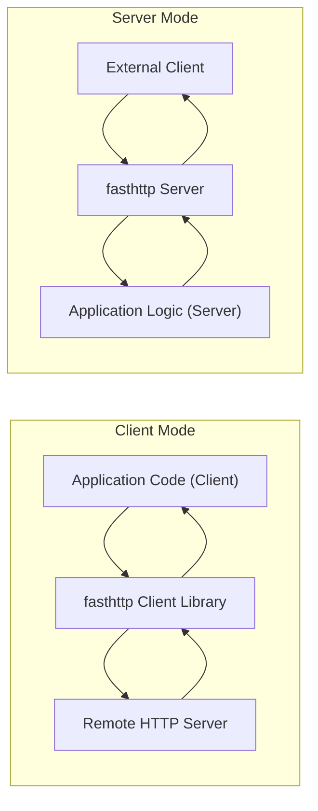

# Project Design Document: fasthttp

**Version:** 1.1
**Date:** October 26, 2023
**Author:** AI Software Architect

## 1. Introduction

This document provides an enhanced architectural design of the `fasthttp` project, a high-performance HTTP implementation for the Go programming language. The primary purpose of this document is to offer a clear and detailed understanding of the system's components, their interactions, and the flow of data, specifically for the purpose of informing subsequent threat modeling activities.

`fasthttp` distinguishes itself through its focus on speed and minimal memory allocation, making it a compelling choice for building demanding web servers and clients. A thorough grasp of its internal workings is essential for proactively identifying and addressing potential security vulnerabilities.

## 2. Goals and Objectives

The core design objectives of `fasthttp` are centered around:

* **Extreme Performance:** To significantly outperform the standard Go `net/http` package in terms of request handling speed and throughput.
* **Memory Efficiency:** To minimize memory allocations and the associated overhead of garbage collection, leading to more stable and predictable performance.
* **API Simplicity for Common Use Cases:** To provide a relatively easy-to-use API for typical HTTP server and client operations.
* **Fine-grained Control:** To offer developers the ability to interact with lower-level HTTP details when necessary, providing greater flexibility.

This design document aims to articulate the architectural elements that contribute to these performance goals and are particularly relevant from a security perspective.

## 3. Overall Architecture

`fasthttp` operates in two primary modes: as an HTTP server and as an HTTP client. The fundamental architecture is built around the efficient processing of HTTP requests and responses.

**Key Architectural Principles:**

* **Aggressive Connection Reuse (Pooling):** `fasthttp` prioritizes the reuse of underlying TCP connections to minimize the latency associated with establishing new connections for both client and server operations.
* **Minimizing Data Copies (Zero-Copy where feasible):**  The architecture aims to reduce unnecessary data copying during request and response processing to improve performance and reduce CPU overhead.
* **Pre-allocation of Buffers:** `fasthttp` employs pre-allocated buffers extensively to reduce the frequency of memory allocations during the handling of requests and responses, thereby decreasing garbage collection pressure.
* **Event-Driven, Non-Blocking I/O (Server):** The server leverages an event-driven model with non-blocking I/O operations to handle a large number of concurrent connections efficiently without dedicating a thread per connection.

## 4. Component Design

This section provides a detailed breakdown of the key components within `fasthttp`, highlighting their responsibilities and potential security implications.

### 4.1. Server Components

* **`net.Listener` (Underlying Listener):**
    * The standard Go `net` package's listener is used as the foundation for accepting incoming TCP connections.
    * Responsible for listening on a specified network address and port.
* **`Conn` (Connection Handler):**
    * Represents an individual TCP connection established between the server and a client.
    * Manages the complete lifecycle of the connection, from initial acceptance to closure.
    * Handles the low-level reading of data from and writing of data to the socket using non-blocking operations.
    * **Security Relevance:** Vulnerabilities here could involve improper handling of connection state, leading to denial-of-service or information leaks.
* **`RequestCtx` (Request Context):**
    * A central structure that encapsulates all information pertaining to a single incoming HTTP request and its corresponding response.
    * Contains parsed request headers, the request body, and the response object to be sent back to the client.
    * Provides methods for accessing and manipulating request and response data.
    * **Security Relevance:**  Improper handling or sanitization of data within `RequestCtx` can lead to vulnerabilities like injection attacks.
* **`RequestHandler` (Application Logic Interface):**
    * A user-defined function (or handler) that is invoked to process the incoming `RequestCtx`.
    * Contains the core application logic for handling specific HTTP requests based on the requested URI and other parameters.
    * Responsible for setting the appropriate response headers, body content, and HTTP status code.
    * **Security Relevance:** The security of the application logic within the `RequestHandler` is paramount and outside the direct control of `fasthttp`, but `fasthttp`'s design can influence how easily vulnerabilities can be introduced.
* **`Server` (Main Server Structure):**
    * The primary server structure that orchestrates the `net.Listener` and the handling of incoming connections.
    * Manages the pool of worker goroutines.
    * Dispatches incoming requests to available worker goroutines for processing.
    * Configures server-wide settings such as timeouts, connection limits, and TLS configuration.
    * **Security Relevance:** Improper configuration of the `Server` can lead to vulnerabilities like denial-of-service or exposure of sensitive information.
* **`Worker Pool` (Goroutine Pool):**
    * A pool of goroutines that concurrently handle incoming connections and process requests.
    * Improves server throughput by parallelizing request processing, preventing a single slow request from blocking others.
    * **Security Relevance:**  While improving performance, the worker pool needs to be managed to prevent resource exhaustion attacks.
* **`HTTP Request Parser`:**
    * Responsible for parsing the raw HTTP request data received from the client's socket.
    * Extracts crucial information such as HTTP method, URI, headers, and body.
    * Implements the rules and syntax of the HTTP protocol.
    * **Security Relevance:** This is a critical component for security. Vulnerabilities in the parser can lead to buffer overflows, denial-of-service, or the ability to bypass security checks. Robust parsing is essential to handle malformed or malicious requests safely.
* **`HTTP Response Writer`:**
    * Responsible for formatting the HTTP response data to be sent back to the client.
    * Constructs the response headers and body according to HTTP specifications.
    * **Security Relevance:**  Vulnerabilities here could involve improper encoding of response data, leading to cross-site scripting (XSS) or other injection attacks.

### 4.2. Client Components

* **`HostClient` (Connection Pool per Host):**
    * Manages a pool of persistent connections to a specific remote host.
    * Implements connection pooling to reduce the overhead of establishing new connections for repeated requests to the same server.
    * Handles sending requests and receiving responses for that specific host.
    * **Security Relevance:** Improper management of the connection pool could lead to issues like connection leaks or the reuse of connections with compromised security contexts.
* **`Client` (High-Level Client Interface):**
    * Provides a higher-level, more user-friendly interface for making HTTP requests to various servers.
    * Can manage `HostClient` instances for multiple different hosts.
    * Offers configuration options for timeouts, TLS settings, proxy configurations, and other client-specific parameters.
    * **Security Relevance:** Incorrect configuration of the `Client` can lead to insecure connections or expose sensitive information.
* **`Request` (HTTP Request Representation):**
    * Represents an HTTP request to be sent to a server.
    * Contains all the necessary information for the request, including the HTTP method, URI, headers, and body.
* **`Response` (HTTP Response Representation):**
    * Represents the HTTP response received from the server.
    * Contains the HTTP status code, headers, and body of the response.
* **`HTTP Request Writer` (Client-Side):**
    * Responsible for formatting the `Request` object into raw HTTP request data to be sent over the network.
* **`HTTP Response Parser` (Client-Side):**
    * Similar to the server-side parser, but responsible for parsing the raw HTTP response data received from the remote server.
    * Extracts the status code, headers, and body of the response.
    * **Security Relevance:** Vulnerabilities in the client-side parser could allow malicious servers to inject data or cause the client application to behave unexpectedly.

## 5. Data Flow

This section illustrates the typical flow of data through `fasthttp` in both server and client modes, highlighting key processing stages.

### 5.1. Server Request Flow (Detailed)

**Detailed Steps:**

1. **Client Connection:** An external client initiates a TCP connection to the server's listening address and port.
2. **`net.Listener` (Accept):** The underlying `net.Listener` accepts the incoming TCP connection.
3. **`Conn` (New Connection):** A new `Conn` object is created to manage the newly accepted connection. This object encapsulates the socket and connection state.
4. **`Server` (Assign to Worker):** The `Server` assigns the new `Conn` to an available worker goroutine from the `Worker Pool` for processing.
5. **`Conn` (Read Request Data from Socket):** The worker goroutine associated with the `Conn` reads raw HTTP request data from the connection's socket using non-blocking I/O.
6. **`HTTP Request Parser` (Parse Raw Data):** The `HTTP Request Parser` parses the raw byte stream into structured HTTP request components (method, URI, headers, body). This stage is crucial for security as it interprets potentially untrusted input.
7. **`RequestCtx` (Populate with Parsed Data):** A `RequestCtx` object is created or reused from a pool and populated with the parsed request information. This context will be passed to the application's request handler.
8. **`RequestHandler` (Invoke Application Logic):** The appropriate `RequestHandler` function (defined by the application) is invoked with the populated `RequestCtx`. This is where the core application logic for handling the specific request resides.
9. **`RequestCtx` (Application Sets Response):** The `RequestHandler` processes the request and sets the response details (headers, body, status code) within the `RequestCtx`.
10. **`HTTP Response Writer` (Format Response):** The `HTTP Response Writer` formats the response data from the `RequestCtx` into a raw HTTP response byte stream, ready to be sent back to the client.
11. **`Conn` (Write Response Data to Socket):** The worker goroutine writes the formatted response data back to the client's socket through the `Conn` object.
12. **Client Receives Response:** The client receives the complete HTTP response from the server.

### 5.2. Client Request Flow (Detailed)

```mermaid
graph LR
    A["Application Code (Client)"] --> B["Client (Create/Get Request Object)"];
    B --> C["HostClient/Client (Get Connection from Pool or Establish New)"];
    C --> D["Conn (Obtained Connection)"];
    D --> E["HTTP Request Writer (Format Request)"];
    E --> F["Conn (Write Request Data to Socket)"];
    F --> G["Remote HTTP Server"];
    G --> H["Conn (Read Response Data from Socket)"];
    H --> I["HTTP Response Parser (Parse Raw Response)"];
    I --> J["Response (Populate with Parsed Data)"];
    J --> K["Application Code (Client Receives Response)"];
```

**Detailed Steps:**

1. **Application Code (Client):** The application code initiates an HTTP request, specifying the target URL, headers, and body.
2. **`Client` (Create/Get Request Object):** The application uses the `fasthttp` `Client` to create a new `Request` object or reuse an existing one.
3. **`HostClient`/`Client` (Get Connection from Pool or Establish New):** The `Client` or the relevant `HostClient` attempts to retrieve an existing, idle connection from its connection pool for the target host. If no suitable connection is available, a new TCP connection is established.
4. **`Conn` (Obtained Connection):** A `Conn` object representing the established or reused connection is obtained.
5. **`HTTP Request Writer` (Format Request):** The `HTTP Request Writer` formats the `Request` object into a raw HTTP request byte stream.
6. **`Conn` (Write Request Data to Socket):** The raw request data is written to the socket of the established connection through the `Conn` object.
7. **Remote HTTP Server:** The remote HTTP server receives the request.
8. **`Conn` (Read Response Data from Socket):** The `Conn` object reads the raw HTTP response data sent by the server from the socket.
9. **`HTTP Response Parser` (Parse Raw Response):** The `HTTP Response Parser` parses the raw response data into a structured `Response` object, extracting the status code, headers, and body.
10. **`Response` (Populate with Parsed Data):** The `Response` object is populated with the parsed response information.
11. **Application Code (Client Receives Response):** The application code receives the populated `Response` object, allowing it to access the response data.

## 6. Security Considerations

This section details potential security considerations based on the architecture and data flow, providing a basis for threat modeling.

* **HTTP Parsing Vulnerabilities (Request and Response):**
    * **Buffer Overflows:**  The `HTTP Request Parser` and `HTTP Response Parser` must be robust against oversized headers, URIs, or bodies that could lead to buffer overflows if not handled with proper bounds checking.
    * **Denial of Service (DoS):** Malformed or excessively large requests or responses could consume excessive resources (CPU, memory) during parsing, leading to denial of service.
    * **HTTP Smuggling/Desync:**  Vulnerabilities in the parser's handling of ambiguous or malformed HTTP syntax (e.g., incorrect Content-Length, Transfer-Encoding issues) could lead to HTTP request smuggling or desynchronization attacks.
* **Connection Handling Security:**
    * **Connection Limits and Resource Exhaustion:**  Lack of proper connection limits on the server could allow attackers to exhaust server resources by opening a large number of connections.
    * **Slowloris Attacks:**  The server needs to be resilient against attacks that attempt to keep connections open for extended periods by sending partial requests slowly.
    * **Connection Hijacking:** While `fasthttp` operates at the application layer, vulnerabilities in the underlying TCP/IP stack or the application's handling of connection state could potentially lead to connection hijacking.
* **Request Context (RequestCtx) Security:**
    * **Data Integrity:**  Ensuring the integrity of data within the `RequestCtx` is crucial. Malicious actors might try to manipulate request data before it reaches the application logic.
    * **Information Disclosure:**  Care must be taken to avoid inadvertently leaking sensitive information stored within the `RequestCtx`.
* **TLS/SSL Configuration and Implementation:**
    * **Insecure Cipher Suites:**  Using weak or outdated cipher suites can make connections vulnerable to eavesdropping or man-in-the-middle attacks.
    * **Improper Certificate Validation (Client):**  The client must properly validate server certificates to prevent connections to malicious servers.
    * **Vulnerabilities in TLS Library:**  The underlying Go TLS library (`crypto/tls`) needs to be kept up-to-date to patch any known vulnerabilities.
* **Security of `RequestHandler` (Application Logic):**
    * **Injection Attacks (SQL, Command, etc.):**  The application logic within the `RequestHandler` must be carefully designed to prevent injection vulnerabilities by properly sanitizing and validating user input.
    * **Cross-Site Scripting (XSS):**  If the application generates dynamic HTML output, it must be careful to escape user-provided data to prevent XSS attacks.
    * **Authentication and Authorization Bypass:**  The application logic is responsible for implementing proper authentication and authorization mechanisms to control access to resources.
* **Client-Side Vulnerabilities:**
    * **Improper Handling of Server Responses:**  The client application needs to handle potentially malicious or unexpected server responses safely to prevent vulnerabilities.
    * **Exposure of Sensitive Data in Requests:**  Care must be taken to avoid accidentally including sensitive information in request headers or bodies.
* **Error Handling and Logging:**
    * **Information Leaks in Error Messages:**  Error messages should not reveal sensitive information about the server's internal workings or data.
    * **Insufficient Logging for Security Auditing:**  Lack of proper logging can make it difficult to detect and respond to security incidents.
* **Dependency Management:**
    * **Vulnerabilities in Dependencies:**  `fasthttp` and the applications built on it rely on other Go packages. Vulnerabilities in these dependencies can introduce security risks.

## 7. Deployment Considerations

The security posture of a `fasthttp` application can be significantly influenced by its deployment environment.

* **Standalone Server (Directly Exposed):**  When deployed directly to the internet, `fasthttp` is responsible for handling all aspects of security, including TLS termination and protection against various web attacks. Proper configuration and hardening are crucial.
* **Behind a Reverse Proxy (e.g., Nginx, HAProxy):**  Deploying `fasthttp` behind a reverse proxy can offload tasks like TLS termination, request filtering, and rate limiting, enhancing security. The reverse proxy acts as a security gateway.
* **Containerized Environments (Docker, Kubernetes):**  Containerization provides isolation and helps manage dependencies, but security considerations still apply to the container image and the orchestration platform. Network policies and security contexts within the container environment are important.
* **Cloud Environments (AWS, Azure, GCP):**  Cloud providers offer various security services that can be integrated with `fasthttp` deployments, such as web application firewalls (WAFs), DDoS protection, and intrusion detection systems.

## 8. Future Considerations

* **Enhanced Security Features:**  Exploring the integration of built-in middleware or handlers for common security tasks like rate limiting, request filtering, and basic authentication.
* **Improved Observability for Security:**  Providing better hooks for security monitoring and logging, making it easier to integrate with security information and event management (SIEM) systems.
* **Formal Security Audits:**  Conducting regular formal security audits by external experts to identify potential vulnerabilities.
* **HTTP/3 Support and its Security Implications:**  As HTTP/3 adoption grows, understanding and addressing its specific security considerations will be important.

This improved design document provides a more detailed and security-focused overview of the `fasthttp` architecture, serving as a stronger foundation for subsequent threat modeling exercises. By understanding the intricacies of its components, data flow, and potential security pitfalls, developers and security professionals can work together to build more resilient and secure applications using `fasthttp`.