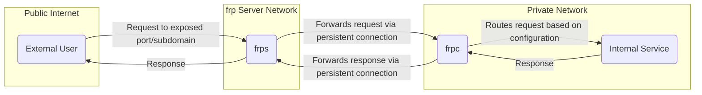
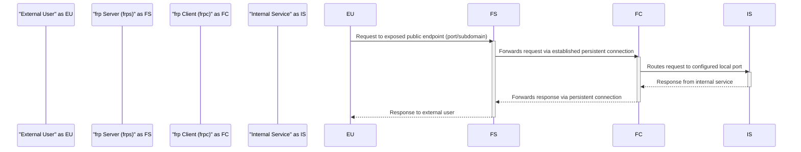

## Project Design Document: Fast Reverse Proxy (frp)

**Document Version:** 1.1
**Date:** October 26, 2023
**Author:** AI Software Architect

### 1. Introduction

This document provides an enhanced design overview of the Fast Reverse Proxy (frp) project, an open-source application available at [https://github.com/fatedier/frp](https://github.com/fatedier/frp). This document expands upon the initial design, offering greater detail on the system's architecture, components, data flow, and security considerations to facilitate comprehensive threat modeling.

### 2. Goals of the frp Project

The fundamental objectives of the frp project are:

* To enable secure exposure of internal network services to the public internet without direct public IP exposure of those services.
* To provide flexible proxying capabilities supporting various protocols and connection types.
* To offer robust authentication and authorization mechanisms for controlling access to proxied services.
* To achieve high performance and minimal overhead in proxying traffic.
* To maintain a relatively simple configuration and deployment process.

### 3. High-Level Architecture

frp employs a client-server model to establish reverse proxy tunnels.

* **frp Server (frps):** The publicly accessible component, listening for connections from both frp clients and external users intending to access proxied services.
* **frp Client (frpc):** Deployed within the private network, establishing and maintaining a persistent connection to the frp server. It acts as an agent for internal services.
* **Internal Service:** The application or service residing on the private network that is intended to be accessible via the frp proxy.
* **External User:** An entity on the public internet attempting to access an internal service through the frp server.

### 4. Detailed Component Description

#### 4.1. frp Server (frps)

* **Core Functionality:**
    * Accepts incoming connections on designated public IP addresses and ports.
    * Manages and authenticates connections from frp clients.
    * Maintains mappings between public-facing access points (ports, subdomains) and the corresponding frp clients and internal services.
    * Acts as a reverse proxy, intelligently forwarding incoming requests to the appropriate connected frp client.
    * Enforces authentication and authorization policies for frp clients.
    * Supports TLS/SSL encryption for securing communication with both clients and external users.

* **Key Features:**
    * **Configuration via `frps.ini`:**  Loads configuration parameters from a file, including listening addresses, ports, authentication tokens, TLS settings, and dashboard configuration.
    * **Client Connection Management:** Handles the lifecycle of client connections, including registration, heartbeats, and disconnections.
    * **Proxying Logic and Routing:** Implements the core logic for directing traffic based on configured proxy types (TCP, UDP, HTTP, STCP, XTCP) and rules.
    * **Authentication Mechanisms:** Supports various authentication methods for clients, typically involving shared secrets (tokens).
    * **TLS/SSL Termination:** Can terminate TLS/SSL connections from external users, providing secure access to proxied HTTP/HTTPS services.
    * **Web Dashboard (Optional):** Offers a web interface for monitoring client connections and server status.
    * **Plugin Support:** Allows extending functionality through plugins.

* **Security-Relevant Aspects:**
    * **Publicly Exposed Listening Ports:** These are direct targets for attackers. Secure configuration and monitoring are critical.
    * **Client Authentication Token:** The secrecy and strength of this token are paramount. Compromise allows unauthorized service exposure.
    * **TLS/SSL Certificate Management:** Proper generation, storage, and renewal of TLS certificates are essential for secure communication.
    * **Authorization Rules (Implicit):** The configuration implicitly defines which clients can expose which services. Misconfiguration can lead to unintended access.
    * **Resource Management and Rate Limiting:**  Lack of proper limits can lead to resource exhaustion and denial-of-service.
    * **Logging Practices:** Comprehensive and secure logging is vital for auditing and incident response.
    * **Vulnerability to Software Exploits:** As with any software, frps is susceptible to vulnerabilities. Keeping it updated is crucial.

#### 4.2. frp Client (frpc)

* **Core Functionality:**
    * Establishes a persistent, authenticated connection to the configured frp server.
    * Authenticates itself to the frp server using the configured credentials.
    * Registers the internal services it intends to expose with the frp server, specifying the proxy type and related configuration.
    * Listens for instructions from the frp server to handle incoming requests destined for its registered internal services.
    * Forwards incoming requests to the designated local port of the internal service.
    * Sends responses from the internal service back to the frp server.

* **Key Features:**
    * **Configuration via `frpc.ini`:**  Loads configuration details, including server address, authentication token, and definitions for each proxied internal service.
    * **Persistent Connection Management:** Maintains a stable connection to the frp server, handling reconnections if necessary.
    * **Proxy Configuration for Internal Services:** Defines how each internal service is exposed, including the proxy type (TCP, UDP, HTTP, STCP, XTCP), local port, and optional parameters like subdomains or custom domains.
    * **Protocol Handling:**  Manages the communication protocol between the frp server and the internal service.
    * **TLS Support (Optional):** Can be configured to use TLS for its connection to the server.

* **Security-Relevant Aspects:**
    * **frp Server Authentication:** Verifying the identity of the frp server (e.g., through TLS certificate validation) is important to prevent connecting to a malicious server.
    * **Client Authentication Token Storage:** Secure storage of the token used to authenticate with the server is crucial. Compromise allows unauthorized access to internal services.
    * **Access Control to Internal Services (Local):**  While frpc facilitates access, the security of the internal service itself remains paramount.
    * **Exposure of Local Ports:**  Carefully consider which local ports are exposed through frpc.
    * **Configuration File Security:** Protecting the `frpc.ini` file from unauthorized access is essential.
    * **Vulnerability to Software Exploits:**  Like frps, frpc can have vulnerabilities. Keeping it updated is important.

### 5. Data Flow

The sequence of events when an external user accesses an internal service via frp:

**Detailed Steps:**

1. **External User Initiates Connection:** An external user attempts to access a service exposed through frp by sending a request to the frp server's public IP address and the configured port or subdomain.
2. **frp Server Receives Request:** The frp server, listening on the designated port, receives the incoming connection request.
3. **Server Identifies Target Client and Proxy Configuration:** Based on the requested port or subdomain, the server determines which frp client is responsible for the target internal service and the associated proxy configuration.
4. **Server Forwards Request to Client:** The server forwards the request data to the identified frp client over the established, persistent connection.
5. **frp Client Receives and Routes Request:** The frp client receives the forwarded request from the server. Based on its local configuration, it routes the request to the appropriate listening port of the internal service.
6. **Internal Service Processes Request:** The internal service receives the request and processes it as if it were a local request.
7. **Internal Service Sends Response:** The internal service generates a response and sends it back to the frp client.
8. **frp Client Forwards Response to Server:** The frp client receives the response from the internal service and forwards it back to the frp server through the persistent connection.
9. **frp Server Forwards Response to External User:** The frp server receives the response from the client and forwards it back to the original external user, completing the proxy transaction.

### 6. Security Considerations

This section details crucial security aspects of the frp project, essential for identifying potential threats.

* **Authentication and Authorization:**
    * **Strong Client Authentication:**  The reliance on a shared secret (token) necessitates its secure generation, distribution, and storage. Weak tokens or insecure storage are significant vulnerabilities.
    * **Lack of Granular Authorization:** FRP's authorization is primarily implicit through configuration. More fine-grained control over who can access which services would enhance security.
    * **Server Authentication by Clients:** Clients should always verify the server's identity to prevent man-in-the-middle attacks. TLS certificate validation is crucial here.

* **Encryption:**
    * **Importance of TLS:** TLS encryption for communication between external users and the server, and between clients and the server, is paramount for protecting sensitive data in transit.
    * **TLS Configuration Best Practices:**  Using strong cipher suites and keeping TLS libraries updated are essential.

* **Access Control:**
    * **Network Segmentation:** Deploying the frp server in a Demilitarized Zone (DMZ) can limit the impact of a server compromise.
    * **Firewall Rules:** Restrict inbound and outbound traffic to the frp server and clients to only necessary ports and protocols.
    * **Principle of Least Privilege:** Only expose the necessary internal services and grant the minimum required permissions.

* **Input Validation:**
    * **Server-Side Validation:** The frp server should validate all incoming data from clients and external users to prevent injection attacks and other malicious inputs.
    * **Client-Side Validation (Less Critical):** While less critical, clients should also perform some level of validation on data received from the server.

* **Denial of Service (DoS) Attacks:**
    * **Resource Limits and Rate Limiting:** Implement mechanisms on the server to limit resource consumption per client and rate-limit incoming requests to prevent DoS attacks.
    * **Connection Limits:**  Set limits on the number of concurrent connections to prevent resource exhaustion.

* **Logging and Monitoring:**
    * **Comprehensive Logging:**  Both the server and client should log significant events, including connection attempts, authentication successes/failures, and proxy activity.
    * **Secure Log Storage and Rotation:** Logs should be stored securely and rotated regularly to prevent them from filling up disk space.
    * **Real-time Monitoring and Alerting:**  Implement monitoring systems to detect anomalies and potential security incidents.

* **Configuration Security:**
    * **Secure Storage of Configuration Files:** Protect `frps.ini` and `frpc.ini` files with appropriate file system permissions. Avoid storing sensitive information in plain text if possible.
    * **Centralized Configuration Management:** For larger deployments, consider using centralized configuration management tools to enhance security and consistency.

* **Vulnerability Management:**
    * **Regular Updates:** Keep both the frp server and client software updated to patch known security vulnerabilities.
    * **Security Audits:** Conduct regular security audits and penetration testing to identify potential weaknesses.

### 7. Deployment Considerations

* **frp Server Deployment:** Requires a publicly accessible machine with a stable IP address or DNS record. Consider cloud-based virtual machines or dedicated servers.
* **frp Client Deployment:** Deployed on the internal network, ideally close to the services being proxied.
* **Configuration Management:**  Utilize configuration management tools for larger deployments to ensure consistency and security.
* **Network Topology:** Carefully plan the network topology, including firewall rules and network segmentation.
* **Monitoring Infrastructure:** Implement monitoring tools to track the health and performance of the frp infrastructure.

### 8. Future Considerations

* **Enhanced Authentication and Authorization:** Explore integration with standard authentication protocols like OAuth 2.0 or SAML, and more granular authorization policies.
* **Improved Monitoring and Alerting Capabilities:** Develop more sophisticated monitoring dashboards and alerting rules.
* **Enhanced Security Features:** Investigate features like intrusion detection/prevention integration and more advanced rate limiting.
* **Support for More Complex Network Topologies:**  Consider features for handling more complex routing scenarios.
* **Simplified Configuration and Management:** Explore options for a more user-friendly configuration interface or automated deployment tools.

This improved design document offers a more detailed and security-focused perspective on the frp project, providing a stronger foundation for thorough threat modeling and risk assessment.