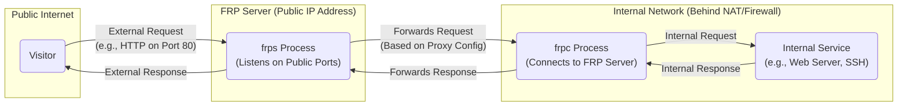
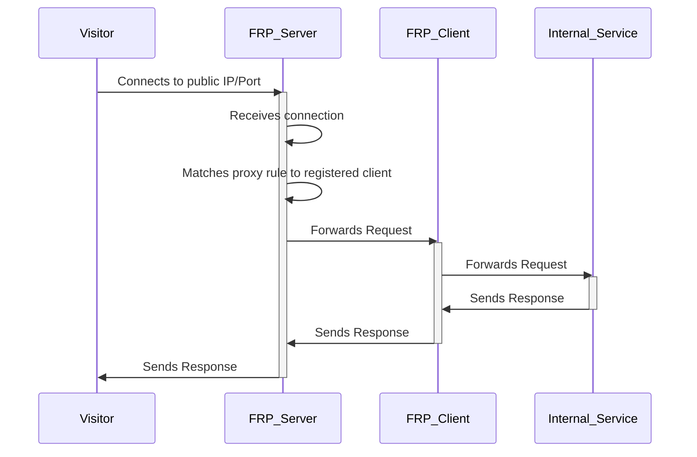

# Project Design Document: FRP (Fast Reverse Proxy) - Improved

**Version:** 2.0
**Date:** October 26, 2023
**Author:** Gemini (AI Language Model)

## 1. Introduction

This document provides an enhanced and detailed design overview of the FRP (Fast Reverse Proxy) project, an invaluable open-source tool for exposing local services behind network address translation (NAT) or firewalls to the public internet. The project is hosted on GitHub at [https://github.com/fatedier/frp](https://github.com/fatedier/frp). This document aims to provide a comprehensive and precise understanding of FRP's architecture, components, and operational flow. It serves as a critical foundation for subsequent threat modeling activities, enabling security professionals to proactively identify potential vulnerabilities and design effective mitigation strategies.

## 2. Goals

The primary goals of this improved design document are:

*   To offer a more detailed and precise description of the FRP project's architecture and its constituent components.
*   To meticulously detail the interactions, communication protocols, and data flow between the various parts of the system.
*   To serve as a robust and reliable foundational document for conducting thorough and effective threat modeling of the FRP project.
*   To ensure the document is easily comprehensible by a diverse audience, including technical experts and non-technical stakeholders involved in the security assessment process.
*   To strictly adhere to the specified formatting requirements, utilizing valid markdown, correctly implemented mermaid syntax (with quoted node names), and avoiding the use of markdown tables in favor of markdown lists.

## 3. Overview

FRP is a high-performance reverse proxy solution designed to facilitate secure access to internal services from the public internet, even when those services reside behind NAT or firewalls. It operates on a client-server model. The FRP server (`frps`) acts as a publicly accessible gateway, while the FRP client (`frpc`) runs on the internal network, establishing a persistent connection to the server. This connection allows the server to act as a proxy, intelligently routing incoming requests to the appropriate client and, subsequently, to the intended internal service.

## 4. Detailed Design

### 4.1. Components

*   **FRP Server (`frps`):**
    *   Role: The central and publicly accessible component of FRP, acting as the entry point for external requests. It listens for incoming connections on a designated public IP address and port.
    *   Responsibilities:
        *   Accepts incoming TCP and potentially UDP connections from FRP clients.
        *   Authenticates and authorizes connecting clients based on configured security measures (e.g., shared secret tokens).
        *   Manages and maintains active connections from multiple FRP clients.
        *   Stores and manages proxy configurations registered by connected clients, defining how external requests should be routed internally.
        *   Listens for incoming connections from visitors on configured public ports or subdomains, based on the defined proxy types.
        *   Forwards incoming requests from visitors to the appropriate connected FRP client based on matching proxy rules.
        *   Can handle TLS termination for incoming HTTPS connections, offloading encryption/decryption from the internal service.
        *   Optionally provides a web-based user interface for monitoring server status, connected clients, and active proxies.
    *   Configuration: Primarily configured through an INI-formatted configuration file (`frps.ini`), defining global server settings and security parameters.

*   **FRP Client (`frpc`):**
    *   Role: Deployed on the internal network alongside the service intended for external exposure. It establishes and maintains a persistent connection to the FRP server.
    *   Responsibilities:
        *   Initiates and maintains a persistent TCP (and potentially UDP) connection to the configured FRP server.
        *   Authenticates with the FRP server using the configured credentials (e.g., authentication token).
        *   Registers proxy configurations with the connected server, specifying details such as the local port of the internal service, the desired public access method (port, subdomain, HTTP header), and the proxy type.
        *   Listens for incoming connection requests from the FRP server on a designated local port.
        *   Forwards requests received from the server to the specified local internal service.
        *   Receives responses from the internal service and transmits them back to the FRP server through the established connection.
    *   Configuration: Configured through an INI-formatted configuration file (`frpc.ini`), defining server connection details, authentication credentials, and individual proxy configurations.

*   **Internal Service:**
    *   Role: The application or service residing on the client's machine that is intended to be made accessible from the public internet via FRP.
    *   Responsibilities:
        *   Receives and processes requests forwarded by the FRP client.
        *   Generates appropriate responses to the received requests.
    *   Examples: Web applications, SSH servers, remote desktop services, game servers, databases, etc.

*   **Visitor:**
    *   Role: An external user, application, or system attempting to access the internal service through the publicly accessible FRP server.
    *   Responsibilities:
        *   Initiates a connection to the FRP server on the configured public IP address and port or subdomain.
        *   Sends requests intended for the internal service, adhering to the protocol expected by that service (e.g., HTTP, TCP, UDP).

### 4.2. Communication Flow

The typical communication flow within the FRP system follows these steps:

1. The FRP client, running on the internal network, establishes a persistent TCP connection to the FRP server listening on its public IP address and port.
2. The FRP client authenticates with the server by providing the configured authentication token (if enabled).
3. The FRP client registers one or more proxy configurations with the server, defining how incoming external requests should be mapped to the local internal service. This includes specifying the proxy type (TCP, UDP, HTTP, etc.) and the public access point (port, subdomain).
4. A visitor initiates a connection to the FRP server on the public IP address and the port or subdomain configured for the target internal service.
5. The FRP server receives the incoming connection from the visitor.
6. Based on the configured proxy rules, the server identifies the appropriate connected FRP client that has registered a proxy matching the visitor's connection attempt.
7. The server forwards the incoming request from the visitor to the identified FRP client through the established persistent connection. The method of forwarding depends on the proxy type.
8. The FRP client receives the forwarded request from the server.
9. The FRP client forwards the request to the local internal service running on the specified local port.
10. The internal service processes the request and generates a response.
11. The internal service sends the response back to the FRP client.
12. The FRP client sends the response back to the FRP server through the persistent connection.
13. The FRP server receives the response from the client and forwards it back to the original visitor.

### 4.3. Proxy Types (Detailed)

FRP offers a variety of proxy types to accommodate different application protocols and use cases:

*   **TCP Proxy:** Forwards raw TCP connections. This is suitable for applications that use persistent TCP connections or protocols other than HTTP(S). Configuration involves specifying local and remote ports.
*   **UDP Proxy:** Forwards UDP packets. This is used for applications and services that rely on the UDP protocol, such as game servers or some VPN solutions.
*   **HTTP Proxy:**  Forwards HTTP requests. This allows for features like virtual host routing (based on the `Host` header) and can be used to expose web applications.
*   **HTTPS Proxy:** Similar to the HTTP proxy but handles TLS termination at the FRP server. This offloads the SSL/TLS encryption and decryption process from the internal web server.
*   **STCP (Secret TCP) Proxy:** Enables direct peer-to-peer communication between two clients behind NAT, mediated by the FRP server. This requires a "sk" (secret key) to be configured on both clients.
*   **SUDP (Secret UDP) Proxy:**  The UDP equivalent of STCP, allowing direct UDP communication between two clients behind NAT using a shared secret key.

### 4.4. Configuration Details

Both the FRP server and client utilize INI-style configuration files, typically named `frps.ini` and `frpc.ini` respectively. These files are structured into sections:

*   **Global Section (`[common]`):** Contains general settings applicable to the entire server or client process. Examples include:
    *   Server: `bind_addr`, `bind_port`, `token`, `log_file`, `vhost_http_port`, `vhost_https_port`.
    *   Client: `server_addr`, `server_port`, `token`, `log_file`.
*   **Proxy Definitions:** Sections defining individual proxy configurations. The section name acts as the proxy name. The parameters within these sections vary depending on the proxy type. Examples:
    *   TCP Proxy: `type = tcp`, `local_ip`, `local_port`, `remote_port`.
    *   HTTP Proxy: `type = http`, `local_ip`, `local_port`, `custom_domains`.

## 5. Deployment Architecture

A common deployment architecture for FRP involves:

*   **FRP Server Instance:** A publicly accessible server, typically a cloud virtual machine or a dedicated server with a static public IP address. This instance runs the `frps` process.
*   **FRP Client Instance(s):** One or more instances of the FRP client (`frpc`) running on machines within private networks, behind NAT gateways or firewalls. Each client is responsible for exposing one or more internal services.
*   **Internal Service Host(s):** The machines hosting the actual internal services that are being exposed through FRP. These may be the same machines running the FRP client or separate servers within the internal network.
*   **Visitor Network:** The public internet or any external network from which users or systems will access the exposed internal services.

## 6. Data Flow Diagram

## 7. Security Considerations (Detailed)

This section expands on the initial security considerations, providing more specific examples and potential threats:

*   **Authentication:**
    *   FRP relies on a shared secret token for authentication between the client and server.
    *   Threat: Weak or easily guessable tokens can be compromised, allowing unauthorized clients to connect to the server and potentially expose malicious services.
    *   Mitigation: Use strong, randomly generated tokens and ensure secure storage and transmission of these tokens.
*   **Authorization:**
    *   FRP's configuration determines which clients are authorized to expose specific services through the server.
    *   Threat: Misconfigured authorization rules can lead to unintended exposure of sensitive internal services to the public internet.
    *   Mitigation: Implement a principle of least privilege when configuring proxy rules, ensuring only necessary services are exposed and access is restricted appropriately. Regularly review and audit proxy configurations.
*   **Encryption:**
    *   Communication between the visitor and the FRP server can be encrypted using HTTPS when using HTTP/HTTPS proxies.
    *   Threat: Communication between the FRP server and client is not inherently encrypted, potentially exposing sensitive data in transit within the internal network.
    *   Mitigation: Consider using network-level encryption (e.g., VPNs, IPsec) or tunneling the FRP client-server connection through SSH to encrypt this traffic.
*   **Access Control:**
    *   Firewall rules on both the server and client machines are crucial for controlling access to FRP ports.
    *   Threat: Open ports on the FRP server can be targeted by attackers. Unrestricted outbound access from the client machine could be exploited.
    *   Mitigation: Implement strict firewall rules, allowing only necessary traffic to the FRP server and from the FRP client.
*   **Rate Limiting and DoS Protection:**
    *   FRP lacks built-in rate limiting and robust denial-of-service (DoS) protection mechanisms.
    *   Threat: The FRP server can be vulnerable to DoS attacks, potentially making all exposed services unavailable.
    *   Mitigation: Implement external rate limiting solutions (e.g., using a reverse proxy or firewall in front of the FRP server) and consider using cloud-based DDoS protection services.
*   **Vulnerability Management:**
    *   Outdated versions of FRP may contain known security vulnerabilities.
    *   Threat: Exploitation of vulnerabilities in the FRP server or client could lead to unauthorized access, data breaches, or system compromise.
    *   Mitigation: Regularly update the FRP server and client software to the latest stable versions to patch known vulnerabilities. Subscribe to security advisories for FRP.
*   **Logging and Monitoring:**
    *   Comprehensive logging and monitoring of FRP server and client activity are essential for security incident detection and response.
    *   Threat: Insufficient logging can hinder the ability to detect and investigate security breaches or suspicious activity.
    *   Mitigation: Configure detailed logging on both the FRP server and client. Integrate logs with a security information and event management (SIEM) system for analysis and alerting.
*   **Configuration Security:**
    *   FRP configuration files contain sensitive information, such as authentication tokens.
    *   Threat: Unauthorized access to configuration files could lead to the compromise of authentication credentials and the ability to manipulate proxy settings.
    *   Mitigation: Securely store configuration files with appropriate file system permissions. Avoid storing sensitive information in plain text where possible. Consider using environment variables or secrets management tools for sensitive data.

## 8. Assumptions and Constraints

*   The underlying network infrastructure provides reliable connectivity between the visitor, FRP server, and FRP client.
*   DNS resolution is correctly configured for any domain names used in proxy configurations.
*   The security of the internal services themselves is the responsibility of the service owners and is outside the direct scope of this FRP design document. However, FRP's configuration can impact the attack surface of these services.
*   This document describes the general architecture and common use cases of FRP. Specific deployments may have additional complexities or customizations.

## 9. Future Considerations

*   Integration with more advanced authentication and authorization protocols, such as OAuth 2.0 or SAML.
*   Implementation of built-in rate limiting and DoS mitigation features within the FRP server.
*   Enhanced logging and monitoring capabilities with standardized log formats and integration with popular monitoring tools (e.g., Prometheus, Grafana).
*   Improved options for securing the communication channel between the FRP server and client, such as built-in TLS encryption.
*   More granular access control mechanisms for managing proxy configurations and client permissions.
*   Support for more sophisticated load balancing and high-availability configurations for the FRP server.

This improved design document provides a more in-depth and nuanced understanding of the FRP project, offering a solid foundation for conducting thorough threat modeling and implementing appropriate security controls. The detailed descriptions of components, communication flows, and security considerations aim to equip security professionals with the necessary knowledge to effectively assess and mitigate potential risks associated with using FRP.