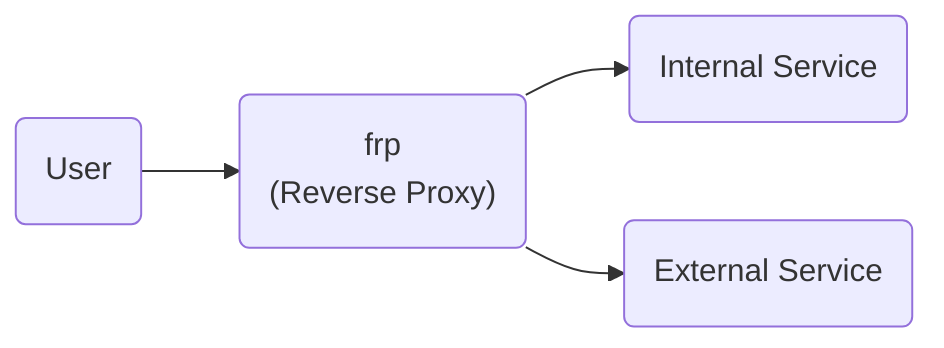
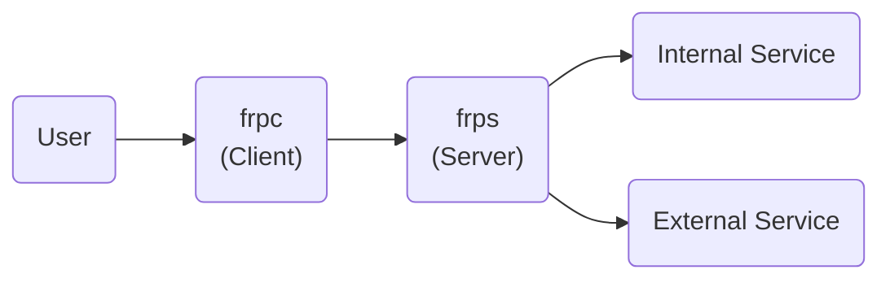
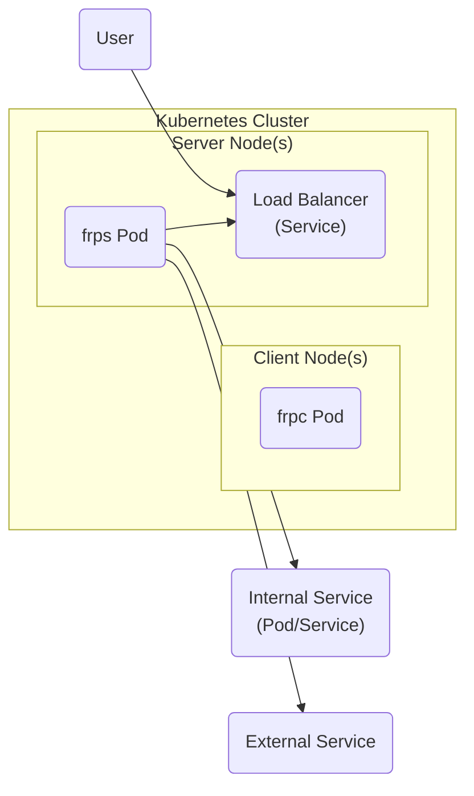
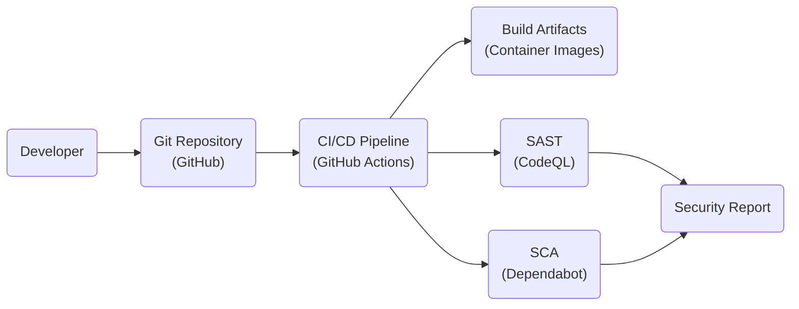

# BUSINESS POSTURE

Business Priorities and Goals:

*   Provide a fast and reliable reverse proxy solution.
*   Enable access to internal services behind NAT or firewalls.
*   Simplify network configuration for developers and administrators.
*   Support a variety of protocols, including TCP, UDP, HTTP, and HTTPS.
*   Offer a flexible and extensible architecture.
*   Maintain a high level of performance and stability.
*   Provide secure communication channels.

Most Important Business Risks:

*   Exposure of internal services to unauthorized access.
*   Data breaches due to vulnerabilities in the proxy software.
*   Denial of service attacks targeting the proxy server.
*   Compromise of the proxy server leading to further network intrusions.
*   Misconfiguration leading to unintended exposure of services.
*   Lack of auditability and traceability of proxy activities.

# SECURITY POSTURE

Existing Security Controls:

*   security control: Transport Layer Security (TLS) encryption for secure communication (frp configuration).
*   security control: Authentication using tokens (frp configuration).
*   security control: Support for plugins to extend functionality, potentially including security features (frp documentation).
*   security control: Rate limiting to mitigate denial-of-service attacks (frp configuration).
*   security control: Basic access control through configuration (frp configuration).

Accepted Risks:

*   accepted risk: The project relies on user-provided configuration for security, which can lead to misconfigurations and vulnerabilities if not properly managed.
*   accepted risk: The project's security heavily depends on the security of the underlying operating system and network infrastructure.
*   accepted risk: While TLS is supported, older/insecure ciphers might be enabled by default, requiring careful configuration.

Recommended Security Controls:

*   Implement mandatory access control (MAC) in addition to the existing discretionary access control (DAC).
*   Integrate with existing identity and access management (IAM) systems for centralized authentication and authorization.
*   Provide built-in intrusion detection and prevention capabilities.
*   Offer comprehensive audit logging and reporting features.
*   Implement robust input validation and sanitization to prevent injection attacks.
*   Regularly conduct security audits and penetration testing.
*   Provide a security hardening guide and best practices documentation.
*   Implement a secure software development lifecycle (SSDLC) with automated security testing.

Security Requirements:

*   Authentication:
    *   Strong authentication mechanisms should be used, such as multi-factor authentication (MFA).
    *   Support integration with existing authentication providers (e.g., LDAP, OAuth 2.0, OpenID Connect).
    *   Implement secure password storage and management.
*   Authorization:
    *   Fine-grained access control should be enforced based on user roles and permissions.
    *   The principle of least privilege should be applied.
    *   Support for attribute-based access control (ABAC) should be considered.
*   Input Validation:
    *   All input from clients and external systems should be strictly validated and sanitized.
    *   Whitelist validation should be preferred over blacklist validation.
    *   Protect against common web vulnerabilities (e.g., cross-site scripting (XSS), SQL injection).
*   Cryptography:
    *   Use strong, up-to-date cryptographic algorithms and protocols.
    *   Securely manage cryptographic keys.
    *   Avoid using deprecated or vulnerable cryptographic libraries.
    *   Enforce TLS 1.3 or higher with secure cipher suites.

# DESIGN

## C4 CONTEXT

Element Descriptions:

*   User:
    *   Name: User
    *   Type: Person
    *   Description: Represents a user or system that interacts with the frp proxy.
    *   Responsibilities: Initiates connections to services through the frp proxy.
    *   Security controls: Authentication (if configured in frp), TLS encryption (if configured in frp).

*   frp:
    *   Name: frp
    *   Type: System
    *   Description: The frp reverse proxy system.
    *   Responsibilities: Forwards traffic between users and internal/external services, provides secure communication channels, and enforces access control policies.
    *   Security controls: TLS encryption, authentication (token-based), rate limiting, basic access control through configuration.

*   Internal Service:
    *   Name: Internal Service
    *   Type: System
    *   Description: A service located behind a NAT or firewall that is accessed through the frp proxy.
    *   Responsibilities: Provides specific functionality to users.
    *   Security controls: Relies on frp for external access control and security; internal security measures are assumed but not explicitly defined within the scope of frp.

*   External Service:
    *   Name: External Service
    *   Type: System
    *   Description: A service located outside the network, potentially used by frp for specific functionalities.
    *   Responsibilities: Provides specific functionality to frp.
    *   Security controls: Relies on frp for secure communication; external security measures are assumed but not explicitly defined within the scope of frp.

## C4 CONTAINER

Element Descriptions:

*   User:
    *   Name: User
    *   Type: Person
    *   Description: Represents a user or system that interacts with the frp proxy.
    *   Responsibilities: Initiates connections to services through the frp client (frpc).
    *   Security controls: Authentication (if configured in frp), TLS encryption (if configured in frp).

*   frpc:
    *   Name: frpc
    *   Type: Container (Client Application)
    *   Description: The frp client application, running on the user's side.
    *   Responsibilities: Establishes connections to the frp server (frps), forwards traffic from the user to the server.
    *   Security controls: TLS encryption (if configured), authentication (token-based, if configured).

*   frps:
    *   Name: frps
    *   Type: Container (Server Application)
    *   Description: The frp server application, running on a publicly accessible server.
    *   Responsibilities: Accepts connections from frp clients, forwards traffic to internal/external services, enforces access control policies.
    *   Security controls: TLS encryption, authentication (token-based), rate limiting, basic access control through configuration.

*   Internal Service:
    *   Name: Internal Service
    *   Type: System
    *   Description: A service located behind a NAT or firewall that is accessed through the frp proxy.
    *   Responsibilities: Provides specific functionality to users.
    *   Security controls: Relies on frp for external access control and security; internal security measures are assumed.

*   External Service:
    *   Name: External Service
    *   Type: System
    *   Description: A service located outside the network, potentially used by frp for specific functionalities.
    *   Responsibilities: Provides specific functionality to frp.
    *   Security controls: Relies on frp for secure communication; external security measures are assumed.

## DEPLOYMENT

Possible Deployment Solutions:

1.  Bare Metal/Virtual Machine Deployment: frps is deployed directly onto a server (physical or virtual) with a public IP address. frpc is deployed on client machines or networks.
2.  Containerized Deployment (Docker): frps and frpc are packaged as Docker containers and deployed using Docker or Docker Compose.
3.  Kubernetes Deployment: frps and frpc are deployed as pods within a Kubernetes cluster.

Chosen Solution (Kubernetes Deployment):

Element Descriptions:

*   User:
    *   Name: User
    *   Type: Person
    *   Description: Represents a user or system that interacts with the frp proxy.
    *   Responsibilities: Initiates connections to services through the frp proxy.
    *   Security controls: Authentication (if configured in frp), TLS encryption (if configured in frp).

*   Kubernetes Cluster:
    *   Name: Kubernetes Cluster
    *   Type: Infrastructure
    *   Description: The Kubernetes cluster where frp is deployed.
    *   Responsibilities: Manages the deployment, scaling, and networking of frp components.
    *   Security controls: Kubernetes RBAC, network policies, pod security policies.

*   Client Node(s):
    *   Name: Client Node(s)
    *   Type: Infrastructure
    *   Description: Kubernetes nodes where frpc pods are running.
    *   Responsibilities: Host the frpc pods.
    *   Security controls: Kubernetes node-level security, network policies.

*   frpc Pod:
    *   Name: frpc Pod
    *   Type: Container
    *   Description: A Kubernetes pod running the frpc container.
    *   Responsibilities: Establishes connections to the frps pod, forwards traffic from the user to the server.
    *   Security controls: TLS encryption (if configured), authentication (token-based, if configured), Kubernetes pod security policies.

*   Server Node(s):
    *   Name: Server Node(s)
    *   Type: Infrastructure
    *   Description: Kubernetes nodes where frps pods are running.
    *   Responsibilities: Host the frps pods.
    *   Security controls: Kubernetes node-level security, network policies.

*   frps Pod:
    *   Name: frps Pod
    *   Type: Container
    *   Description: A Kubernetes pod running the frps container.
    *   Responsibilities: Accepts connections from frpc pods, forwards traffic to internal/external services, enforces access control policies.
    *   Security controls: TLS encryption, authentication (token-based), rate limiting, basic access control through configuration, Kubernetes pod security policies.

*   Load Balancer (Service):
    *   Name: Load Balancer (Service)
    *   Type: Infrastructure
    *   Description: A Kubernetes Service of type LoadBalancer that exposes the frps pods to external traffic.
    *   Responsibilities: Distributes incoming traffic across multiple frps pods.
    *   Security controls: Kubernetes Service-level security, potentially cloud provider's load balancer security features.

*   Internal Service (Pod/Service):
    *   Name: Internal Service (Pod/Service)
    *   Type: System/Container
    *   Description: A service (potentially running as a pod or service within Kubernetes) located behind a NAT or firewall that is accessed through the frp proxy.
    *   Responsibilities: Provides specific functionality to users.
    *   Security controls: Relies on frp for external access control and security; internal security measures are assumed, Kubernetes network policies.

*   External Service:
    *   Name: External Service
    *   Type: System
    *   Description: A service located outside the network, potentially used by frp for specific functionalities.
    *   Responsibilities: Provides specific functionality to frp.
    *   Security controls: Relies on frp for secure communication; external security measures are assumed.

## BUILD

Build Process Description:

1.  Developer: Developers write and commit code to the Git repository (GitHub).
2.  Git Repository (GitHub): The source code is stored in a GitHub repository.
3.  CI/CD Pipeline (GitHub Actions): GitHub Actions is used as the CI/CD pipeline.  Workflows are triggered on code pushes and pull requests.
4.  Build Artifacts (Container Images): The CI/CD pipeline builds the frp client (frpc) and server (frps) as Docker container images.
5.  SAST (CodeQL): Static Application Security Testing (SAST) is performed using CodeQL to identify potential security vulnerabilities in the source code.
6.  SCA (Dependabot): Software Composition Analysis (SCA) is performed using Dependabot to identify vulnerabilities in third-party dependencies.
7.  Security Report: The results of SAST and SCA are compiled into a security report.  The build can be configured to fail if vulnerabilities of a certain severity are found.

Security Controls:

*   security control: Code review process before merging code changes.
*   security control: SAST (CodeQL) to identify code-level vulnerabilities.
*   security control: SCA (Dependabot) to identify vulnerabilities in dependencies.
*   security control: Build automation (GitHub Actions) to ensure consistent and repeatable builds.
*   security control: Containerization (Docker) to provide a consistent and isolated runtime environment.
*   security control: Use of signed commits to ensure code integrity.

# RISK ASSESSMENT

Critical Business Processes:

*   Providing secure and reliable access to internal services.
*   Maintaining the confidentiality, integrity, and availability of data transmitted through the proxy.
*   Ensuring business continuity by preventing service disruptions.

Data Sensitivity:

*   The data transmitted through frp can vary in sensitivity depending on the specific internal services being accessed.
*   Potentially sensitive data includes:
    *   Personally Identifiable Information (PII)
    *   Financial data
    *   Authentication credentials
    *   Proprietary business data
    *   Configuration data

# QUESTIONS & ASSUMPTIONS

Questions:

*   What specific types of internal services will be accessed through frp?
*   What are the existing security controls and policies in place for the internal network and services?
*   What are the regulatory compliance requirements (e.g., GDPR, HIPAA, PCI DSS)?
*   What is the expected traffic volume and performance requirements?
*   Are there any existing IAM systems that frp should integrate with?
*   What level of logging and auditing is required?
*   What is the process for managing and updating frp configurations?
*   What is the process for incident response and vulnerability management?

Assumptions:

*   BUSINESS POSTURE: The organization has a moderate risk appetite and prioritizes security, but also needs a flexible and easy-to-use solution.
*   SECURITY POSTURE: The organization has basic security controls in place, but may not have a comprehensive security program. It's assumed that internal services have their own security measures, but frp is the primary means of securing external access.
*   DESIGN: The Kubernetes deployment model is chosen for its scalability, resilience, and manageability. It is assumed that the organization has a Kubernetes cluster available or is willing to set one up. The build process assumes the use of GitHub and GitHub Actions, but other CI/CD systems could be used.