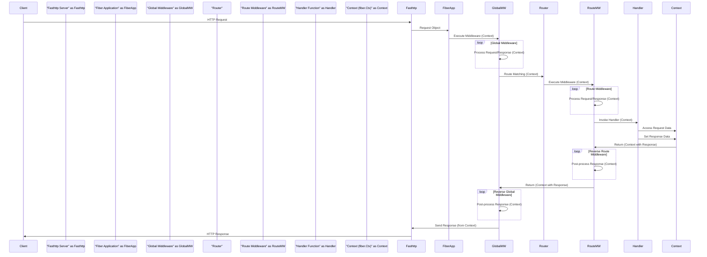
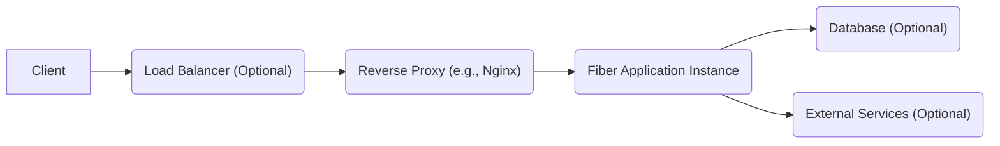

## Project Design Document: Go Fiber Web Framework (Improved)

**Project Name:** Fiber

**Project Repository:** https://github.com/gofiber/fiber

**Document Version:** 1.1

**Date:** October 26, 2023

**Author:** AI Software Architect

### 1. Introduction

This document provides an enhanced architectural design of the Go Fiber web framework, building upon the previous version. It offers a more detailed explanation of the key components, their interactions, and the data flow within a typical Fiber application. This improved document aims to provide a more comprehensive foundation for understanding the framework's structure and will serve as a more robust input for subsequent threat modeling activities.

### 2. Project Overview

Fiber is a high-performance, minimalist web framework written in Go, heavily inspired by the Express framework for Node.js. Its primary goal is to provide a fast and developer-friendly experience for building web applications and APIs in Go. By leveraging the speed of the Fasthttp library, Fiber achieves significant performance gains compared to the standard `net/http` package.

*   **Core Principles:**
    *   **Extreme Performance:** Built on top of Fasthttp for optimal speed and minimal overhead.
    *   **Developer Ergonomics:**  Offers an intuitive API familiar to developers with Express.js experience, reducing the learning curve.
    *   **Middleware-Centric Architecture:** Emphasizes the use of middleware for extending functionality and handling cross-cutting concerns.
    *   **Extensibility and Flexibility:** Allows integration with various Go libraries and tools.
    *   **Modularity:**  Encourages a modular approach to application development.

*   **Key Architectural Components:**
    *   **Application Core:** Manages the lifecycle and configuration of the Fiber application.
    *   **Router Engine:**  Efficiently maps incoming requests to their corresponding handlers.
    *   **Middleware Pipeline:**  A chain of functions that intercept and process requests.
    *   **Contextual Request Handling:** Provides a context object for accessing request and response data.
    *   **Response Emitter:**  Handles the construction and sending of HTTP responses.

### 3. Architectural Overview

Fiber employs a layered architecture centered around the request-response cycle. Incoming HTTP requests are processed through a series of middleware functions before reaching the designated handler. The handler then generates a response, which may also be processed by middleware before being sent back to the client.

*   **Core Interactions:**
    *   The `fiber.App` instance initializes and manages the application.
    *   The `fiber.Router` handles route registration and matching.
    *   Middleware functions operate on the `fiber.Ctx` object, modifying the request or response.
    *   Handler functions contain the core application logic for specific routes.
    *   Fasthttp handles the low-level HTTP communication.

### 4. Component Breakdown

This section provides a more detailed breakdown of the key components within the Fiber framework.

*   **Application (`fiber.App`)**
    *   **Responsibilities:**
        *   Creating and managing the HTTP server instance (using Fasthttp).
        *   Holding the router instance and managing route registrations.
        *   Storing and managing global middleware functions.
        *   Providing methods for starting and stopping the server.
        *   Configuring application-level settings (e.g., error handling, prefork).
    *   **Security Considerations:** Improper configuration of application settings (e.g., overly permissive CORS) can introduce vulnerabilities.

*   **Router (`fiber.Router`)**
    *   **Responsibilities:**
        *   Storing registered routes, mapping HTTP methods and paths to handler functions.
        *   Efficiently matching incoming request paths to registered routes using a trie-based or similar data structure.
        *   Extracting route parameters from the request path.
        *   Supporting route grouping and nested routing.
    *   **Security Considerations:**  Incorrectly defined or overlapping routes could lead to unintended access or denial of service. Exposure of internal routing logic might aid attackers.

*   **Middleware (`func(*fiber.Ctx) error`)**
    *   **Responsibilities:**
        *   Intercepting and processing incoming requests before they reach the handler.
        *   Modifying the request or response objects.
        *   Performing tasks such as authentication, authorization, logging, request validation, and header manipulation.
        *   Terminating the request processing chain if necessary.
        *   Executing code after the handler function has completed (in reverse order of registration).
    *   **Security Considerations:**
        *   Vulnerabilities in custom or third-party middleware can directly compromise the application.
        *   Improperly implemented authentication or authorization middleware can lead to unauthorized access.
        *   Middleware that doesn't sanitize input can introduce vulnerabilities.
        *   Order of middleware execution is critical and misconfiguration can lead to bypasses.

*   **Handler Function (`func(*fiber.Ctx) error`)**
    *   **Responsibilities:**
        *   Containing the core business logic for handling a specific route.
        *   Accessing request data from the `fiber.Ctx` object.
        *   Generating the HTTP response, including setting the status code, headers, and body.
        *   Returning an error to indicate processing failures.
    *   **Security Considerations:**  Handlers are the primary point where vulnerabilities like injection flaws, business logic errors, and insecure data handling can occur.

*   **Context (`fiber.Ctx`)**
    *   **Responsibilities:**
        *   Providing a unified interface for accessing request and response information.
        *   Offering methods to retrieve request parameters (path, query, body).
        *   Providing access to request headers and cookies.
        *   Enabling setting response status codes, headers, and body.
        *   Facilitating data sharing within the request lifecycle using `Locals`.
        *   Providing utility functions for common tasks (e.g., JSON serialization, redirection).
    *   **Security Considerations:**  Improper handling of data accessed through the context (e.g., unsanitized input) can lead to vulnerabilities.

*   **Request (`fiber.Request`)**
    *   **Responsibilities:**  Representing the incoming HTTP request, providing access to raw request data.
    *   **Security Considerations:**  Direct access to raw request data requires careful handling to prevent vulnerabilities.

*   **Response (`fiber.Response`)**
    *   **Responsibilities:**  Representing the outgoing HTTP response, allowing manipulation of response attributes.
    *   **Security Considerations:**  Incorrectly setting response headers can lead to security issues (e.g., missing security headers).

### 5. Data Flow (Detailed)

This section provides a more granular view of the data flow within a Fiber application.

1. **Client Initiates Request:** A client sends an HTTP request targeting a specific endpoint of the Fiber application.
2. **Fasthttp Receives Request:** The underlying Fasthttp server receives the raw TCP connection and parses the HTTP request.
3. **Fiber Application Receives Request:** The `fiber.App` instance receives the request object from Fasthttp.
4. **Global Middleware Execution:**  Global middleware functions registered with the application are executed sequentially. Each middleware receives the `fiber.Ctx` object, allowing it to inspect and potentially modify the request or response. Data passed within the context.
5. **Routing Decision:** The `fiber.Router` analyzes the request method and path from the `fiber.Ctx` to find a matching route definition.
6. **Route-Specific Middleware Execution:** If a matching route is found, any middleware specifically associated with that route or its group is executed sequentially. Again, data is passed via the `fiber.Ctx`.
7. **Handler Invocation:** The handler function associated with the matched route is invoked. The `fiber.Ctx` object is passed to the handler, providing access to request data and methods for setting the response.
8. **Handler Logic:** The handler function executes its core logic, potentially interacting with databases, external services, or other components.
9. **Response Construction:** The handler uses the `fiber.Ctx` object to set the response status code, headers, and body. The response data is stored within the context.
10. **Reverse Middleware Execution:** Middleware functions are executed in reverse order of their registration, allowing for post-processing of the response (e.g., logging, adding headers). The `fiber.Ctx` contains the constructed response.
11. **Fasthttp Sends Response:** Fiber utilizes Fasthttp to serialize the response from the `fiber.Ctx` and send it back to the client over the TCP connection.
12. **Client Receives Response:** The client receives the complete HTTP response.

### 6. Security Considerations (Detailed for Threat Modeling)

This section expands on the initial security considerations, providing more specific examples and potential threats.

*   **Input Validation (within Handlers and Middleware):**
    *   **Threats:** SQL Injection, Command Injection, Cross-Site Scripting (XSS), Path Traversal, Buffer Overflows.
    *   **Examples:**  Failing to sanitize user input before using it in database queries (SQL Injection), or when rendering dynamic content (XSS).
    *   **Mitigation:** Implement robust input validation using whitelisting, sanitization libraries, and parameterized queries.

*   **Authentication and Authorization (Middleware):**
    *   **Threats:** Unauthorized Access, Privilege Escalation, Data Breaches.
    *   **Examples:**  Weak or missing authentication mechanisms, insecure storage of credentials, flawed authorization logic allowing users to access resources they shouldn't.
    *   **Mitigation:** Use strong authentication protocols (e.g., OAuth 2.0, OpenID Connect), secure password hashing, role-based access control (RBAC), and regularly audit authorization rules.

*   **Session Management (Middleware or Custom Logic):**
    *   **Threats:** Session Hijacking, Session Fixation, Unauthorized Access.
    *   **Examples:**  Using predictable session IDs, storing session IDs in insecure cookies (missing `HttpOnly`, `Secure`, `SameSite` flags), lack of session expiration or renewal.
    *   **Mitigation:** Generate cryptographically secure session IDs, use secure cookie attributes, implement session timeouts and renewal mechanisms, and consider using secure session storage.

*   **Cross-Site Scripting (XSS) (within Handlers):**
    *   **Threats:**  Account Takeover, Data Theft, Defacement.
    *   **Examples:**  Rendering user-provided data directly in HTML without escaping or sanitizing it.
    *   **Mitigation:**  Employ context-aware output encoding, use templating engines with auto-escaping features, and implement a Content Security Policy (CSP).

*   **Cross-Site Request Forgery (CSRF) (Middleware):**
    *   **Threats:**  Unauthorized Actions on Behalf of a User.
    *   **Examples:**  An attacker tricking a logged-in user into making unintended requests on the application.
    *   **Mitigation:**  Implement anti-CSRF tokens (synchronizer tokens), use the `SameSite` cookie attribute, and verify the Origin or Referer header.

*   **Rate Limiting and DoS Protection (Middleware):**
    *   **Threats:**  Denial of Service, Resource Exhaustion.
    *   **Examples:**  An attacker sending a large number of requests to overwhelm the server.
    *   **Mitigation:**  Implement rate limiting based on IP address or user, use techniques like request queuing or connection limiting, and consider using a Web Application Firewall (WAF).

*   **Header Security (Middleware):**
    *   **Threats:**  Various attacks depending on the missing header (e.g., clickjacking, MIME sniffing).
    *   **Examples:**  Not setting `Content-Security-Policy`, `Strict-Transport-Security`, `X-Frame-Options`, `X-Content-Type-Options`.
    *   **Mitigation:**  Set appropriate security headers in middleware to mitigate common web vulnerabilities.

*   **Dependency Management:**
    *   **Threats:**  Exploiting known vulnerabilities in third-party libraries.
    *   **Examples:**  Using an outdated version of a library with a known security flaw.
    *   **Mitigation:**  Regularly update dependencies, use vulnerability scanning tools, and carefully evaluate the security posture of third-party libraries.

*   **Error Handling (within Handlers and Application):**
    *   **Threats:**  Information Disclosure.
    *   **Examples:**  Exposing stack traces or sensitive error messages to clients.
    *   **Mitigation:**  Implement generic error pages for clients, log detailed error information securely, and avoid revealing internal details in error responses.

*   **Middleware Security:**
    *   **Threats:**  Vulnerabilities introduced by insecure or malicious middleware.
    *   **Examples:**  Middleware that doesn't properly handle errors or leaks sensitive information.
    *   **Mitigation:**  Thoroughly vet third-party middleware, follow secure coding practices when developing custom middleware, and ensure proper error handling within middleware.

### 7. Deployment Considerations (Expanded)

The deployment environment significantly impacts the security of a Fiber application.

*   **Bare Metal Servers:**
    *   **Security Considerations:** Requires manual configuration and management of security measures (firewalls, intrusion detection, OS hardening). Vulnerable if not properly secured.
    *   **Mitigation:** Implement strong firewall rules, regularly patch the operating system, use intrusion detection/prevention systems, and follow security best practices for server hardening.

*   **Containers (Docker):**
    *   **Security Considerations:** Provides isolation but requires secure container image creation and management. Vulnerabilities in the base image or container configuration can be exploited.
    *   **Mitigation:** Use minimal base images, regularly scan container images for vulnerabilities, implement resource limits, and follow container security best practices.

*   **Cloud Platforms (AWS, Google Cloud, Azure):**
    *   **Security Considerations:** Offers various built-in security services (firewalls, identity management, vulnerability scanning) but requires proper configuration and utilization. Misconfiguration can lead to security breaches.
    *   **Mitigation:** Leverage cloud provider security services (e.g., Security Groups, IAM, Cloud Security Scanner), follow cloud security best practices, and implement infrastructure-as-code for consistent security configurations.

*   **Platform-as-a-Service (PaaS):**
    *   **Security Considerations:**  The platform provider handles some security aspects, but developers are still responsible for application-level security. Understanding the shared responsibility model is crucial.
    *   **Mitigation:**  Understand the security responsibilities of the PaaS provider, configure application settings securely, and follow secure coding practices.

*   **Serverless Functions (Less Common for Fiber):**
    *   **Security Considerations:**  Focus shifts to function-level security, including access control, input validation, and dependency management. Cold starts can introduce latency concerns for some security measures.
    *   **Mitigation:**  Implement least privilege access for functions, thoroughly validate input, and manage dependencies carefully.

### 8. Diagrams

*   **High-Level Architecture Diagram:** (No change from previous version)

*   **Detailed Request Processing Flow:** (As shown in Section 5)

### 9. Conclusion

This improved design document provides a more detailed and comprehensive understanding of the Go Fiber web framework's architecture, components, and data flow. The expanded security considerations and deployment considerations offer a stronger foundation for conducting thorough threat modeling activities. This document will continue to be updated as the project evolves and new insights emerge.