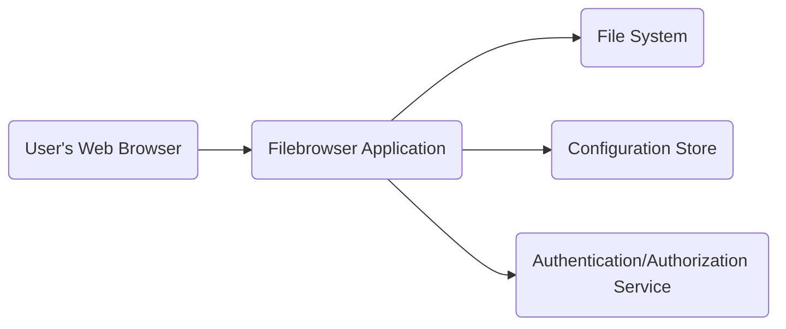
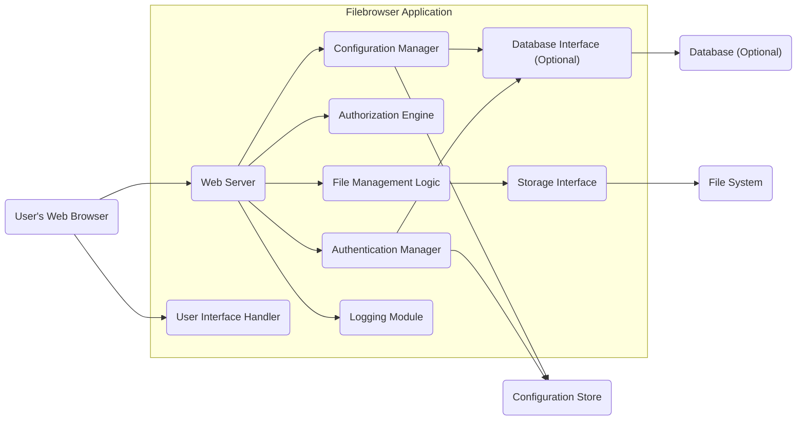

# Project Design Document: Filebrowser

**Version:** 1.1
**Date:** October 26, 2023
**Author:** AI Software Architect

## 1. Introduction

This document provides an enhanced and more detailed design overview of the Filebrowser project, an open-source web application designed for browsing, uploading, downloading, and managing files through a web interface. This document builds upon the previous version, offering greater clarity and specificity regarding the system's architecture, components, and data flow. It remains a crucial foundation for subsequent threat modeling activities.

## 2. Goals and Objectives

The primary goals of Filebrowser are to:

* Provide a user-friendly and intuitive web interface for efficient file management.
* Enable users to easily browse directory structures and individual files.
* Facilitate the seamless uploading and downloading of files.
* Support essential file operations, including renaming, deleting, and creating directories.
* Offer robust user authentication and authorization mechanisms to control access to files and functionalities.
* Be easily deployable across various environments and highly configurable to suit different needs.

## 3. System Architecture

### 3.1. High-Level Architecture

The Filebrowser application adheres to a standard client-server architecture.

* **User's Web Browser:** The client-side interface through which users interact with the Filebrowser application. This is where the user interface is rendered and user actions are initiated.
* **Filebrowser Application:** The core server-side application. It receives requests from the user's browser, processes them, interacts with the file system and configuration, and enforces security policies.
* **File System:** The underlying storage medium where the files being managed by Filebrowser are physically stored. This could be local storage, network-attached storage (NAS), or other storage solutions.
* **Configuration Store:**  A persistent storage mechanism for application settings and parameters. This might be a configuration file (e.g., YAML, JSON) or a lightweight database.
* **Authentication/Authorization Service:** The component responsible for verifying user identities and determining their access rights to specific resources and actions within the application.

### 3.2. Detailed Component Architecture

The Filebrowser application can be further decomposed into the following logical components:

* **Web Server:**  Listens for incoming HTTP requests from the user's browser and routes them to the appropriate internal handlers. This component is typically built using a Go-based web framework (e.g., standard `net/http`, Gin, Echo). It handles routing, request parsing, and response generation.
* **Authentication Manager:**  Responsible for verifying user credentials. It interacts with the **Database Interface** (if a database is configured) or directly with the **Configuration Store** to validate provided credentials against stored user information. Common authentication methods might include basic authentication, form-based authentication, or potentially integration with external authentication providers in future iterations.
* **Authorization Engine:**  Determines if an authenticated user has the necessary permissions to perform a specific action (e.g., read, write, delete) on a particular file or directory. This component evaluates user roles, permissions, and potentially access control lists (ACLs) defined within the application's configuration or database.
* **File Management Logic:**  Implements the core business logic for file manipulation. This includes functionalities such as listing directory contents, handling file uploads and downloads, renaming files and directories, deleting files and directories, and creating new directories. This component interacts directly with the underlying **File System** through the **Storage Interface**.
* **Configuration Manager:**  Loads, manages, and provides access to the application's configuration settings. It reads configuration data from the **Configuration Store** (e.g., configuration files in YAML or JSON format) and makes it available to other components. This includes settings like the root directory for file browsing, listening port, user accounts (if not using a database), and other operational parameters.
* **Logging Module:**  Records application events, including user actions, errors, security-related events, and informational messages. Logs are typically written to files, standard output, or potentially to external logging services.
* **Storage Interface:**  Provides an abstraction layer for interacting with the underlying **File System**. This decouples the **File Management Logic** from the specific file system implementation, allowing for potential future support of different storage backends (e.g., cloud storage).
* **User Interface Handler:**  Responsible for rendering the web interface presented to the user. It processes requests related to UI elements and serves HTML templates, CSS stylesheets, JavaScript files, and other static assets.
* **Database Interface (Optional):**  Provides an interface for interacting with a database system. This component is used for storing user accounts, permissions, and potentially other application settings when a more robust user management system is required. Supported databases might include SQLite, PostgreSQL, or MySQL.

## 4. Data Flow

This section details the typical data flow for common user interactions within the Filebrowser application.

### 4.1. User Authentication

1. The user accesses the Filebrowser login page via their **User's Web Browser**.
2. The **User's Web Browser** sends an HTTP GET request to the **Web Server** for the login page.
3. The **Web Server** retrieves the login page content from the **User Interface Handler** and sends it back to the browser.
4. The user enters their credentials (username and password) into the login form and submits it.
5. The **User's Web Browser** sends an HTTP POST request containing the credentials to the **Web Server**.
6. The **Web Server** forwards the credentials to the **Authentication Manager**.
7. The **Authentication Manager** queries the user information from the **Database Interface** (if configured) or the **Configuration Store**.
8. The stored credentials are compared with the provided credentials.
9. The **Authentication Manager** returns the authentication status (success or failure) to the **Web Server**.
10. Upon successful authentication, the **Web Server** creates a session for the user (e.g., by setting a session cookie in the user's browser) and redirects the user to the main file browsing interface.

### 4.2. Browsing Files

1. The authenticated user navigates to a specific directory within the web interface.
2. The **User's Web Browser** sends an HTTP GET request to the **Web Server**, specifying the path of the requested directory.
3. The **Web Server** forwards the request to the **Authorization Engine** to verify if the user has the necessary permissions to access the specified directory.
4. If authorized, the **Web Server** instructs the **File Management Logic** to retrieve the contents of the directory.
5. The **File Management Logic** interacts with the **Storage Interface** to fetch the list of files and subdirectories from the **File System**.
6. The **File Management Logic** returns the list of files and directories to the **Web Server**.
7. The **Web Server** passes the directory listing data to the **User Interface Handler**.
8. The **User Interface Handler** renders the directory listing using appropriate templates and sends the HTML response back to the **User's Web Browser**.

### 4.3. Downloading a File

1. The user clicks on a download link for a specific file in the web interface.
2. The **User's Web Browser** sends an HTTP GET request to the **Web Server**, including the file path.
3. The **Web Server** forwards the request to the **Authorization Engine** to verify download permissions for the requested file.
4. If authorized, the **Web Server** instructs the **File Management Logic** to retrieve the file content.
5. The **File Management Logic** interacts with the **Storage Interface** to read the file content from the **File System**.
6. The **File Management Logic** streams the file content back to the **Web Server**.
7. The **Web Server** sends the file content as an HTTP response to the **User's Web Browser**, setting appropriate headers (e.g., `Content-Disposition`) to initiate the download.

### 4.4. Uploading a File

1. The user selects a file to upload through the web interface's upload form.
2. The **User's Web Browser** sends an HTTP POST request to the **Web Server**, including the file content in the request body.
3. The **Web Server** forwards the request to the **Authorization Engine** to verify upload permissions for the target directory.
4. If authorized, the **Web Server** passes the uploaded file content to the **File Management Logic**.
5. The **File Management Logic** interacts with the **Storage Interface** to write the received file content to the **File System** in the specified directory.
6. The **File Management Logic** returns the upload status (success or failure) to the **Web Server**.
7. The **Web Server** sends an HTTP response back to the **User's Web Browser**, indicating the outcome of the upload operation.

## 5. Security Considerations (Pre-Threat Modeling)

This section outlines potential security concerns that should be considered during subsequent threat modeling activities.

* **Authentication and Authorization:**
    * **Weak Password Policies:**  Lack of enforcement of strong password requirements can lead to easily compromised accounts.
    * **Brute-Force Attacks:**  Vulnerability to automated attempts to guess user credentials.
    * **Session Hijacking:**  Risk of attackers stealing or intercepting user session identifiers to gain unauthorized access.
    * **Insufficient Authorization Granularity:**  Overly permissive access controls could allow users to access resources they shouldn't.
* **Input Validation:**
    * **Path Traversal Vulnerabilities:**  Improper handling of user-supplied file paths could allow attackers to access files outside the intended directories.
    * **Command Injection:**  Failure to sanitize user input used in system commands could allow attackers to execute arbitrary commands on the server.
    * **Cross-Site Scripting (XSS):**  If user-provided data is not properly sanitized before being displayed in the web interface, attackers could inject malicious scripts.
* **File Handling:**
    * **Malicious File Uploads:**  Risk of users uploading malware or other harmful files that could compromise the server or other users.
    * **Insecure File Storage Permissions:**  Incorrectly configured file system permissions could allow unauthorized access to uploaded files.
    * **Exposure of Sensitive File Metadata:**  Potentially exposing sensitive information through file metadata.
* **Transport Security:**
    * **Lack of HTTPS:**  Communication between the browser and server is not encrypted, making it vulnerable to eavesdropping and man-in-the-middle attacks.
    * **Weak TLS Configuration:**  Using outdated or insecure TLS protocols and ciphers.
* **Configuration Security:**
    * **Storing Credentials in Plain Text:**  Storing user credentials or other sensitive information in easily readable configuration files.
    * **Insecure Configuration File Permissions:**  Allowing unauthorized users to read or modify configuration files.
* **Logging and Monitoring:**
    * **Insufficient Logging:**  Lack of comprehensive logging makes it difficult to detect and investigate security incidents.
    * **Insecure Log Storage:**  Logs themselves are not protected from unauthorized access or modification.
* **Dependencies:**
    * **Vulnerabilities in Third-Party Libraries:**  Using outdated or vulnerable dependencies can introduce security risks.

## 6. Deployment

Filebrowser can be deployed using various methods, each with its own considerations:

* **Direct Execution:**
    * Involves running the compiled Filebrowser binary directly on a server operating system.
    * Requires manual configuration of dependencies and system settings.
    * Security considerations include securing the server operating system and the Filebrowser process itself.
* **Containerization (Docker):**
    * Packaging Filebrowser and its dependencies into a Docker container for isolated and reproducible deployments.
    * Simplifies deployment and management across different environments.
    * Security considerations include securing the Docker host and the container image.
* **Reverse Proxy:**
    * Deploying Filebrowser behind a reverse proxy server (e.g., Nginx, Apache).
    * Enables features like SSL termination, load balancing, and enhanced security through web application firewall (WAF) capabilities.
    * Security considerations include properly configuring the reverse proxy to protect the backend Filebrowser application.

## 7. Future Considerations

* **File Versioning:** Implementing a system to track and manage different versions of files.
* **Advanced Search Functionality:** Adding robust search capabilities based on file content or metadata.
* **User Quotas:** Implementing limits on storage space usage per user.
* **Two-Factor Authentication (2FA):** Enhancing security by requiring a second factor of authentication beyond username and password.
* **Integration with External Storage Providers:** Supporting storage backends like Amazon S3, Google Cloud Storage, etc.
* **WebDAV Protocol Support:** Allowing users to access and manage files through WebDAV clients.

This improved design document provides a more detailed and comprehensive understanding of the Filebrowser project's architecture, components, and data flow. It serves as a more robust foundation for conducting thorough threat modeling and identifying potential security vulnerabilities.