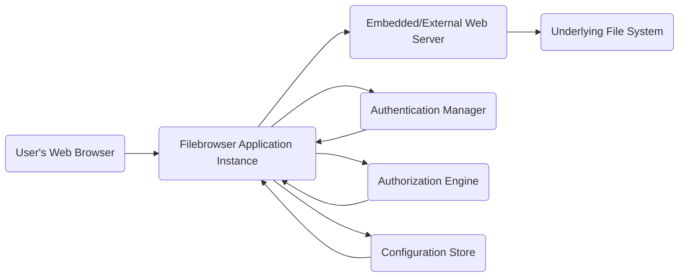

## Project Design Document: Filebrowser (Improved)

**1. Introduction**

This document provides an enhanced design specification for the Filebrowser project, an open-source web application facilitating file management within a designated server directory. This detailed description of the system's architecture, components, and data flow is specifically intended to serve as a foundation for comprehensive threat modeling activities.

**2. Goals and Objectives**

*   Offer an intuitive web-based interface for browsing and managing server-side files and directories.
*   Empower users to execute standard file operations: uploading, downloading, creating, deleting, renaming, and editing.
*   Implement configurable user authentication and authorization mechanisms to enforce granular access control over files and directories.
*   Ensure compatibility across diverse operating systems and deployment environments.
*   Maintain a streamlined and efficient design to simplify deployment and ongoing maintenance.

**3. System Architecture**

Filebrowser employs a client-server architecture. The client is the user's web browser, while the server is the Filebrowser application instance.

*   **User's Web Browser:** The primary interface for user interaction with Filebrowser. It transmits HTTP requests to the Filebrowser application and renders the received responses.
*   **Filebrowser Application Instance:** The core application logic, responsible for processing user requests, interacting with the file system, and managing user authentication and authorization. This includes routing logic, request handlers, and business logic.
*   **Embedded/External Web Server:**  Filebrowser can operate with an integrated web server or be deployed behind a separate web server (e.g., Nginx, Apache). This component manages the reception and dispatch of HTTP requests and responses.
*   **Underlying File System:** The physical storage medium where the files and directories managed by Filebrowser are located. This is the target of most file operations.
*   **Authentication Manager:** The module responsible for verifying user identities. It handles login requests, validates credentials against stored data, and manages user sessions.
*   **Authorization Engine:** The component that determines if an authenticated user has the necessary privileges to perform a requested action on a specific file or directory. It enforces access control policies.
*   **Configuration Store:**  Stores the application's configuration parameters, including user accounts, permissions, the root directory for file browsing, and other operational settings. This could be a file (e.g., YAML, JSON) or an embedded database.

**4. Component Breakdown**

*   **Web Server Interface (Handler):**
    *   Purpose:  Acts as the entry point for all incoming HTTP requests from user browsers.
    *   Functionality:
        *   Listens on a specified port for incoming HTTP requests (GET, POST, PUT, DELETE, etc.).
        *   Parses incoming requests to extract relevant information (headers, parameters, body).
        *   Routes requests to the appropriate internal handlers based on the requested URL path and HTTP method.
        *   Constructs and sends HTTP responses back to the client, including status codes, headers, and response bodies.
    *   Security Considerations:  Susceptible to common web server vulnerabilities if not hardened (e.g., improper handling of large requests, exposure of server information). Incorrect routing logic can lead to unintended access.

*   **Authentication Manager (Module):**
    *   Purpose:  Verifies the identity of users attempting to access Filebrowser resources.
    *   Functionality:
        *   Receives and processes user login requests, typically involving username and password submission.
        *   Retrieves and compares provided credentials against stored user credentials from the Configuration Store.
        *   Manages user sessions upon successful authentication, often using cookies or tokens.
        *   May support various authentication schemes (e.g., basic authentication, form-based authentication, potentially integration with external authentication providers).
        *   Handles user logout requests, invalidating active sessions.
    *   Security Considerations: Vulnerable to brute-force attacks, credential stuffing, and dictionary attacks. Insecure storage of credentials (e.g., plain text or weak hashing algorithms) is a critical risk. Session management flaws can lead to session hijacking or fixation.

*   **Authorization Engine (Module):**
    *   Purpose: Enforces access control policies, determining if an authenticated user is permitted to perform a specific action on a given resource (file or directory).
    *   Functionality:
        *   Evaluates user permissions based on their identity, roles, or group memberships.
        *   Checks if the authenticated user has the necessary permissions (e.g., read, write, delete) for the requested operation on the target file or directory.
        *   May implement Access Control Lists (ACLs) or Role-Based Access Control (RBAC).
        *   Enforces restrictions based on configured permissions and the current user's context.
    *   Security Considerations:  Authorization bypass vulnerabilities are a significant concern. Flaws in permission evaluation logic can allow unauthorized access to sensitive files or functionalities. Improper handling of inheritance or cascading permissions can also lead to vulnerabilities.

*   **File Management Module (Core Logic):**
    *   Purpose:  Provides the core functionalities for interacting with the underlying file system.
    *   Functionality:
        *   Retrieves and formats lists of files and directories within a specified path for display in the user interface.
        *   Handles file upload requests, receiving file data and writing it to the file system.
        *   Manages file download requests, reading file content from the file system and streaming it to the user's browser.
        *   Implements functionalities for creating, deleting, and renaming files and directories.
        *   Provides capabilities for editing text-based files directly within the interface.
        *   May interact with the operating system's file permission mechanisms.
    *   Security Considerations:  Highly susceptible to path traversal vulnerabilities if input sanitization is insufficient. Insecure handling of uploaded files can lead to malware execution or data breaches. Lack of proper input validation during file creation or renaming can cause unexpected behavior or security issues. Vulnerabilities in the file editing functionality could allow for arbitrary code injection or data manipulation.

*   **Configuration Management Module (Component):**
    *   Purpose:  Manages the application's configuration settings, allowing administrators to customize its behavior.
    *   Functionality:
        *   Reads configuration settings from the Configuration Store at startup and during runtime.
        *   Provides mechanisms for administrators to modify configuration settings, such as user accounts, permissions, the root directory for browsing, and other application parameters.
        *   Persists configuration changes back to the Configuration Store.
        *   May include validation logic to ensure configuration settings are valid.
    *   Security Considerations:  The Configuration Store itself is a critical security target. Unauthorized access or modification can have severe consequences. Lack of input validation during configuration updates can introduce vulnerabilities. Storing sensitive information in the configuration without proper encryption is a risk.

*   **Logging Module (Service):**
    *   Purpose: Records events and activities within the application for auditing, debugging, and security monitoring.
    *   Functionality:
        *   Logs user authentication attempts (successful and failed).
        *   Records file access and modification events, including timestamps and user information.
        *   Logs application errors, exceptions, and warnings.
        *   May provide different logging levels and output destinations (e.g., files, system logs).
    *   Security Considerations:  Logs can contain sensitive information and must be stored securely with appropriate access controls. Insufficient logging can hinder incident response and forensic analysis. Excessive logging can lead to performance issues or storage exhaustion.

**5. Data Flow**

Here are detailed data flow scenarios illustrating key interactions within the system:

*   **User Authentication:**
    1. The "User's Web Browser" sends an HTTP POST request containing login credentials (username and password) to the "Web Server Interface (Handler)".
    2. The "Web Server Interface (Handler)" routes the request to the "Authentication Manager (Module)".
    3. The "Authentication Manager (Module)" retrieves stored user credentials from the "Configuration Store".
    4. The "Authentication Manager (Module)" compares the provided credentials with the retrieved credentials.
    5. If authentication is successful, the "Authentication Manager (Module)" creates a new session and potentially stores session information (e.g., in a cookie sent back to the browser).
    6. The "Authentication Manager (Module)" sends a success response (e.g., an HTTP redirect or a success status code) back to the "Web Server Interface (Handler)".
    7. The "Web Server Interface (Handler)" relays the response to the "User's Web Browser".

*   **Browsing a Directory:**
    1. The "User's Web Browser" sends an HTTP GET request for a specific directory path to the "Web Server Interface (Handler)".
    2. The "Web Server Interface (Handler)" routes the request to the "Authorization Engine (Module)".
    3. The "Authorization Engine (Module)" verifies if the authenticated user (identified by their session) has the necessary permissions to access the requested directory, potentially consulting the "Configuration Store" for access rules.
    4. If authorized, the "Authorization Engine (Module)" signals approval to the "File Management Module (Core Logic)".
    5. The "File Management Module (Core Logic)" interacts with the "Underlying File System" to retrieve the list of files and subdirectories within the specified path.
    6. The "File Management Module (Core Logic)" formats the retrieved information into a suitable response.
    7. The "File Management Module (Core Logic)" sends the formatted list back to the "Web Server Interface (Handler)".
    8. The "Web Server Interface (Handler)" sends the response (typically HTML or JSON) to the "User's Web Browser" for rendering.

*   **Downloading a File:**
    1. The "User's Web Browser" sends an HTTP GET request for a specific file download to the "Web Server Interface (Handler)".
    2. The "Web Server Interface (Handler)" routes the request to the "Authorization Engine (Module)".
    3. The "Authorization Engine (Module)" verifies if the authenticated user has permission to download the requested file.
    4. If authorized, the "Authorization Engine (Module)" signals approval to the "File Management Module (Core Logic)".
    5. The "File Management Module (Core Logic)" reads the content of the requested file from the "Underlying File System".
    6. The "File Management Module (Core Logic)" streams the file content back to the "Web Server Interface (Handler)".
    7. The "Web Server Interface (Handler)" sends the file content as the HTTP response body to the "User's Web Browser", setting appropriate headers for download.

*   **Uploading a File:**
    1. The "User's Web Browser" sends an HTTP POST request containing the file content to be uploaded to the "Web Server Interface (Handler)".
    2. The "Web Server Interface (Handler)" routes the request to the "Authorization Engine (Module)".
    3. The "Authorization Engine (Module)" verifies if the authenticated user has permission to upload files to the target directory.
    4. If authorized, the "Authorization Engine (Module)" signals approval to the "File Management Module (Core Logic)".
    5. The "File Management Module (Core Logic)" receives the uploaded file content from the "Web Server Interface (Handler)".
    6. The "File Management Module (Core Logic)" writes the received file content to the "Underlying File System" in the designated directory.
    7. The "File Management Module (Core Logic)" sends a success response back to the "Web Server Interface (Handler)".
    8. The "Web Server Interface (Handler)" relays the response to the "User's Web Browser".

**6. Security Considerations (Detailed)**

This section expands on potential security vulnerabilities, providing more specific examples for threat modeling.

*   **Authentication and Authorization:**
    *   **Vulnerability:** Weak password policies enforced by the "Authentication Manager (Module)" could allow attackers to easily guess user passwords.
    *   **Vulnerability:** Lack of multi-factor authentication makes accounts vulnerable to compromise if credentials are leaked.
    *   **Vulnerability:**  Authorization bypass flaws in the "Authorization Engine (Module)" could allow users to access or modify files and directories they shouldn't. For example, a flaw in path canonicalization could allow access to files outside the intended scope.
    *   **Vulnerability:**  Predictable or easily guessable session identifiers used by the "Authentication Manager (Module)" could lead to session hijacking.
    *   **Vulnerability:**  Failure to invalidate sessions properly upon logout could allow attackers to reuse compromised sessions.

*   **File Handling:**
    *   **Vulnerability:** Path traversal vulnerabilities in the "File Management Module (Core Logic)" could allow attackers to access files and directories outside the intended root directory by manipulating file paths in requests (e.g., using "../" sequences).
    *   **Vulnerability:**  Insecure handling of uploaded files, such as failing to sanitize filenames or scan for malware, could allow attackers to upload malicious files that could be executed on the server.
    *   **Vulnerability:**  Exposure of sensitive information through file previews or editing features if proper sanitization or access controls are not in place. For example, displaying the content of a configuration file containing secrets.
    *   **Vulnerability:**  Denial-of-service attacks could be possible by uploading excessively large files, filling up disk space, or performing a large number of file operations in a short period.

*   **Web Application Security:**
    *   **Vulnerability:** Cross-Site Scripting (XSS) vulnerabilities could exist if user-supplied input is not properly sanitized before being displayed in the web interface, allowing attackers to inject malicious scripts.
    *   **Vulnerability:** Cross-Site Request Forgery (CSRF) vulnerabilities could allow attackers to trick authenticated users into performing unintended actions on the application.
    *   **Vulnerability:** If a database is used (even embedded), SQL Injection vulnerabilities could arise if user input is not properly sanitized before being used in database queries.
    *   **Vulnerability:**  Missing or misconfigured security headers (e.g., `Content-Security-Policy`, `Strict-Transport-Security`) could leave the application vulnerable to various attacks.

*   **Configuration Security:**
    *   **Vulnerability:** Storing sensitive configuration data (e.g., database credentials, API keys) in plain text within the "Configuration Store" is a significant risk.
    *   **Vulnerability:**  Lack of proper access control to the "Configuration Store" could allow unauthorized users to modify critical application settings.

*   **Deployment Security:**
    *   **Vulnerability:** Running the Filebrowser application with overly permissive privileges could allow an attacker who compromises the application to gain broader access to the system.
    *   **Vulnerability:** Exposing the application directly to the public internet without proper security measures (e.g., a Web Application Firewall, rate limiting) increases the attack surface.

**7. Deployment Considerations**

*   Filebrowser can be deployed as a standalone executable.
*   Deployment behind a reverse proxy (e.g., Nginx, Apache) is recommended for enhanced security (SSL termination, request filtering) and load balancing.
*   Containerization using Docker simplifies deployment, management, and scaling.
*   Configuration can be managed via command-line arguments, environment variables, or dedicated configuration files (YAML, JSON). Securely managing these configuration sources is crucial.

**8. Technologies Used**

*   **Primary Programming Language:** Go
*   **Web Server Implementation:** Likely using the standard Go `net/http` package or a lightweight routing library.
*   **Frontend Technologies:** HTML, CSS, and JavaScript. Potentially leveraging a JavaScript framework or library for UI components and interactivity.
*   **Configuration Storage Format:**  Likely YAML or JSON files, or potentially an embedded database like SQLite for more complex configurations.
*   **Potential Authentication Libraries:**  May utilize standard Go libraries for handling authentication or implement custom logic.

This improved design document provides a more detailed and security-focused overview of the Filebrowser project's architecture and components. It is intended to be a valuable and comprehensive resource for conducting thorough threat modeling and identifying potential security vulnerabilities.