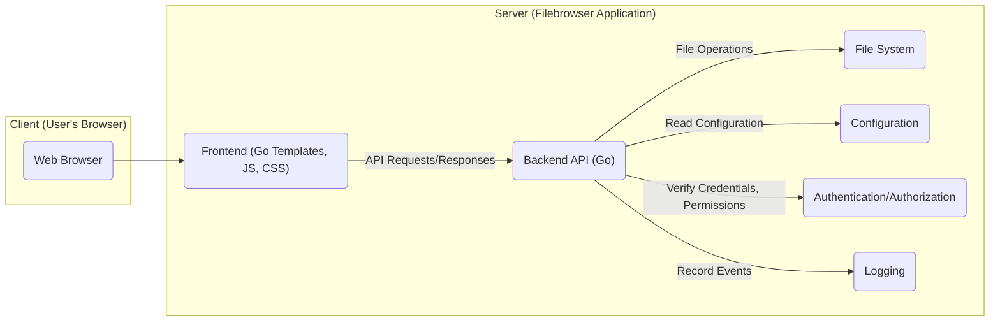
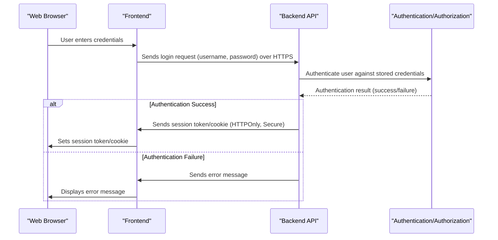
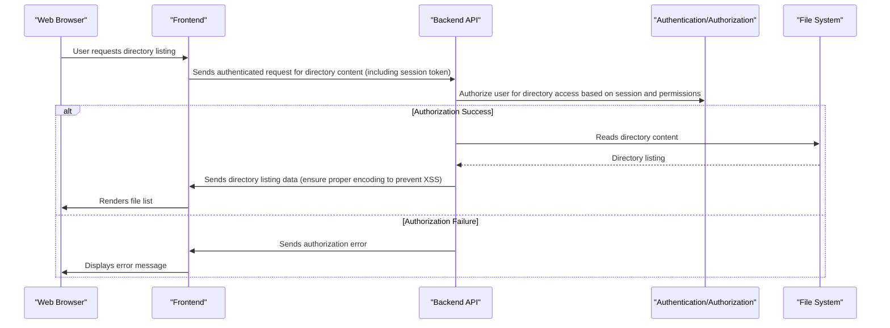
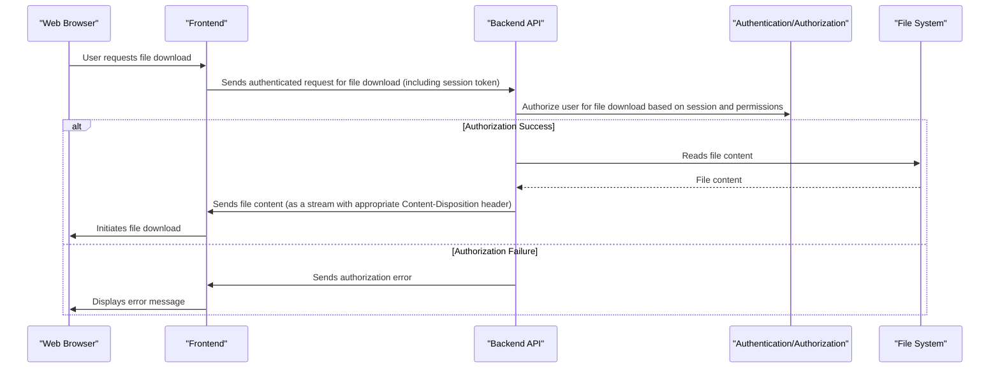
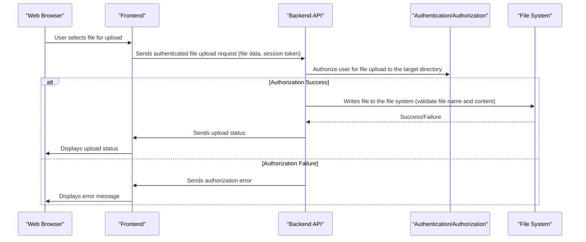

# Project Design Document: Filebrowser

**Version:** 1.1
**Date:** October 26, 2023
**Author:** AI Software Architect

## 1. Introduction

This document provides a detailed design overview of the Filebrowser project, an open-source web application that provides a file managing interface within a specified directory. This document aims to clearly articulate the system's architecture, components, data flow, and key considerations for security. This design will serve as the foundation for subsequent threat modeling activities, enabling a structured approach to identifying potential vulnerabilities and risks.

## 2. Goals

The primary goals of this design document are to:

*   Clearly define the architecture and components of the Filebrowser application, emphasizing security-relevant aspects.
*   Illustrate the data flow within the system for various user interactions, highlighting potential points of vulnerability.
*   Identify key areas and components relevant for security analysis and threat modeling, providing a focused scope for security assessments.
*   Provide a comprehensive understanding of the system for security stakeholders, enabling informed discussions and decision-making regarding security measures.

## 3. Scope

This document covers the design of the core Filebrowser application as represented in the provided GitHub repository. It focuses on the functional aspects relevant to file management, user interaction, and system configuration, with a strong emphasis on security implications. It includes:

*   The web interface (frontend) and its interaction with the backend.
*   The backend API and its functionalities, including authentication, authorization, and file system operations.
*   User authentication and authorization mechanisms and their security implications.
*   File system interaction and associated security risks.
*   Configuration management and the security of configuration data.

This document does not cover:

*   Specific deployment environments or infrastructure details beyond general considerations.
*   Detailed code-level implementation specifics.
*   Third-party integrations beyond standard web technologies and their immediate impact on the core Filebrowser functionality.

## 4. Architecture Overview

Filebrowser follows a client-server architecture. The frontend, a web application built with technologies like Go templates, HTML, CSS, and JavaScript, interacts with the backend API, which is also built in Go. The backend handles user authentication, authorization, and file system operations. This separation of concerns is a key architectural element for security.

## 5. Component Details

This section details the key components of the Filebrowser application, with a focus on their functionality and security relevance.

### 5.1. Web Interface (Frontend)

*   **Description:** The user interface presented in the web browser. It's responsible for rendering the file listing, handling user interactions (clicks, form submissions), and communicating with the backend API. It plays a crucial role in preventing client-side vulnerabilities like XSS.
*   **Responsibilities:**
    *   Displaying files and directories received from the backend API.
    *   Providing controls for file operations (upload, download, delete, rename, etc.), translating user actions into API requests.
    *   Handling user input for actions, which requires careful sanitization to prevent injection attacks.
    *   Rendering error messages and notifications received from the backend.
    *   Managing user sessions (typically through cookies or local storage), which needs to be done securely to prevent session hijacking.
*   **Technology:** Primarily Go templates for server-side rendering, along with HTML, CSS, and JavaScript for dynamic behavior. The use of JavaScript frameworks might introduce additional security considerations.

### 5.2. Backend API

*   **Description:** The core logic of the application, responsible for handling requests from the frontend, interacting with the file system, and managing user authentication and authorization. This component is the primary gatekeeper for accessing and manipulating files.
*   **Responsibilities:**
    *   Receiving and processing API requests from the frontend, including validating the format and content of requests.
    *   Authenticating and authorizing user actions before performing any file system operations. This is a critical security function.
    *   Interacting with the underlying file system to perform file operations (read, write, delete, rename, etc.), ensuring proper access controls are enforced.
    *   Managing user sessions and permissions, potentially storing session information securely.
    *   Serving static files (if configured), which requires careful handling to prevent directory traversal vulnerabilities.
    *   Generating logs for auditing and security monitoring.
*   **Technology:** Go programming language, utilizing standard libraries for HTTP handling, file system operations, and potentially other libraries for specific functionalities like image thumbnail generation.

### 5.3. File System

*   **Description:** The underlying file system where the files and directories managed by Filebrowser reside. The security of this component relies heavily on the operating system's access controls.
*   **Responsibilities:**
    *   Storing the actual files and directories.
    *   Providing access to files and directories based on the permissions enforced by the operating system. Filebrowser must respect these permissions.
*   **Technology:** The host operating system's file system (e.g., ext4, NTFS). The permissions model of the underlying file system is crucial for Filebrowser's security.

### 5.4. Configuration

*   **Description:** Stores the application's configuration settings, such as the root directory to be served, user accounts, permissions, and other operational parameters. The security of this component is paramount, as it can control access and behavior.
*   **Responsibilities:**
    *   Persisting application settings, potentially including sensitive information like user credentials.
    *   Providing configuration values to the backend, which uses these values to control its behavior.
*   **Technology:** Likely a configuration file (e.g., YAML, JSON, TOML) or environment variables. The storage mechanism and access controls for this configuration are critical.

### 5.5. Authentication/Authorization

*   **Description:** Manages user authentication (verifying identity) and authorization (granting access to resources). This component is central to the security of Filebrowser.
*   **Responsibilities:**
    *   Verifying user credentials (username/password), ideally using strong hashing algorithms for passwords.
    *   Managing user sessions, ensuring secure session token generation and storage.
    *   Enforcing access control policies based on user roles and permissions, determining what actions a user is allowed to perform on specific files and directories.
*   **Technology:** Likely built-in Go functionalities or potentially using external libraries for authentication. The specific implementation details are crucial for security.

### 5.6. Logging

*   **Description:** Records application events, errors, and user actions for monitoring and auditing purposes. This component is essential for detecting and responding to security incidents.
*   **Responsibilities:**
    *   Recording significant events, including login attempts, file operations, and errors.
    *   Providing a mechanism for debugging and security analysis, allowing administrators to track suspicious activity.
*   **Technology:** Standard Go logging library or potentially a more advanced logging framework. Secure storage and access control for logs are important considerations.

## 6. Data Flow

This section describes the typical data flow for common user interactions, highlighting potential security checkpoints.

### 6.1. User Login

### 6.2. Browsing Files

### 6.3. File Download

### 6.4. File Upload

## 7. Security Considerations

Based on the architecture and data flow, the following are key security considerations for Filebrowser, categorized for clarity:

*   **Authentication and Authorization:**
    *   **Threats:** Brute-force attacks on login, credential stuffing, session hijacking, privilege escalation.
    *   **Considerations:** Strength of password hashing algorithms (e.g., Argon2), secure session management (HTTPOnly, Secure flags on cookies, session timeout), role-based access control implementation and enforcement, protection against replay attacks.
*   **File System Access Control:**
    *   **Threats:** Path traversal vulnerabilities allowing access to files outside the intended directory, unauthorized modification or deletion of files.
    *   **Considerations:**  Strict validation and sanitization of file paths, preventing the use of relative paths or special characters, careful handling of symbolic links, ensuring the application runs with the least necessary privileges.
*   **Input Validation:**
    *   **Threats:** Cross-site scripting (XSS), command injection, path injection, SQL injection (if a database is used for user management).
    *   **Considerations:**  Thorough validation and sanitization of all user inputs on both the frontend and backend, using parameterized queries for database interactions, encoding output to prevent XSS.
*   **Cross-Site Scripting (XSS):**
    *   **Threats:** Attackers injecting malicious scripts into the web page, potentially stealing session cookies or performing actions on behalf of the user.
    *   **Considerations:**  Proper output encoding of user-generated content, implementing Content Security Policy (CSP) to restrict the sources of content the browser is allowed to load.
*   **Cross-Site Request Forgery (CSRF):**
    *   **Threats:** Attackers tricking authenticated users into performing unintended actions on the application.
    *   **Considerations:**  Using anti-CSRF tokens synchronized between the client and server, implementing proper SameSite cookie attributes.
*   **Secure File Handling:**
    *   **Threats:** Uploading malicious files (e.g., malware), serving files with incorrect MIME types leading to browser vulnerabilities.
    *   **Considerations:**  File type validation based on content rather than just extension, potential integration with antivirus scanning tools, setting appropriate `Content-Disposition` headers for downloads, preventing direct execution of uploaded files.
*   **Configuration Security:**
    *   **Threats:** Unauthorized access or modification of the configuration file, exposing sensitive information like user credentials.
    *   **Considerations:**  Restricting file permissions on the configuration file, storing sensitive information using environment variables or a dedicated secrets management system, avoiding hardcoding sensitive data.
*   **Logging and Monitoring:**
    *   **Threats:** Insufficient logging making it difficult to detect and respond to security incidents, logs being tampered with.
    *   **Considerations:**  Logging all significant events (authentication attempts, file operations, errors), storing logs securely with appropriate access controls, regular review and analysis of logs.
*   **Transport Security (HTTPS):**
    *   **Threats:** Man-in-the-middle attacks intercepting sensitive data transmitted between the client and server.
    *   **Considerations:**  Enforcing HTTPS for all communication, using strong TLS configurations, ensuring valid SSL/TLS certificates.

## 8. Deployment Considerations

The security of Filebrowser is heavily influenced by its deployment environment. Secure deployment practices are crucial:

*   **Network Security:**
    *   **Considerations:** Deploying Filebrowser within a private network or behind a firewall, restricting access to the application to authorized users and networks, using network segmentation to limit the impact of a potential breach.
*   **Operating System Security:**
    *   **Considerations:** Hardening the underlying operating system by disabling unnecessary services, applying security patches regularly, using strong passwords for system accounts.
*   **Containerization (e.g., Docker):**
    *   **Considerations:** Using minimal and trusted base images, scanning container images for vulnerabilities, running containers with non-root users, configuring appropriate resource limits and security contexts, regularly updating container images.
*   **Reverse Proxy:**
    *   **Considerations:** Using a reverse proxy (e.g., Nginx, Apache) for SSL termination, request filtering, rate limiting, and hiding the internal structure of the application. Configuring the reverse proxy to prevent common attacks like HTTP Host header injection.
*   **Regular Updates:**
    *   **Considerations:** Keeping Filebrowser and its dependencies up-to-date with the latest security patches is crucial for mitigating known vulnerabilities. Implementing a process for regularly checking for and applying updates.

## 9. Assumptions and Constraints

The following assumptions and constraints have been considered in this design:

*   The application is primarily intended for managing files within a single server's file system.
*   User authentication is primarily based on username and password, although other methods might be possible.
*   The application relies on standard web technologies for communication.
*   Detailed implementation specifics are subject to the actual codebase and may vary.
*   The security of the underlying infrastructure (operating system, network) is assumed to be reasonably maintained.

## 10. Future Considerations

Potential future enhancements that could impact the design and security include:

*   Integration with external authentication providers (e.g., OAuth, SAML), which would require careful consideration of trust relationships and token handling.
*   Support for cloud storage services, introducing new authentication and authorization challenges specific to those platforms.
*   More granular permission management, potentially requiring a more complex authorization model.
*   Advanced file editing capabilities, which could introduce new vulnerabilities related to file parsing and manipulation.
*   Two-factor authentication, which would significantly enhance the security of user accounts.
*   Implementation of rate limiting to protect against brute-force attacks and denial-of-service attempts.

This document provides a more detailed and security-focused design overview of the Filebrowser project. This enhanced information will be invaluable for conducting thorough threat modeling and implementing appropriate security measures.