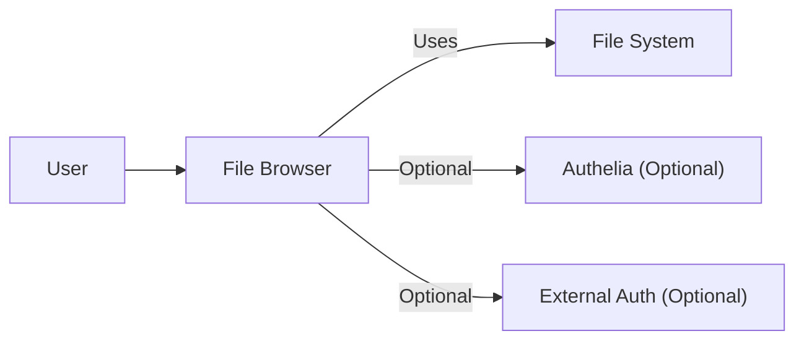
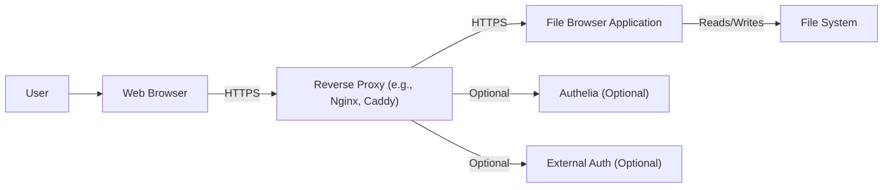
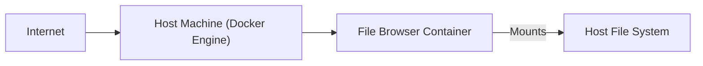
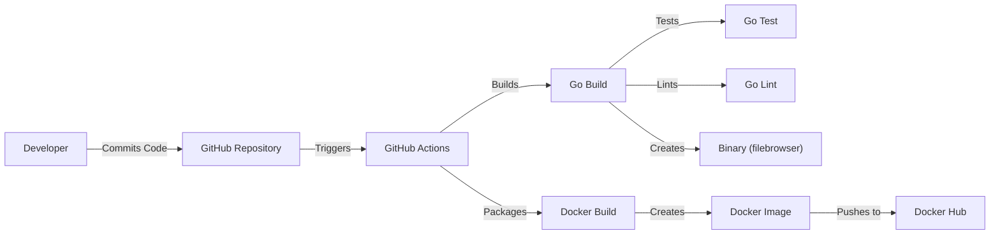

Okay, let's create a design document for the File Browser project.

# BUSINESS POSTURE

File Browser is an open-source project that provides a file management interface within a specified directory. It allows users to perform file operations like creating, deleting, moving, renaming, and editing files through a web browser.

Priorities:

*   Ease of use and deployment: The project should be simple to set up and use across different platforms.
*   Accessibility: Users should be able to access and manage their files from anywhere with a web browser.
*   Maintainability: The codebase should be easy to maintain and extend.
*   Community-driven: Being open-source, the project benefits from community contributions and feedback.

Goals:

*   Provide a user-friendly web interface for file management.
*   Offer a lightweight alternative to traditional file management tools.
*   Enable remote file access and management.

Business Risks:

*   Unauthorized Access: Given its web-based nature, unauthorized access is a significant risk. If compromised, an attacker could gain full control over the files within the designated directory and potentially the host system.
*   Data Breach: Sensitive files stored within the managed directory could be exposed if security measures are inadequate.
*   Data Loss: Accidental or malicious deletion of files through the interface is a potential risk.
*   Abuse of Service: The service could be exploited for malicious purposes, such as hosting illegal content or launching attacks on other systems.
*   Supply Chain Attacks: Compromised dependencies or build processes could introduce vulnerabilities.

# SECURITY POSTURE

Existing Security Controls (based on the GitHub repository and common practices):

*   security control: Authentication: The application supports user authentication with configurable usernames and passwords, and the option to use JSON Web Tokens (JWT). Implemented in the application's authentication middleware.
*   security control: Authorization: Basic authorization is implemented based on user roles and permissions, controlling access to files and operations. Described in documentation and implemented in the application logic.
*   security control: HTTPS Support: The application can be configured to use HTTPS, encrypting communication between the client and server. Described in documentation and configured during deployment.
*   security control: Command-Line Interface (CLI) Configuration: Security-related settings, such as user accounts and access permissions, can be configured through the CLI. Described in documentation.
*   security control: Reverse Proxy Configuration: Documentation suggests running File Browser behind a reverse proxy (like Nginx or Caddy) for enhanced security and performance. Described in documentation.
*   security control: Docker Deployment: Official Docker images are provided, simplifying deployment and potentially improving isolation. Described in documentation and Dockerfile.

Accepted Risks:

*   accepted risk: Limited Audit Logging: While some logging exists, comprehensive audit trails for all file operations might be limited.
*   accepted risk: Default Configuration: The default configuration might not be the most secure, requiring users to actively configure security settings.
*   accepted risk: Dependency Vulnerabilities: As with any software, there's a risk of vulnerabilities in third-party dependencies.

Recommended Security Controls:

*   security control: Enhanced Audit Logging: Implement comprehensive audit logging for all user actions, including file access, modifications, and deletions.
*   security control: Multi-Factor Authentication (MFA): Add support for MFA to enhance account security.
*   security control: Intrusion Detection/Prevention System (IDS/IPS): Recommend deploying an IDS/IPS (e.g., at the reverse proxy level) to monitor and block malicious traffic.
*   security control: Regular Security Audits: Conduct regular security audits and penetration testing to identify and address vulnerabilities.
*   security control: File Integrity Monitoring (FIM): Implement FIM to detect unauthorized changes to critical files and configurations.
*   security control: Content Security Policy (CSP): Implement a strong CSP to mitigate XSS and other code injection attacks.
*   security control: Rate Limiting: Implement rate limiting to prevent brute-force attacks and denial-of-service.

Security Requirements:

*   Authentication:
    *   Strong password policies should be enforced.
    *   Support for secure password storage (e.g., using bcrypt or similar).
    *   Session management should be secure, with proper session timeouts and protection against session hijacking.
    *   Consider supporting external authentication providers (e.g., OAuth 2.0, OpenID Connect).

*   Authorization:
    *   Implement granular access control, allowing administrators to define specific permissions for users and groups.
    *   Follow the principle of least privilege, granting users only the necessary access.

*   Input Validation:
    *   All user inputs (filenames, paths, search queries, etc.) should be strictly validated to prevent injection attacks (e.g., command injection, path traversal).
    *   Use a whitelist approach for allowed characters and patterns whenever possible.

*   Cryptography:
    *   Use strong, industry-standard cryptographic algorithms for all sensitive operations (e.g., password hashing, data encryption).
    *   Ensure proper key management practices.
    *   If handling sensitive data at rest, consider implementing data encryption.

# DESIGN

## C4 CONTEXT



Element Descriptions:

*   Element:
    *   Name: User
    *   Type: Person
    *   Description: A person who interacts with File Browser through a web browser.
    *   Responsibilities: Accessing, managing, uploading, and downloading files.
    *   Security controls: Web browser security settings, strong passwords.

*   Element:
    *   Name: File Browser
    *   Type: Software System
    *   Description: The core application providing the web-based file management interface.
    *   Responsibilities: Handling user authentication, authorization, file operations, and serving the web interface.
    *   Security controls: Authentication, authorization, input validation, HTTPS support.

*   Element:
    *   Name: File System
    *   Type: External System
    *   Description: The underlying file system where the files managed by File Browser are stored.
    *   Responsibilities: Storing and retrieving files.
    *   Security controls: Operating system file permissions, disk encryption (if applicable).

*   Element:
    *   Name: Authelia (Optional)
    *   Type: External System
    *   Description: An open-source authentication and authorization server providing 2FA and SSO.
    *   Responsibilities: Providing advanced authentication and authorization services.
    *   Security controls: Authelia's built-in security features.

*   Element:
    *   Name: External Auth (Optional)
    *   Type: External System
    *   Description: Any external authentication provider (e.g., OAuth 2.0, OpenID Connect).
    *   Responsibilities: Authenticating users.
    *   Security controls: Security features of the external authentication provider.

## C4 CONTAINER



Element Descriptions:

*   Element:
    *   Name: User
    *   Type: Person
    *   Description: A person who interacts with File Browser.
    *   Responsibilities: Accessing, managing, uploading, and downloading files.
    *   Security controls: Web browser security settings, strong passwords.

*   Element:
    *   Name: Web Browser
    *   Type: Container
    *   Description: The user's web browser used to access the File Browser interface.
    *   Responsibilities: Rendering the web interface and communicating with the server.
    *   Security controls: Browser security settings, HTTPS.

*   Element:
    *   Name: Reverse Proxy (e.g., Nginx, Caddy)
    *   Type: Container
    *   Description: A reverse proxy server placed in front of the File Browser application.
    *   Responsibilities: Handling HTTPS termination, load balancing, caching, and potentially providing additional security features (e.g., WAF).
    *   Security controls: HTTPS configuration, WAF (if configured), rate limiting.

*   Element:
    *   Name: File Browser Application
    *   Type: Container
    *   Description: The core File Browser application, written in Go.
    *   Responsibilities: Handling user authentication, authorization, file operations, and serving the web interface.
    *   Security controls: Authentication, authorization, input validation, session management.

*   Element:
    *   Name: File System
    *   Type: External System
    *   Description: The underlying file system.
    *   Responsibilities: Storing and retrieving files.
    *   Security controls: Operating system file permissions, disk encryption (if applicable).

*   Element:
    *   Name: Authelia (Optional)
    *   Type: External System
    *   Description: An open-source authentication and authorization server providing 2FA and SSO.
    *   Responsibilities: Providing advanced authentication and authorization services.
    *   Security controls: Authelia's built-in security features.

*   Element:
    *   Name: External Auth (Optional)
    *   Type: External System
    *   Description: Any external authentication provider (e.g., OAuth 2.0, OpenID Connect).
    *   Responsibilities: Authenticating users.
    *   Security controls: Security features of the external authentication provider.

## DEPLOYMENT

Possible Deployment Solutions:

1.  Docker Container: Using the official Docker image.
2.  Bare Metal: Building from source and running directly on the host operating system.
3.  Cloud Platforms (e.g., AWS, Azure, GCP): Deploying as a container or virtual machine.

Chosen Solution (Docker Container):



Element Descriptions:

*   Element:
    *   Name: Internet
    *   Type: External
    *   Description: The public internet.
    *   Responsibilities: Providing network connectivity.
    *   Security controls: Firewall, IDS/IPS.

*   Element:
    *   Name: Host Machine (Docker Engine)
    *   Type: Node
    *   Description: The physical or virtual machine running the Docker Engine.
    *   Responsibilities: Hosting the Docker container.
    *   Security controls: Operating system security, firewall, Docker security settings.

*   Element:
    *   Name: File Browser Container
    *   Type: Container Instance
    *   Description: The running instance of the File Browser Docker container.
    *   Responsibilities: Running the File Browser application.
    *   Security controls: Container isolation, application-level security controls.

*   Element:
    *   Name: Host File System
    *   Type: External System
    *   Description: A directory on the host machine that is mounted into the container.
    *   Responsibilities: Providing persistent storage for the files managed by File Browser.
    *   Security controls: Operating system file permissions, disk encryption (if applicable).

Deployment Steps (Docker):

1.  Install Docker Engine on the host machine.
2.  Pull the official File Browser Docker image: `docker pull filebrowser/filebrowser`.
3.  Create a directory on the host machine to store the files to be managed.
4.  Run the Docker container, mounting the host directory and configuring necessary ports and environment variables:

    ```bash
    docker run -d \
      -v /path/to/data:/srv \
      -v /path/to/filebrowser.db:/database/filebrowser.db \
      -p 8080:80 \
      --name filebrowser \
      filebrowser/filebrowser
    ```
5. Configure the reverse proxy.

## BUILD

The File Browser project uses Go modules for dependency management and provides a Makefile for building the application.  GitHub Actions are used for CI/CD.


Build Process Description:

1.  Developer commits code to the GitHub repository.
2.  GitHub Actions workflow is triggered.
3.  The workflow checks out the code.
4.  Go Build step compiles the application using `go build`.
5.  Go Test step runs unit tests using `go test`.
6.  Go Lint step performs static analysis using a linter (e.g., `golangci-lint`).
7.  If all checks pass, a binary executable (`filebrowser`) is created.
8.  Docker Build step builds a Docker image using the provided Dockerfile.
9.  The Docker image is tagged and pushed to a container registry (Docker Hub).

Security Controls in Build Process:

*   security control: Dependency Management: Go modules ensure reproducible builds and help manage dependencies.
*   security control: Static Analysis: The Go Lint step helps identify potential code quality and security issues.
*   security control: Testing: Unit tests help ensure code correctness and prevent regressions.
*   security control: GitHub Actions: Provides a secure and automated build environment.
*   security control: Docker: Containerization improves isolation and reduces the attack surface.
*   security control: Signed Commits (Recommended): Developers should sign their commits using GPG keys to ensure code integrity.
*   security control: Software Bill of Materials (SBOM) (Recommended): Generate an SBOM during the build process to track all dependencies and their versions.
*   security control: Container Image Scanning (Recommended): Integrate container image scanning into the CI/CD pipeline to identify vulnerabilities in the Docker image.

# RISK ASSESSMENT

Critical Business Processes:

*   File access and management: Users need to be able to reliably access and manage their files.
*   Remote access: The ability to access files from anywhere is a key feature.
*   Data integrity: Ensuring that files are not corrupted or lost.

Data Sensitivity:

The sensitivity of the data depends entirely on what the user stores within the managed directory. It could range from non-sensitive personal files to highly confidential business documents. Therefore, the system should be designed with the assumption that it *may* handle sensitive data.

# QUESTIONS & ASSUMPTIONS

Questions:

*   What is the expected user base (e.g., individual users, small teams, large organizations)? This impacts the scalability and security requirements.
*   What types of files are expected to be stored (e.g., documents, images, videos, code)? This can influence storage and performance considerations.
*   Are there any specific compliance requirements (e.g., GDPR, HIPAA)?
*   What is the acceptable downtime for the service?
*   What level of logging detail is required for auditing and troubleshooting?
*   Is there a preference for specific authentication providers?
*   What is the budget for security tools and infrastructure?

Assumptions:

*   BUSINESS POSTURE: The primary goal is to provide a user-friendly and convenient file management solution. Security is important, but usability should not be sacrificed unnecessarily.
*   SECURITY POSTURE: The system will be deployed behind a properly configured reverse proxy that handles HTTPS termination. Users are responsible for securing their own credentials.
*   DESIGN: The Docker deployment method will be the primary focus. The underlying file system is assumed to be secure and properly configured. The user has basic knowledge of Docker and networking.