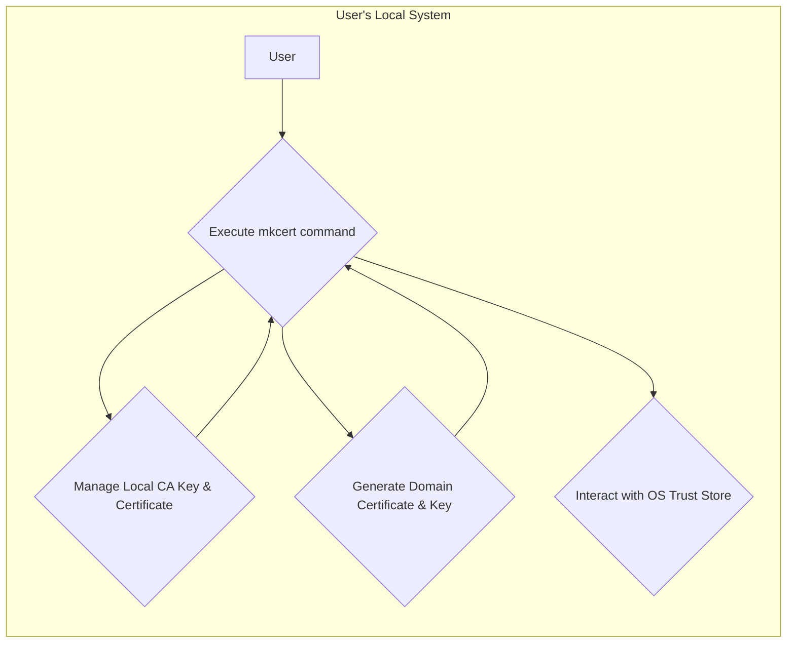
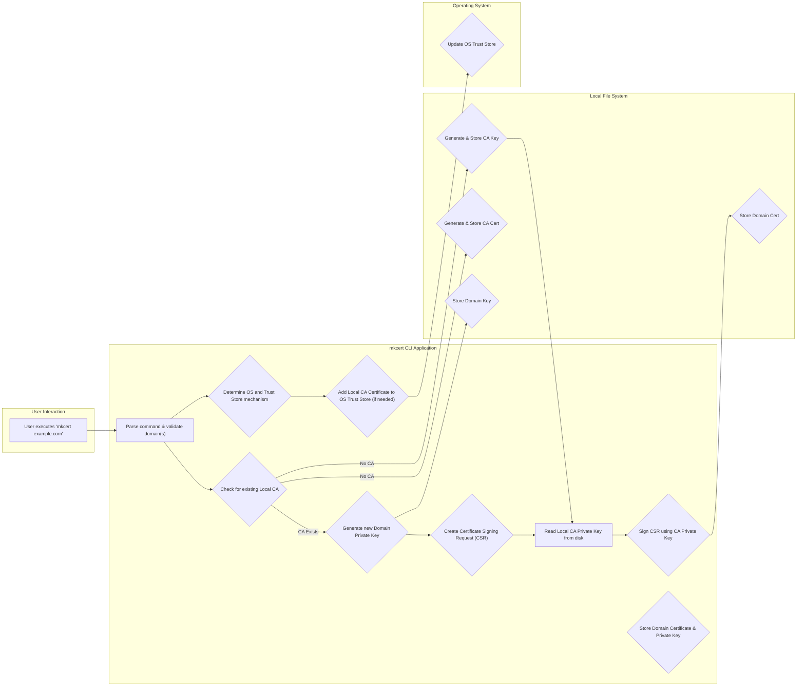

## Project Design Document: mkcert (Improved)

**1. Introduction**

This document provides an enhanced and detailed design overview of the `mkcert` project, a simple zero-configuration tool designed to facilitate the creation of locally trusted development certificates. This document aims to offer a comprehensive understanding of the system's architecture, components, and data flow, serving as a robust foundation for subsequent threat modeling activities. The improvements in this version focus on providing more technical depth and clarity for security analysis.

**2. Goals and Non-Goals**

* **Goals:**
    * Offer a user-friendly command-line interface (CLI) for generating locally trusted TLS certificates with minimal configuration.
    * Automate the creation and management of a local Certificate Authority (CA) specifically for development purposes.
    * Streamline the process of installing the local CA certificate into the operating system's trust store, ensuring browser and application trust.
    * Maintain cross-platform compatibility, supporting major operating systems (macOS, Linux, Windows).
    * Generate certificates that are recognized as valid and trusted by browsers and other applications within the local development environment.
    * Minimize the need for manual configuration and complex setup procedures for users.

* **Non-Goals:**
    * Provide certificates suitable for deployment in production environments or for public-facing services.
    * Offer advanced certificate lifecycle management features such as certificate revocation lists (CRLs) or Online Certificate Status Protocol (OCSP).
    * Function as a general-purpose, publicly trusted Certificate Authority.
    * Develop a graphical user interface (GUI) for the tool.
    * Implement automatic certificate renewal mechanisms.

**3. High-Level Architecture**

**Description:**

The `mkcert` tool operates entirely within the user's local system environment. The user interacts with the `mkcert` command-line interface to initiate certificate generation. Internally, `mkcert` manages a self-signed local Certificate Authority (CA), responsible for signing the development certificates. A critical function of `mkcert` is to programmatically update the operating system's trust store, adding the local CA certificate to the list of trusted root authorities. This ensures that certificates generated by `mkcert` are inherently trusted by applications running on that specific machine.

**4. Detailed Design**

**4.1. Components:**

* **`mkcert` CLI Application:**
    * **Functionality:**  Parses user commands, validates arguments, orchestrates certificate and key generation, and manages trust store interactions. Implemented primarily in Go.
    * **Dependencies:** Relies on standard Go libraries for cryptography (`crypto/tls`, `crypto/x509`), file system operations (`os`, `io/ioutil`), and potentially platform-specific libraries for trust store manipulation.
* **Local Certificate Authority (CA):**
    * **CA Private Key:** An RSA or ECDSA private key used exclusively to sign development certificates. Generated once during the initial `mkcert` execution. Stored securely on the file system.
    * **CA Certificate (Self-Signed):** An X.509 certificate for the local CA, signed by its own private key. This certificate is added to the system's trust store.
* **Generated Certificates:**
    * **Domain Private Key:** An RSA or ECDSA private key generated for each specific domain or hostname.
    * **Domain Certificate (Signed):** An X.509 certificate for a specific domain, signed by the local CA's private key. Includes the domain name(s) in the Subject Alternative Name (SAN) extension.
* **Operating System Trust Store:**
    * **Description:** The system-level repository of trusted root certificates. The mechanism for accessing and modifying this store is operating system-specific (e.g., Keychain Access on macOS, `certutil` on Windows, `update-ca-certificates` on Linux). `mkcert` abstracts these differences.

**4.2. Core Functionalities:**

* **Local CA Creation (Executed on first run or when explicitly requested):**
    * **Check for Existing CA:** `mkcert` first checks for the presence of existing CA key and certificate files in the designated storage location.
    * **Key Generation:** If no CA exists, `mkcert` generates a new private key (typically RSA 4096-bit or ECDSA P-256) using Go's `crypto/rsa` or `crypto/ecdsa` package.
    * **Certificate Generation:** A self-signed X.509 certificate is created. This certificate includes metadata such as the CA's common name (typically "mkcert development CA"), validity period, and basic constraints indicating it's a CA certificate.
    * **Secure Storage:** The CA private key is stored in a PEM-encoded file with restricted file system permissions (e.g., `0600` on Unix-like systems) to prevent unauthorized access. The CA certificate is also stored as a PEM file.
* **Certificate Generation for a Domain:**
    * **User Input:** The user provides one or more domain names or hostnames as arguments to the `mkcert` command.
    * **Domain Key Generation:** A new private key is generated for the specified domain(s), similar to the CA key generation process.
    * **Certificate Signing Request (CSR) Creation:** A CSR is created containing the domain name(s) (added as Subject Alternative Names), the public key of the domain, and other relevant information.
    * **Signing with CA Key:** The `mkcert` CLI reads the local CA's private key from the secure storage. Using Go's `crypto/x509` package, it signs the CSR, creating the final domain certificate. The certificate's issuer is set to the local CA.
    * **Storage of Domain Certificate and Key:** The generated domain certificate and its corresponding private key are stored as PEM-encoded files in the designated directory.
* **Trust Store Integration:**
    * **OS Detection:** `mkcert` detects the user's operating system to determine the appropriate method for updating the trust store.
    * **Platform-Specific Commands:**
        * **macOS:** Uses the `security add-trusted-cert` command.
        * **Linux:** Typically uses `sudo cp <ca.pem> /usr/local/share/ca-certificates/` followed by `sudo update-ca-certificates`. May also interact with browser-specific trust stores (e.g., Firefox).
        * **Windows:** Uses the `certutil -addstore root <ca.pem>` command.
    * **Automation:** `mkcert` automates the execution of these commands, often requiring administrator privileges.
    * **Verification:** After adding the CA certificate, `mkcert` may attempt to verify its presence in the trust store.

**4.3. Data Storage:**

* **Local CA Private Key:** Stored in a file named `rootCA-key.pem` within the `mkcert` configuration directory (typically `~/.mkcert`). File permissions are set to restrict access to the owner.
* **Local CA Certificate:** Stored in a file named `rootCA.pem` within the `mkcert` configuration directory.
* **Generated Domain Private Keys:** Stored in files named `<domain>+<n>-key.pem` (where `<domain>` is the primary domain and `<n>` is an incrementing number for multiple certificates for the same domain) within the `mkcert` configuration directory. File permissions are restricted.
* **Generated Domain Certificates:** Stored in files named `<domain>+<n>.pem` within the `mkcert` configuration directory.

**4.4. Key Generation and Signing Details:**

* **Cryptographic Libraries:** Leverages Go's standard `crypto/*` packages for all cryptographic operations.
* **Key Pair Generation:** Uses `rsa.GenerateKey` or `ecdsa.GenerateKey` with appropriate key sizes (e.g., 4096-bit RSA or P-256 ECDSA).
* **Certificate Signing Algorithm:** Typically uses SHA256 or SHA384 with RSA or ECDSA.
* **Certificate Validity:** Generated certificates typically have a validity period of a few years, suitable for development purposes.
* **Subject and SAN:** Certificates include the requested domain names in the Subject Alternative Name (SAN) extension, allowing the certificate to be valid for multiple hostnames.

**5. Data Flow (Detailed)**

**Description:**

1. The user initiates the process by executing the `mkcert` command with the target domain name(s).
2. The `mkcert` CLI parses the command and validates the provided domain names.
3. It checks for the existence of the local Certificate Authority's key and certificate files. If they don't exist, `mkcert` generates them and stores them securely on the file system.
4. A new private key is generated specifically for the requested domain.
5. A Certificate Signing Request (CSR) is created, containing the domain's public key and the domain name(s).
6. The `mkcert` CLI reads the local CA's private key from the protected file on disk.
7. Using the CA's private key, the CSR is signed, resulting in the signed domain certificate.
8. The generated domain certificate and its corresponding private key are stored as separate files on the local file system.
9. `mkcert` determines the user's operating system to select the appropriate method for interacting with the trust store.
10. If the local CA certificate is not already present in the operating system's trust store, `mkcert` executes the necessary commands to add it.

**6. Security Considerations (Detailed for Threat Modeling)**

This section provides a more detailed breakdown of potential security considerations relevant for threat modeling.

* **Local CA Private Key Security:**
    * **Threat:** Compromise of the CA private key would allow an attacker to forge trusted certificates for any domain, potentially leading to man-in-the-middle attacks or other security breaches.
    * **Mitigation:**  Strict file system permissions (e.g., `0600`) are crucial. Consider the risk of backup solutions inadvertently making the key accessible. Explore options for encrypting the key at rest with a passphrase, though this adds complexity for automation.
* **Trust Store Manipulation Vulnerabilities:**
    * **Threat:**  Malicious actors could attempt to inject their own CA certificates into the system trust store if the `mkcert` trust store update process has vulnerabilities.
    * **Mitigation:** Ensure the platform-specific commands used by `mkcert` are executed securely and with appropriate privileges. Be aware of potential vulnerabilities in the underlying OS trust store management tools.
* **Path Traversal:**
    * **Threat:** If file paths for storing keys and certificates are not handled carefully, an attacker might be able to write or overwrite files outside the intended `mkcert` directory.
    * **Mitigation:**  Use secure file path manipulation techniques and avoid constructing paths from user-supplied input.
* **Dependency Vulnerabilities:**
    * **Threat:**  Vulnerabilities in the Go standard library or any third-party libraries used by `mkcert` could be exploited.
    * **Mitigation:** Regularly update dependencies and perform security audits or use vulnerability scanning tools.
* **Accidental Production Use:**
    * **Threat:** Developers might mistakenly use certificates generated by `mkcert` in production environments, where they would not be trusted by external users.
    * **Mitigation:** Clearly document that `mkcert` is for development purposes only. Consider adding warnings or metadata to the generated certificates to discourage production use.
* **Information Disclosure:**
    * **Threat:**  Error messages or logging could inadvertently reveal sensitive information, such as file paths or cryptographic details.
    * **Mitigation:**  Carefully review logging and error handling to avoid exposing sensitive data.
* **Race Conditions:**
    * **Threat:**  Potential race conditions could occur during file creation or trust store updates, leading to inconsistent state or security vulnerabilities.
    * **Mitigation:**  Use appropriate locking mechanisms when dealing with shared resources like the file system or trust store.
* **Side-Channel Attacks:**
    * **Threat:** While less likely for a tool like `mkcert`, consider potential side-channel attacks if sensitive cryptographic operations are performed in a predictable manner.
    * **Mitigation:**  Use well-vetted cryptographic libraries and follow best practices for secure coding.

**7. Deployment Considerations**

* **Installation Methods:**
    * **Pre-compiled Binaries:**  The primary method of deployment is downloading pre-compiled binaries for different operating systems from the GitHub releases page.
    * **Package Managers:**  `mkcert` is available through some package managers (e.g., `brew` on macOS, `apt` on Debian/Ubuntu, `choco` on Windows).
    * **Building from Source:** Users can also build `mkcert` from source using the Go toolchain.
* **Prerequisites:**  Typically, no special prerequisites are required beyond having the necessary permissions to write to the file system and update the system trust store (often requiring administrator privileges).
* **Configuration:** `mkcert` is designed to be zero-configuration. The default storage location for CA and certificate files is typically within the user's home directory (`~/.mkcert`).

**8. Future Considerations**

* **Limited Certificate Revocation:** Explore options for providing a simple mechanism to remove generated certificates and potentially untrust the local CA, even if full CRL/OCSP support is not implemented.
* **Customizable Certificate Validity:** Allow users to configure the validity period of generated certificates.
* **Key Type Selection:**  Provide options for users to choose between RSA and ECDSA key pairs.
* **API or Library Interface:** Consider offering a programmatic API or library interface for more advanced use cases or integration with other tools.
* **Improved Error Handling and Reporting:** Provide more informative error messages to help users troubleshoot issues.
* **Automated Trust Store Management:**  Potentially monitor the system trust store and automatically re-add the CA certificate if it's removed by other software.

This improved design document provides a more detailed and technically focused overview of the `mkcert` project, specifically tailored to facilitate comprehensive threat modeling. The enhanced descriptions of components, data flow, and security considerations offer a deeper understanding of the system's inner workings and potential vulnerabilities.
