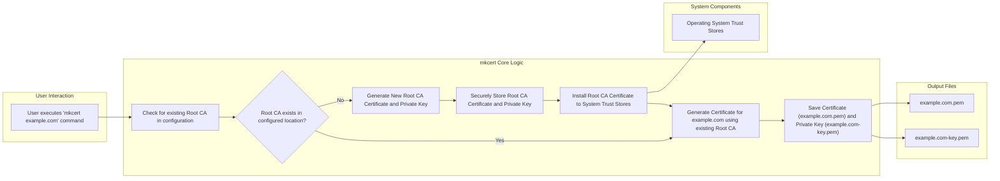

# Project Design Document: mkcert

**Version:** 1.1
**Date:** October 26, 2023
**Author:** Gemini (AI Language Model)

## 1. Introduction

This document provides an enhanced and more detailed design overview of the `mkcert` project, a simple zero-config tool designed to facilitate locally trusted development certificates. This document aims to provide a robust foundation for understanding the system's architecture, components, and data flow, which is crucial for subsequent threat modeling and security analysis. Improvements in this version focus on providing greater clarity and detail in key areas.

## 2. Project Overview

`mkcert` elegantly solves the persistent challenge developers encounter when working with HTTPS in local environments: browser-issued security warnings stemming from self-signed certificates. It streamlines the generation and installation of locally trusted certificates by establishing a local Certificate Authority (CA) and leveraging it to sign certificates specifically for development purposes. This automation eliminates the cumbersome manual processes traditionally involved in certificate creation and trust store manipulation.

## 3. Goals and Objectives

* **Effortless Local HTTPS Development:**  To empower developers to seamlessly utilize HTTPS within their local development setups, thereby eliminating disruptive browser security warnings.
* **Truly Zero Configuration:** To minimize the need for user configuration. The tool should operate intuitively and effectively upon installation.
* **Broad Cross-Platform Support:** To ensure compatibility across major operating systems, including macOS, Linux, and Windows.
* **Cryptographically Sound Certificate Generation:** To generate certificates that adhere to robust cryptographic standards.
* **Automated Trust Store Integration:** To handle the often complex process of adding the generated CA certificate to the operating system's trust stores automatically.

## 4. Target Audience

The primary beneficiaries of `mkcert` are software developers who require the use of HTTPS in their local development workflows for testing, debugging, and general development activities.

## 5. System Architecture

The fundamental architecture of `mkcert` centers around the creation and management of a local Certificate Authority (CA) and the subsequent signing of development certificates using this CA.

**Key Architectural Elements:**

* **Command Line Interface (CLI):** Serves as the primary point of interaction for users, enabling them to issue commands for generating certificates for specific domains.
* **Root CA Management Subsystem:**  Responsible for the generation, secure storage, and overall lifecycle management of the locally trusted Root CA certificate and its associated private key.
* **Certificate Generation Engine:** Employs cryptographic libraries to produce X.509 certificates that are cryptographically signed by the local Root CA.
* **Trust Store Integration Module:** Automates the process of adding the generated Root CA certificate to the appropriate trust stores managed by the underlying operating system.
* **Configuration Management Module:** Handles the storage and retrieval of configuration parameters, including the designated location for the Root CA certificate and private key.

## 6. Key Components in Detail

* **CLI (`mkcert` executable):**
    * Accepts one or more domain names as command-line arguments.
    * Parses user input and orchestrates the invocation of relevant internal functions within `mkcert`.
    * Provides user feedback through informative messages, including success and error notifications.
    * May support various command-line options to customize behavior (e.g., specifying output directories).

* **Root CA Management Subsystem:**
    * **Root CA Generation:** Utilizes cryptographic libraries, likely from the Go standard library (`crypto/tls`, `crypto/x509`, and related packages), to generate a self-signed Root CA certificate adhering to industry best practices and a corresponding strong private key.
    * **Root CA Storage:**  Securely persists the generated Root CA certificate and its private key on the user's file system. The default storage location is typically within a dedicated directory in the user's home directory (e.g., `~/.mkcert` on Unix-like systems). Crucially, the private key file is created with highly restrictive file system permissions (e.g., read/write only for the owner).
    * **Root CA Existence Check:**  Determines whether a Root CA has already been generated by checking for the presence of the Root CA certificate and key files in the configured storage location.

* **Certificate Generation Engine:**
    * **Internal Certificate Signing Request (CSR) Generation:**  `mkcert` internally constructs a Certificate Signing Request (CSR) for the specified domain name(s). This CSR contains information about the requested certificate, including the subject name (domain).
    * **Certificate Signing Operation:** Employs the private key of the Root CA to digitally sign the generated CSR, thereby creating the final, trusted certificate.
    * **Certificate and Key Output:**  Saves the newly generated certificate (typically in PEM format) and its corresponding private key to separate files within the user's current working directory by default (e.g., `example.com.pem`, `example.com-key.pem`). The private key for the generated certificate also has restricted file permissions.

* **Trust Store Integration Module:**
    * **Operating System Detection:**  Identifies the underlying operating system (macOS, Windows, Linux distributions) to determine the appropriate methods for interacting with its trust stores.
    * **Trust Store Modification Procedures:** Executes platform-specific commands or utilizes operating system APIs to add the Root CA certificate to the system's trusted certificate authorities. This process typically involves:
        * **macOS:**  Leveraging the `security` command-line tool to import the Root CA certificate into the system's Keychain.
        * **Windows:** Utilizing the `certutil` command-line utility to import the certificate into the Windows Certificate Store.
        * **Linux:** Updating the system's certificate authority database using tools such as `update-ca-certificates` (on Debian/Ubuntu-based systems) or similar utilities on other distributions.
    * **Error Handling:** Includes mechanisms to handle potential errors during trust store modification, such as insufficient permissions or incorrect command usage.

* **Configuration Management Module:**
    * **Configuration Storage:** Persists configuration settings, such as the file paths to the Root CA certificate and private key, in a configuration file. This file is typically located within the `~/.mkcert` directory (or a platform-specific equivalent). The format of this file might be a simple text-based format or a more structured format like JSON.
    * **Configuration Retrieval:** Loads configuration data at runtime when `mkcert` is executed, allowing the application to locate the Root CA and other necessary settings.

## 7. Data Flow

1. **User Initiates Certificate Generation:** The user executes the `mkcert` command in their terminal, providing one or more domain names as arguments (e.g., `mkcert example.com localhost dev.local`).
2. **Root CA Presence Check:** `mkcert` consults its configuration to determine the location of the Root CA certificate and key. It then checks if these files exist.
3. **Root CA Generation (Conditional):** If a Root CA does not exist:
    * A new Root CA certificate and a corresponding private key are generated using cryptographic libraries.
    * The newly generated Root CA certificate is added to the operating system's trusted certificate stores using platform-specific commands or APIs.
    * The Root CA certificate and private key are securely saved to the configured storage location with appropriate file permissions.
4. **Certificate Generation for Requested Domains:** For each domain name provided by the user:
    * A Certificate Signing Request (CSR) is internally created, containing information specific to the domain.
    * The CSR is signed using the private key of the locally managed Root CA.
    * The resulting signed certificate (in `.pem` format) and its corresponding private key (also in `.pem` format) are saved to the file system, typically in the current working directory.
5. **User Feedback:**  `mkcert` provides feedback to the user, typically indicating the successful generation of the certificates and their file locations.

## 8. Security Considerations

* **Criticality of Root CA Private Key Security:** The security posture of `mkcert` hinges on the confidentiality and integrity of the Root CA's private key. Compromise of this key would allow an attacker to forge trusted certificates for any domain, posing a significant security risk.
    * **Secure Local Storage:** The private key must be stored with strict file system permissions (e.g., `0600` on Unix-like systems), granting read and write access only to the user who generated it.
    * **Prevention of Network Exposure:** The Root CA private key should never be transmitted over a network or stored in easily accessible locations.
* **Risks Associated with Trust Store Modifications:** Adding a certificate to the system's trust store inherently grants significant trust to any certificates signed by that CA. Malicious actors could potentially exploit `mkcert` (or trick users) into installing rogue CA certificates, enabling man-in-the-middle attacks.
    * **User Awareness and Responsibility:** Users must understand the implications of trusting a local CA and exercise caution when running `mkcert` or similar tools.
    * **Limited Scope of Trust:** The trust established by `mkcert` is generally intended for local development environments and should not be extended to production systems.
* **Dependency Vulnerabilities:** `mkcert` relies on external libraries, particularly for cryptographic operations and interactions with the operating system. Security vulnerabilities in these dependencies could introduce risks.
    * **Regular Dependency Updates:** Maintaining up-to-date dependencies is crucial for mitigating known vulnerabilities.
    * **Dependency Auditing and Management:** Employing tools and practices for regularly auditing dependencies for security flaws.
* **Secure Coding Practices within `mkcert`:** The source code of `mkcert` itself must adhere to secure coding principles to prevent common software vulnerabilities such as buffer overflows, injection flaws, and improper error handling.
* **Permissions of Generated Certificates and Keys:** The private keys for the generated development certificates should also be stored with restrictive file permissions to prevent unauthorized access.
* **Potential for Accidental Production Use:** Although designed for development, there's a risk that users might inadvertently use certificates generated by `mkcert` in production environments, which is strongly discouraged due to the local nature of the trust. Clear warnings and documentation are necessary.
* **Supply Chain Security:**  Consider the security of the distribution mechanism for `mkcert`. Compromised binaries could lead to widespread installation of malicious software. Using official distribution channels and verifying signatures can mitigate this.

## 9. Deployment Considerations

`mkcert` is typically deployed as a standalone executable, simplifying installation and usage.

* **Common Installation Methods:**
    * Downloading pre-compiled binaries for the target operating system from the official project releases on platforms like GitHub.
    * Utilizing package managers specific to each operating system (e.g., `brew` on macOS, `apt` or `snap` on Linux distributions, `choco` on Windows).
    * Building the executable directly from the source code using the Go toolchain (`go install`).
* **Intended Execution Environment:** `mkcert` is primarily designed to be executed on individual developer workstations or within local development environments.

## 10. Future Considerations

* **Certificate Revocation Mechanisms:** Implementing a way to revoke locally generated certificates if they are compromised or no longer needed.
* **Graphical User Interface (GUI):**  Exploring the possibility of offering a GUI as an alternative interface for users who prefer a visual approach.
* **Integration with Development Tools and IDEs:**  Developing integrations with popular development tools, IDEs, and local development platforms (like Docker) to streamline certificate management.
* **Customizable Certificate Expiration:** Providing options for users to configure the expiration duration of the generated development certificates.
* **Support for More Trust Stores:** Expanding support to include trust stores used by specific applications or browsers beyond the system-level trust store.

This revised design document provides a more in-depth and refined understanding of the `mkcert` project. The added details, particularly in the security considerations, will be beneficial for conducting a comprehensive threat model and identifying potential areas for security enhancements.