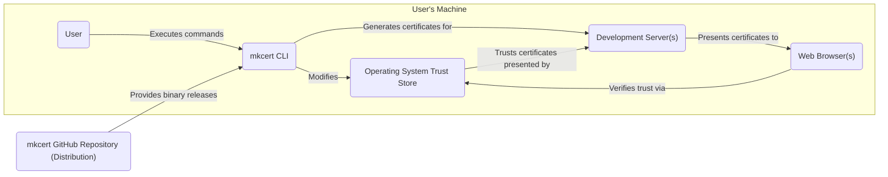
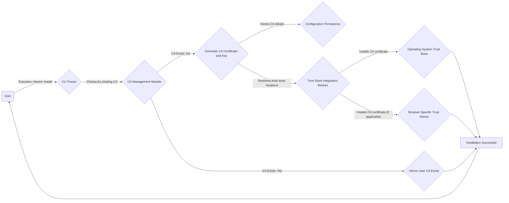
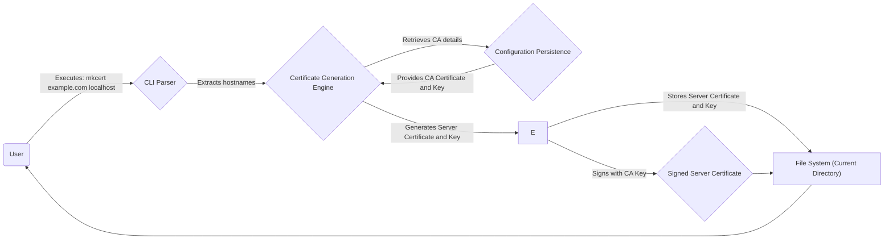

# Project Design Document: mkcert

**Version:** 1.1
**Date:** October 26, 2023
**Author:** AI Software Architect

## 1. Introduction

This document provides an enhanced and detailed design overview of the `mkcert` project, a simple zero-config tool designed to facilitate the creation of locally trusted TLS certificates for development environments. This document serves as a foundational artifact for subsequent threat modeling activities, providing a comprehensive understanding of the system's architecture, data flows, and key components.

## 2. Goals and Non-Goals

### 2.1. Goals

*   To offer a user-friendly and efficient method for developers to generate locally trusted TLS certificates, eliminating browser security warnings during development.
*   To automate the complete lifecycle of a local Certificate Authority (CA) for development purposes, including creation and installation into the system's trust store.
*   To provide broad compatibility across major operating systems (macOS, Linux, Windows) and popular web browsers (Chrome, Firefox, Safari, Edge).
*   To minimize the need for manual configuration, allowing developers to quickly generate certificates with minimal effort.
*   To ensure that generated certificates are valid for common development scenarios, including `localhost`, specific IP addresses (e.g., `127.0.0.1`), and custom domain names used in local development.
*   To provide clear and concise command-line feedback to the user regarding the status of certificate generation and installation.

### 2.2. Non-Goals

*   To generate certificates suitable for production environments or publicly accessible services. The generated CA should *not* be used for signing production certificates.
*   To offer advanced certificate management functionalities such as certificate revocation lists (CRLs), Online Certificate Status Protocol (OCSP), or complex renewal policies beyond the default validity period.
*   To support the processing of arbitrary Certificate Signing Requests (CSRs) from external entities. `mkcert` manages its own CA and signing process.
*   To function as a comprehensive Certificate Authority solution for organizational use or large-scale deployments. Its scope is limited to individual developer environments.
*   To provide a graphical user interface (GUI) for interacting with the tool. The primary interface is the command-line.

## 3. System Architecture

### 3.1. High-Level Architecture

*   **User:** The software developer who interacts with the `mkcert` tool via the command-line interface.
*   **mkcert CLI:** The executable binary of the `mkcert` application, responsible for all core functionalities.
*   **Operating System Trust Store:** The system-level repository where trusted Certificate Authority certificates are stored. This is managed by the operating system.
*   **Web Browser(s):** Web browsers installed on the user's machine that rely on the OS trust store to validate the authenticity of TLS certificates.
*   **Development Server(s):** Local web servers or applications where the generated TLS certificates are deployed for development and testing.
*   **mkcert GitHub Repository (Distribution):** The official source for downloading pre-compiled binaries and the source code of `mkcert`.

### 3.2. Detailed Component Architecture

The `mkcert` tool is composed of several interconnected modules:

*   **Command-Line Interface (CLI) Parser:**
    *   Responsible for parsing commands and arguments provided by the user through the command line (e.g., `mkcert example.com`).
    *   Validates user input and provides feedback on incorrect usage.
    *   Triggers the appropriate underlying modules based on the parsed commands.
*   **Certificate Authority (CA) Management Module:**
    *   Handles the generation of the root CA certificate and its corresponding private key.
    *   Determines the storage location for the CA certificate and key based on the operating system.
    *   Includes logic to check if a CA already exists and to avoid redundant generation.
*   **Certificate Generation Engine:**
    *   Generates server certificates and private keys based on the hostnames or domains provided by the user.
    *   Utilizes the stored CA private key to sign the newly generated server certificates.
    *   Allows specifying multiple Subject Alternative Names (SANs) for a single certificate.
*   **Trust Store Integration Module:**
    *   Contains platform-specific logic to interact with the operating system's trust store and browser-specific trust stores (where applicable).
    *   Executes commands or uses APIs to install the generated CA certificate into the relevant trust stores.
    *   Handles potential permission issues and prompts the user for necessary credentials if required.
*   **Configuration Persistence:**
    *   Stores the location of the generated CA certificate and private key to ensure persistence across multiple invocations of `mkcert`.
    *   May store other configuration settings, although the tool is designed to be largely zero-configuration.
*   **Error Handling and Logging Subsystem:**
    *   Manages errors that occur during the execution of `mkcert`.
    *   Provides informative error messages to the user, aiding in troubleshooting.
    *   May include optional logging capabilities for more detailed debugging information.

## 4. Data Flow

### 4.1. Initial CA Setup ("mkcert -install")

1. **User initiates installation:** The user executes the command `mkcert -install`.
2. **CLI Parsing:** The CLI parser interprets the command and directs the flow to the CA management module.
3. **Check for Existing CA:** The CA management module checks if a local CA certificate and key pair already exist based on the stored configuration.
4. **Generate CA (if needed):** If no CA exists, the module generates a new self-signed CA certificate and a corresponding private key.
5. **Store CA Details:** The location of the generated CA certificate and key is stored persistently.
6. **Identify Trust Stores:** The trust store integration module identifies the relevant system and browser-specific trust stores on the user's operating system.
7. **Install CA in Trust Stores:** The CA certificate is installed into the identified trust stores, making it trusted by the system and browsers.
8. **Inform User:** The user is informed about the successful installation or that a CA already exists.

### 4.2. Certificate Generation ("mkcert example.com localhost")

1. **User requests certificate:** The user executes the command `mkcert example.com localhost` (or similar).
2. **CLI Parsing:** The CLI parser extracts the requested hostnames or domains.
3. **Certificate Generation:** The certificate generation engine is invoked with the hostnames.
4. **Retrieve CA Details:** The engine retrieves the location of the CA certificate and private key from the configuration persistence.
5. **Generate Server Certificate:** A new server certificate and private key are generated for the specified hostnames.
6. **Sign with CA Key:** The newly generated server certificate is signed using the CA's private key, establishing its trust.
7. **Store Server Certificate:** The generated server certificate and private key are stored in the user's file system, typically in the current working directory.

## 5. Security Considerations (Detailed)

This section expands on the initial security considerations, providing a more in-depth analysis of potential risks and mitigations.

*   **CA Private Key Security:** The compromise of the CA private key is the most significant security risk.
    *   **Storage Location:** The key is typically stored in a platform-specific, protected location (e.g., the user's home directory with restricted permissions).
    *   **Permissions:** `mkcert` aims to set restrictive file system permissions on the CA key file to prevent unauthorized access.
    *   **Mitigation:** Users should be aware of the importance of protecting their home directory and system from malware.
*   **Trust Store Manipulation Vulnerabilities:** Incorrect handling of trust store modifications could lead to security issues.
    *   **Privilege Escalation:** If `mkcert` requires elevated privileges to modify the trust store, vulnerabilities in this process could be exploited.
    *   **Malicious Certificate Injection:** A compromised `mkcert` binary or a vulnerability in the trust store integration could allow an attacker to install malicious CA certificates.
    *   **Mitigation:** `mkcert` relies on well-established operating system mechanisms for trust store management. Users should ensure their operating system is up-to-date with security patches.
*   **Certificate Validity Period:** While for development, excessively long validity periods could lead to accidental use in non-development scenarios.
    *   **Default Validity:** `mkcert` uses a reasonable default validity period (typically around 2 years).
    *   **Mitigation:** Users should be aware of the validity period of their generated certificates.
*   **Integrity of the `mkcert` Binary:** Users must ensure they are using a legitimate and untampered version of `mkcert`.
    *   **Distribution Channels:** Downloading from the official GitHub releases page or trusted package managers is crucial.
    *   **Verification:** Users can verify the integrity of the downloaded binary using checksums or digital signatures.
*   **Dependency Vulnerabilities:** If `mkcert` relies on external libraries, vulnerabilities in those dependencies could affect `mkcert`.
    *   **Dependency Management:** The `mkcert` development team should practice good dependency management and regularly update dependencies.
*   **User Permissions and Awareness:** Users need to understand the implications of installing a local CA in their trust store.
    *   **Informed Consent:** The installation process typically requires user confirmation or administrator privileges.
    *   **Documentation:** Clear documentation about the purpose and risks of `mkcert` is essential.
*   **Code Injection Vulnerabilities:** As a command-line tool, `mkcert` needs to be robust against potential code injection vulnerabilities if it processes user-provided input in a way that could be exploited.
    *   **Input Sanitization:**  Careful handling and sanitization of user input (hostnames, commands) are necessary.

## 6. Deployment

`mkcert` is designed for straightforward deployment as a command-line utility.

*   **Installation via Pre-compiled Binaries:**
    *   Users can download pre-compiled binaries for their respective operating systems from the official GitHub releases page.
    *   This is the most common and recommended method for most users.
*   **Installation via Package Managers:**
    *   `mkcert` is available through various package managers (e.g., `brew` on macOS, `apt` on Debian/Ubuntu, `choco` on Windows).
    *   This provides a convenient way to install and manage updates.
*   **Compilation from Source:**
    *   Developers can compile `mkcert` from its source code, providing more control over the build process.
    *   Requires Go development tools to be installed.
*   **Execution:** Once installed, users can execute the `mkcert` command from their terminal or command prompt. The binary needs to be in the system's PATH or the full path to the executable must be used.

## 7. Future Considerations

*   **Limited Certificate Revocation:** Exploring mechanisms for users to easily "untrust" or remove locally generated certificates, although full CRL/OCSP support is not a goal.
*   **Customizable Certificate Validity:** Providing options for users to specify the validity period of generated certificates.
*   **Enhanced Error Reporting and Diagnostics:** Improving the clarity and detail of error messages to assist users in resolving issues.
*   **Improved Cross-Platform Consistency:** Continuously working to ensure consistent behavior and trust store interaction across different operating systems and browser versions, addressing any platform-specific quirks.
*   **Consideration for Containerized Environments:**  Exploring how `mkcert` can be seamlessly integrated into containerized development workflows.
*   **Automated Trust Store Cleanup:** Potentially providing a command to easily remove the `mkcert` CA certificate from the system's trust store.

This improved design document provides a more comprehensive and detailed understanding of the `mkcert` project. It serves as a robust foundation for identifying and analyzing potential security threats during the threat modeling process.