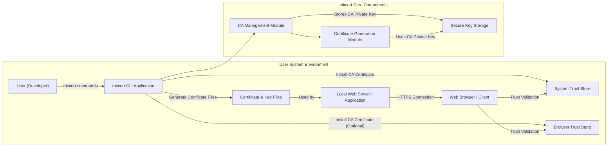
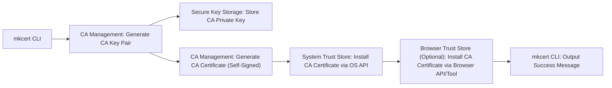
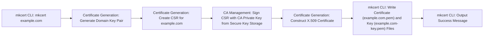

# Project Design Document: mkcert - Zero-Config Local TLS Development

**Version:** 1.1
**Date:** October 26, 2023
**Author:** Gemini (AI Expert in Software, Cloud, and Cybersecurity Architecture)

## 1. Project Overview

### 1.1. Project Name

mkcert

### 1.2. Project Goal

`mkcert` simplifies local TLS certificate generation for development. It automates the creation and installation of a locally trusted Certificate Authority (CA) within the system trust store. Subsequently, it enables the generation of TLS certificates, signed by this local CA, for development domains. This streamlined process allows developers to use HTTPS in local development environments, eliminating browser security warnings and mirroring production-like security configurations.

### 1.3. Target Audience

* Software Developers requiring HTTPS for local development.
* Web Developers testing secure web applications locally.
* System Administrators setting up secure local development environments for teams.
* DevOps Engineers automating local development environment provisioning.

### 1.4. Key Features

* **Automated Local CA Management:**  Generates a unique local CA, including key pair and self-signed certificate, and securely installs the CA certificate into the operating system's trust store.
* **Zero-Configuration Operation:** Designed for ease of use with sensible defaults, minimizing the need for manual configuration.
* **Single-Command Certificate Generation:**  Generates domain-specific TLS certificates and private keys with a simple command-line interface, supporting multiple domains and wildcard domains.
* **Cross-Platform Support:** Operates seamlessly across macOS, Linux, and Windows operating systems, ensuring broad accessibility.
* **Browser and Tool Trust Integration:**  Installed CA is recognized by major web browsers and other applications that rely on the system's trusted certificate store, ensuring seamless HTTPS development.
* **Implicit Certificate Revocation (via CA Removal):**  While not explicit CRL/OCSP, removing the local CA effectively revokes trust in all certificates issued by it, providing a straightforward revocation mechanism for development contexts.
* **Open Source and Community-Driven:**  Developed as an open-source project under the BSD 3-Clause License, fostering community contributions and transparency.

## 2. System Architecture

### 2.1. High-Level Architecture Diagram

### 2.2. Component Description

* **"User (Developer)"**: The individual who interacts with `mkcert` via the command-line interface to manage CAs and generate certificates.
* **"mkcert CLI Application"**: The command-line executable written in Go. It serves as the user interface, parsing commands, orchestrating core modules, and interacting with the operating system and file system.
* **"CA Management Module"**:  A core logic component responsible for the lifecycle of the local Certificate Authority. Its functions include:
    * **CA Key Pair Generation:** Generating a cryptographically secure private and public key pair for the CA.
    * **CA Certificate Creation:** Creating a self-signed X.509 certificate for the CA, embedding the CA's public key and relevant metadata.
    * **CA Installation/Uninstallation:** Interacting with the operating system's APIs to install and uninstall the CA certificate from the system trust store and optionally browser-specific trust stores.
* **"Certificate Generation Module"**:  A core logic component responsible for generating domain-specific TLS certificates. Its functions include:
    * **Domain Key Pair Generation:** Generating a private and public key pair for each requested domain.
    * **Certificate Signing Request (CSR) Creation (Implicit):**  Internally constructs a CSR containing the domain's public key and domain name(s).
    * **CSR Signing:**  Signs the CSR using the CA's private key (managed by the "CA Management Module") to create the domain certificate.
    * **Certificate and Key File Output:**  Writes the generated domain certificate and private key to PEM-encoded files on the file system.
* **"System Trust Store"**: The operating system's central repository for trusted CA certificates. `mkcert` adds its local CA certificate to this store, making it trusted by the entire system and applications that rely on it.
* **"Browser Trust Store"**:  Some browsers (like Firefox) maintain their own separate trust stores. `mkcert` optionally targets these stores to ensure broader browser compatibility for locally developed HTTPS websites.
* **"Certificate & Key Files"**: The output of `mkcert`'s certificate generation process. These PEM-encoded files (`domain.pem` for the certificate and `domain-key.pem` for the private key) are used to configure local web servers and applications for HTTPS.
* **"Secure Key Storage"**:  The location where the CA's private key is stored.  The security of this storage is critical.  Typically, this is a file system location with restricted permissions, but the exact location and security mechanisms are OS-dependent and crucial for security analysis.
* **"Local Web Server / Application"**:  The software being developed that utilizes the generated certificates and keys to enable HTTPS.
* **"Web Browser / Client"**:  The application used to access the locally developed HTTPS website, validating the certificate against the system and browser trust stores.

## 3. Data Flow

### 3.1. CA Creation and Installation Data Flow

**Description:**

1. User executes `mkcert -install` command.
2. `mkcert CLI` invokes the "CA Management Module" to generate a new cryptographic key pair (private and public) for the local CA.
3. The CA's private key is securely stored in "Secure Key Storage" on the local file system.
4. "CA Management Module" generates a self-signed X.509 certificate for the CA, using the generated key pair and embedding CA-specific information.
5. The CA certificate is installed into the "System Trust Store" by interacting with operating system-specific APIs (e.g., Keychain on macOS, `certutil` on Windows, `update-ca-certificates` on Linux).
6. Optionally, the CA certificate is installed into "Browser Trust Stores" using browser-specific APIs or tools (if available and implemented).
7. `mkcert CLI` outputs a success message to the user, indicating successful CA installation.

### 3.2. Certificate Generation Data Flow

**Description:**

1. User executes `mkcert example.com` command (or similar command with domain names).
2. `mkcert CLI` invokes the "Certificate Generation Module".
3. "Certificate Generation Module" generates a new cryptographic key pair (private and public) specifically for the requested domain (`example.com`).
4. "Certificate Generation Module" creates a Certificate Signing Request (CSR) containing the domain's public key and the domain name `example.com`.
5. "CA Management Module" retrieves the CA's private key from "Secure Key Storage" and uses it to digitally sign the CSR.
6. "Certificate Generation Module" constructs the final X.509 certificate from the signed CSR, incorporating the signature from the CA.
7. `mkcert CLI` writes the generated domain certificate to `example.com.pem` and the domain private key to `example.com-key.pem` files in the current directory (or specified output path).
8. `mkcert CLI` outputs a success message to the user, indicating successful certificate generation.

## 4. Technology Stack

* **Core Language:** Go (Golang) - chosen for its performance, concurrency, and cross-platform capabilities.
* **Cryptography:** Go Standard Library `crypto` packages - leveraging robust and well-vetted cryptographic implementations within the Go standard library (e.g., `crypto/x509`, `crypto/rsa`, `crypto/ecdsa`, `crypto/rand`).
* **Operating System API Interaction:** Platform-specific Go packages and system calls for interacting with:
    * **macOS:** Keychain Services API for trust store management.
    * **Linux:**  System trust store update utilities (e.g., `update-ca-certificates`, `trust`).
    * **Windows:**  Certificate Store APIs (`certutil`).
* **Certificate and Key Encoding:** PEM (Privacy Enhanced Mail) format for storing certificates and private keys in text-based files. X.509 standard for certificate structure.
* **Command-Line Interface:** Go's `flag` package or similar for command-line argument parsing.

## 5. Security Considerations (For Threat Modeling)

This section details security considerations relevant for threat modeling, categorized for clarity.

* **5.1. CA Private Key Security - Critical Asset:**
    * **Storage Location Vulnerability:** The CA private key is the most sensitive asset. Default storage locations (OS-dependent, e.g., user's config directory) might be vulnerable to unauthorized access if user account is compromised or due to weak file system permissions. **Threat:** Unauthorized access, theft, or deletion of the CA private key.
    * **Access Control Weakness:**  Permissions on the CA private key file might be overly permissive, allowing other processes or users on the system to read or modify it. **Threat:** Unauthorized access and potential misuse of the CA private key by malicious software or other user accounts.
    * **Backup and Recovery Risks:** Lack of secure backup and recovery mechanisms for the CA private key could lead to data loss and inability to issue new certificates if the key is corrupted or lost. Conversely, insecure backups could expose the key. **Threat:** Data loss, system unavailability, or compromise of backups.
    * **Key Generation Weakness:**  If the random number generation during CA key creation is weak or predictable, it could theoretically weaken the security of all certificates issued by this CA. (Mitigated by using Go's `crypto/rand`). **Threat:** Cryptographic weakness, potential for key compromise (though highly unlikely with standard Go crypto).

* **5.2. Trust Store Manipulation - Integrity and Availability:**
    * **Privilege Escalation during Installation:**  `mkcert -install` requires administrative privileges. Vulnerabilities in the installation process could be exploited for privilege escalation. **Threat:** Privilege escalation, unauthorized system access.
    * **Trust Store Tampering (Post-Installation):**  Malware or a compromised user account could potentially tamper with the system trust store after `mkcert` installation, adding malicious CAs or removing the `mkcert` CA. **Threat:** Man-in-the-middle attacks, denial of service (by removing the CA).
    * **Incomplete Uninstallation:** `mkcert -uninstall` might not completely remove the CA certificate from all relevant trust stores (especially browser-specific stores or in edge cases). **Threat:** Residual trust in the CA after uninstallation, potential for confusion or unintended trust.
    * **Trust Store Corruption:**  Bugs in `mkcert`'s trust store interaction code could potentially corrupt the system trust store, leading to system instability or security issues. **Threat:** System instability, denial of service, potential security vulnerabilities due to corrupted trust store.

* **5.3. Certificate Generation Process - Input Validation and Output Security:**
    * **Domain Name Validation Bypass:** Insufficient validation of domain names provided by the user could allow injection of malicious characters or unexpected certificate subjects, potentially leading to misinterpretation or exploitation. **Threat:** Spoofing, phishing, unexpected certificate behavior.
    * **Certificate Content Injection:**  Vulnerabilities in certificate generation logic could allow injection of malicious content into generated certificates (e.g., crafted extensions). **Threat:**  Exploitation of vulnerabilities in certificate parsing or handling by applications.
    * **Insecure Key Generation for Domains:**  Weak random number generation during domain key creation could weaken the security of individual domain certificates. (Mitigated by using Go's `crypto/rand`). **Threat:** Cryptographic weakness, potential for domain key compromise (unlikely with standard Go crypto).
    * **Output File Security:**  Generated certificate and key files are written to the file system. Default permissions might be overly permissive, allowing unauthorized access to domain private keys. **Threat:** Unauthorized access to domain private keys, potential for impersonation or data interception.

* **5.4. Dependency Security - Go Standard Library and OS APIs:**
    * **Go Standard Library Vulnerabilities:**  Although generally robust, vulnerabilities can be discovered in the Go standard library's crypto packages. **Threat:** Cryptographic vulnerabilities, potential for exploitation if vulnerabilities are found and exploited before patches are applied.
    * **Operating System API Vulnerabilities:**  `mkcert` relies on OS-specific APIs for trust store interaction. Vulnerabilities in these APIs could be exploited through `mkcert`. **Threat:** Exploitation of OS vulnerabilities via `mkcert`'s API interactions.

* **5.5. Code Integrity and Distribution - Supply Chain Security:**
    * **Binary Tampering:**  Downloaded pre-compiled binaries could be tampered with during distribution, potentially containing malware. **Mitigation:** Use official release channels, verify checksums/signatures if provided. **Threat:** Malware distribution, compromised binaries.
    * **Source Code Compromise:**  Compromise of the source code repository could lead to malicious code injection into `mkcert`. **Mitigation:** Secure development practices, code reviews, trusted development environment. **Threat:** Supply chain attack, compromised software.

* **5.6. Operational Security and Misuse - User Behavior and Misapplication:**
    * **User Misunderstanding of Security Implications:** Users might not fully understand the security implications of installing a local CA and the scope of trust it grants. **Threat:**  Accidental or intentional misuse of `mkcert`, over-trusting local development certificates in non-development contexts.
    * **Misuse for Malicious Purposes:**  `mkcert` could be misused by malicious actors to generate seemingly trusted certificates for phishing attacks or man-in-the-middle attacks within local networks. **Threat:** Phishing, man-in-the-middle attacks, misuse of a legitimate tool for malicious purposes.

## 6. Deployment and Operation

* **Installation Methods:**
    * **Direct Binary Download:** Downloading pre-compiled binaries from the official GitHub releases page (`https://github.com/filosottile/mkcert/releases`). Recommended method for ease of use.
    * **Building from Source:** Cloning the GitHub repository and building from source using the Go toolchain (`go install`). Suitable for developers who want to inspect or modify the code.
    * **Package Managers (Community-Provided):**  Potentially available through community-maintained package managers like `brew` (macOS), `apt` (Debian/Ubuntu), `yum`/`dnf` (Red Hat/Fedora), etc. (Note: Official support and security of these packages should be verified).

* **Operational Steps:**
    1. **Installation:** Choose an installation method and install the `mkcert` binary on the development machine.
    2. **CA Installation (One-time setup):** Execute `mkcert -install` in a terminal with administrator privileges. This step is required only once per system to establish the local CA trust.
    3. **Certificate Generation (Per Project/Domain):** For each project or domain requiring HTTPS, run `mkcert <domain1> <domain2> ...` in the project directory or desired output location. This generates `domain1.pem`, `domain1-key.pem`, etc. files.
    4. **Web Server Configuration:** Configure the local web server (e.g., Nginx, Apache, Node.js server) to use the generated `.pem` and `-key.pem` files for TLS/HTTPS configuration.
    5. **Access via HTTPS:** Access the local website or application using HTTPS in a web browser or client. No browser security warnings should appear due to the installed local CA.
    6. **CA Uninstallation (Optional):** To remove the local CA and invalidate all generated certificates, execute `mkcert -uninstall` with administrator privileges.

## 7. Future Considerations

* **Explicit Certificate Revocation Mechanisms (CRL/OCSP):**  While implicit revocation via CA removal is sufficient for most local development scenarios, exploring options for generating and managing Certificate Revocation Lists (CRLs) or Online Certificate Status Protocol (OCSP) responders could enhance security for more complex or shared development environments.
* **GUI or Web Interface (Optional):**  Developing a graphical user interface or a web-based interface could improve usability for less technical users and potentially offer more advanced management features.
* **Integration with Development Tools and Frameworks:**  Creating plugins or integrations for popular IDEs, development servers, and frameworks could further streamline the process of enabling HTTPS in local development workflows.
* **Enhanced Key Management Options:**  Investigating options for more secure key storage, such as integration with hardware security modules (HSMs) or secure enclaves, could cater to users with heightened security requirements or enterprise development scenarios.
* **Certificate Rotation and Renewal Automation:**  Implementing features for automated certificate rotation and renewal could reduce the manual overhead of managing certificates, although the current short-lived nature of development certificates mitigates this need somewhat.

This revised design document provides a more detailed and security-focused perspective on `mkcert`, suitable for in-depth threat modeling and security analysis. It expands on security considerations, clarifies data flows, and provides more context for each component and process.