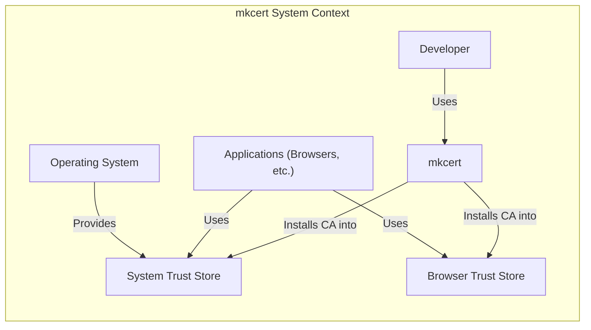
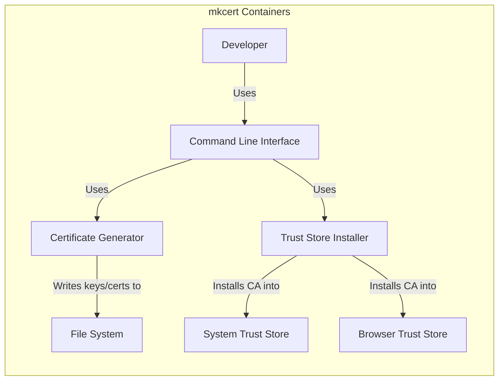
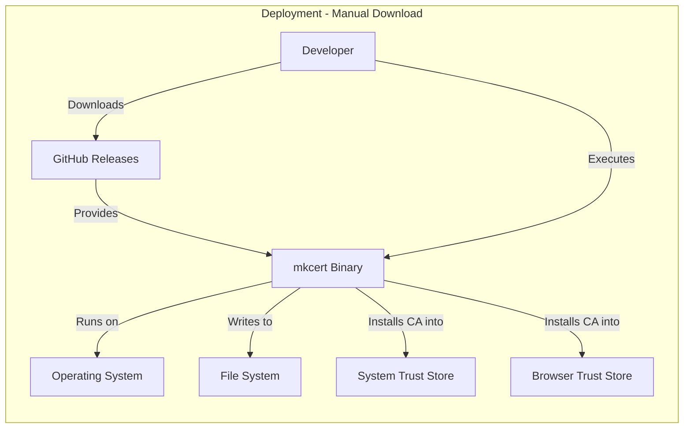
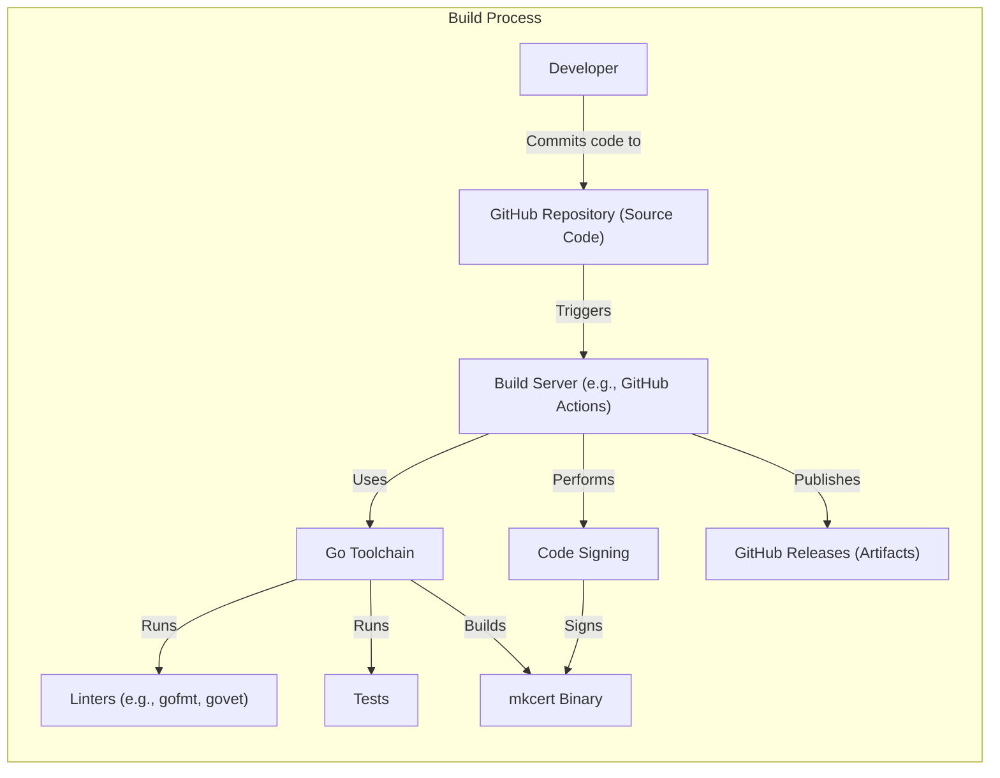

# BUSINESS POSTURE

Business Priorities and Goals:

*   Provide a simple, zero-configuration tool for developers to create locally trusted certificates.
*   Minimize the complexity and friction associated with generating development certificates.
*   Improve developer experience by automating the process of certificate creation and installation.
*   Reduce the risk of developers using self-signed certificates without proper CA trust, which can lead to security vulnerabilities and inconsistent browser behavior.
*   Support a wide range of operating systems and browsers.

Most Important Business Risks:

*   Compromise of the root CA key: If the root CA key generated by mkcert is compromised, an attacker could issue trusted certificates for any domain, leading to man-in-the-middle attacks.
*   Incorrect usage by developers: If developers misuse mkcert (e.g., use the generated certificates in production, share the root CA key), it could lead to security vulnerabilities.
*   Lack of awareness of security implications: Developers might not fully understand the security implications of using locally trusted certificates, leading to potential misuse.
*   Compatibility issues: mkcert might not be compatible with all operating systems, browsers, or development environments, leading to user frustration and potential workarounds that could introduce security risks.
*   Supply chain attacks: Compromise of the mkcert distribution channel (e.g., GitHub repository, package manager) could allow an attacker to distribute a malicious version of mkcert.

# SECURITY POSTURE

Existing Security Controls:

*   security control: Root CA key generation: mkcert generates a unique root CA key pair for each user. This key is stored locally. (Implemented in mkcert's Go code).
*   security control: Certificate generation: mkcert generates certificates signed by the locally generated root CA. (Implemented in mkcert's Go code).
*   security control: Automatic trust store installation: mkcert attempts to automatically install the generated root CA into the system's trust store and/or browser trust stores. (Implemented in mkcert's Go code, using platform-specific commands and libraries).
*   security control: Code signing (for releases): Official releases of mkcert are likely code-signed to ensure authenticity and integrity. (Mentioned in the GitHub repository, but specific implementation details may vary).
*   security control: Limited permissions: mkcert encourages users to run it without elevated privileges (e.g., not as root/administrator) whenever possible, reducing the potential impact of a vulnerability. (Documented in the README).

Accepted Risks:

*   accepted risk: Local root CA trust: The root CA generated by mkcert is only trusted locally. This is an inherent aspect of the tool's design and is necessary for its functionality.
*   accepted risk: User responsibility for root CA key: The user is responsible for the security of the generated root CA key. mkcert provides guidance, but ultimately the user controls the key's storage and protection.
*   accepted risk: Potential for misuse: Developers could misuse mkcert, such as by using the generated certificates in production. This is a risk that is mitigated through documentation and user education.
*   accepted risk: Limited platform support: While mkcert supports many platforms, there might be edge cases or unsupported environments.

Recommended Security Controls:

*   security control: Add support for hardware security modules (HSMs) or secure enclaves for storing the root CA key, providing a higher level of protection against key compromise.
*   security control: Implement a mechanism for revoking certificates issued by the local CA.
*   security control: Provide more granular control over certificate attributes (e.g., validity period, key usage extensions).
*   security control: Integrate with secret management tools to securely store and manage the root CA key.

Security Requirements:

*   Authentication: Not directly applicable, as mkcert is a local tool that does not involve authentication.
*   Authorization: Not directly applicable, as mkcert operates with the privileges of the user running it.
*   Input Validation:
    *   Domain names provided as input should be validated to prevent the generation of certificates for invalid or malicious domains.
    *   Command-line arguments should be validated to prevent unexpected behavior or security vulnerabilities.
*   Cryptography:
    *   Use strong, industry-standard cryptographic algorithms for key generation and certificate signing (e.g., RSA with at least 2048-bit keys, ECDSA with NIST-approved curves).
    *   Ensure that the generated certificates comply with relevant standards (e.g., X.509).
    *   Random number generation must use cryptographically secure sources.
*   Output Validation:
    *   Ensure that generated certificates are properly formatted and contain the expected information.

# DESIGN

## C4 CONTEXT

Element Descriptions:

*   Element:
    *   Name: Developer
    *   Type: Person
    *   Description: A software developer who needs locally trusted certificates for development purposes.
    *   Responsibilities: Runs mkcert, manages the generated root CA key, and uses the generated certificates in their development environment.
    *   Security controls: None (external to the system).

*   Element:
    *   Name: mkcert
    *   Type: Software System
    *   Description: A simple tool for creating locally trusted development certificates.
    *   Responsibilities: Generates root CA key pairs, generates certificates signed by the root CA, and installs the root CA into system and browser trust stores.
    *   Security controls: Root CA key generation, certificate generation, automatic trust store installation, code signing (for releases), limited permissions.

*   Element:
    *   Name: System Trust Store
    *   Type: System Component
    *   Description: The operating system's store of trusted root CA certificates.
    *   Responsibilities: Stores trusted root CA certificates, provides a mechanism for applications to verify certificate chains.
    *   Security controls: Operating system-level access controls and security mechanisms.

*   Element:
    *   Name: Browser Trust Store
    *   Type: Application Component
    *   Description: A browser's store of trusted root CA certificates.
    *   Responsibilities: Stores trusted root CA certificates, provides a mechanism for the browser to verify certificate chains.
    *   Security controls: Browser-specific security mechanisms and access controls.

*   Element:
    *   Name: Applications (Browsers, etc.)
    *   Type: Software System
    *   Description: Applications that use certificates for secure communication (e.g., web browsers, development tools).
    *   Responsibilities: Uses certificates to establish secure connections, verifies certificate chains against trusted root CAs.
    *   Security controls: Application-specific security mechanisms.

*   Element:
    *   Name: Operating System
    *   Type: System Component
    *   Description: Provides System Trust Store
    *   Responsibilities: Provides System Trust Store
    *   Security controls: Operating system-level access controls and security mechanisms.

## C4 CONTAINER

Element Descriptions:

*   Element:
    *   Name: Developer
    *   Type: Person
    *   Description: A software developer.
    *   Responsibilities: Interacts with mkcert via the command line.
    *   Security controls: None (external to the system).

*   Element:
    *   Name: Command Line Interface (CLI)
    *   Type: Container
    *   Description: The entry point for user interaction with mkcert.
    *   Responsibilities: Parses command-line arguments, invokes other components, provides feedback to the user.
    *   Security controls: Input validation of command-line arguments.

*   Element:
    *   Name: Certificate Generator
    *   Type: Container
    *   Description: Responsible for generating cryptographic keys and certificates.
    *   Responsibilities: Generates root CA key pairs, generates certificates signed by the root CA.
    *   Security controls: Uses strong cryptographic algorithms, uses cryptographically secure random number generation.

*   Element:
    *   Name: Trust Store Installer
    *   Type: Container
    *   Description: Handles the installation of the root CA into system and browser trust stores.
    *   Responsibilities: Detects the operating system and browser, uses platform-specific commands and libraries to install the CA.
    *   Security controls: Limited permissions (runs without elevated privileges when possible).

*   Element:
    *   Name: File System
    *   Type: Container
    *   Description: Stores the generated root CA key and certificates.
    *   Responsibilities: Provides persistent storage for keys and certificates.
    *   Security controls: Operating system-level file system permissions.

*   Element:
    *   Name: System Trust Store
    *   Type: System Component
    *   Description: The operating system's store of trusted root CA certificates.
    *   Responsibilities: Stores trusted root CA certificates.
    *   Security controls: Operating system-level access controls.

*   Element:
    *   Name: Browser Trust Store
    *   Type: Application Component
    *   Description: A browser's store of trusted root CA certificates.
    *   Responsibilities: Stores trusted root CA certificates.
    *   Security controls: Browser-specific security mechanisms.

## DEPLOYMENT

Possible Deployment Solutions:

1.  Manual download and execution: The user downloads the pre-built binary from the GitHub releases page and executes it directly.
2.  Package manager installation: The user installs mkcert using a package manager like Homebrew (macOS), Chocolatey (Windows), or apt (Debian/Ubuntu).
3.  Build from source: The user clones the GitHub repository and builds mkcert from source using the Go toolchain.

Chosen Deployment Solution (Manual download and execution):

Element Descriptions:

*   Element:
    *   Name: Developer
    *   Type: Person
    *   Description: A software developer.
    *   Responsibilities: Downloads and executes mkcert.
    *   Security controls: None (external to the system).

*   Element:
    *   Name: GitHub Releases
    *   Type: System
    *   Description: The official distribution channel for mkcert binaries.
    *   Responsibilities: Provides pre-built binaries for various operating systems.
    *   Security controls: Code signing of releases, HTTPS for secure download.

*   Element:
    *   Name: Operating System
    *   Type: System
    *   Description: The operating system on which mkcert is executed.
    *   Responsibilities: Provides the runtime environment for mkcert.
    *   Security controls: Operating system-level security mechanisms.

*   Element:
    *   Name: mkcert Binary
    *   Type: Application
    *   Description: The executable file for mkcert.
    *   Responsibilities: Performs the core functionality of mkcert (key generation, certificate creation, trust store installation).
    *   Security controls: Code signing (verified by the user or operating system).

*   Element:
    *   Name: File System
    *   Type: System Component
    *   Description: Stores the generated root CA key and certificates.
    *   Responsibilities: Provides persistent storage.
    *   Security controls: Operating system-level file system permissions.

*   Element:
    *   Name: System Trust Store
    *   Type: System Component
    *   Description: The operating system's store of trusted root CA certificates.
    *   Responsibilities: Stores trusted root CA certificates.
    *   Security controls: Operating system-level access controls.

*   Element:
    *   Name: Browser Trust Store
    *   Type: Application Component
    *   Description: A browser's store of trusted root CA certificates.
    *   Responsibilities: Stores trusted root CA certificates.
    *   Security controls: Browser-specific security mechanisms.

## BUILD

Build Process Description:

1.  Developer commits code changes to the GitHub repository.
2.  A build server (e.g., GitHub Actions) is triggered by the commit.
3.  The build server checks out the code from the repository.
4.  The Go toolchain is used to:
    *   Run linters (e.g., `gofmt`, `govet`) to enforce code style and identify potential issues.
    *   Run tests to ensure code correctness.
    *   Build the mkcert binary.
5.  Code signing is performed on the built binary to ensure authenticity and integrity.
6.  The signed binary is published as a release on GitHub Releases.

Security Controls:

*   security control: Use of a build server (GitHub Actions) for automated builds and consistent environments.
*   security control: Linting (gofmt, govet) to identify potential code quality and security issues.
*   security control: Automated testing to ensure code correctness and prevent regressions.
*   security control: Code signing of releases to ensure authenticity and integrity.
*   security control: Use of a secure build environment (GitHub Actions runners).
*   security control: Dependency management (Go modules) to track and manage dependencies, reducing the risk of using vulnerable libraries.

# RISK ASSESSMENT

Critical Business Processes to Protect:

*   The process of generating locally trusted certificates for development.
*   The integrity and availability of the mkcert tool itself.
*   The trust placed in the certificates generated by mkcert (by developers and their systems).

Data to Protect and Sensitivity:

*   Root CA private key: Extremely sensitive. Compromise allows an attacker to issue trusted certificates for any domain, leading to man-in-the-middle attacks.
*   Generated certificates: Moderately sensitive. While intended for development, they could be misused if they fall into the wrong hands.
*   mkcert source code: Moderately sensitive. Vulnerabilities in the code could be exploited to compromise the tool or the generated certificates.
*   User's system and browser trust stores: Moderately sensitive. Unauthorized modification could lead to the acceptance of malicious certificates.

# QUESTIONS & ASSUMPTIONS

Questions:

*   What specific cryptographic algorithms and key sizes are currently used by mkcert?
*   What are the exact steps involved in the code signing process for mkcert releases?
*   What are the specific platform-specific commands and libraries used for trust store installation?
*   Are there any plans to support hardware security modules (HSMs) or secure enclaves?
*   Are there any existing mechanisms for certificate revocation?
*   How are dependencies managed and vetted for security vulnerabilities?
*   What is the process for handling security vulnerabilities reported in mkcert?

Assumptions:

*   BUSINESS POSTURE: The primary goal of mkcert is to simplify the creation of locally trusted certificates for development, not to provide a general-purpose PKI solution.
*   SECURITY POSTURE: Developers using mkcert have a basic understanding of the security implications of using locally trusted certificates. The generated root CA key is stored securely by the user. mkcert releases are code-signed.
*   DESIGN: mkcert is a command-line tool written in Go. It uses platform-specific mechanisms to install the root CA into trust stores. The build process is automated using GitHub Actions.