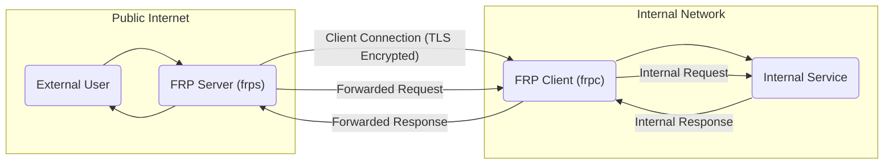
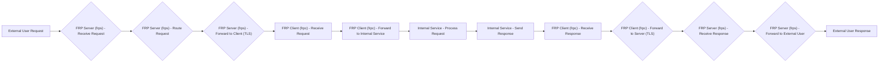

## Project Design Document: FRP (Fast Reverse Proxy) - Improved

**1. Introduction**

This document provides an enhanced design overview of the FRP (Fast Reverse Proxy) project, an application designed for securely exposing internal services to the public internet through a reverse proxy mechanism. This document is intended to serve as a robust foundation for subsequent threat modeling activities. It details the system's architecture, components, data flow, and key security considerations.

**2. Project Goals**

* Provide a reliable and efficient method for exposing internal TCP and UDP services to external networks.
* Offer robust and configurable access control mechanisms for exposed services.
* Enable efficient multiplexing of connections over a single public IP address and port.
* Support diverse network configurations and communication protocols.
* Maintain a lightweight, performant, and resource-efficient architecture.
* Facilitate secure communication and data transfer.

**3. System Architecture**

FRP employs a client-server architecture to achieve its functionality.

* **FRP Server (frps):** A publicly accessible server instance that listens for incoming connections from both FRP clients and external users. It acts as the primary entry point for accessing services hosted within the internal network.
* **FRP Client (frpc):** An instance deployed within the internal network, responsible for establishing and maintaining connections to the FRP server. It creates secure tunnels for specific internal services, enabling the server to forward external traffic to them.
* **Internal Service:** The actual application or service residing within the internal network that requires exposure to external users.
* **External User:** An individual or system located outside the internal network attempting to access an exposed internal service through the FRP server.

**4. Component Details**

**4.1. FRP Server (frps)**

* **Responsibilities:**
    * Listen for and accept incoming connection requests from FRP clients.
    * Authenticate and authorize connecting FRP clients to ensure only legitimate clients can establish tunnels.
    * Manage and maintain the active tunnels established by connected clients, tracking their status and configurations.
    * Listen for incoming connection requests from external users on pre-configured public addresses and ports.
    * Forward traffic originating from external users to the appropriate, authorized FRP client based on defined routing rules.
    * Optionally handle TLS termination for incoming external connections, offloading encryption processing from internal services.
    * Optionally provide a management interface (e.g., a web dashboard or API) for monitoring server status and managing configurations.

* **Key Functionalities:**
    * **Listener Management:**  Handles incoming connections on specified network interfaces and ports (supporting both TCP and UDP protocols).
    * **Client Connection Management:**  Manages the lifecycle of connections from authenticated FRP clients, including connection establishment, maintenance, and termination.
    * **Proxy Logic & Routing:**  Intelligently routes incoming external traffic to the correct internal service by forwarding it through the corresponding connected client, based on configured rules (e.g., port mapping, subdomain routing).
    * **Authentication and Authorization:**  Verifies the identity of FRP clients using configured credentials (e.g., tokens, passwords) and authorizes their ability to establish specific tunnels.
    * **TLS Termination (Optional):**  Decrypts TLS-encrypted traffic from external users, allowing internal services to operate without managing TLS certificates.
    * **Dashboard/API (Optional):** Provides a user interface or programmatic access for monitoring server performance, active connections, and managing configurations dynamically.

* **Configuration Examples:**
    * Listening address: `0.0.0.0`
    * Client listener port: `7000`
    * External listener ports: `80`, `443`, `8080`
    * Authentication type: `token`
    * Authentication token: `your_secret_token`
    * Proxy rules:
        * `tcp:80:127.0.0.1:8080` (Forward external TCP traffic on port 80 to internal service at 127.0.0.1:8080)
        * `subdomain:app.example.com:192.168.1.100:9000` (Forward external traffic for subdomain app.example.com to internal service at 192.168.1.100:9000)
    * TLS certificate path: `/etc/frps/server.crt`
    * TLS key path: `/etc/frps/server.key`

**4.2. FRP Client (frpc)**

* **Responsibilities:**
    * Establish and maintain a persistent, secure connection to the configured FRP server.
    * Authenticate with the FRP server using provided credentials.
    * Register tunnels for specific internal services with the server, defining how external traffic should be routed to these services.
    * Listen for incoming connections from the FRP server that are destined for its registered internal services.
    * Forward traffic received from the FRP server to the designated internal service running within the internal network.

* **Key Functionalities:**
    * **Server Connection:** Establishes and maintains a reliable connection to the configured FRP server, handling reconnections in case of network interruptions.
    * **Authentication:** Authenticates with the FRP server using configured credentials (matching the server's configuration).
    * **Tunnel Registration:** Registers the mapping between a local internal service (address and port) and a public-facing address, port, or subdomain on the server. This informs the server how to route external requests.
    * **Proxy Logic:** Receives traffic forwarded by the server and forwards it to the correct local internal service based on the registered tunnel configuration.

* **Configuration Examples:**
    * Server address: `public.frps.com`
    * Server port: `7000`
    * Authentication type: `token`
    * Authentication token: `your_secret_token`
    * Tunnel definitions:
        * `[ssh]`
            * `type = tcp`
            * `local_ip = 127.0.0.1`
            * `local_port = 22`
            * `remote_port = 6000` (Expose internal SSH on server's port 6000)
        * `[web]`
            * `type = http`
            * `local_ip = 192.168.1.100`
            * `local_port = 80`
            * `subdomain = myapp` (Expose internal web app on server's subdomain myapp.frps.com)

**4.3. Communication Channels**

* **Client-Server Communication:**
    * Typically a persistent TCP connection established by the client to the server.
    * Used for client authentication, tunnel registration, control messages (e.g., heartbeat), and forwarding proxied traffic.
    * Should be secured with TLS encryption to protect sensitive data like authentication credentials and proxied content.

* **Server-External User Communication:**
    * TCP or UDP connections, depending on the configured proxy type for the specific service.
    * Can be secured with TLS (HTTPS) if the server is configured to handle TLS termination.

* **Client-Internal Service Communication:**
    * Direct TCP or UDP connection within the internal network, typically unencrypted unless the internal service itself implements encryption.

**5. Data Flow**

The following outlines the typical flow of a request from an external user to an internal service and the corresponding response:

1. **External User Request:** An external user initiates a request to the FRP server on a configured public address and port (or subdomain).
2. **Server Reception:** The FRP server receives the incoming request on the designated listener.
3. **Server Routing Decision:** The server analyzes the request (e.g., destination port, subdomain) and determines the appropriate FRP client and internal service based on its configured proxy rules.
4. **Server to Client Forwarding:** The server forwards the request over the established, secure client-server connection to the identified FRP client.
5. **Client Reception:** The FRP client receives the forwarded request from the server.
6. **Client to Internal Service Forwarding:** The client forwards the request to the configured internal service within the internal network.
7. **Internal Service Processing:** The internal service processes the received request and generates a response.
8. **Internal Service to Client Response:** The internal service sends the response back to the FRP client.
9. **Client to Server Response Forwarding:** The FRP client sends the response back to the FRP server over the secure client-server connection.
10. **Server to External User Response:** The FRP server forwards the response back to the original external user.

**6. Deployment Considerations**

* **FRP Server Deployment:**
    * Typically deployed on a publicly accessible server with a static IP address or a stable DNS record.
    * Requires careful firewall configuration to allow incoming connections on the configured external listener ports and the client connection port. Outbound connections to clients are also necessary.
    * Should be hardened and secured against unauthorized access, including regular security updates and strong access controls.

* **FRP Client Deployment:**
    * Deployed within the internal network, ideally in close proximity to the services being exposed to minimize latency.
    * Needs network connectivity to both the FRP server (outbound) and the internal services it is proxying for.
    * Should be secured to prevent unauthorized access to internal resources and to protect the client's configuration and credentials.

* **Internal Service Deployment:**
    * Remains within the internal network, behind firewalls and other security measures.
    * Security considerations for the internal service itself are still paramount, as FRP provides access but does not inherently secure the underlying service.

**7. Security Considerations (Detailed for Threat Modeling)**

* **Authentication and Authorization:**
    * **Client Authentication:**  Strong authentication mechanisms (e.g., pre-shared keys/tokens, potentially certificate-based authentication) are crucial for verifying the identity of FRP clients connecting to the server. Weak authentication can lead to unauthorized tunnel creation and access to internal resources.
    * **Client Authorization:**  Granular authorization controls should be implemented to restrict which clients can expose which internal services. This prevents a compromised client from exposing unintended services.
* **Data Confidentiality and Integrity:**
    * **Client-Server Encryption:**  Mandatory TLS encryption for communication between the FRP client and server is essential to protect sensitive data, including authentication credentials, tunnel configurations, and proxied traffic.
    * **End-to-End Encryption:** While FRP can provide secure transport to the internal network, consider the need for end-to-end encryption if the internal service handles highly sensitive data. FRP itself doesn't inherently provide this.
* **Access Control:**
    * **Server Access Control:** Restrict access to the FRP server itself through strong passwords, multi-factor authentication, and limiting administrative access.
    * **External Access Control:**  While FRP facilitates access, the internal service should ideally have its own authentication and authorization mechanisms to control which external users can access its functionalities.
* **Denial of Service (DoS) Attacks:**
    * **Server-Side Protection:** Implement rate limiting, connection limits, and other DoS mitigation strategies on the FRP server to prevent resource exhaustion from malicious traffic.
    * **Client-Side Considerations:**  While less direct, a compromised client could potentially be used to launch DoS attacks against the server or internal services.
* **Man-in-the-Middle (MitM) Attacks:**
    * **TLS Enforcement:** Enforce TLS for client-server communication to prevent interception and tampering of data in transit. Ensure proper certificate validation.
* **Vulnerabilities in FRP Software:**
    * **Regular Updates:**  Maintain up-to-date versions of both the FRP server and client software to patch known security vulnerabilities. Subscribe to security advisories.
* **Misconfiguration:**
    * **Secure Defaults:**  Ensure secure default configurations for both the server and client.
    * **Configuration Management:**  Implement secure configuration management practices to prevent accidental or malicious misconfigurations that could expose vulnerabilities.
* **Compromised Client:**
    * **Isolation:**  Implement network segmentation and least privilege principles to limit the impact of a compromised FRP client.
    * **Monitoring:**  Monitor client activity for suspicious behavior.
* **Tunnel Hijacking:**
    * Ensure robust authentication and authorization to prevent unauthorized clients from hijacking existing tunnels or creating malicious ones.
* **Information Disclosure:**
    * Avoid exposing sensitive information in server logs or error messages.

**8. Diagrams**

**8.1. High-Level Architecture**

**8.2. Data Flow Diagram**

**9. Future Considerations**

* Explore more advanced authentication and authorization mechanisms, such as integration with identity providers (e.g., OAuth 2.0).
* Implement comprehensive monitoring and logging capabilities for both the server and clients, including security-related events.
* Investigate and potentially integrate intrusion detection and prevention systems (IDPS) to enhance security.
* Consider support for more complex routing scenarios and load balancing across multiple internal service instances.
* Evaluate the feasibility of implementing automated configuration management and deployment strategies.

This improved document provides a more detailed and comprehensive design overview of the FRP project, specifically tailored for effective threat modeling. It highlights key components, data flows, and crucial security considerations.
