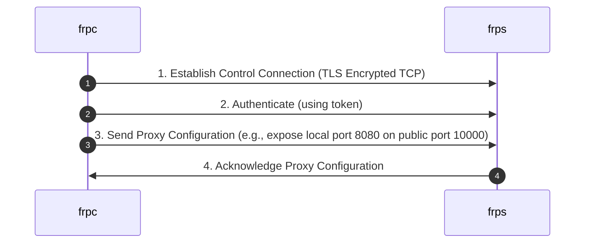
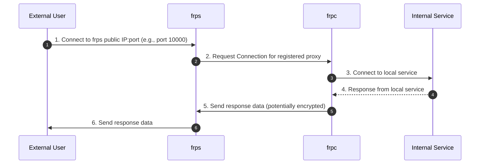

# Project Design Document: frp (Fast Reverse Proxy) - Improved

**Version:** 1.1
**Date:** October 26, 2023
**Author:** AI Software Architect

## 1. Introduction

This document provides an enhanced architectural design of the `frp` (Fast Reverse Proxy) project, an open-source application facilitating the exposure of local servers behind NATs or firewalls to the internet. This improved version aims for greater clarity, detail, and a stronger focus on security considerations, making it an even more robust foundation for subsequent threat modeling activities.

## 2. Goals and Non-Goals

**Goals:**

* **Enhanced Architectural Clarity:** Provide a more detailed and precise description of the `frp` architecture, emphasizing security-relevant aspects of its core components and their interactions.
* **Granular Component Breakdown:**  Describe the functionality, responsibilities, and security implications of each major component within the `frp` system with greater specificity.
* **Detailed Data Flow Understanding:** Illustrate the flow of data through the system for various use cases, highlighting potential points of vulnerability.
* **Strong Foundation for Threat Modeling:**  Provide comprehensive details necessary to identify a wider range of potential security vulnerabilities, attack vectors, and mitigation strategies.

**Non-Goals:**

* **Implementation Code Details:** This document remains focused on the high-level design and does not delve into specific implementation details, code-level specifics, or internal algorithms.
* **Performance Benchmarking and Optimization:** Performance metrics, optimization strategies, and scalability considerations are outside the scope of this document.
* **Exhaustive Configuration Options:** While key configuration parameters are mentioned, a completely exhaustive list of all possible configuration options is not included.
* **Specific Deployment Procedures:** This document describes the architecture, not step-by-step deployment instructions for specific environments.

## 3. High-Level Architecture

The `frp` system comprises two primary components working in tandem:

* **`frps` (frp server):** Deployed on a publicly accessible network with a public IP address. It acts as the entry point, listening for incoming connections from both `frpc` clients and external users.
* **`frpc` (frp client):** Deployed within the private network where the internal service resides. It establishes and maintains a persistent connection to the `frps` server, creating a secure tunnel.

The fundamental function of `frp` is to establish secure tunnels, enabling external users to access internal services through the intermediary `frps` server. This involves a control connection for management and data connections for actual traffic.

```mermaid
graph LR
    subgraph Public Network
        A[External User] --> B(frps Server);
    end
    subgraph Private Network
        C(Internal Service) <-- D(frpc Client);
    end
    B -- Control Connection (Encrypted) --> D;
    B -- Data Connection (Potentially Encrypted) --> D;
    B -- Forwarded Request --> C;
```

**Explanation of the Diagram:**

* **External User:** Represents any entity on the internet attempting to access the internal service.
* **frps Server:** The central server component, responsible for connection management, authentication, and traffic routing.
* **frpc Client:** The client component residing on the private network, initiating and maintaining the connection to `frps`.
* **Internal Service:** The application or service within the private network intended for external access.
* **Control Connection (Encrypted):** A persistent, typically TLS-encrypted TCP connection established by `frpc` to `frps` for control signaling, authentication, and proxy configuration. Encryption is crucial for protecting sensitive information.
* **Data Connection (Potentially Encrypted):** Temporary TCP or UDP connections established through the tunnel for the actual transfer of data between the external user and the internal service. Encryption of this channel depends on configuration and proxy type (e.g., using `stcp`/`sudp` or HTTPS).
* **Forwarded Request:** Represents the request from the `frps` server being forwarded to the internal service via the `frpc` client.

## 4. Component Details

### 4.1. `frps` (frp Server)

**Responsibilities:**

* **Listening and Connection Handling:** Listens on specified ports for incoming connections from `frpc` clients and external users. Manages the lifecycle of these connections.
* **Client Authentication and Authorization:** Authenticates connecting `frpc` clients based on configured credentials (e.g., authentication token). Authorizes clients to register specific proxies.
* **Proxy Configuration Management and Enforcement:** Stores, manages, and enforces the configuration of proxies registered by connected `frpc` clients. This includes mapping public ports/domains to internal services and access control rules.
* **Control Connection Management:** Manages the persistent, encrypted control connections with connected `frpc` clients, ensuring their integrity and availability.
* **Data Proxying and Routing:**  Receives incoming requests from external users and routes them to the appropriate `frpc` client based on the configured proxy rules.
* **Resource Management and Security:** Manages server resources (connections, memory, CPU) and implements security measures to prevent abuse and unauthorized access.
* **TLS Termination (Optional):** Can be configured to handle TLS termination for incoming HTTPS connections, decrypting traffic before forwarding to the `frpc` client.

**Key Functionalities:**

* **TCP Proxying:** Forwards raw TCP traffic to internal services.
* **UDP Proxying:** Forwards raw UDP traffic to internal services.
* **HTTP/HTTPS Proxying:** Provides specialized support for HTTP and HTTPS traffic, including virtual host support, header manipulation, and domain-based routing.
* **Domain Name Resolution (Optional):** Can be configured to handle DNS resolution for exposed services, potentially integrating with dynamic DNS providers.
* **Dashboard (Optional):** Provides a web-based interface for monitoring server status, connected clients, and registered proxies. This interface itself needs to be secured.
* **Authentication Methods:** Supports various authentication methods for `frpc` clients, typically involving a shared secret token.
* **Access Control Lists (ACLs):** May implement ACLs to restrict which external IP addresses or networks can access specific proxies.

**Configuration:**

The `frps` server is configured via a configuration file (typically `frps.ini`). Key security-relevant configuration parameters include:

| Parameter           | Description                                                                 | Security Implications                                                                                                |
|---------------------|-----------------------------------------------------------------------------|----------------------------------------------------------------------------------------------------------------------|
| `bind_addr`         | The IP address the server listens on.                                       | Binding to `0.0.0.0` exposes the server on all interfaces, potentially increasing the attack surface.                 |
| `bind_port`         | The port the server listens on for `frpc` connections.                      | Using non-standard ports might offer slight obscurity but shouldn't be relied upon for security.                       |
| `vhost_http_port`   | The port for listening to HTTP proxy requests.                               | Ensure firewalls and network policies are configured correctly for this port.                                         |
| `vhost_https_port`  | The port for listening to HTTPS proxy requests.                              | Proper TLS configuration is crucial for secure HTTPS proxying.                                                        |
| `token`             | The authentication token required by `frpc` clients.                        | A weak or compromised token allows unauthorized clients to connect. Secure storage and rotation of this token are vital. |
| `tls_enable`        | Enables TLS encryption for the control connection.                           | **Crucial for protecting the control channel.** Should always be enabled.                                            |
| `tls_cert_file`     | Path to the TLS certificate file.                                           | Use valid and trusted certificates.                                                                                   |
| `tls_key_file`      | Path to the TLS private key file.                                           | Protect the private key securely.                                                                                     |
| `allow_ports`       | Restricts the public ports that can be used for TCP/UDP proxies.             | Limits the potential attack surface by controlling exposed ports.                                                     |
| `max_pool_count`    | Limits the maximum number of idle connections in the connection pool.        | Helps prevent resource exhaustion attacks.                                                                            |
| `log_level`         | Sets the verbosity of logging.                                              | Detailed logs are important for security auditing and incident response.                                             |

### 4.2. `frpc` (frp Client)

**Responsibilities:**

* **Establishing and Maintaining Control Connection:** Initiates and maintains a persistent, encrypted TCP connection to the configured `frps` server. Handles reconnections and connection monitoring.
* **Authentication:** Authenticates with the `frps` server using the configured credentials.
* **Proxy Registration and Heartbeat:** Registers the desired proxies with the `frps` server, specifying local service details and public access methods. Sends periodic heartbeats to maintain the connection.
* **Data Tunneling and Forwarding:** Receives forwarded traffic from the `frps` server and forwards it to the specified internal service. Receives responses from the internal service and sends them back to the `frps` server.
* **Local Service Monitoring (Optional):** May monitor the health and availability of the local service being proxied.

**Key Functionalities:**

* **TCP Proxy Configuration:** Defines TCP proxies to expose internal TCP services, specifying local IP and port, and the desired remote port on the `frps` server.
* **UDP Proxy Configuration:** Defines UDP proxies to expose internal UDP services.
* **HTTP/HTTPS Proxy Configuration:** Defines HTTP/HTTPS proxies, including custom domains, subdomains, and local HTTP headers to add.
* **Stcp (Secret TCP) and Sudp (Secret UDP):** Provides end-to-end encrypted tunneling for enhanced security, encrypting the data channel between `frpc` and `frps`.
* **P2P (Peer-to-Peer) Connection:** Allows direct connections between clients without going through the server for certain scenarios, potentially reducing latency but requiring careful security considerations.
* **Multiple Proxy Definitions:** Can define multiple proxies to expose different internal services.

**Configuration:**

The `frpc` client is configured via a configuration file (typically `frpc.ini`). Key security-relevant configuration parameters include:

| Parameter      | Description                                                                 | Security Implications                                                                                             |
|----------------|-----------------------------------------------------------------------------|-------------------------------------------------------------------------------------------------------------------|
| `server_addr`  | The IP address or hostname of the `frps` server.                            | Ensure this points to the legitimate `frps` server to prevent connecting to malicious servers.                  |
| `server_port`  | The port of the `frps` server.                                             | Matches the `bind_port` on the `frps` server.                                                                    |
| `token`        | The authentication token to connect to the `frps` server.                    | **Must match the `token` on the `frps` server.** Secure storage is crucial.                                      |
| `tls_enable`   | Enables TLS encryption for the control connection.                           | **Should always be enabled to protect the control channel.**                                                     |
| `proxy_name`   | A unique name for the proxy configuration.                                  | Helps in managing and identifying different proxies.                                                              |
| `type`         | The proxy type (tcp, udp, http, https, stcp, sudp).                         | Choose the appropriate type based on the service being proxied and security requirements.                         |
| `local_ip`     | The IP address of the internal service.                                     | Ensure this is the correct IP address to avoid unintended routing.                                                |
| `local_port`   | The port of the internal service.                                         | Ensure this is the correct port.                                                                                   |
| `remote_port`  | The public port on the `frps` server (for TCP/UDP).                         | Carefully manage exposed ports to minimize the attack surface.                                                    |
| `custom_domains`| The custom domain names for HTTP/HTTPS proxies.                             | Ensure proper DNS configuration and ownership of these domains.                                                    |
| `subdomain`    | The subdomain to use for HTTP/HTTPS proxies.                                | Choose strong and unpredictable subdomains if security through obscurity is a minor consideration.               |
| `use_encryption` (for stcp/sudp) | Enables encryption for the data channel.                               | **Essential for securing the data channel when using `stcp` or `sudp`.**                                       |
| `use_compression` (for stcp/sudp) | Enables compression for the data channel.                               | Can improve performance but might have security implications in certain scenarios (e.g., CRIME attack).        |

## 5. Data Flow

The data flow in `frp` involves two primary phases: **Proxy Registration** and **Data Transfer**.

### 5.1. Proxy Registration



**Description:**

1. The `frpc` client initiates a TLS-encrypted TCP connection to the `frps` server. This secure channel protects the subsequent communication.
2. The `frpc` client authenticates itself to the `frps` server using the configured token. This verifies the client's identity.
3. The `frpc` client sends its proxy configuration to the `frps` server, specifying the details of the internal service it wants to expose and how it should be accessed publicly. This configuration is transmitted securely over the control channel.
4. The `frps` server acknowledges the proxy configuration and stores it.

### 5.2. Data Transfer (Example: TCP Proxy)



**Description:**

1. An external user attempts to connect to the `frps` server on the public port configured for the proxy (e.g., port 10000).
2. The `frps` server, based on its stored proxy configuration, identifies the corresponding `frpc` client and requests a connection for this proxy over the control channel.
3. The `frpc` client establishes a connection to the local internal service.
4. The internal service processes the request and sends a response back to the `frpc` client.
5. The `frpc` client forwards the response data back to the `frps` server through the established data connection. The encryption of this data depends on the proxy type (e.g., `stcp`).
6. The `frps` server forwards the response data to the external user.

## 6. Deployment Scenarios

`frp` is versatile and can be deployed in various scenarios, each with its own security considerations:

* **Exposing Web Services (HTTP/HTTPS):** Making a web application accessible via a public domain. Security considerations include TLS configuration, protection against web application vulnerabilities, and potential DDoS attacks on the `frps` server.
* **Providing SSH Access (TCP):** Enabling secure remote access to machines. Security relies on the strength of SSH keys and the security of the `frps` server. Consider using non-standard ports for obscurity (not a primary security measure).
* **Accessing Internal Databases (TCP):** Allowing access to databases. Security is paramount; ensure strong database authentication and consider encrypting the connection using `stcp`. Limit access to authorized users only.
* **Game Server Hosting (TCP/UDP):** Hosting game servers. Security considerations include potential DDoS attacks, game-specific vulnerabilities, and managing player connections.
* **IoT Device Management (TCP/UDP):** Remotely managing and accessing IoT devices. Secure communication protocols (like `stcp`/`sudp`) are crucial due to the often-sensitive nature of IoT data.
* **Internal Service Access (various protocols):** Providing access to internal tools or APIs for authorized external partners. Implement strong authentication and authorization mechanisms.

## 7. Security Considerations (For Threat Modeling)

This section provides a more detailed breakdown of potential security considerations for threat modeling:

* **Authentication and Authorization:**
    * **`frps` Authentication Token Management:** Weak, default, or easily guessable tokens are a significant vulnerability. Implement strong token generation, secure storage, and consider token rotation.
    * **`frpc` Authorization and Access Control:**  Ensure the `frps` server correctly authorizes which clients can expose which services and on which public ports/domains. Misconfigurations can lead to unauthorized exposure. Implement fine-grained access control lists (ACLs).
* **Communication Security:**
    * **Control Channel Encryption (TLS):**  **Mandatory.** Ensure TLS is enabled and configured correctly on both `frps` and `frpc`. Use strong cipher suites and keep TLS libraries updated.
    * **Data Channel Encryption:**  For sensitive data, utilize `stcp` or `sudp` to encrypt the data channel. For HTTP/HTTPS proxies, ensure the backend service also uses HTTPS to maintain end-to-end encryption.
    * **Man-in-the-Middle (MITM) Attacks:** Without proper encryption, attackers can intercept and potentially modify traffic.
* **Access Control and Network Segmentation:**
    * **`frps` Public Port Management:**  Minimize the number of open ports on the `frps` server. Only expose necessary ports.
    * **Firewall Rules:** Implement strict firewall rules on both the public and private networks to limit access to the `frps` server and internal services.
    * **Network Segmentation:** Isolate the internal services being proxied from other sensitive parts of the private network.
* **Input Validation and Data Sanitization:**
    * **Vulnerabilities in Proxied Services:** `frp` itself doesn't protect against vulnerabilities in the internal services. Ensure these services are secure and properly handle input.
    * **Header Manipulation:** Be cautious about header manipulation features in HTTP/HTTPS proxies, as they could be misused.
* **Denial of Service (DoS) Attacks:**
    * **`frps` Resource Exhaustion:** Implement rate limiting and connection limits on the `frps` server to mitigate DoS attacks.
    * **Control Channel Flooding:** Protect the control channel from excessive connection attempts.
* **Logging and Auditing:**
    * **Comprehensive Logging:** Enable detailed logging on both `frps` and `frpc` to track connections, authentication attempts, and potential security incidents. Securely store and monitor these logs.
    * **Auditing:** Regularly review logs for suspicious activity.
* **Dependency Management:**
    * **Vulnerabilities in `frp` Dependencies:** Keep `frp` and its dependencies up-to-date to patch known security vulnerabilities.
* **Regular Security Assessments:**
    * **Penetration Testing:** Conduct regular penetration testing to identify potential weaknesses in the `frp` setup and the proxied services.

## 8. Assumptions and Constraints

* **Secure Host Environment:** It is assumed that the operating systems hosting `frps` and `frpc` are securely configured and maintained.
* **Strong Password/Key Management:**  Users are expected to use strong and unique tokens/passwords and manage them securely.
* **Awareness of Proxied Service Security:**  The security of the overall system depends on the security of the internal services being proxied.
* **Network Infrastructure Security:** The underlying network infrastructure is assumed to have basic security measures in place.

## 9. Future Considerations

* **Enhanced Authentication and Authorization Mechanisms:** Exploring more advanced authentication methods like mutual TLS or integration with identity providers. Implementing more granular role-based access control.
* **Built-in Intrusion Detection/Prevention:**  Potentially integrating basic intrusion detection or prevention capabilities into `frps`.
* **Improved Monitoring and Alerting:** Enhancing monitoring capabilities and implementing real-time alerting for suspicious activity.
* **Automated Configuration Management:**  Supporting configuration management tools for easier and more secure deployment.

This improved design document provides a more detailed and security-focused overview of the `frp` project. It serves as a valuable resource for understanding the system's architecture and identifying potential security risks during threat modeling activities. The added details and emphasis on security considerations aim to facilitate a more thorough and effective security analysis.
