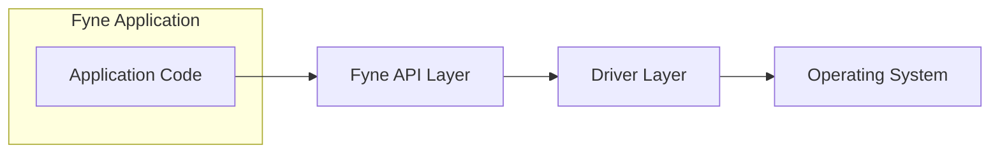
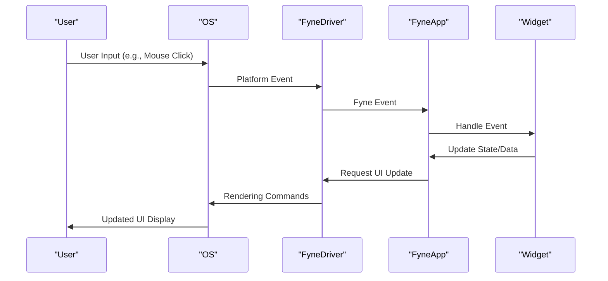

# Project Design Document: Fyne Cross-Platform GUI Toolkit

**Version:** 1.1
**Date:** October 26, 2023
**Prepared By:** Gemini (AI Language Model)

## 1. Introduction

This document provides a detailed design overview of the Fyne cross-platform GUI toolkit. It aims to capture the key architectural components, data flows, and interactions within the Fyne ecosystem. This document will serve as a robust foundation for subsequent threat modeling activities.

Fyne is an open-source, cross-platform UI toolkit written in Go. It offers a comprehensive set of widgets and APIs for building graphical applications that can run on various operating systems (desktop and mobile) and even in web browsers (via WebAssembly). A key design principle of Fyne is to provide a consistent look and feel across all supported platforms, adhering to Material Design guidelines by default.

## 2. Goals and Objectives

*   Provide a clear and comprehensive architectural overview of the Fyne toolkit.
*   Identify the core components of Fyne and delineate their specific responsibilities.
*   Describe the flow of data within Fyne applications, highlighting key interaction points.
*   Outline the communication and dependencies between Fyne applications and the underlying operating system.
*   Serve as a precise and informative basis for identifying potential security vulnerabilities during subsequent threat modeling exercises.

## 3. Target Audience

This document is intended for a diverse audience, including:

*   Security architects and engineers who will be responsible for threat modeling Fyne-based applications.
*   Software developers actively working with the Fyne toolkit to build and maintain applications.
*   System administrators involved in the deployment and management of Fyne applications within their infrastructure.
*   Anyone seeking a deeper, more technical understanding of Fyne's internal workings and design principles.

## 4. Scope

This document focuses on the core architectural aspects of the Fyne library itself. The scope includes:

*   The major architectural components that constitute the Fyne toolkit.
*   A detailed explanation of the rendering pipeline and the process by which UI elements are displayed to the user.
*   The event handling mechanism within Fyne, detailing how user interactions are captured and processed.
*   The lifecycle management of a Fyne application, from initialization to termination.
*   The interfaces and mechanisms through which Fyne interacts with platform-specific APIs.

This document explicitly excludes:

*   Specific implementation details of individual widgets and their internal logic.
*   In-depth analysis of the Go programming language's features and runtime environment.
*   Detailed information about third-party libraries utilized by Fyne, unless their interaction is directly relevant to the core architecture.
*   Step-by-step instructions or tutorials on how to develop Fyne applications.

## 5. High-Level Architecture

Fyne employs a layered architecture to achieve platform independence, abstracting away the complexities of underlying operating systems and providing a consistent API for developers. The primary layers are:

*   **Application Layer:** This is the domain of the application developer, where custom application logic and user interface definitions are implemented using the Fyne API.
*   **Fyne API Layer:** This layer provides the core set of platform-agnostic interfaces and abstractions for fundamental GUI concepts such as windows, widgets, layouts, and event handling.
*   **Driver Layer:** Acting as a crucial intermediary, this layer translates the platform-independent Fyne API calls into platform-specific instructions for the underlying operating system's graphics and input subsystems. Different drivers are implemented for each supported platform.
*   **Operating System Layer:** This is the foundation upon which the Fyne application executes, providing access to essential system resources, graphics rendering capabilities, and input handling mechanisms.

## 6. Detailed Design

### 6.1. Core Components

*   **`App`:** Represents the central application instance, responsible for managing the application's lifecycle, global settings, and shared resources.
*   **`Window`:** Represents a top-level window displayed on the screen. A Fyne application can manage multiple independent windows.
*   **`Canvas`:** The fundamental drawing surface within a `Window` where all UI elements (widgets) are rendered and managed.
*   **`Widget`:** Reusable and interactive UI components such as buttons, labels, text input fields, and more. Fyne provides a comprehensive library of built-in widgets.
*   **`Layout`:** Defines the rules and algorithms for arranging `Widget` instances within a container. Fyne offers various layout managers like `BorderLayout`, `GridLayout`, `BoxLayout`, etc.
*   **`Theme`:** Controls the visual appearance of the application, including colors, fonts, and widget styling. Fyne defaults to a Material Design-inspired theme but allows for customization.
*   **`Driver`:** A platform-specific implementation responsible for the low-level interactions with the underlying operating system's graphics and input systems. Examples include the desktop driver (utilizing OpenGL or native platform APIs), the mobile driver (leveraging Android or iOS SDKs), and the WebAssembly driver (interacting with browser APIs).
*   **`Event`:** Represents occurrences within the application, such as user interactions (mouse clicks, key presses) or system-generated signals.
*   **`Resource`:** Represents embedded data that the application utilizes, such as images, fonts, or other binary assets.

### 6.2. Rendering Pipeline

The rendering process in Fyne involves a series of steps to translate the application's UI structure into visual output:

1. **Widget Tree Construction:** The application developer defines the hierarchical structure of widgets that constitute the user interface. This tree represents the logical arrangement of UI elements.
2. **Layout Calculation:** Based on the chosen `Layout` manager, the size and position of each `Widget` within its parent container are calculated. This determines the spatial arrangement of UI elements.
3. **Canvas Rendering:** The `Canvas` object, driven by the active `Driver`, traverses the visible widgets and their associated visual properties (e.g., color, size, text).
4. **Graphics API Interaction:** The `Driver` translates the abstract rendering instructions into concrete calls to the underlying graphics API provided by the operating system (e.g., OpenGL, Direct3D, Metal, or platform-specific APIs on mobile, browser canvas APIs for WebAssembly).
5. **Display:** The operating system's graphics subsystem takes the rendered output and presents it on the user's screen.

### 6.3. Event Handling

Fyne employs an event-driven architecture to manage user interactions and system events:

1. **Event Generation:** User actions (e.g., mouse clicks, keyboard input, touch events) are detected by the operating system and relayed to the Fyne `Driver`.
2. **Event Propagation:** The `Driver` converts these platform-specific events into platform-agnostic Fyne `Event` objects.
3. **Event Dispatching:** The Fyne event system determines the appropriate `Widget` or event handler to receive the event based on the event type and its location within the UI hierarchy.
4. **Event Handling:** The application code defines event handlers (functions or methods) that are executed when specific events occur on particular widgets, allowing the application to respond to user input and other events.

### 6.4. Application Lifecycle

The lifecycle of a Fyne application follows a predictable sequence of stages:

1. **Initialization:** The `App` instance is created, and essential resources are initialized. This may involve loading settings, initializing subsystems, etc.
2. **Window Creation:** One or more `Window` instances are created and configured, defining the application's visible interface.
3. **UI Construction:** `Widget` instances are created and arranged within the `Window` using appropriate `Layout` managers.
4. **Event Loop:** The application enters its main event loop, continuously waiting for user interactions or system events to occur.
5. **Event Handling:** When an event occurs, the appropriate handler is invoked, potentially triggering changes in the application's state or UI.
6. **Termination:** When the application is closed, resources are released, and the application exits gracefully.

### 6.5. Interaction with Platform APIs

The `Driver` layer serves as the crucial bridge between the platform-independent Fyne API and the specific APIs provided by the underlying operating system. This interaction encompasses:

*   **Graphics Rendering:** Utilizing platform-specific graphics APIs (e.g., OpenGL on desktop, Metal on macOS, Direct3D on Windows, Android/iOS graphics APIs on mobile, and the browser canvas API for WebAssembly) to perform the actual drawing of UI elements.
*   **Input Handling:** Receiving and processing raw input events from the operating system (e.g., mouse movements, keyboard presses, touch gestures).
*   **Window Management:** Creating, managing, and controlling native operating system windows.
*   **System Integration:** Accessing various system resources and functionalities, such as file system access, network communication, and sensor data (where applicable to the platform).

## 7. Data Flow

The following diagram illustrates a simplified data flow representing a typical user interaction within a Fyne application:

**Description of the Data Flow:**

*   The `User` initiates an action by interacting with the application's interface (e.g., clicking a button).
*   The `OS` detects this input and generates a platform-specific event.
*   The `FyneDriver` receives this platform event and translates it into a platform-independent `Fyne Event`.
*   The `FyneApp`'s event handling mechanism dispatches the `Fyne Event` to the relevant `Widget`.
*   The `Widget`'s designated event handler is executed, potentially leading to updates in the application's internal state or data.
*   If the user interface needs to reflect these changes, the `FyneApp` requests a re-rendering of the UI.
*   The `FyneDriver` translates these rendering requests into platform-specific graphics commands.
*   The `OS`'s graphics subsystem then renders the updated user interface to the `User`'s display.

## 8. Security Considerations (Preliminary)

While the primary focus of this document is architectural design, several preliminary security considerations are apparent:

*   **Input Validation and Sanitization:** Fyne applications must implement robust input validation and sanitization techniques to prevent injection vulnerabilities (e.g., cross-site scripting in WebAssembly deployments, command injection if processing external input). This responsibility primarily lies with the application developer.
*   **Secure Data Storage:** When storing sensitive data, applications should utilize secure storage mechanisms provided by the underlying operating system (e.g., keychain on macOS/iOS, Keystore on Android) or employ robust encryption techniques. Fyne offers basic storage APIs, but developers must choose appropriate security measures.
*   **Dependency Management and Supply Chain Security:** Maintaining the security of Fyne's dependencies is crucial. Regular updates, vulnerability scanning of dependencies, and utilizing trusted sources for libraries are essential to mitigate supply chain attacks.
*   **Platform-Specific Security Measures:** Developers must be aware of and address security considerations specific to the target platform. This includes handling permissions correctly on mobile, adhering to web security best practices for WebAssembly deployments, and understanding desktop operating system security features.
*   **Code Signing and Application Integrity:** Proper code signing practices are vital to ensure the integrity and authenticity of the application, preventing tampering and assuring users of its legitimacy. Secure distribution channels are also necessary.
*   **Secure Update Mechanisms:** Implementing a secure update mechanism is crucial for delivering security patches and new features without introducing vulnerabilities. Updates should be authenticated and integrity-checked.
*   **Protection Against UI Redressing Attacks:** For web-based deployments, care must be taken to prevent UI redressing attacks (e.g., clickjacking) by implementing appropriate security headers and frame policies.
*   **Handling of Sensitive Data in UI:** Developers should avoid displaying sensitive data unnecessarily in the UI and should take precautions to prevent data leakage through screenshots or screen recordings.

These preliminary considerations will be further analyzed and expanded upon during the dedicated threat modeling process.

## 9. Deployment Considerations

Fyne applications offer flexibility in deployment across various platforms:

*   **Desktop (Windows, macOS, Linux):** Applications are typically packaged as standalone executables for each target operating system. Distribution often involves direct downloads or platform-specific package managers. Security considerations include code signing and protecting against reverse engineering.
*   **Mobile (Android, iOS):** Applications are packaged as APKs (Android) or IPAs (iOS) and are primarily distributed through official app stores (Google Play Store, Apple App Store). These platforms have their own security review processes and signing requirements.
*   **Web (via WebAssembly):** Applications can run within modern web browsers using WebAssembly. Deployment involves hosting the WebAssembly bundle and associated assets on a web server. Security considerations include adhering to web security best practices, handling cross-origin requests, and protecting against common web vulnerabilities.

Each deployment scenario presents unique security challenges and requires specific considerations during development and deployment.

## 10. Technology Stack

*   **Primary Programming Language:** Go
*   **Graphics APIs:** Primarily OpenGL on desktop platforms, platform-specific native graphics APIs (e.g., Metal on macOS, Direct3D on Windows, Android/iOS graphics APIs on mobile), and Browser Canvas API for WebAssembly deployments.
*   **Build System and Dependency Management:** Go modules
*   **Core GUI Concepts:** Adheres to fundamental widget-based UI development principles.

## 11. Glossary

*   **Widget:** A fundamental, interactive building block of the user interface (e.g., button, label, text input).
*   **Canvas:** The drawing surface within a `Window` where `Widget` instances are rendered.
*   **Driver:** A platform-specific implementation responsible for bridging the gap between the Fyne API and the underlying operating system.
*   **Layout:** Defines the rules and algorithms for arranging `Widget` instances within a container.
*   **Theme:** The visual style and appearance of the application's user interface.
*   **App:** The central application instance, managing lifecycle and resources.
*   **Window:** A top-level container for UI elements, representing a visible window on the screen.
*   **Event:** A notification of an occurrence within the application, such as user input or system signals.
*   **Resource:** Embedded data utilized by the application, such as images, fonts, or other binary assets.

This document provides a comprehensive architectural overview of the Fyne toolkit, intended to facilitate a thorough understanding of its components and interactions. It serves as a crucial input for subsequent threat modeling activities, enabling the identification and mitigation of potential security vulnerabilities.