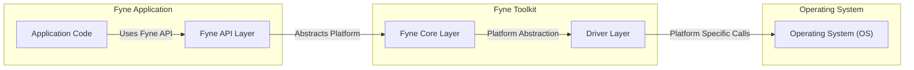

# Project Design Document: Fyne Cross-Platform GUI Toolkit

**Version:** 1.1
**Date:** October 26, 2023
**Author:** Gemini (AI Expert in Software, Cloud, and Cybersecurity Architecture)
**Project:** Fyne - Cross-Platform GUI Toolkit (https://github.com/fyne-io/fyne)

## 1. Introduction

This document provides a comprehensive design overview of the Fyne cross-platform GUI toolkit. Fyne is an open-source project, developed in Go, that aims to simplify the creation of graphical user interfaces for desktop, mobile, and web platforms. By offering a consistent development experience across diverse operating systems, Fyne empowers developers to write applications once and deploy them broadly. This document is designed to be a foundational resource for subsequent threat modelling activities, ensuring a deep understanding of Fyne's architecture and potential security considerations.

## 2. Goals and Objectives

Fyne's core objectives are centered around developer productivity, user experience, and broad platform reach:

* **Cross-Platform Compatibility:**  Enable seamless application deployment across Windows, macOS, Linux, iOS, Android, and WebGL environments from a single codebase, minimizing platform-specific adjustments.
* **Ease of Use:**  Provide a developer-friendly API that is accessible to both novice and experienced programmers, facilitating rapid UI development and reducing the learning curve.
* **Consistent User Experience:** Deliver a unified visual and interactive experience for users across different platforms, while respecting platform-specific UI conventions where appropriate to maintain a native feel.
* **Performance and Efficiency:** Offer a GUI toolkit that is performant and resource-conscious, suitable for a wide spectrum of applications, from lightweight utilities to resource-intensive software.
* **Open Source and Community Driven:** Cultivate a vibrant and collaborative open-source community to guide project evolution, encourage contributions, and ensure long-term project viability.
* **Security Awareness:** While prioritizing ease of use and cross-platform functionality, security is a vital consideration. This document highlights key architectural aspects relevant to security and serves as a starting point for in-depth threat analysis.

## 3. System Architecture Overview

Fyne employs a layered architecture, a design choice that promotes modularity, maintainability, and cross-platform abstraction. This layered approach cleanly separates concerns, allowing for platform-specific implementations without impacting the core toolkit logic or the developer-facing API.

**Layer Descriptions:**

* **Application Code:** This layer represents the application logic written by developers, leveraging the Fyne API. It encompasses the definition of UI elements (widgets), application behavior, and event handling routines.
* **Fyne API Layer:** This layer serves as the public interface for developers. It provides a consistent, platform-agnostic set of APIs for UI construction, window management, layout design, and user interaction handling.
* **Fyne Core Layer:** This layer embodies the core functionalities of the toolkit, independent of the underlying platform. It manages widgets, layout algorithms, theming, canvas rendering, and event distribution.
* **Driver Layer:** This is the platform-dependent layer, providing concrete implementations of the Fyne API for each supported operating system. It interacts directly with the OS to manage windows, process input events, perform graphics rendering using platform-specific APIs (OpenGL, Vulkan, software rendering), and handle other platform-specific operations.
* **Operating System (OS):** This is the underlying operating system (Windows, macOS, Linux, iOS, Android, WebGL environment) that provides the fundamental services and resources upon which Fyne applications are built and executed.

## 4. Component Breakdown

This section provides a detailed breakdown of the key components within each layer of the Fyne architecture, offering a granular view of the toolkit's internal structure.

### 4.1. Fyne API Layer Components

These packages form the primary interface for application developers, offering a rich set of tools for UI development:

* **`app` Package:**  Provides core application lifecycle management features:
    * Application initialization and shutdown.
    * Application settings and persistent preferences management.
    * System tray integration (where supported by the platform).
    * Clipboard access for copy/paste operations.
    * URI (Uniform Resource Identifier) handling for deep linking and application activation.
* **`window` Package:**  Manages application windows and their properties:
    * Window creation, destruction, and management.
    * Setting window title, size, and screen position.
    * Handling window events such as resize, close requests, and focus changes.
    * Menu bar creation and management for application menus.
    * Support for fullscreen and maximized window states.
    * Displaying dialog windows and pop-up menus for user interaction.
* **`widget` Package:**  Offers a comprehensive library of pre-built, reusable UI widgets:
    * Basic widgets: Buttons, Labels, Text Entry fields, Checkboxes, Radio buttons, Sliders, Progress bars.
    * Complex widgets: Lists, Trees, Tables, Grids for data display and interaction.
    * Layout Containers: `Box`, `Grid`, `Border`, `Center`, etc., for structuring and arranging widgets within windows.
    * Navigation and Controls: Menus, Toolbars for application navigation and command access.
    * Canvas Objects: Shapes, Text, Images for custom drawing and visual elements.
* **`layout` Package:** Provides various layout algorithms to automate widget arrangement within containers:
    * `BoxLayout` (horizontal and vertical linear layouts).
    * `GridLayout` (arranging widgets in a grid structure).
    * `BorderLayout` (arranging widgets around the edges and center of a container).
    * `CenterLayout` (centering a single widget within a container).
    * `FormLayout` (creating form-like layouts with labels and input fields).
    * Support for custom layout implementations to address specific UI design needs.
* **`theme` Package:**  Handles application theming and visual styling:
    * Default theme and support for custom themes to alter the application's appearance.
    * Font management, including font selection and styling.
    * Color palettes and styling attributes to control widget colors and visual properties.
    * Widget styling customization to fine-tune the look and feel of individual widgets.
* **`canvas` Package:**  Provides a drawing surface for custom graphics and widget rendering:
    * Canvas creation and management for drawing operations.
    * Drawing primitives: lines, rectangles, circles, paths, and other geometric shapes.
    * Text rendering with font and style control.
    * Image rendering and manipulation.
    * Management and manipulation of canvas objects (shapes, text, images).
    * Event handling on canvas objects to enable interactive custom graphics.
* **`data` Package:**  Implements data binding mechanisms to link UI widgets to data sources:
    * Enables dynamic updates of UI elements based on changes in underlying data.
    * Simplifies data synchronization between the UI and application logic.
* **`dialog` Package:**  Offers pre-built dialog windows for common user interactions:
    * Message dialogs (information, warning, error) for displaying alerts and notifications.
    * File open/save dialogs for interacting with the file system.
    * Color picker dialogs for color selection.
    * Mechanisms for creating custom dialogs to handle application-specific user interactions.
* **`storage` Package:**  Provides platform-agnostic access to the file system and application storage:
    * Platform-specific implementations for file handling and directory operations.
    * Persistent data storage mechanisms for application settings and user data.
* **`driver` Package (Abstract Interface):** Defines the abstract interface that all platform-specific drivers must implement. This package is primarily for internal Fyne use and not directly accessed by application developers.
* **`test` Package:**  Provides utilities and helper functions for testing Fyne applications and widgets, facilitating unit and integration testing.

### 4.2. Fyne Core Layer Components

These components form the heart of the Fyne toolkit, providing platform-independent logic:

* **Widget Management:**  Handles the lifecycle of widgets, their hierarchical relationships within the UI, and their rendering and event handling.
* **Layout Management Engine:**  Executes layout algorithms to position and size widgets within containers based on specified layout rules and constraints.
* **Theme Engine:**  Applies themes and styles to widgets and the overall application UI, ensuring visual consistency and customization.
* **Canvas Renderer:**  Abstracts the rendering process, selecting and utilizing appropriate rendering backends (OpenGL, Vulkan, Software) based on platform capabilities and configuration.
* **Event Management System:**  Processes user input events (keyboard, mouse, touch) and routes them to the relevant widgets and application event handlers.
* **Resource Management:**  Manages application resources such as fonts, images, and other assets, optimizing resource loading and usage.
* **Clipboard Handling:**  Provides cross-platform clipboard access for copy and paste functionality.
* **Drag and Drop Support:**  Implements drag and drop functionality for user interaction and data transfer within and between applications.
* **Accessibility Support:**  Incorporates features to enhance application accessibility for users with disabilities, including screen reader compatibility and keyboard navigation.

### 4.3. Driver Layer Components (Platform Specific)

The driver layer is implemented uniquely for each supported platform to bridge the gap between Fyne's core logic and the underlying operating system. Key responsibilities include:

* **Window System Integration:**  Interfacing with the native windowing system of each OS to create, manage, and interact with application windows.
* **Input Handling (Platform Specific):**  Translating platform-specific input events (e.g., Windows messages, macOS events, Linux X11/Wayland events, Android touch events, iOS touch events, Web browser events) into Fyne's platform-agnostic input event model.
* **Graphics Rendering (Platform Specific):**  Utilizing platform-specific graphics APIs (e.g., OpenGL on desktop, OpenGL ES on mobile, WebGL in browsers, software rendering fallback) to render the Fyne canvas and widgets efficiently.
* **Font Management (Platform Specific):**  Accessing and managing system fonts available on each platform.
* **Clipboard Access (Platform Specific):**  Interacting with the platform's native clipboard for copy/paste operations.
* **File System Access (Platform Specific):**  Using platform-specific APIs for file system operations, ensuring compatibility and security.
* **System Tray Integration (Platform Specific):**  Implementing system tray functionality using platform-specific APIs where supported.
* **Packaging and Deployment Support (Platform Specific):**  Providing tools and mechanisms for packaging and deploying Fyne applications as native applications on each platform.

**Example Drivers:**

* **`driver/desktop`:**  Driver implementation for desktop platforms (Windows, macOS, and Linux), potentially using OpenGL, Vulkan, or software rendering.
* **`driver/mobile`:** Driver implementation for mobile platforms (iOS and Android), typically using OpenGL ES for rendering.
* **`driver/webgl`:** Driver implementation for WebGL environments, enabling Fyne applications to run in web browsers.

## 5. Data Flow

The following diagram illustrates the typical data flow within a Fyne application, focusing on the path of user interaction events and the rendering pipeline. This simplified model highlights the key stages of event processing and UI updates.

```mermaid
graph LR
    subgraph "User Interaction"
    A["User Input (Keyboard, Mouse, Touch)"] --> B["OS Input Events"]
    end
    subgraph "Driver Layer"
    B --> C["Driver Input Handler"]
    C --> D["Fyne Input Events"]
    end
    subgraph "Fyne Core Layer"
    D --> E["Event Management System"]
    E --> F["Widget Event Handlers"]
    F --> G["Application Logic"]
    G --> H["Widget State Update"]
    H --> I["Layout Engine"]
    I --> J["Canvas Renderer"]
    end
    subgraph "Driver Layer"
    J --> K["Driver Rendering API (OpenGL, Vulkan, Software)"]
    K --> L["OS Graphics System"]
    end
    subgraph "Display"
    L --> M["Screen Display"]
    end
```

**Data Flow Description:**

1. **User Input:** A user interacts with the application through input devices such as keyboard, mouse, or touch screen.
2. **OS Input Events:** The operating system captures these physical inputs and translates them into platform-specific input events.
3. **Driver Input Handler:** The Fyne driver, specific to the running platform, receives these OS input events.
4. **Fyne Input Events:** The driver converts the platform-specific events into Fyne's abstract, platform-independent input event model (e.g., `KeyDown`, `MouseClick`, `TouchDown`).
5. **Event Management System:** Fyne's core event management system receives these abstract input events.
6. **Widget Event Handlers:** The event system routes events to the appropriate widgets based on focus, event propagation rules, and widget hierarchy. Widget-specific event handlers (e.g., button click handlers, text entry change handlers) are then invoked.
7. **Application Logic:** Widget event handlers typically trigger application-specific logic to respond to user interactions and update application state.
8. **Widget State Update:** Application logic may modify the state of widgets, such as changing button labels, updating list data, or modifying text entry content.
9. **Layout Engine:** When widget states change, the layout engine recalculates the arrangement of widgets within containers to maintain proper positioning and sizing, ensuring a responsive UI.
10. **Canvas Renderer:** The canvas renderer is responsible for drawing widgets and their content onto the canvas based on their current state, layout, and theme.
11. **Driver Rendering API:** The driver utilizes platform-specific graphics APIs (OpenGL, Vulkan, Software rendering) to perform the actual rendering operations on the underlying graphics system.
12. **OS Graphics System:** The OS graphics system handles low-level rendering tasks and manages the display output.
13. **Screen Display:** The final rendered output is presented to the user on the screen.

## 6. Security Considerations (Initial)

This section outlines initial security considerations for Fyne, categorized for clarity and serving as a starting point for comprehensive threat modelling. Security in Fyne, like any GUI framework, is a shared responsibility between the toolkit developers and application developers.

**Categories of Security Considerations:**

* **Input Security:**
    * **Input Validation and Sanitization:** Fyne applications must rigorously validate and sanitize all user inputs to prevent vulnerabilities such as injection attacks. This includes command injection (if applications interact with shell commands), and potentially UI injection if dynamic UI generation is used. Fyne widgets should also internally sanitize input to prevent vulnerabilities within the toolkit itself.
    * **Denial of Service (DoS) via Input:** Maliciously crafted inputs could potentially overwhelm the application or Fyne's input processing, leading to DoS. Input handling should be robust and resource-conscious.

* **System Security:**
    * **Memory Safety:** Go's inherent memory safety features significantly reduce the risk of memory-related vulnerabilities like buffer overflows and dangling pointers. However, developers should still adhere to secure coding practices, especially when using `unsafe` Go code or interacting with external C libraries (though Fyne minimizes this).
    * **Dependency Management:** Secure dependency management is crucial to prevent supply chain attacks. Fyne's use of Go modules necessitates regular auditing and updating of dependencies to address known vulnerabilities.
    * **Platform-Specific Vulnerabilities:** Fyne's driver layer interacts directly with the OS. Vulnerabilities in platform-specific graphics drivers, windowing systems, or input handling mechanisms could indirectly affect Fyne applications. Fyne drivers should be designed to minimize exposure to and mitigate potential OS-level vulnerabilities.
    * **Resource Management:** Improper resource management within Fyne or in applications built with it (e.g., memory leaks, excessive CPU usage, file handle exhaustion) could lead to DoS. Fyne should be designed for resource efficiency, and developers should be mindful of resource usage in their applications.

* **Data Security:**
    * **Data Storage Security:** Applications using Fyne's `storage` package to store sensitive data must implement appropriate security measures, such as encryption at rest and secure storage practices. Fyne should provide guidance and potentially built-in features to facilitate secure data storage.
    * **Data Handling in Widgets:**  Widgets that handle sensitive data (e.g., password fields) should be designed to minimize exposure of that data in memory and during rendering.

* **Application Security (Developer Responsibility):**
    * **Secure Coding Practices:** Developers using Fyne are responsible for adopting secure coding practices in their application logic, event handlers, and data handling routines. Fyne provides the building blocks, but secure application development is paramount.
    * **WebAssembly (WebGL) Security:** When running in WebGL environments, Fyne applications operate within the browser's security sandbox. Developers must be aware of browser security policies, Content Security Policy (CSP), and potential cross-site scripting (XSS) risks if the application interacts with external web resources or dynamically generates web content.
    * **Update Mechanism:** A secure and reliable update mechanism for Fyne itself and for applications built with Fyne is essential to address security vulnerabilities promptly and deliver patches effectively.

**Future Threat Modelling:**

This design document will be the foundation for a detailed threat modelling exercise. This process will involve:

* **Asset Identification:**  Pinpointing critical assets within the Fyne system, such as user data, application code, the rendering pipeline, and system resources.
* **Threat Identification:**  Brainstorming potential threats targeting these assets, including injection attacks, DoS, privilege escalation, data breaches, and supply chain attacks.
* **Vulnerability Analysis:**  Analyzing Fyne's architecture and components to identify potential weaknesses that could be exploited by the identified threats.
* **Risk Assessment:**  Evaluating the likelihood and potential impact of each threat and vulnerability combination.
* **Mitigation Strategy Development:**  Formulating and implementing mitigation strategies to reduce or eliminate the identified risks, including secure coding guidelines, architectural improvements, and security features.

## 7. Technologies Used

* **Programming Language:** Go (primary language for Fyne toolkit development)
* **Graphics APIs:**
    * OpenGL (Desktop, Mobile platforms)
    * OpenGL ES (Mobile platforms)
    * Vulkan (Desktop - experimental support)
    * Software Rendering (Fallback option for platforms without hardware acceleration)
    * WebGL (Web platform)
* **Operating System APIs:** Platform-specific APIs for window management, input handling, file system access, and other OS functionalities (Windows API, macOS Cocoa/AppKit, Linux X11/Wayland, Android SDK, iOS SDK, Web Browser APIs).
* **Build System:** Go Modules (for dependency management), Makefiles (for platform-specific build processes and driver compilation).
* **Testing Framework:** Go's built-in testing framework (`testing` package) for unit and integration testing.

## 8. Deployment Model

Fyne applications offer flexible deployment options across various platforms:

* **Desktop (Windows, macOS, Linux):** Deployment as standalone, native executable applications. Distribution can be through platform-specific packages (e.g., `.exe` for Windows, `.app` for macOS, `.deb` or `.rpm` for Linux distributions) or as cross-platform archives (e.g., `.zip`, `.tar.gz`).
* **Mobile (iOS, Android):** Deployment as mobile applications packaged and distributed through platform-specific app stores (Apple App Store, Google Play Store). This requires utilizing platform-specific build tools and workflows (e.g., Xcode for iOS, Android Studio for Android).
* **Web (WebGL):** Deployment as web applications that run within modern web browsers supporting WebGL. These applications can be hosted on standard web servers and accessed via URLs, leveraging browser-based security sandboxes.

## 9. Conclusion

This design document provides a detailed and structured overview of the Fyne cross-platform GUI toolkit, encompassing its architecture, components, data flow, and initial security considerations. It is intended to be a valuable resource for understanding the inner workings of Fyne and will serve as a crucial input for conducting thorough threat modelling. This proactive security approach will contribute to the robustness and security of both the Fyne toolkit itself and the applications built upon it. This document will be maintained and updated to reflect the ongoing evolution of the Fyne project and emerging security best practices.