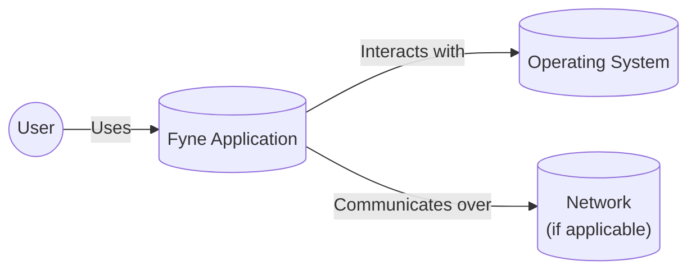
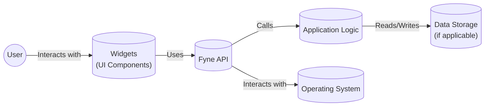
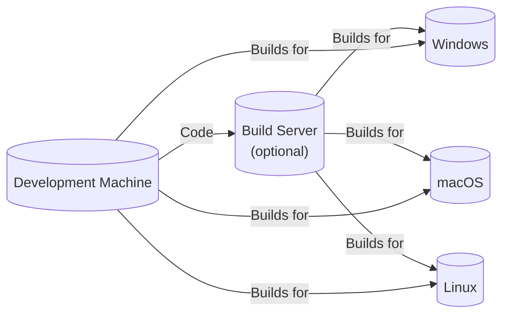
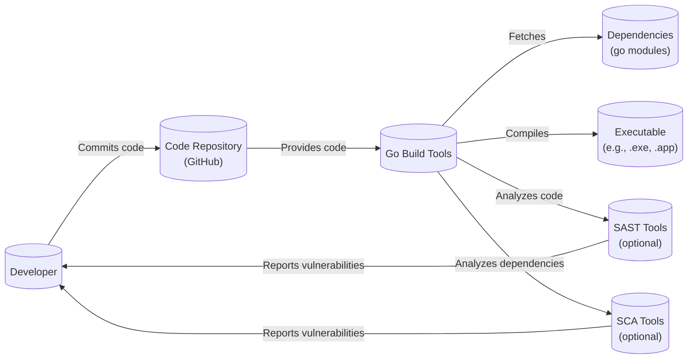

Okay, let's create a design document for the Fyne project, focusing on aspects relevant to threat modeling.

# BUSINESS POSTURE

Fyne is a cross-platform GUI toolkit built in Go.  It aims to simplify the development of desktop and mobile applications with a single codebase.  The business priorities and goals appear to be:

*   Ease of Use:  Provide a simple API for developers to create GUI applications, reducing development time and complexity.
*   Cross-Platform Compatibility:  Support a wide range of platforms (macOS, Windows, Linux, iOS, Android, and more) with a consistent look and feel.
*   Performance:  Offer a responsive and efficient user experience.
*   Open Source and Community Driven:  Foster a collaborative development environment and encourage community contributions.
*   Maintainability:  Ensure the codebase is well-structured and easy to maintain and extend.

Based on these priorities, the most important business risks are:

*   Security Vulnerabilities:  Vulnerabilities in the toolkit could be exploited to compromise applications built with Fyne, leading to data breaches, system compromise, or other malicious activities. This is the most critical risk.
*   Platform Incompatibility:  Failure to maintain compatibility with supported platforms could limit the reach and usefulness of applications built with Fyne.
*   Performance Issues:  Poor performance could lead to a negative user experience and discourage adoption.
*   Lack of Community Adoption:  Insufficient community engagement could hinder the long-term development and maintenance of the toolkit.
*   Licensing Issues:  Improper handling of licensing could lead to legal problems.

# SECURITY POSTURE

Fyne, being a GUI toolkit, relies heavily on the underlying operating system's security features.  However, it also has its own security considerations.

Existing Security Controls:

*   security control: Memory Safety (Go Language):  Fyne is written in Go, which provides built-in memory safety features like garbage collection, reducing the risk of memory corruption vulnerabilities (e.g., buffer overflows, use-after-free). Implemented in: Go language runtime.
*   security control: Input Validation: Fyne likely includes input validation mechanisms to prevent common vulnerabilities like cross-site scripting (XSS) or injection attacks, especially in text input widgets. Implemented in: Widget implementations (e.g., `Entry`, `TextGrid`). Described in: Fyne API documentation and source code.
*   security control: Secure Defaults: Fyne should strive to use secure defaults for its components, minimizing the risk of misconfiguration by developers. Implemented in: Widget constructors and default property values. Described in: Fyne API documentation.
*   security control: Regular Updates: The Fyne project appears to be actively maintained, with regular releases that likely include security fixes. Implemented in: Release process. Described in: GitHub releases and changelogs.
*   security control: Community Security Audits: As an open-source project, Fyne benefits from community scrutiny, which can help identify and address security vulnerabilities. Implemented in: Community contributions and issue tracking. Described in: GitHub issues and pull requests.
*   security control: Use of standard libraries: Fyne uses standard Go libraries. Implemented in: Go standard libraries.

Accepted Risks:

*   accepted risk: Third-Party Dependencies: Fyne, like any project, depends on third-party libraries.  Vulnerabilities in these dependencies could impact Fyne's security. This is a common accepted risk, mitigated by regular dependency updates and vulnerability scanning.
*   accepted risk: Platform-Specific Vulnerabilities:  Fyne relies on the underlying operating system and graphics libraries.  Vulnerabilities in these components could affect Fyne applications, even if Fyne itself is secure.
*   accepted risk: Developer Misuse:  Developers using Fyne could introduce security vulnerabilities in their applications, even if the toolkit itself is secure. This is mitigated by providing secure defaults and clear documentation.

Recommended Security Controls:

*   security control: Content Security Policy (CSP): If Fyne supports web-based rendering (e.g., through a WebView), implementing CSP can help mitigate XSS vulnerabilities.
*   security control: Static Analysis Security Testing (SAST): Integrate SAST tools into the build process to automatically identify potential security vulnerabilities in the Fyne codebase.
*   security control: Dynamic Analysis Security Testing (DAST): Perform regular DAST scans of example Fyne applications to identify runtime vulnerabilities.
*   security control: Software Composition Analysis (SCA): Use SCA tools to track and manage third-party dependencies, identifying known vulnerabilities and outdated components.
*   security control: Fuzz Testing: Implement fuzz testing to identify unexpected behavior and potential vulnerabilities in Fyne's input handling.

Security Requirements:

*   Authentication: Fyne itself does not handle authentication. This is the responsibility of the application developer using Fyne.
*   Authorization: Fyne itself does not handle authorization. This is the responsibility of the application developer using Fyne.
*   Input Validation: All user input must be validated to prevent injection attacks and other common vulnerabilities.  Fyne should provide convenient mechanisms for developers to perform input validation.
*   Cryptography: Fyne should use appropriate cryptographic libraries for any security-sensitive operations (e.g., storing passwords, encrypting data).  It should not implement its own cryptographic algorithms. Fyne should rely on the Go standard library's `crypto` package.

# DESIGN

## C4 CONTEXT

Element Descriptions:

*   Element:
    *   Name: User
    *   Type: Person
    *   Description: A person interacting with a Fyne application.
    *   Responsibilities: Provides input to the application, views output from the application.
    *   Security controls: None (handled by the application and operating system).

*   Element:
    *   Name: Fyne Application
    *   Type: Software System
    *   Description: An application built using the Fyne GUI toolkit.
    *   Responsibilities: Provides the application's functionality, handles user input, displays output, interacts with the operating system.
    *   Security controls: Input validation, secure defaults, memory safety (via Go), any application-specific security controls implemented by the developer.

*   Element:
    *   Name: Operating System
    *   Type: Software System
    *   Description: The underlying operating system (e.g., Windows, macOS, Linux, iOS, Android).
    *   Responsibilities: Provides the runtime environment for the Fyne application, manages system resources, handles low-level graphics and input events.
    *   Security controls: OS-level security features (e.g., process isolation, memory protection, access controls).

*   Element:
    *   Name: Network
    *   Type: Network
    *   Description: The network (e.g., internet, local network) if the application uses network communication.
    *   Responsibilities: Transmits data between the Fyne application and other systems.
    *   Security controls: Network-level security controls (e.g., firewalls, intrusion detection systems), application-level security controls (e.g., TLS/SSL).

## C4 CONTAINER

Since Fyne is a toolkit, the "containers" are largely defined by the application using it. However, we can represent the core components of a typical Fyne application.

Element Descriptions:

*   Element:
    *   Name: User
    *   Type: Person
    *   Description: A person interacting with a Fyne application.
    *   Responsibilities: Provides input to the application, views output from the application.
    *   Security controls: None (handled by the application and operating system).

*   Element:
    *   Name: Widgets
    *   Type: Container
    *   Description: The UI components of the Fyne application (e.g., buttons, text fields, labels).
    *   Responsibilities: Display information to the user, receive user input.
    *   Security controls: Input validation, secure defaults.

*   Element:
    *   Name: Application Logic
    *   Type: Container
    *   Description: The core logic of the Fyne application.
    *   Responsibilities: Handles application-specific functionality, processes user input, interacts with data storage.
    *   Security controls: Application-specific security controls implemented by the developer.

*   Element:
    *   Name: Data Storage
    *   Type: Container
    *   Description: The data storage mechanism used by the application (e.g., files, database).
    *   Responsibilities: Stores and retrieves application data.
    *   Security controls: Data encryption, access controls, database security measures (if applicable).

*   Element:
    *   Name: Fyne API
    *   Type: Container
    *   Description: The Fyne API, providing the interface between the application code and the Fyne toolkit.
    *   Responsibilities: Provides functions for creating and managing UI components, handling events, and interacting with the operating system.
    *   Security controls: Memory safety (via Go), secure defaults.

*   Element:
    *   Name: Operating System
    *   Type: Software System
    *   Description: The underlying operating system.
    *   Responsibilities: Provides the runtime environment, manages resources, handles graphics and input.
    *   Security controls: OS-level security features.

## DEPLOYMENT

Fyne applications can be deployed in various ways, depending on the target platform. Here are some possible solutions:

1.  **Native Executables:**  Compile the Go code into a native executable for each target platform (e.g., .exe for Windows, .app for macOS).
2.  **Mobile App Packages:**  Package the application into a mobile app package (e.g., .apk for Android, .ipa for iOS).
3.  **WebAssembly (Experimental):**  Compile the application to WebAssembly for web deployment (this is still experimental in Fyne).

We'll describe the Native Executables deployment in detail:

Element Descriptions:

*   Element:
    *   Name: Development Machine
    *   Type: Infrastructure Node
    *   Description: The developer's machine where the code is written and compiled.
    *   Responsibilities: Code development, compilation, testing.
    *   Security controls: Developer machine security (e.g., antivirus, firewall).

*   Element:
    *   Name: Build Server (optional)
    *   Type: Infrastructure Node
    *   Description: A server used for automated builds and continuous integration.
    *   Responsibilities: Compiles the code for different platforms, runs tests, creates release artifacts.
    *   Security controls: Server security (e.g., access controls, vulnerability scanning), build process security (e.g., SAST, SCA).

*   Element:
    *   Name: Windows
    *   Type: Operating System
    *   Description: A Windows operating system instance where the Fyne application can be deployed.
    *   Responsibilities: Runs the compiled Fyne application.
    *   Security controls: Windows security features.

*   Element:
    *   Name: macOS
    *   Type: Operating System
    *   Description: A macOS operating system instance where the Fyne application can be deployed.
    *   Responsibilities: Runs the compiled Fyne application.
    *   Security controls: macOS security features.

*   Element:
    *   Name: Linux
    *   Type: Operating System
    *   Description: A Linux operating system instance where the Fyne application can be deployed.
    *   Responsibilities: Runs the compiled Fyne application.
    *   Security controls: Linux security features.

## BUILD

The build process for Fyne applications typically involves using the Go build tools.  Here's a description and diagram:

Description:

1.  **Code Commit:** The developer commits code changes to the code repository (e.g., GitHub).
2.  **Go Build:** The Go build tools (`go build`, `go install`) are used to compile the code.
3.  **Dependency Management:** Go modules are used to manage dependencies. The build tools automatically fetch and manage the required dependencies.
4.  **Compilation:** The Go compiler compiles the code and dependencies into a native executable for the target platform.
5.  **SAST (Optional):** Static Analysis Security Testing tools (e.g., GoSec) can be integrated into the build process to scan the code for potential vulnerabilities.
6.  **SCA (Optional):** Software Composition Analysis tools (e.g., Snyk, Dependabot) can be used to scan the dependencies for known vulnerabilities.
7.  **Executable:** The build process produces a native executable file that can be deployed to the target platform.

Security Controls:

*   security control: Go Build Tools: The Go build tools provide built-in security features, such as memory safety checks.
*   security control: Dependency Management: Go modules help manage dependencies and ensure that the correct versions are used.
*   security control: SAST (Optional): SAST tools can identify potential vulnerabilities in the code.
*   security control: SCA (Optional): SCA tools can identify known vulnerabilities in the dependencies.
*   security control: Code Signing (Optional): The executable can be code-signed to ensure its authenticity and integrity.

# RISK ASSESSMENT

*   Critical Business Processes:
    *   Application Functionality: The primary business process is the correct and reliable functioning of applications built with Fyne.
    *   Development Workflow: The ability for developers to efficiently create and maintain Fyne applications.
    *   Cross-Platform Compatibility: Maintaining compatibility with supported platforms.

*   Data to Protect:
    *   Application Data: The sensitivity of the data depends on the specific application built with Fyne. This could range from non-sensitive data to highly sensitive data (e.g., personal information, financial data).
    *   Source Code: The Fyne source code itself is open source, but developers' application code may contain sensitive information.
    *   User Credentials: If an application handles user authentication, user credentials (e.g., passwords) are highly sensitive and must be protected.

Data Sensitivity:

*   Application Data: Varies depending on the application.
*   Source Code: Potentially sensitive (for application code, not Fyne itself).
*   User Credentials: Highly sensitive.

# QUESTIONS & ASSUMPTIONS

Questions:

*   What specific types of applications are commonly built with Fyne? This will help determine the typical data sensitivity and security requirements.
*   Are there any plans to add built-in support for specific security features (e.g., encryption, authentication helpers)?
*   What is the process for reporting and addressing security vulnerabilities in Fyne?
*   What level of support is provided for older versions of Fyne?
*   What are the specific target platforms and their minimum supported versions?

Assumptions:

*   BUSINESS POSTURE: Fyne's primary goal is to provide a user-friendly and cross-platform GUI toolkit. Security is a high priority, but usability and ease of development are also key considerations.
*   SECURITY POSTURE: Developers using Fyne are responsible for implementing application-specific security controls. Fyne provides a foundation for building secure applications, but it does not guarantee the security of applications built with it.
*   DESIGN: The design diagrams provided are representative of typical Fyne applications, but the specific architecture may vary depending on the application's complexity and functionality. The build process relies primarily on the standard Go build tools.