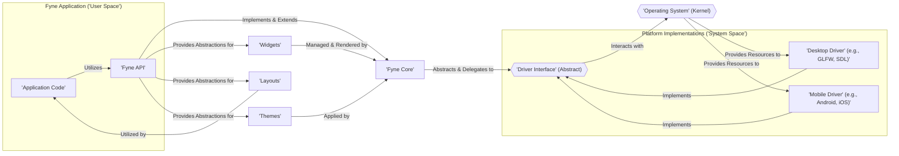
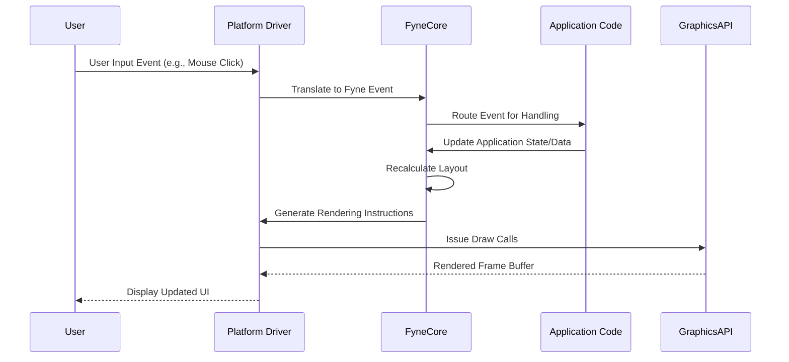

# Project Design Document: Fyne Cross-Platform GUI Toolkit

**Version:** 1.1
**Date:** October 26, 2023
**Author:** AI Software Architect

## 1. Introduction

This document provides an enhanced architectural design of the Fyne cross-platform GUI toolkit. Fyne is an open-source, Go-based library enabling the creation of graphical user interfaces (GUIs) that run on a variety of operating systems and devices. This revised document offers greater detail on the key components, their interactions, and the overall structure of Fyne, specifically tailored for subsequent threat modeling activities. The aim is to facilitate the identification of potential security vulnerabilities and the design of appropriate mitigation strategies.

## 2. Goals and Objectives

The core goals of the Fyne project are:

- To offer a straightforward and intuitive API for developing cross-platform GUIs using the Go programming language.
- To ensure a consistent visual presentation and user experience across different operating systems.
- To provide support for a broad spectrum of desktop and mobile platforms.
- To be easily accessible and usable for developers with varying levels of experience.
- To maintain a compact size and efficient performance profile.

## 3. High-Level Architecture

Fyne is structured using a layered architecture to achieve platform independence and maintainability. The interaction between the core components is essential for the functionality of building and executing GUI applications.

**Key Components:**

- **Application Code ('User Space'):** The Go source code written by the application developer, which defines the specific GUI application's logic and user interface using the Fyne API. This operates within the application's process space.
- **Fyne API:** The public set of Go packages and interfaces exposed by the Fyne library. This is the primary interaction point for developers and includes functionalities for creating windows, widgets, layouts, handling user events, managing data, and customizing the application's appearance.
- **Fyne Core:** The central logic of the Fyne toolkit. It manages the application lifecycle, orchestrates the rendering pipeline, handles event distribution, and interacts with the platform-specific drivers through the defined interface.
- **Driver Interface (Abstract):** A set of abstract Go interfaces that define the contract for platform-specific driver implementations. This ensures a consistent way for the Fyne Core to interact with diverse operating systems and graphics subsystems.
- **Desktop Drivers ('System Space'):** Concrete implementations of the Driver Interface tailored for desktop operating systems (e.g., Windows, macOS, Linux). These drivers often rely on libraries like GLFW or SDL for low-level window management, input handling, and OpenGL/Vulkan context creation. They operate closer to the system level.
- **Mobile Drivers ('System Space'):** Concrete implementations of the Driver Interface for mobile operating systems (e.g., Android, iOS). These drivers interact with the native UI frameworks (Android SDK, UIKit) of the respective platforms, bridging Fyne's abstractions with the platform's native components.
- **Operating System (Kernel):** The underlying operating system providing essential services and resources to the drivers, including window management, input event delivery, and access to graphics hardware.
- **Widgets:** Reusable, pre-built UI elements offered by the Fyne API, such as buttons, labels, text inputs, and lists. These components encapsulate both visual representation and basic interaction logic.
- **Layouts:** Mechanisms provided by the Fyne API for structuring and arranging widgets within a window or container. Layouts define how widgets are positioned and resized in response to window changes or content updates.
- **Themes:** Define the visual style of the application, encompassing aspects like color palettes, font styles, and widget-specific styling. Themes allow for customization of the application's look and feel.

## 4. Detailed Component Description

### 4.1. Application Code ('User Space')

- Represents the custom Go code developed to create a specific GUI application using the Fyne library.
- Directly interacts with the Fyne API to define the user interface, handle user interactions, and implement application-specific logic.
- Determines the unique functionality and user experience of the application.
- Is compiled into a platform-specific executable or application package.
- **Security Relevance:** Potential vulnerabilities here include insecure handling of user input, improper data management, and logic flaws that could be exploited.

### 4.2. Fyne API

- Provides a structured set of Go packages and interfaces for GUI development.
- Key packages include:
    - `app`: Manages the application lifecycle, including initialization and shutdown.
    - `widget`: Offers a library of pre-built, interactive UI components.
    - `container`: Provides various layout managers for arranging widgets.
    - `canvas`: Enables custom drawing and the creation of interactive graphical elements.
    - `dialog`: Facilitates the display of standard modal dialog boxes for user interaction.
    - `data`: Supports data binding and management for dynamic UI updates.
    - `theme`: Allows customization of the application's visual appearance.
    - `storage`: Provides abstractions for accessing the local file system and application preferences.
- Abstracts away platform-specific complexities, enabling developers to write largely platform-agnostic GUI code.
- **Security Relevance:**  The API design itself can introduce vulnerabilities if not carefully implemented. For example, insecure default settings or lack of proper input sanitization within API functions could be exploited.

### 4.3. Fyne Core

- Implements the fundamental logic of the Fyne toolkit, acting as the central coordinator.
- Manages the application's main event loop and the processing of user interactions and system events.
- Orchestrates the rendering pipeline, translating widget descriptions and layout information into platform-specific drawing commands for the drivers.
- Implements layout algorithms to determine the position and size of widgets within containers.
- Manages the application's active theme and applies the defined visual styles to UI elements.
- Communicates with the underlying platform drivers through the standardized Driver Interface.
- **Security Relevance:**  Vulnerabilities in the core logic, such as improper state management or flawed rendering logic, could lead to crashes or unexpected behavior. Incorrect handling of events could also be a potential attack vector.

### 4.4. Driver Interface (Abstract)

- Defines a set of Go interfaces that *must* be implemented by platform-specific drivers.
- Includes methods for essential GUI operations, such as:
    - Creating and managing application windows.
    - Handling user input events from keyboard, mouse, and touch devices.
    - Performing graphics rendering operations using platform-appropriate APIs (OpenGL, Vulkan, native APIs).
    - Managing clipboard interactions for copy and paste functionality.
    - Accessing system-level resources like timers and sensors.
- Ensures a consistent communication protocol between the Fyne Core and the platform-specific implementations.
- **Security Relevance:**  The design of this interface is crucial for security. If the interface allows for insecure operations or lacks necessary security considerations, it can create vulnerabilities in the drivers.

### 4.5. Desktop Drivers ('System Space')

- Concrete implementations of the Driver Interface specifically for desktop operating systems.
- Commonly utilize external libraries like GLFW or SDL to handle low-level tasks such as window creation, input event handling, and OpenGL context management.
- Manage the platform-specific event loops and rendering mechanisms required for desktop environments.
- Examples include drivers based on OpenGL for rendering and GLFW for window and input management.
- **Security Relevance:**  Desktop drivers are a potential attack surface. Vulnerabilities in the underlying libraries (GLFW, SDL) or in the driver's implementation of the Driver Interface could be exploited. Access to system resources also needs careful management.

### 4.6. Mobile Drivers ('System Space')

- Concrete implementations of the Driver Interface tailored for mobile operating systems like Android and iOS.
- Interact directly with the native UI frameworks of these platforms (e.g., Android SDK, UIKit).
- Handle touch input events and manage platform-specific application lifecycle events (e.g., pausing, resuming).
- Leverage the native rendering capabilities provided by the mobile operating systems.
- **Security Relevance:** Mobile drivers must adhere to the security models of the respective platforms. Improper interaction with native APIs or mishandling of permissions can introduce significant security risks.

### 4.7. Operating System (Kernel)

- Provides the foundational environment for Fyne applications and drivers to operate.
- Offers core services such as window management, input event delivery, file system access, and graphics driver support.
- The specific operating system in use dictates which driver implementation is loaded and utilized by Fyne.
- **Security Relevance:** The security of the underlying operating system directly impacts the security of Fyne applications. Vulnerabilities in the OS kernel or its services can be exploited by malicious actors.

### 4.8. Widgets

- Pre-built, reusable UI components that developers can assemble to construct application interfaces.
- Examples include:
    - `Button`: For triggering user actions.
    - `Label`: For displaying static text.
    - `Entry`: For single-line text input from the user.
    - `TextArea`: For multi-line text input.
    - `List`: For displaying scrollable lists of items.
    - `Canvas`: For enabling custom drawing and interactive graphical elements.
- Widgets encapsulate both their visual appearance and basic interaction behavior.
- **Security Relevance:** Widgets are a primary point of user interaction. Vulnerabilities in widget implementations, such as lack of input sanitization or improper event handling, can be exploited.

### 4.9. Layouts

- Define the rules and algorithms for arranging widgets within a container.
- Examples include:
    - `BorderLayout`: Arranges widgets around the edges (North, South, East, West) and in the center.
    - `HBoxLayout`: Arranges widgets horizontally in a row.
    - `VBoxLayout`: Arranges widgets vertically in a column.
    - `GridLayout`: Arranges widgets in a two-dimensional grid.
    - `StackLayout`: Overlaps widgets on top of each other.
- Layouts automatically adjust widget positions and sizes in response to changes in window size or content.
- **Security Relevance:** While layouts themselves are less likely to be direct sources of vulnerabilities, incorrect layout configurations or unexpected behavior in layout algorithms could potentially be exploited to create denial-of-service conditions or obscure critical UI elements.

### 4.10. Themes

- Define the visual styling of the application, providing a consistent look and feel.
- Control aspects such as:
    - Color palettes (primary, secondary, background, text colors).
    - Font styles and sizes.
    - Widget-specific styling (e.g., button borders, background gradients).
- Fyne provides default themes, and developers can create custom themes to match their application's branding.
- **Security Relevance:**  Themes themselves are generally not a direct security risk. However, if custom themes are loaded from untrusted sources, they could potentially contain malicious code or manipulate the UI in deceptive ways (though this is less likely in Fyne's current architecture).

## 5. Data Flow

The following describes the typical flow of data within a Fyne application, highlighting key interactions between components:

- **User Interaction:** A user interacts with the application through input devices (mouse click, keyboard press, touch gesture).
- **Driver Input Capture:** The platform-specific driver intercepts the raw input event from the operating system.
- **Event Translation and Propagation:** The driver translates the raw input into a Fyne-specific event and propagates it to the Fyne Core.
- **Event Handling and Routing:** The Fyne Core determines which widget or application component is the target of the event based on the event type and location.
- **Application Logic Execution:** The application code's event handler for the targeted widget or component is executed, potentially updating the application's internal state or triggering actions.
- **Rendering Request Initiation:** If the application state changes as a result of the event, a request to re-render the affected parts of the UI is initiated.
- **Layout Calculation and Update:** The Fyne Core recalculates the layout of the widgets within the affected containers to reflect any changes in size or visibility.
- **Rendering Instructions Generation:** The Fyne Core generates platform-agnostic rendering instructions based on the current state of the widgets and their layout.
- **Driver Rendering Execution:** The Fyne Core passes these rendering instructions to the appropriate platform-specific driver.
- **Graphics API Interaction:** The driver utilizes the underlying graphics API (e.g., OpenGL, Vulkan, native platform APIs) to draw the UI elements on the screen.
- **Display Update:** The rendered UI is presented to the user on the display.

## 6. Security Considerations (Detailed)

This section expands on the initial security considerations, providing more specific examples of potential threats and vulnerabilities related to the Fyne architecture.

- **Input Validation and Sanitization:**
    - **Threat:** Malicious user input through widgets like `Entry` or `TextArea` could lead to code injection (though less likely in Go), cross-site scripting (if rendering web content), or buffer overflows (less common in Go's memory-managed environment).
    - **Mitigation:** Implement robust input validation and sanitization within the application code before processing user-provided data. Fyne could potentially offer built-in sanitization helpers.
- **Dependency Management:**
    - **Threat:** Vulnerabilities in third-party libraries used by Fyne (e.g., GLFW, SDL) or by the application itself could be exploited.
    - **Mitigation:** Maintain up-to-date dependencies, regularly audit dependencies for known vulnerabilities, and consider using dependency scanning tools.
- **Platform-Specific Security Vulnerabilities:**
    - **Threat:** Exploitable vulnerabilities in the underlying operating system, graphics drivers, or native UI frameworks could be leveraged to compromise the application.
    - **Mitigation:** Stay informed about platform-specific security advisories and encourage users to keep their systems updated. Fyne's driver implementations should adhere to platform security best practices.
- **Resource Management:**
    - **Threat:** Improper management of resources (memory, file handles, network connections) could lead to denial-of-service attacks or resource exhaustion.
    - **Mitigation:** Implement careful resource allocation and deallocation within the Fyne Core, drivers, and application code. Implement safeguards against excessive resource consumption.
- **Code Injection (Less Likely in Go):**
    - **Threat:** Although Go's memory safety features mitigate many code injection risks, vulnerabilities could still arise if the application interacts with external data in unsafe ways or uses `unsafe` packages improperly.
    - **Mitigation:** Avoid using `unsafe` packages unless absolutely necessary and with extreme caution. Carefully sanitize any external data before processing.
- **Data Storage Security:**
    - **Threat:** Sensitive data stored using Fyne's `storage` package could be vulnerable if not properly protected.
    - **Mitigation:** Implement encryption for sensitive data at rest. Follow platform-specific best practices for secure data storage. Consider providing options for secure credential management.
- **Network Communication Security:**
    - **Threat:** If the application communicates over a network, it is susceptible to network-based attacks (e.g., man-in-the-middle, eavesdropping).
    - **Mitigation:** Use secure communication protocols like TLS/SSL for all network traffic. Implement proper authentication and authorization mechanisms.
- **Permissions on Mobile Platforms:**
    - **Threat:** Requesting excessive or unnecessary permissions on mobile platforms increases the attack surface and could be a privacy risk.
    - **Mitigation:** Adhere to the principle of least privilege and request only the permissions strictly necessary for the application's functionality. Clearly explain permission requests to the user.
- **UI Redressing/Clickjacking:**
    - **Threat:** Malicious websites could embed the Fyne application's UI in a frame and trick users into performing unintended actions.
    - **Mitigation:** Implement frame busting techniques or use Content Security Policy (CSP) headers where applicable (especially for WebAssembly deployments).
- **Side-Channel Attacks:**
    - **Threat:** Information leakage through observable side effects of the application's execution, such as timing variations or resource consumption.
    - **Mitigation:** While difficult to fully eliminate, be aware of potential side-channel vulnerabilities when handling sensitive data or performing cryptographic operations.

## 7. Deployment

Fyne applications are typically deployed as native executables or application packages tailored for each target platform.

- **Desktop (Windows, macOS, Linux):**
    - Applications are compiled into standalone executables that bundle the necessary Fyne libraries and assets.
    - **Security Considerations:** Ensure executables are signed to verify their authenticity and prevent tampering. Consider using platform-specific security features like code signing and sandboxing.
- **Mobile (Android, iOS):**
    - Applications are built into platform-specific packages (APK for Android, IPA for iOS) that can be installed on mobile devices through app stores or sideloading.
    - **Security Considerations:** Adhere to app store security guidelines and code signing requirements. Properly manage permissions and secure inter-process communication.
- **WebAssembly (Experimental):**
    - Fyne applications can be compiled to WebAssembly, allowing them to run within web browsers.
    - **Security Considerations:** WebAssembly applications operate within the browser's security sandbox. Be mindful of browser security policies and potential vulnerabilities in the WebAssembly runtime. Implement appropriate content security policies (CSP). Secure communication with backend services is crucial.

## 8. Technologies Used

- **Primary Programming Language:** Go
- **Graphics Rendering Libraries:** OpenGL (primarily used for cross-platform rendering), Vulkan (potential future enhancement for improved performance and control), platform-specific graphics APIs (DirectX on Windows, Metal on macOS/iOS for native drivers).
- **Windowing and Input Management Libraries:** GLFW (a popular cross-platform library for window creation and input handling), SDL (another cross-platform library offering similar functionalities, potentially used in some driver implementations), native platform APIs (for direct interaction with the operating system's windowing and input systems on mobile).
- **Build Tools:** The standard Go toolchain (`go build`, `go install`). Platform-specific build tools (e.g., Xcode for iOS, Android Studio for Android) are used for packaging mobile applications.

## 9. Future Considerations

- **Enhanced Built-in Security Features:** Explore incorporating more security-focused features directly into the Fyne API, such as input sanitization utilities, secure data storage abstractions, and protection against common UI-based attacks.
- **Improved WebAssembly Security and Capabilities:** Further develop and harden the WebAssembly backend, addressing potential security concerns and expanding its feature set.
- **Accessibility Enhancements:** Continuously improve accessibility features to ensure applications are usable by individuals with disabilities, which can also have security implications (e.g., preventing reliance on visual cues alone).
- **Performance Optimization and Security Trade-offs:** Continuously optimize rendering performance and resource utilization while carefully considering the security implications of performance-related optimizations.
- **Formal Security Audits:** Conduct regular security audits by external experts to identify and address potential vulnerabilities in the Fyne codebase.

This improved design document provides a more detailed and security-focused overview of the Fyne architecture. It serves as a solid foundation for conducting a comprehensive threat modeling exercise to identify potential security risks and design effective mitigation strategies.
