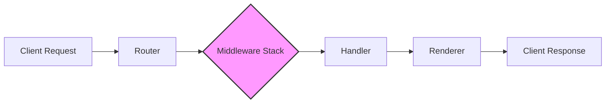

## Project Design Document: Gin Web Framework (Improved)

**1. Introduction**

This document provides a detailed architectural design of the Gin web framework (https://github.com/gin-gonic/gin). This improved version aims to enhance clarity and provide a more robust foundation for future threat modeling activities. A comprehensive understanding of the system's components, data flow, and potential vulnerabilities is crucial for effective security analysis. Gin is a lightweight HTTP web framework written in Go, known for its Martini-like API and high performance, achieved through the use of `httprouter`. It is primarily used for building high-performance RESTful APIs and web applications.

**2. Goals**

*   Provide a clear and comprehensive overview of the Gin framework's architecture, with enhanced detail.
*   Identify key components and their interactions, including sub-components where relevant.
*   Describe the data flow within the framework in more detail, highlighting data transformations.
*   Explicitly outline the responsibilities of each major component.
*   Highlight security-relevant aspects of the design with more specific examples of potential threats.
*   Serve as a robust basis for subsequent threat modeling exercises, facilitating the identification of attack surfaces and vulnerabilities.

**3. Target Audience**

This document is intended for:

*   Security engineers and architects performing threat modeling and security assessments.
*   Developers contributing to or building applications using the Gin framework.
*   Operations teams responsible for deploying and maintaining applications built with Gin.

**4. System Architecture**

The Gin framework employs a layered architecture, centered around the concept of a request context and a pipeline of middleware. This architecture promotes modularity and allows for the interception and manipulation of requests and responses at various stages.

**5. Data Flow (Detailed)**

The journey of an HTTP request through a Gin application involves several stages, with data transformations occurring at each step:

1. **"Client Request"**: An HTTP request originates from a client (browser, API consumer, etc.). This request includes headers, method, path, and potentially a body.
2. **"Router"**: The request is received by Gin's router (`httprouter`).
    *   **Responsibility:** Matches the incoming request's method and path against registered routes.
    *   **Data Transformation:**  Identifies the appropriate handler and extracts route parameters.
3. **"Middleware Stack"**: The request passes through a chain of middleware functions. Each middleware can:
    *   **Responsibility:** Intercept and process the request and response. Examples include logging, authentication, authorization, request modification, and error handling.
    *   **Data Transformation:** Middleware can modify request headers, body, or the `gin.Context`. They can also generate responses, short-circuiting the pipeline.
4. **"Handler"**: The designated handler function for the matched route is executed.
    *   **Responsibility:** Contains the core application logic to process the request and generate a response.
    *   **Data Transformation:** Processes request data, interacts with backend services, and prepares data for rendering.
5. **"Renderer"**: The handler utilizes a renderer to format the response data.
    *   **Responsibility:** Converts the data into a specific format (JSON, HTML, XML, etc.) for the client.
    *   **Data Transformation:** Serializes data into the chosen format, setting appropriate content-type headers.
6. **"Client Response"**: The formatted response is sent back to the client.

**6. Key Components (Detailed)**

*   **"Router" (github.com/julienschmidt/httprouter):**  The core routing engine.
    *   **Sub-components:**
        *   **Trie Data Structure:**  Efficiently stores and matches routes.
        *   **Route Handlers:**  Functions associated with specific routes.
        *   **Parameter Extraction Logic:**  Identifies and extracts parameters from the request path.
    *   **Responsibilities:**
        *   Receiving incoming HTTP requests.
        *   Parsing the request method and path.
        *   Matching the request to a registered route.
        *   Extracting route parameters.
        *   Handling 404 (Not Found) and 405 (Method Not Allowed) errors.
*   **"Middleware Stack"**: An ordered collection of middleware functions.
    *   **Responsibilities:**
        *   Intercepting requests before they reach the handler.
        *   Modifying requests and responses.
        *   Performing authentication and authorization checks.
        *   Logging request details.
        *   Handling errors and panics.
        *   Setting HTTP headers.
    *   **Examples of Middleware:**
        *   `Logger()`: Logs request information.
        *   `Recovery()`: Recovers from panics.
        *   Custom authentication middleware.
        *   Rate limiting middleware.
*   **"Context" (`gin.Context`):**  The central object for managing request-scoped data.
    *   **Responsibilities:**
        *   Providing access to the underlying `http.Request` and `http.ResponseWriter`.
        *   Storing and retrieving request-specific data using `Set()` and `Get()`.
        *   Accessing request parameters, headers, and body.
        *   Setting response headers and status codes.
        *   Rendering responses using various renderers.
        *   Aborting the request processing pipeline.
        *   Managing request cancellation.
*   **"Handler"**: The application logic for processing a specific request.
    *   **Responsibilities:**
        *   Receiving the `gin.Context`.
        *   Processing request data.
        *   Interacting with backend services (databases, APIs, etc.).
        *   Preparing data for the response.
        *   Calling a renderer to generate the response.
*   **"Renderer"**: Responsible for formatting the response data.
    *   **Types of Renderers:**
        *   `JSONRenderer`: Serializes data to JSON.
        *   `HTMLRenderer`: Renders HTML templates.
        *   `XMLRenderer`: Serializes data to XML.
        *   `StringRenderer`: Sends plain text.
        *   `RedirectRenderer`: Performs HTTP redirects.
        *   `FileRenderer`: Sends files.
        *   Custom Renderers.
    *   **Responsibilities:**
        *   Taking data as input.
        *   Serializing or formatting the data according to the chosen format.
        *   Setting the appropriate `Content-Type` header.
        *   Writing the response to the `http.ResponseWriter`.

**7. Security Considerations (Enhanced)**

This section outlines potential security vulnerabilities and considerations related to the Gin framework's architecture.

*   **Input Validation Vulnerabilities:**
    *   **Threat:**  Attackers can inject malicious data (e.g., SQL injection, XSS payloads, command injection) if input is not properly validated in handlers and middleware.
    *   **Affected Components:** Router (path parameters), Middleware (request body, headers), Handlers (all input).
    *   **Mitigation:** Implement robust input validation using libraries or custom logic. Sanitize and escape data before use.
*   **Cross-Site Scripting (XSS):**
    *   **Threat:**  Malicious scripts can be injected into web pages if user-generated content is not properly escaped during HTML rendering.
    *   **Affected Components:** HTMLRenderer.
    *   **Mitigation:** Use template engines with auto-escaping features or manually escape output. Implement Content Security Policy (CSP).
*   **Cross-Site Request Forgery (CSRF):**
    *   **Threat:**  Attackers can trick users into performing unintended actions on a web application they are authenticated with.
    *   **Affected Components:** Handlers that perform state-changing operations.
    *   **Mitigation:** Implement CSRF protection mechanisms using tokens (e.g., synchronizer token pattern).
*   **SQL Injection:**
    *   **Threat:**  Attackers can manipulate database queries by injecting malicious SQL code.
    *   **Affected Components:** Handlers that interact with databases.
    *   **Mitigation:** Use parameterized queries or ORM libraries to prevent direct SQL injection. Follow the principle of least privilege for database access.
*   **Authentication and Authorization Weaknesses:**
    *   **Threat:**  Unauthorized access to resources or functionality due to flawed authentication or authorization logic.
    *   **Affected Components:** Middleware (authentication and authorization).
    *   **Mitigation:** Implement strong authentication schemes (e.g., multi-factor authentication). Use a robust authorization model (e.g., RBAC, ABAC). Securely store credentials.
*   **Session Management Issues:**
    *   **Threat:**  Session hijacking, session fixation, or insecure session storage can lead to unauthorized access.
    *   **Affected Components:** Middleware (session management).
    *   **Mitigation:** Use secure session management libraries. Implement HTTP-only and secure flags for session cookies. Rotate session IDs regularly.
*   **Denial of Service (DoS) Attacks:**
    *   **Threat:**  Overwhelming the application with requests, making it unavailable to legitimate users.
    *   **Affected Components:** Router, Middleware.
    *   **Mitigation:** Implement rate limiting middleware. Use load balancers and auto-scaling. Protect against resource exhaustion.
*   **Error Handling and Information Disclosure:**
    *   **Threat:**  Detailed error messages in production can reveal sensitive information to attackers.
    *   **Affected Components:** Error handling middleware, Handlers.
    *   **Mitigation:** Implement generic error messages in production. Log detailed errors securely.
*   **Dependency Vulnerabilities:**
    *   **Threat:**  Using outdated or vulnerable dependencies can expose the application to known security flaws.
    *   **Affected Components:** All components relying on external libraries.
    *   **Mitigation:** Regularly update Gin and its dependencies. Use dependency scanning tools.
*   **HTTP Header Security Issues:**
    *   **Threat:**  Missing or misconfigured security headers can leave the application vulnerable to various attacks.
    *   **Affected Components:** Middleware (setting headers).
    *   **Mitigation:** Implement security headers like `Content-Security-Policy`, `Strict-Transport-Security`, `X-Frame-Options`, `X-Content-Type-Options`.
*   **TLS/SSL Configuration Weaknesses:**
    *   **Threat:**  Insecure TLS/SSL configuration can lead to man-in-the-middle attacks and data interception.
    *   **Affected Components:** Deployment environment, reverse proxies.
    *   **Mitigation:** Use strong TLS versions and cipher suites. Configure HTTPS properly.

**8. Deployment Considerations**

*   Gin applications are compiled into standalone executables, simplifying deployment.
*   Common deployment environments include cloud platforms (AWS, Azure, GCP), containerized environments (Docker, Kubernetes), and traditional server infrastructure.
*   Reverse proxies (e.g., Nginx, Apache) are frequently used for:
    *   SSL/TLS termination.
    *   Load balancing.
    *   Caching.
    *   Security (e.g., request filtering, WAF).

**9. Technologies Used**

*   **Go Programming Language:** The foundation of the Gin framework.
*   **net/http (Standard Library):** Provides core HTTP functionalities.
*   **httprouter (github.com/julienschmidt/httprouter):**  The high-performance HTTP request router.

**10. Future Considerations (Threat Modeling Focus Areas)**

*   **Security Audits of Custom Middleware:** Thoroughly review and audit any custom middleware developed for potential vulnerabilities.
*   **Analysis of Third-Party Integrations:**  Assess the security implications of integrating with external services and APIs.
*   **Review of Data Serialization and Deserialization Practices:**  Identify potential vulnerabilities related to insecure deserialization.
*   **Threat Modeling of Specific Application Features:** Conduct focused threat modeling on critical functionalities and data flows within applications built with Gin.
*   **Regular Penetration Testing:**  Perform periodic penetration testing to identify and validate vulnerabilities in deployed applications.

This improved design document provides a more detailed and security-focused overview of the Gin web framework, serving as a valuable resource for comprehensive threat modeling activities.
