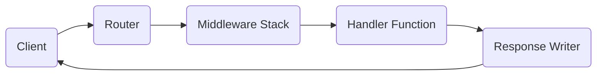
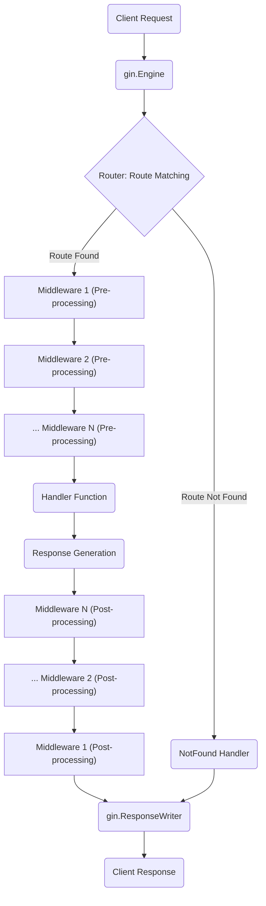

# Project Design Document: Gin Web Framework

**Version:** 1.1
**Date:** October 26, 2023
**Author:** AI Software Architect

## 1. Introduction

This document provides an enhanced and more detailed design overview of the Gin web framework for Go (https://github.com/gin-gonic/gin). This document is specifically designed to serve as a robust foundation for subsequent threat modeling activities. It meticulously outlines the key architectural components, data flow, and interactions within the framework, with a strong emphasis on security-relevant aspects.

## 2. Goals

*   Present a clear, comprehensive, and architecturally sound description of the Gin framework.
*   Thoroughly identify the core components, detailing their responsibilities and interactions.
*   Precisely illustrate the request processing flow within the framework, highlighting critical decision points and data transformations.
*   Serve as a well-structured and informative foundation for identifying potential security vulnerabilities and attack vectors during threat modeling sessions.

## 3. High-Level Architecture

The Gin framework adopts a structure reminiscent of the Model-View-Controller (MVC) pattern, although its primary strength lies in providing a highly efficient routing and middleware infrastructure tailored for building robust web APIs and applications. The central concept within Gin is the `Context`, a per-request object that encapsulates request-specific information and provides methods for request handling and response generation.

*   **Client:** The entity initiating an HTTP request. This could be a web browser, a mobile application, another microservice, or any system capable of making HTTP requests.
*   **Router:** The component responsible for analyzing incoming HTTP requests and directing them to the appropriate handler function based on the HTTP method (GET, POST, PUT, DELETE, etc.) and the URL path.
*   **Middleware Stack:** An ordered sequence of functions that intercept and process each incoming request before it reaches the designated handler function. Middleware can also process the response generated by the handler.
*   **Handler Function:** The application-specific logic that executes upon receiving a request. This function processes the request data, interacts with other parts of the application, and constructs the HTTP response.
*   **Response Writer:** An interface (specifically, `http.ResponseWriter` from the Go standard library) used to write the HTTP response back to the client, including headers and the response body.

## 4. Detailed Component Description

### 4.1. Core Components

*   **`gin.Engine`:**
    *   The central orchestrator of the Gin framework. It manages the router, the global middleware stack, and the HTTP server configuration.
    *   Provides the primary API for defining routes (mapping URL paths to handler functions), adding global middleware that applies to all routes, and starting the HTTP server to listen for incoming requests.
    *   Serves as the initial entry point for all incoming HTTP requests.

*   **`gin.Context`:**
    *   A crucial, per-request object that acts as a container for all information relevant to the current HTTP request and response.
    *   Holds references to the underlying `http.Request` and `http.ResponseWriter` from the Go standard library.
    *   Provides methods for accessing and manipulating request data:
        *   Retrieving route parameters (values extracted from the URL path).
        *   Accessing query parameters (values appended to the URL after the `?`).
        *   Reading the request body.
        *   Setting and retrieving request-scoped data using a key-value store (`Set` and `Get` methods).
    *   Offers functionalities for managing errors that occur during request processing.
    *   Includes methods for data binding (automatically mapping request data to Go structs) and validation.
    *   Provides methods for efficiently rendering responses in various formats (JSON, XML, HTML, plain text, etc.).
    *   Acts as the primary mechanism for passing data and control through the middleware chain and to the handler function.

*   **`gin.RouterGroup`:**
    *   A powerful feature for organizing and structuring API endpoints by grouping routes under a common path prefix and/or applying a shared set of middleware.
    *   Enhances code organization and maintainability, especially for larger applications with numerous endpoints.
    *   Supports nesting of router groups, allowing for complex hierarchical route structures.

*   **`gin.HandlerFunc`:**
    *   A function type (`func(c *gin.Context)`) that defines the signature for functions responsible for handling specific routes.
    *   Receives a pointer to the `gin.Context` object as its sole argument, providing access to all necessary request and response information and methods.

*   **`gin.IRoutes` and `gin.Router`:**
    *   `gin.IRoutes` is an interface that defines the methods for registering routes (e.g., `GET`, `POST`, `PUT`, `DELETE`, `PATCH`, `OPTIONS`, `HEAD`). `gin.Router` is the concrete implementation of this interface.
    *   Responsible for efficiently storing and matching incoming request paths to their corresponding handler functions.
    *   Internally utilizes a highly performant Trie (prefix tree) data structure for route matching, enabling fast lookup even with a large number of defined routes.
    *   Supports defining path parameters within routes (e.g., `/users/:id`), allowing for dynamic route matching.

*   **Middleware:**
    *   Functions that adhere to the `gin.HandlerFunc` signature, allowing them to intercept and process HTTP requests.
    *   Executed in a defined order, forming a chain of responsibility. Middleware can be applied globally (to all routes) or specifically to certain routes or router groups.
    *   Common examples of middleware functionalities include:
        *   **Logging:** Recording request and response details for auditing and debugging.
        *   **Authentication:** Verifying the identity of the client making the request.
        *   **Authorization:** Determining if the authenticated client has permission to access the requested resource.
        *   **CORS (Cross-Origin Resource Sharing) Handling:** Managing requests from different domains.
        *   **Request ID Generation:** Assigning a unique identifier to each request for tracking.
        *   **Error Handling and Recovery:** Catching and handling panics or errors that occur during request processing.
        *   **Compression:** Compressing response bodies to reduce bandwidth usage.
        *   **Rate Limiting:** Restricting the number of requests from a specific client within a given timeframe.
        *   **Security Headers:** Setting HTTP headers to enhance security (e.g., `Content-Security-Policy`, `X-Frame-Options`).

### 4.2. Key Data Structures

*   **`Params`:** A slice of `Param` structs, where each `Param` contains the `Key` (name of the route parameter) and `Value` (the extracted value from the URL). This structure stores the route parameters extracted during route matching.
*   **`Errors`:** A slice of `error` interfaces stored within the `gin.Context`. This allows middleware and handlers to accumulate errors that occur during request processing, providing a centralized way to manage and report errors.
*   **`Keys`:** A `map[string]interface{}` within the `gin.Context`. This map serves as a request-local storage for arbitrary data that can be shared between different middleware and the handler function.
*   **`HandlersChain`:** A slice of `gin.HandlerFunc` that represents the ordered list of middleware functions associated with a specific route or router group. This chain dictates the order in which middleware will be executed.

## 5. Request Processing Flow

The following diagram provides a detailed illustration of the typical flow of an HTTP request as it traverses the Gin framework:

1. **Client Request:** An HTTP request is initiated by a client and sent to the server.
2. **`gin.Engine`:** The incoming request is received by the `gin.Engine` instance, which acts as the entry point for all requests.
3. **Router: Route Matching:** The router component within `gin.Engine` analyzes the HTTP method and the request path to find a matching route definition.
    *   **Route Found:** If a matching route is found, the router identifies the associated `HandlersChain` (the ordered list of middleware) and the corresponding handler function.
    *   **Route Not Found:** If no matching route is found, the framework invokes a default "NotFound" handler or a custom-defined one.
4. **Middleware Chain Execution (Pre-processing):** The middleware functions associated with the matched route (or router group) are executed sequentially in the order they were defined. Each middleware function has the opportunity to:
    *   Inspect and potentially modify the incoming request (e.g., adding headers, parsing data).
    *   Perform authentication and authorization checks to verify the client's identity and permissions.
    *   Log request details for auditing and monitoring purposes.
    *   Short-circuit the request processing by sending a response directly, preventing subsequent middleware and the handler from executing (e.g., for unauthorized requests).
    *   Pass control to the next middleware in the chain by calling the `c.Next()` method.
5. **Handler Function:** Once all pre-processing middleware has been executed (and no middleware has short-circuited the request), the registered handler function for the matched route is invoked. This function contains the core application logic for processing the specific request. It interacts with services, databases, and other parts of the application to fulfill the request.
6. **Response Generation:** The handler function generates the HTTP response. This typically involves setting response headers, writing the response body (often in JSON, XML, or HTML format), and setting the HTTP status code. The `gin.Context` provides convenient methods for rendering responses in various formats.
7. **Middleware Chain Execution (Post-processing):** After the handler function has completed its execution, the middleware functions are executed again, but this time in reverse order. This allows middleware to perform actions after the response has been generated, such as:
    *   Logging response details (status code, response time, etc.).
    *   Adding or modifying response headers.
    *   Performing cleanup tasks or releasing resources.
8. **`gin.ResponseWriter`:** The final HTTP response, potentially modified by post-processing middleware, is written to the `gin.ResponseWriter`.
9. **Client Response:** The completed HTTP response is sent back to the client.

## 6. Security Considerations for Threat Modeling

This section details potential areas of security concern within the Gin framework, providing specific examples to aid in threat modeling activities.

*   **Input Validation Vulnerabilities:**
    *   **Threat:** Failure to properly validate user-provided input (e.g., request parameters, request body) can lead to various injection attacks.
    *   **Examples:** SQL injection, command injection, cross-site scripting (XSS) through reflected input, buffer overflows due to excessively long input.
    *   **Threat Modeling Focus:** Analyze how data is received and processed in handler functions and middleware. Identify points where external input is used without validation.

*   **Authentication and Authorization Flaws:**
    *   **Threat:** Weak or improperly implemented authentication and authorization mechanisms can allow unauthorized access to resources and functionalities.
    *   **Examples:** Missing authentication checks on sensitive endpoints, insecure password storage, flawed authorization logic allowing privilege escalation, session fixation or hijacking vulnerabilities.
    *   **Threat Modeling Focus:** Examine the middleware used for authentication and authorization. Analyze the logic for verifying user credentials and permissions.

*   **Session Management Weaknesses:**
    *   **Threat:** Vulnerabilities in session management can allow attackers to impersonate legitimate users.
    *   **Examples:** Use of predictable session IDs, lack of secure flags on session cookies (HttpOnly, Secure), session fixation vulnerabilities, insufficient session timeout mechanisms.
    *   **Threat Modeling Focus:** If custom session management is implemented, scrutinize its implementation for security best practices. If using external libraries, assess their security posture.

*   **Cross-Site Scripting (XSS) Attacks:**
    *   **Threat:** Improper handling of user-provided data in dynamically generated web pages can allow attackers to inject malicious scripts that execute in the victim's browser.
    *   **Examples:** Reflecting unescaped user input in HTML, storing malicious scripts in the database and displaying them later, DOM-based XSS.
    *   **Threat Modeling Focus:** Identify all points where user input is rendered in HTML responses. Ensure proper encoding and sanitization techniques are applied.

*   **Cross-Site Request Forgery (CSRF):**
    *   **Threat:** Attackers can trick authenticated users into performing unintended actions on a web application.
    *   **Examples:** Embedding malicious links or forms on external websites that, when clicked by an authenticated user, send requests to the vulnerable application.
    *   **Threat Modeling Focus:** Determine if and how CSRF protection mechanisms (e.g., anti-CSRF tokens, SameSite cookies) are implemented for state-changing operations.

*   **Denial of Service (DoS) Vulnerabilities:**
    *   **Threat:** Attackers can overwhelm the application with requests, making it unavailable to legitimate users.
    *   **Examples:** Sending a large number of requests in a short period (brute-force attacks), exploiting resource-intensive operations, slowloris attacks, sending excessively large request bodies.
    *   **Threat Modeling Focus:** Analyze potential resource bottlenecks and points of high computational cost. Evaluate the effectiveness of rate limiting and other protective measures.

*   **Security Header Misconfiguration:**
    *   **Threat:** Failure to configure security-related HTTP headers correctly can leave the application vulnerable to various attacks.
    *   **Examples:** Missing `Content-Security-Policy` allowing for script injection, lack of `Strict-Transport-Security` exposing users to man-in-the-middle attacks, improper `X-Frame-Options` allowing clickjacking.
    *   **Threat Modeling Focus:** Review the middleware responsible for setting security headers and ensure they are configured according to security best practices.

*   **Dependency Vulnerabilities:**
    *   **Threat:** Using vulnerable third-party libraries can introduce security risks into the application.
    *   **Examples:** Exploits in outdated versions of dependencies used for routing, serialization, or database interaction.
    *   **Threat Modeling Focus:** Maintain an inventory of all dependencies and regularly scan them for known vulnerabilities. Implement a process for updating dependencies.

*   **Error Handling and Information Disclosure:**
    *   **Threat:** Exposing detailed error messages to clients can reveal sensitive information about the application's internal workings, making it easier for attackers to find vulnerabilities.
    *   **Examples:** Displaying stack traces or database error messages in production environments.
    *   **Threat Modeling Focus:** Review error handling logic and ensure that generic error messages are returned to clients, while detailed error information is logged securely for debugging.

*   **Route Security Misconfigurations:**
    *   **Threat:** Sensitive endpoints might not be adequately protected by authentication and authorization middleware, allowing unauthorized access.
    *   **Examples:** Exposing administrative interfaces or data modification endpoints without proper authentication.
    *   **Threat Modeling Focus:** Carefully review the middleware applied to each route and router group to ensure that appropriate access controls are in place.

## 7. Dependencies

Gin relies on the following key dependencies, which are potential areas of security concern:

*   **`net/http` (Go Standard Library):** Provides the foundational HTTP server and client implementations. While generally secure, vulnerabilities in the standard library can occur.
*   **`github.com/go-playground/validator/v10`:** A popular library for request body validation. Security vulnerabilities in the validator itself could impact applications using it.
*   **`github.com/ugorji/go/codec`:** Used for efficient JSON and XML serialization and deserialization. Vulnerabilities in this codec could lead to data manipulation or denial-of-service attacks.
*   **Various Middleware Libraries:** Depending on the application's specific needs, it might utilize numerous third-party middleware libraries for functionalities like logging, authentication (e.g., `jwt-go`), CORS handling, etc. Each of these libraries introduces its own set of potential vulnerabilities.

## 8. Deployment Considerations and Security Implications

The way a Gin application is deployed can significantly impact its security posture.

*   **Bare Metal Servers/Virtual Machines:** Requires careful manual configuration of the operating system, web server (if used as a reverse proxy), and firewall. Misconfigurations can introduce vulnerabilities.
*   **Containers (Docker):** Containerization provides isolation but requires secure container image management and runtime configuration. Vulnerabilities in the base image or container configuration can be exploited.
*   **Cloud Platforms (AWS, GCP, Azure):** Leveraging cloud services offers security features but requires understanding and correctly configuring these services (e.g., security groups, IAM roles, network policies).
*   **Serverless Platforms:** While less common for Gin, deployment to serverless environments introduces a different security model with its own set of considerations (e.g., function permissions, API Gateway configuration).

**Key Deployment Security Considerations:**

*   **Network Security:** Proper firewall rules, network segmentation, and access control lists are crucial to restrict access to the application.
*   **TLS/SSL Configuration:** Ensuring that the application uses HTTPS with a valid certificate is essential for encrypting communication and protecting against man-in-the-middle attacks. Proper configuration of TLS settings is also important.
*   **Load Balancing:** While improving availability, load balancers also need to be secured and configured correctly to prevent attacks.
*   **Monitoring and Logging:** Robust monitoring and logging are essential for detecting and responding to security incidents. Logs should be securely stored and analyzed.
*   **Secrets Management:** Securely managing API keys, database credentials, and other sensitive information is critical. Avoid hardcoding secrets in the application code.

This enhanced design document provides a more detailed and security-focused overview of the Gin web framework, intended to be a valuable resource for conducting comprehensive threat modeling activities. By understanding the components, data flow, and potential security considerations outlined here, developers and security professionals can proactively identify and mitigate potential vulnerabilities in applications built with Gin.