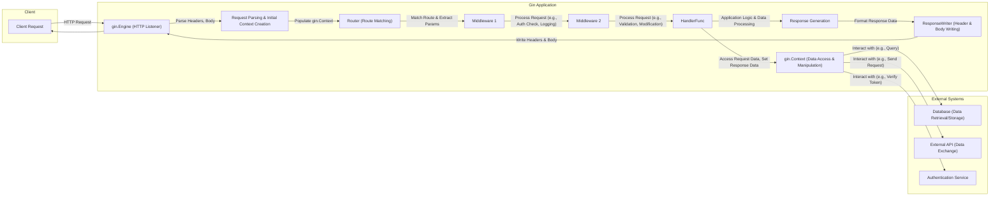

# Project Design Document: Gin Web Framework (Improved)

**Version:** 1.1
**Date:** October 26, 2023
**Author:** AI Software Architect

## 1. Introduction

This document provides an enhanced architectural overview of the Gin web framework (https://github.com/gin-gonic/gin), specifically tailored for threat modeling. Building upon the previous version, this document offers more granular detail on components, data flows, and potential security implications to facilitate a comprehensive threat assessment.

## 2. Goals

* Provide a highly detailed and precise description of the Gin framework's architecture, emphasizing security-relevant aspects.
* Clearly define the responsibilities of each major component and their potential security vulnerabilities.
* Illustrate the flow of data during request processing with a focus on data transformations and trust boundaries.
* Thoroughly outline external dependencies and interaction points, highlighting associated security risks.
* Establish a robust and detailed understanding of the system to enable effective threat identification and mitigation planning.

## 3. Architectural Overview

Gin is a lightweight yet powerful HTTP web framework written in Go, optimized for building high-performance APIs and web applications. Its architecture is centered around the concept of an **HTTP request lifecycle** managed through a chain of **middleware**. This middleware pipeline allows for intercepting, processing, and modifying requests and responses, making it a crucial area for security considerations. The `gin.Engine` acts as the central orchestrator, routing requests and managing the middleware execution.

## 4. Component Details (Enhanced)

Here's a more detailed breakdown of the key components within the Gin framework, with a focus on their security relevance:

* **`gin.Engine` (HTTP Server and Router):**
    * **Responsibility:**  Listens for incoming HTTP requests, manages the routing tree, and orchestrates the middleware and handler execution. It embeds Go's `net/http.Server`.
    * **Security Relevance:** Vulnerabilities in the underlying `net/http.Server` could impact Gin applications. Improper configuration of TLS settings or handling of HTTP headers can introduce security risks. The routing logic itself, if flawed, could lead to unauthorized access or denial of service.
* **`Context` (`gin.Context`):**
    * **Responsibility:**  A per-request object holding request-specific information (headers, body, parameters, etc.) and providing methods for setting response data. It acts as a central hub for data within the request lifecycle.
    * **Security Relevance:**  Improper handling of data within the `Context` can lead to vulnerabilities. For example, failing to sanitize input accessed through `Context` methods can lead to injection attacks. Storing sensitive information insecurely within the `Context` could also be a risk.
* **`RouterGroup` (`gin.RouterGroup`):**
    * **Responsibility:**  Organizes routes under common prefixes and applies shared middleware. Facilitates logical grouping of endpoints.
    * **Security Relevance:**  Incorrectly applied middleware at the `RouterGroup` level can lead to security misconfigurations, such as unintentionally exposing endpoints or bypassing authentication checks.
* **`HandlerFunc` (`gin.HandlerFunc`):**
    * **Responsibility:**  The final function that processes the request and generates the response. Contains the core application logic for a specific endpoint.
    * **Security Relevance:**  This is where most application-level vulnerabilities reside. Issues like business logic flaws, insecure data handling, and lack of proper authorization checks within the `HandlerFunc` are common attack vectors.
* **`Middleware` (Functions with `gin.Context`):**
    * **Responsibility:**  Intercept and process requests before (and sometimes after) the `HandlerFunc`. Used for cross-cutting concerns like logging, authentication, authorization, request modification, and error handling.
    * **Security Relevance:**  Middleware plays a critical role in security. Vulnerable middleware can introduce significant risks. Examples include:
        * **Authentication/Authorization Middleware:** Flaws can lead to unauthorized access.
        * **Input Validation Middleware:** Insufficient validation can allow malicious input.
        * **Logging Middleware:**  Logging sensitive information insecurely can be a vulnerability.
        * **CORS Middleware:** Incorrect configuration can expose the application to cross-origin attacks.
* **`ResponseWriter` (`gin.ResponseWriter`):**
    * **Responsibility:**  Wraps the standard `http.ResponseWriter`, providing additional features like tracking the HTTP status code and response size.
    * **Security Relevance:**  While less directly involved in introducing vulnerabilities, improper use or understanding of its behavior, particularly regarding header manipulation, could have security implications.
* **`Request` (`http.Request`):**
    * **Responsibility:**  The standard Go HTTP request object, containing all the details of the incoming request.
    * **Security Relevance:**  Understanding the structure and potential malicious content within the `http.Request` (headers, body, cookies) is crucial for identifying injection points and other attacks.
* **Route Matching (Radix Tree):**
    * **Responsibility:**  Efficiently matches incoming request paths to registered handlers.
    * **Security Relevance:**  Vulnerabilities in the routing logic itself could lead to route hijacking or denial of service. Misconfigured routes can expose unintended endpoints.
* **Parameter Handling:**
    * **Responsibility:** Extracts parameters from the request path and query strings.
    * **Security Relevance:**  Failure to properly sanitize and validate extracted parameters is a common source of injection vulnerabilities.
* **Data Binding and Validation:**
    * **Responsibility:**  Binds request data to Go structs and validates the data against defined rules.
    * **Security Relevance:**  Crucial for preventing invalid or malicious data from reaching the application logic. Insufficient or incorrect validation can lead to various attacks.
* **Rendering (JSON, XML, HTML, etc.):**
    * **Responsibility:**  Formats and sends the response data in the specified format.
    * **Security Relevance:**  Improper encoding of data during rendering can lead to Cross-Site Scripting (XSS) vulnerabilities.

## 5. Data Flow (Detailed)

The following diagram provides a more granular view of the HTTP request flow, highlighting data transformations and potential security checkpoints:

**Detailed Data Flow with Security Focus:**

1. **Client Request:** The client sends an HTTP request, potentially containing malicious data in headers, body, or cookies.
2. **`gin.Engine` (HTTP Listener):** The server receives the raw HTTP request. Potential vulnerabilities here relate to handling malformed requests or HTTP protocol attacks.
3. **Request Parsing & Initial Context Creation:** Gin parses the request headers and body, creating the initial `gin.Context`. Vulnerabilities can arise from improper parsing leading to buffer overflows or other issues.
4. **Router (Route Matching):** The router matches the request path. Security concerns include route hijacking if the matching logic is flawed.
5. **Middleware Chain:**
    * **Middleware 1 (e.g., Authentication):** Verifies user credentials. Vulnerabilities here can lead to unauthorized access.
    * **Middleware 2 (e.g., Input Validation):** Validates request data. Insufficient validation can allow malicious data to pass through.
    * Each middleware represents a potential point for introducing vulnerabilities or mitigating existing ones. The order of middleware execution is crucial for security.
6. **`HandlerFunc`:** The application logic processes the request. This is where business logic vulnerabilities, injection flaws, and authorization errors can occur.
7. **`gin.Context` (Data Access & Manipulation):** The `HandlerFunc` and middleware access request data and set response data through the `gin.Context`. Improper handling of data here is a primary source of vulnerabilities.
8. **Interaction with External Systems:**  Communication with databases, external APIs, and authentication services introduces new trust boundaries and potential attack vectors (e.g., SQL injection, API key compromise, man-in-the-middle attacks).
9. **Response Generation:** The `HandlerFunc` generates the response data. Failure to properly encode output can lead to XSS vulnerabilities.
10. **`ResponseWriter` (Header & Body Writing):** Gin writes the response headers and body. Incorrect header settings can have security implications (e.g., missing security headers).
11. **HTTP Response:** The server sends the response back to the client.

## 6. External Interactions (Security Implications)

Gin applications commonly interact with external systems, each presenting unique security challenges:

* **Databases (SQL, NoSQL):**
    * **Security Risks:** SQL injection, NoSQL injection, data breaches due to compromised credentials or insecure database configurations.
    * **Mitigation Strategies:** Parameterized queries, input sanitization, principle of least privilege for database access, strong authentication.
* **External APIs:**
    * **Security Risks:** API key compromise, man-in-the-middle attacks, data breaches through vulnerable APIs, rate limiting issues.
    * **Mitigation Strategies:** Secure API key management, HTTPS for all communication, input/output validation, adherence to API security best practices.
* **Authentication/Authorization Services (OAuth 2.0, etc.):**
    * **Security Risks:**  Authentication bypass, authorization flaws, token theft, insecure token storage.
    * **Mitigation Strategies:**  Following OAuth 2.0 best practices, secure token handling (e.g., using HttpOnly and Secure cookies), regular token rotation.
* **Caching Systems (Redis, Memcached):**
    * **Security Risks:** Data leaks if cache is not properly secured, cache poisoning.
    * **Mitigation Strategies:**  Authentication and authorization for cache access, secure network configuration.
* **Message Queues (RabbitMQ, Kafka):**
    * **Security Risks:** Message tampering, unauthorized access to queues.
    * **Mitigation Strategies:**  Authentication and authorization for queue access, message encryption.
* **Logging and Monitoring Systems:**
    * **Security Risks:** Exposure of sensitive information in logs, log injection attacks.
    * **Mitigation Strategies:**  Careful selection of what is logged, secure log storage and access controls.
* **File Storage (Cloud Storage, Local File System):**
    * **Security Risks:** Unauthorized access to files, data breaches, injection vulnerabilities through file uploads.
    * **Mitigation Strategies:**  Strong access controls, secure upload mechanisms, content security policies, regular security assessments.

## 7. Security Considerations (Detailed)

This section expands on the preliminary security considerations, providing more context and examples:

* **Input Validation:**
    * **Threat:** Injection attacks (SQL, command injection, XSS), buffer overflows, data corruption.
    * **Gin Features:** Utilize `c.Bind()` and validation libraries (e.g., `github.com/go-playground/validator/v10`) to enforce data types, formats, and constraints. Sanitize user input before processing.
* **Authentication and Authorization:**
    * **Threat:** Unauthorized access to resources and data.
    * **Gin Features:** Implement authentication middleware to verify user identities (e.g., using JWT, session cookies). Implement authorization middleware to control access based on roles or permissions. Use `gin.Context` to store and retrieve authentication information.
* **Output Encoding:**
    * **Threat:** Cross-Site Scripting (XSS) attacks.
    * **Gin Features:** Use Gin's rendering functions appropriately to encode output data based on the content type (e.g., HTML escaping for HTML responses). Be cautious when rendering user-provided content.
* **Error Handling:**
    * **Threat:** Information leakage through verbose error messages, denial of service through excessive error generation.
    * **Gin Features:** Implement centralized error handling middleware to catch and log errors gracefully. Avoid exposing sensitive details in error responses to clients.
* **Rate Limiting:**
    * **Threat:** Denial-of-Service (DoS) and brute-force attacks.
    * **Gin Features:** Implement rate limiting middleware to restrict the number of requests from a single IP address or user within a specific time window.
* **Secure Configuration:**
    * **Threat:** Vulnerabilities due to default or insecure configurations.
    * **Gin Features:** Configure TLS properly for HTTPS. Disable unnecessary features or endpoints. Review default settings and adjust as needed.
* **Dependency Management:**
    * **Threat:**  Using libraries with known vulnerabilities.
    * **Gin Features:** Regularly update dependencies using `go mod tidy` and `go get -u`. Use vulnerability scanning tools to identify and address vulnerable dependencies.
* **Middleware Security:**
    * **Threat:** Vulnerabilities introduced by custom or third-party middleware.
    * **Gin Features:** Thoroughly review and test all middleware components. Follow secure coding practices when developing custom middleware.
* **CORS (Cross-Origin Resource Sharing):**
    * **Threat:**  Unauthorized access from different origins.
    * **Gin Features:** Use a CORS middleware (e.g., `github.com/rs/cors`) to configure allowed origins, methods, and headers.
* **CSRF (Cross-Site Request Forgery) Protection:**
    * **Threat:**  Malicious websites performing actions on behalf of authenticated users.
    * **Gin Features:** Implement CSRF protection mechanisms, especially for state-changing requests (e.g., using synchronizer tokens).
* **Session Management:**
    * **Threat:** Session hijacking, session fixation.
    * **Gin Features:** If using sessions, use secure session management libraries. Configure secure cookie attributes (HttpOnly, Secure, SameSite). Implement session timeouts and rotation.

This improved design document provides a more detailed and security-focused view of the Gin web framework's architecture, setting a stronger foundation for comprehensive threat modeling activities.