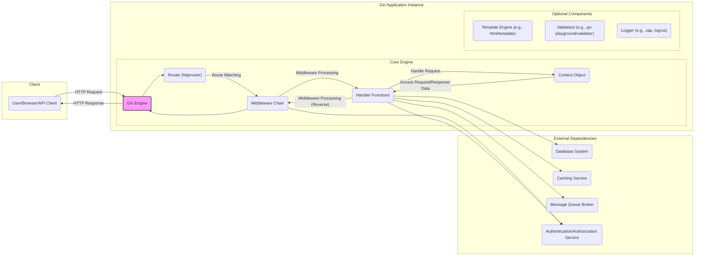
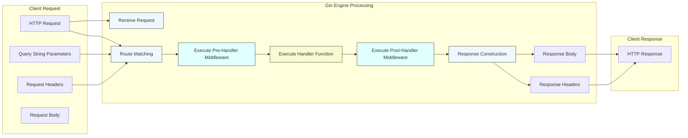

# Project Design Document: Gin Web Framework

**Version:** 1.1
**Date:** October 26, 2023
**Author:** Gemini (AI Language Model)

## 1. Project Overview

This document provides a detailed design overview of the Gin web framework, a popular high-performance HTTP web framework written in Go. This document is specifically tailored to serve as a reference for understanding the framework's architecture, components, and data flow, with a strong emphasis on facilitating threat modeling activities.

Gin is engineered for speed and developer efficiency. It adopts a Martini-like API but achieves significantly enhanced performance by leveraging `httprouter` for request routing. It maintains a minimalist core, offering essential functionalities for constructing web applications and RESTful APIs.

**Project Repository:** https://github.com/gin-gonic/gin

## 2. Goals and Objectives

The primary design goals of the Gin framework are:

*   **High Performance:** To provide an exceptionally fast and efficient mechanism for HTTP request routing and middleware processing.
*   **Developer Productivity:** To offer a clean, intuitive, and easy-to-use API that accelerates web application development.
*   **Extensibility and Flexibility:** To enable developers to seamlessly integrate custom middleware and extend the framework's functionality.
*   **Modular Design:** To maintain a core set of essential features while allowing for optional extensions and integrations.

## 3. Target Audience

This document is primarily intended for:

*   Security engineers and architects responsible for conducting threat modeling and security assessments of applications built using the Gin framework.
*   Software developers seeking a deeper understanding of Gin's internal architecture and request processing lifecycle.
*   Operations and DevOps teams involved in deploying, configuring, and maintaining Gin-based applications in production environments.

## 4. System Architecture

### 4.1. High-Level Architecture Diagram

### 4.2. Component Description

*   **Gin Engine:** The central orchestrator of the framework. It implements the `http.Handler` interface, manages the router and middleware stack, and handles the lifecycle of incoming HTTP requests.
*   **Router (httprouter):** A highly efficient HTTP request multiplexer. It utilizes a radix tree (trie) data structure for fast URL path matching, mapping incoming requests to their corresponding handler functions.
*   **Middleware Chain:** An ordered sequence of functions that intercept and process HTTP requests before or after they reach the main handler. Middleware can perform tasks such as logging, authentication, authorization, request modification, and response manipulation. The order of middleware execution is crucial.
*   **Handler Functions:** The application-specific logic responsible for processing the incoming request and generating the appropriate response. Handlers receive a `gin.Context` object, providing access to request data and methods for setting the response.
*   **Context Object (`gin.Context`):** A per-request object that carries request-scoped information and utility methods. Key functionalities include:
    *   Accessing request details (headers, parameters, request body).
    *   Setting response details (headers, status code, response body).
    *   Aborting the request processing pipeline.
    *   Sharing data between middleware and handlers.
    *   Rendering responses in various formats (JSON, XML, HTML, plain text).
    *   Managing request lifecycle information and error handling.
*   **Template Engine (Optional):**  Gin integrates with Go's standard `html/template` package or other template engines for rendering dynamic HTML content.
*   **Validators (Optional):**  Libraries like `go-playground/validator` can be used within handlers or middleware to enforce data validation rules on incoming requests.
*   **Logger (Optional):** Gin provides basic logging, but developers often integrate with more robust logging libraries like `zap` or `logrus` for structured logging.

### 4.3. Data Flow Diagram (Detailed Request Lifecycle)

**Detailed Request Flow:**

1. **Client Request:** A client initiates an HTTP request, including query string parameters, request headers, and potentially a request body.
2. **Receive Request:** The Gin Engine receives the incoming HTTP request.
3. **Route Matching:** The Router (`httprouter`) analyzes the request method and URL path to find a matching route definition. Query string parameters and headers might influence routing decisions in custom implementations.
4. **Execute Pre-Handler Middleware:**  The middleware functions configured to execute *before* the handler are invoked sequentially. Each middleware can inspect and modify the request, perform authentication/authorization checks, or terminate the request early.
5. **Execute Handler Function:** The handler function associated with the matched route is executed. The handler utilizes the `gin.Context` to access request data, interact with backend services, and prepare the response.
6. **Execute Post-Handler Middleware:** Middleware functions configured to execute *after* the handler are invoked in reverse order of their registration. This allows for tasks like logging the response, adding security headers, or modifying the response.
7. **Response Construction:** The Gin Engine constructs the HTTP response based on the data set in the `gin.Context` by the handler and middleware. This includes the response body and headers.
8. **Client Response:** The Gin Engine sends the constructed HTTP response back to the client.

## 5. Security Considerations for Threat Modeling

This section details security considerations relevant to Gin applications, providing context for threat identification and risk assessment.

*   **Input Validation Vulnerabilities:**
    *   **Threat:** Failure to validate user-supplied input (query parameters, headers, request body) can lead to various injection attacks (SQL injection, command injection, cross-site scripting), data corruption, and unexpected application behavior.
    *   **Gin's Role:** Gin does not provide built-in input validation. Developers must implement validation logic within handlers or middleware.
    *   **Mitigation:** Employ robust input validation techniques, including whitelisting allowed characters, data type validation, and sanitization. Consider using validation libraries.
*   **Cross-Site Scripting (XSS):**
    *   **Threat:** Improperly escaping user-controlled data when rendering HTML can allow attackers to inject malicious scripts into the rendered page, potentially stealing user credentials or performing actions on their behalf.
    *   **Gin's Role:** Gin provides helper functions for rendering templates, but developers are responsible for ensuring proper escaping.
    *   **Mitigation:** Utilize Gin's template rendering functions with appropriate escaping enabled. Implement Content Security Policy (CSP) headers.
*   **Cross-Site Request Forgery (CSRF):**
    *   **Threat:** Attackers can trick authenticated users into making unintended requests on the application, potentially leading to unauthorized actions.
    *   **Gin's Role:** Gin does not provide built-in CSRF protection.
    *   **Mitigation:** Implement CSRF protection mechanisms, typically using synchronizer tokens or the SameSite cookie attribute. Consider using middleware for CSRF protection.
*   **Authentication and Authorization Flaws:**
    *   **Threat:** Weak or missing authentication mechanisms allow unauthorized users to access the application. Insufficient authorization controls can allow authenticated users to access resources or perform actions they are not permitted to.
    *   **Gin's Role:** Gin provides the framework for implementing authentication and authorization through middleware.
    *   **Mitigation:** Implement strong authentication schemes (e.g., multi-factor authentication, OAuth 2.0). Enforce the principle of least privilege in authorization logic. Securely store and manage credentials.
*   **Session Management Weaknesses:**
    *   **Threat:** Vulnerabilities in session management can allow attackers to hijack user sessions, gaining unauthorized access to user accounts.
    *   **Gin's Role:** Gin does not provide built-in session management.
    *   **Mitigation:** Utilize secure session management libraries or implement secure custom solutions. Ensure secure session ID generation, storage, and transmission (HTTPS). Implement session timeouts and consider HTTPOnly and Secure flags for session cookies.
*   **Denial of Service (DoS) Attacks:**
    *   **Threat:** Attackers can overwhelm the application with requests, consuming resources and making it unavailable to legitimate users.
    *   **Gin's Role:** Gin relies on the underlying Go HTTP server and developer-implemented logic.
    *   **Mitigation:** Implement rate limiting middleware. Set appropriate timeouts for requests and connections. Protect against resource exhaustion by limiting request body sizes and file uploads. Consider using a Web Application Firewall (WAF).
*   **Security Header Misconfiguration:**
    *   **Threat:** Missing or misconfigured security headers can leave the application vulnerable to various client-side attacks.
    *   **Gin's Role:** Developers are responsible for setting security headers using middleware.
    *   **Mitigation:** Implement security headers such as `Content-Security-Policy`, `Strict-Transport-Security`, `X-Frame-Options`, `X-Content-Type-Options`, and `Referrer-Policy`.
*   **Error Handling and Information Disclosure:**
    *   **Threat:** Verbose error messages or stack traces exposed to users can reveal sensitive information about the application's internal workings, aiding attackers.
    *   **Gin's Role:** Developers control error handling logic.
    *   **Mitigation:** Implement proper error handling that logs detailed errors internally but returns generic error messages to users in production environments.
*   **Dependency Vulnerabilities:**
    *   **Threat:** Using outdated or vulnerable dependencies can introduce security flaws into the application.
    *   **Gin's Role:** Gin relies on several external packages.
    *   **Mitigation:** Regularly audit and update dependencies to their latest secure versions. Utilize dependency scanning tools.
*   **Middleware Security Issues:**
    *   **Threat:** Vulnerabilities in custom or third-party middleware can introduce security risks. The order of middleware execution can also have security implications.
    *   **Gin's Role:** Gin allows for flexible middleware integration.
    *   **Mitigation:** Thoroughly review and test custom middleware. Carefully consider the order of middleware execution. Use well-vetted and maintained third-party middleware.
*   **Request Body Parsing Vulnerabilities:**
    *   **Threat:** Improper handling of request body parsing (e.g., JSON, XML) can lead to vulnerabilities like Billion Laughs attack (XML bomb) or denial of service.
    *   **Gin's Role:** Gin provides methods for parsing request bodies.
    *   **Mitigation:** Set limits on request body sizes. Use secure parsing libraries and handle potential parsing errors gracefully.
*   **File Upload Vulnerabilities:**
    *   **Threat:** Insecure file upload handling can allow attackers to upload malicious files, potentially leading to remote code execution or other attacks.
    *   **Gin's Role:** Gin provides mechanisms for handling file uploads.
    *   **Mitigation:** Implement strict validation of file types, sizes, and content. Store uploaded files securely and prevent direct access to the upload directory. Sanitize filenames.

## 6. Dependencies

Gin relies on the following key external Go packages:

*   `github.com/gin-gonic/gin`: (The core Gin framework library itself).
*   `github.com/julienschmidt/httprouter`:  The high-performance HTTP request router used by Gin.
*   `github.com/ugorji/go/codec`:  Provides support for various encoding and decoding formats, including JSON and XML.
*   `golang.org/x/sys/unix`: Offers low-level system calls for Unix-like operating systems.
*   `gopkg.in/yaml.v2` (or `gopkg.in/yaml.v3`): Used for parsing YAML configuration files (optional dependency).
*   Standard Go library packages:  Includes essential packages like `net/http`, `encoding/json`, `html/template`, and others.

Understanding these dependencies is crucial for identifying potential transitive vulnerabilities and assessing the overall security posture of a Gin application.

## 7. Deployment Considerations

*   Gin applications are typically deployed as self-contained, statically linked executables.
*   It is a common practice to deploy Gin applications behind a reverse proxy server (e.g., Nginx, Apache, Caddy) for handling SSL/TLS termination, load balancing, and providing an additional layer of security.
*   Containerization technologies like Docker are frequently used for packaging and deploying Gin applications, enhancing portability and consistency.
*   Security best practices for the deployment environment are essential, including network segmentation, access control lists, regular security patching of the underlying operating system and infrastructure, and secure configuration of the reverse proxy.

## 8. Attack Surface

Based on the architecture and data flow, the primary attack surfaces for Gin applications include:

*   **HTTP Request Entry Points:** All routes and endpoints exposed by the application are potential entry points for attackers. This includes the request path, query parameters, headers, and request body.
*   **Middleware Components:** Vulnerabilities in custom or third-party middleware can be exploited. Improperly configured middleware can also introduce security weaknesses.
*   **Handler Functions:** The application's business logic within handler functions is a prime target for attacks like injection flaws and business logic vulnerabilities.
*   **Data Storage and Retrieval:** If handlers interact with databases or other data stores, vulnerabilities in these interactions (e.g., SQL injection) can be exploited.
*   **External Service Integrations:** Interactions with external services (databases, APIs, message queues) can introduce vulnerabilities if not handled securely.
*   **File Upload Functionality:**  Endpoints that handle file uploads are a significant attack surface if not implemented securely.

## 9. Future Considerations

*   Exploring opportunities to integrate more built-in security features directly into the framework, such as basic CSRF protection or more robust input validation mechanisms.
*   Providing more comprehensive documentation and best practice guides specifically focused on security considerations for Gin applications.
*   Developing tooling or middleware to assist developers in implementing common security controls.

This enhanced design document provides a more detailed and security-focused overview of the Gin web framework, making it a more effective resource for threat modeling and security analysis.