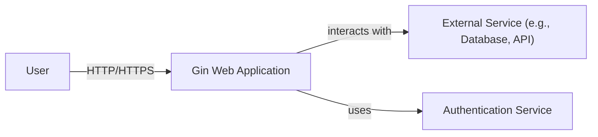
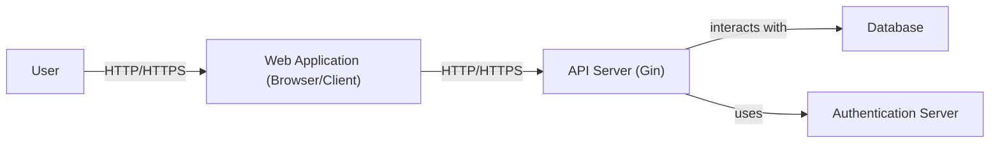
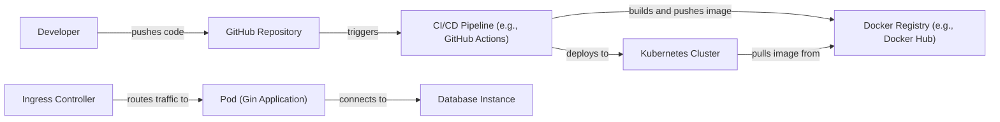
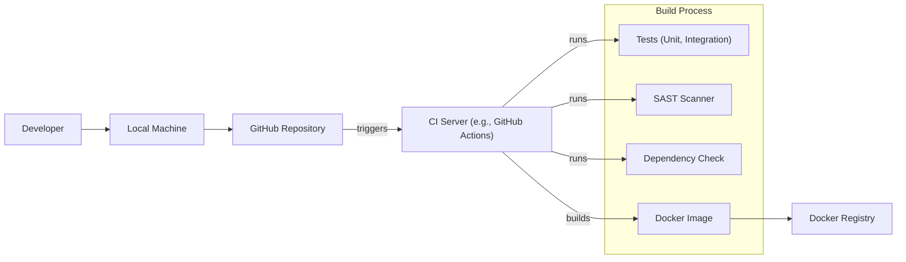

# BUSINESS POSTURE

Business Priorities and Goals:

*   Provide a fast and efficient web framework for Go developers.
*   Offer a user-friendly API for building web applications and microservices.
*   Maintain a lightweight and performant core.
*   Provide a rich set of features commonly needed in web development.
*   Foster a strong community and ecosystem around the framework.
*   Ensure the framework is well-documented and easy to learn.
*   Minimize external dependencies to reduce potential security vulnerabilities.

Most Important Business Risks:

*   Security vulnerabilities in the framework could lead to exploits in applications built using it.
*   Performance bottlenecks in the framework could impact the performance of applications.
*   Lack of features or poor documentation could hinder adoption and growth.
*   Breaking changes in new versions could disrupt existing applications.
*   Inability to keep up with evolving web development trends and security best practices.

# SECURITY POSTURE

Existing Security Controls:

*   security control: The framework uses standard Go libraries for handling HTTP requests and responses, leveraging the built-in security features of the Go language. (Described in Go documentation)
*   security control: The framework provides middleware support, allowing developers to implement custom security logic such as authentication, authorization, and input validation. (Described in Gin documentation)
*   security control: The framework encourages the use of HTTPS by providing easy ways to configure SSL/TLS certificates. (Described in Gin documentation)
*   security control: The framework includes built-in support for preventing Cross-Site Scripting (XSS) attacks by automatically escaping HTML output. (Described in Gin documentation)
*   security control: The framework provides mechanisms for handling Cross-Site Request Forgery (CSRF) tokens. (Described in Gin documentation)
*   security control: Regular updates and security patches are released to address known vulnerabilities. (Described in Gin GitHub repository)

Accepted Risks:

*   accepted risk: The framework relies on third-party dependencies, which may introduce security vulnerabilities.
*   accepted risk: Developers using the framework are responsible for implementing appropriate security measures in their applications.
*   accepted risk: The framework's default configuration may not be secure for all use cases, requiring developers to customize it based on their specific needs.

Recommended Security Controls:

*   security control: Implement a robust logging and monitoring system to detect and respond to security incidents.
*   security control: Regularly conduct security audits and penetration testing to identify and address vulnerabilities.
*   security control: Implement a Content Security Policy (CSP) to mitigate the impact of XSS attacks.
*   security control: Use a dependency management tool to track and update third-party dependencies, ensuring they are free of known vulnerabilities.
*   security control: Implement rate limiting to prevent brute-force attacks and denial-of-service attacks.

Security Requirements:

*   Authentication:
    *   The framework should provide mechanisms for implementing various authentication methods, such as API keys, JWT, and OAuth2.
    *   Support secure storage of user credentials (e.g., using hashing and salting).
*   Authorization:
    *   The framework should support role-based access control (RBAC) or other authorization models.
    *   Provide mechanisms for defining and enforcing access control policies.
*   Input Validation:
    *   The framework should provide tools for validating user input to prevent common vulnerabilities like SQL injection and command injection.
    *   Support for data sanitization and escaping.
*   Cryptography:
    *   The framework should utilize strong cryptographic algorithms for secure communication (HTTPS) and data protection.
    *   Provide easy-to-use APIs for cryptographic operations.

# DESIGN

## C4 CONTEXT

Context Diagram Element List:

*   Element:
    *   Name: User
    *   Type: Person
    *   Description: A user interacting with the Gin web application through a web browser or other client.
    *   Responsibilities: Initiates requests to the application, provides input, and receives responses.
    *   Security controls: Browser security features, user-provided credentials.

*   Element:
    *   Name: Gin Web Application
    *   Type: Software System
    *   Description: The web application built using the Gin framework.
    *   Responsibilities: Handles HTTP requests, processes data, interacts with external services, and returns responses to the user.
    *   Security controls: Input validation, output encoding, authentication, authorization, session management, error handling, HTTPS, CSRF protection.

*   Element:
    *   Name: External Service
    *   Type: Software System
    *   Description: Any external service that the Gin application interacts with, such as a database, another API, or a message queue.
    *   Responsibilities: Provides specific functionality or data to the Gin application.
    *   Security controls: Depends on the specific service; may include API keys, authentication tokens, firewalls, and encryption.

*   Element:
    *   Name: Authentication Service
    *   Type: Software System
    *   Description: An external or internal service responsible for authenticating users.
    *   Responsibilities: Verifies user credentials, issues tokens, and manages user sessions.
    *   Security controls: Secure storage of credentials, strong authentication protocols, protection against brute-force attacks.

## C4 CONTAINER

Container Diagram Element List:

*   Element:
    *   Name: User
    *   Type: Person
    *   Description: A user interacting with the Gin web application.
    *   Responsibilities: Initiates requests, provides input, receives responses.
    *   Security controls: Browser security features, user-provided credentials.

*   Element:
    *   Name: Web Application
    *   Type: Container: Browser/Client
    *   Description: The front-end application running in the user's browser or a client application.
    *   Responsibilities: Renders the user interface, handles user interactions, and communicates with the API server.
    *   Security controls: Browser security features, secure communication with the API server (HTTPS).

*   Element:
    *   Name: API Server
    *   Type: Container: Gin Application
    *   Description: The core of the application, built using the Gin framework, handling API requests.
    *   Responsibilities: Handles HTTP requests, processes data, interacts with the database and authentication server, and returns responses.
    *   Security controls: Input validation, output encoding, authentication, authorization, session management, error handling, HTTPS, CSRF protection.

*   Element:
    *   Name: Database
    *   Type: Container: Database
    *   Description: The database used to store application data.
    *   Responsibilities: Stores and retrieves data.
    *   Security controls: Access control, encryption at rest, encryption in transit, regular backups.

*   Element:
    *   Name: Authentication Server
    *   Type: Container: Authentication Server
    *   Description: Server responsible for user authentication.
    *   Responsibilities: Verifies user credentials, issues tokens, manages user sessions.
    *   Security controls: Secure storage of credentials, strong authentication protocols, protection against brute-force attacks.

## DEPLOYMENT

Possible deployment solutions:

1.  Traditional server deployment (e.g., using a virtual machine).
2.  Containerized deployment (e.g., using Docker and Kubernetes).
3.  Serverless deployment (e.g., using AWS Lambda, Google Cloud Functions, or Azure Functions).

Chosen solution: Containerized deployment using Docker and Kubernetes.

Deployment Diagram Element List:

*   Element:
    *   Name: Developer
    *   Type: Person
    *   Description: A developer working on the Gin application.
    *   Responsibilities: Writes code, commits changes, and pushes to the repository.
    *   Security controls: Code reviews, secure coding practices, access control to the repository.

*   Element:
    *   Name: GitHub Repository
    *   Type: System
    *   Description: The source code repository for the application.
    *   Responsibilities: Stores the application's code and version history.
    *   Security controls: Access control, branch protection rules, code scanning.

*   Element:
    *   Name: CI/CD Pipeline
    *   Type: System
    *   Description: The automated pipeline for building, testing, and deploying the application.
    *   Responsibilities: Automates the build, test, and deployment process.
    *   Security controls: Secure configuration, access control, vulnerability scanning.

*   Element:
    *   Name: Docker Registry
    *   Type: System
    *   Description: The registry for storing Docker images.
    *   Responsibilities: Stores and serves Docker images.
    *   Security controls: Access control, image scanning, vulnerability management.

*   Element:
    *   Name: Kubernetes Cluster
    *   Type: System
    *   Description: The cluster of nodes running the containerized application.
    *   Responsibilities: Manages the deployment and scaling of the application.
    *   Security controls: Network policies, role-based access control (RBAC), pod security policies.

*   Element:
    *   Name: Ingress Controller
    *   Type: Node
    *   Description: Manages external access to the services in the cluster.
    *   Responsibilities: Routes external traffic to the appropriate pods.
    *   Security controls: TLS termination, access control, rate limiting.

*   Element:
    *   Name: Pod
    *   Type: Node
    *   Description: An instance of the Gin application running in a container.
    *   Responsibilities: Handles HTTP requests and serves responses.
    *   Security controls: Container security context, resource limits.

*   Element:
    *   Name: Database Instance
    *   Type: Node
    *   Description: The database instance used by the application.
    *   Responsibilities: Stores and retrieves data.
    *   Security controls: Access control, encryption at rest, encryption in transit, regular backups.

## BUILD

Build Process Description:

1.  Developer writes code on their Local Machine.
2.  Code is pushed to the GitHub Repository.
3.  GitHub triggers the CI Server (e.g., GitHub Actions).
4.  The CI Server runs the following steps:
    *   Tests: Executes unit and integration tests.
    *   SAST: Performs static application security testing to identify vulnerabilities in the code.
    *   Dependency Check: Scans dependencies for known vulnerabilities.
    *   Docker Image: Builds a Docker image containing the application.
5.  The Docker Image is pushed to a Docker Registry.

Security Controls in Build Process:

*   Code reviews: Ensure code quality and security before merging.
*   Automated testing: Unit and integration tests to catch bugs and regressions.
*   SAST: Static analysis to identify security vulnerabilities in the code.
*   Dependency checking: Scanning for known vulnerabilities in third-party libraries.
*   Secure build environment: Protecting the CI server and its configuration from unauthorized access.
*   Image signing: Ensuring the integrity and authenticity of the Docker image.

# RISK ASSESSMENT

Critical Business Processes:

*   Serving web requests: The primary function of the framework is to handle HTTP requests and provide responses. Any disruption to this process would significantly impact users.
*   Data processing: The framework is used to build applications that process data. Security breaches or data corruption could have severe consequences.
*   Integration with external services: Many applications built with Gin rely on external services. The security and availability of these integrations are critical.

Data Sensitivity:

*   User data: Applications built with Gin may handle sensitive user data, such as personal information, financial data, or authentication credentials. This data requires the highest level of protection.  Sensitivity: High
*   Application data: The framework may be used to process and store application-specific data, which could be confidential or proprietary. Sensitivity: Medium to High
*   Configuration data: Configuration files may contain sensitive information, such as API keys or database credentials. Sensitivity: High
*   Logs: Logs can contain sensitive information about user activity and system behavior. Sensitivity: Medium

# QUESTIONS & ASSUMPTIONS

Questions:

*   What specific external services will applications built with Gin commonly interact with?
*   What are the expected traffic patterns and load requirements for applications built with Gin?
*   What are the specific regulatory compliance requirements (e.g., GDPR, HIPAA) for applications built with Gin?
*   What is the existing security infrastructure and tooling in place for the development and deployment environments?
*   What level of security expertise is available within the development team?

Assumptions:

*   BUSINESS POSTURE: The primary goal is to provide a secure and performant web framework. Security is a high priority.
*   SECURITY POSTURE: Developers using the framework have a basic understanding of web security principles. The framework will be used in environments with some existing security controls.
*   DESIGN: The deployment environment will be a containerized platform like Kubernetes. The build process will be automated using a CI/CD pipeline. The applications built using Gin will primarily be API servers.