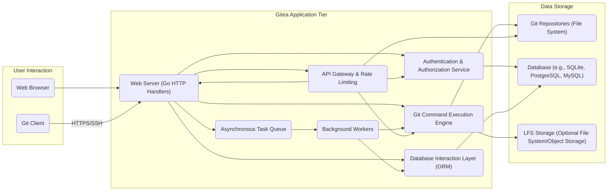
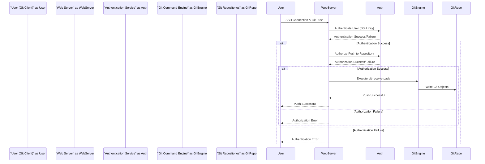
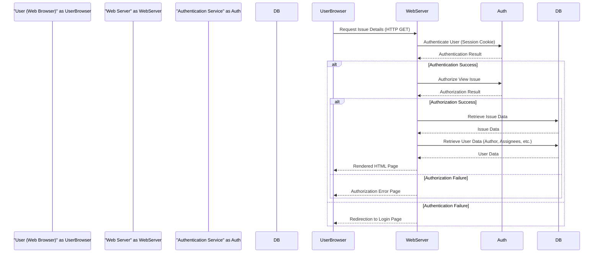

# Project Design Document: Gitea - A Self-Hosted Git Service

**Version:** 1.1
**Date:** October 26, 2023
**Author:** AI Software Architect

## 1. Introduction

This document provides an enhanced and detailed architectural design of Gitea, a lightweight, self-hosted Git service written in Go. This document aims to clearly outline the system's components, their interactions, and the overall architecture with greater depth. It will serve as a robust foundation for subsequent threat modeling activities.

## 2. Goals and Objectives

The primary goals of Gitea are to provide:

* A robust and reliable self-hosted alternative to platforms like GitHub, GitLab, and Bitbucket.
* A lightweight and efficient Git service optimized for minimal resource consumption.
* An intuitive and user-friendly web interface for comprehensive management of Git repositories.
* Essential and advanced features for collaborative software development, including issue tracking, pull requests, wikis, and project management tools.
* Flexible support for various authentication methods to integrate with existing infrastructure.
* An extensible platform through well-defined APIs, enabling automation and integration with other services.

## 3. High-Level Architecture

Gitea employs a well-defined three-tier architecture, promoting modularity and separation of concerns:

* **Presentation Tier:** The user-facing interface, primarily accessed through web browsers, facilitating user interaction with Gitea's features.
* **Application Tier:** The core of the Gitea application, responsible for processing user requests, implementing business logic, and managing data flow.
* **Data Tier:** The persistent storage layer for all of Gitea's data, encompassing Git repositories and application-specific metadata.

## 4. Detailed Component Design

This section provides a more in-depth look at the key components within the Gitea architecture and their functionalities.

### 4.1. Presentation Tier

* **Web Browser:**  The primary client interface, rendering HTML, CSS, and executing JavaScript to provide a dynamic user experience. It interacts with the Gitea web server via HTTP/HTTPS.
* **Git Client:**  Command-line tools (e.g., `git`) or GUI applications used by developers to manage Git repositories hosted on Gitea. Communication occurs via SSH for authenticated operations and HTTPS for read-only access or with credentials.

### 4.2. Application Tier

* **Web Server (Go HTTP Handlers):**  Built using Go's efficient `net/http` library or a routing framework like `chi` or `gin`, responsible for:
    * Receiving and processing incoming HTTP requests from web browsers and API clients.
    * Routing requests to the appropriate handler functions based on URL paths and HTTP methods.
    * Handling request parsing, validation, and response generation.
    * Serving static assets (CSS, JavaScript, images).
* **Authentication & Authorization Service:** A dedicated component responsible for managing user identity and access control:
    * **Authentication:** Verifying user credentials using various methods: local passwords (hashed and salted), OAuth 2.0 providers (e.g., GitHub, GitLab, Google), LDAP/Active Directory, SAML, and HTTP Authentication.
    * **Authorization:** Determining user permissions based on roles and access control lists (ACLs) for repositories, organizations, and administrative functions. This includes checks for read, write, and admin privileges.
* **API Gateway & Rate Limiting:**  Acts as a central point of entry for API requests, providing:
    * **Routing:** Directing API requests to the appropriate backend services.
    * **Rate Limiting:** Protecting the application from abuse by limiting the number of requests from a specific user or IP address within a given timeframe.
    * **Authentication & Authorization Enforcement:** Ensuring that API requests are authenticated and authorized before reaching backend services.
* **Git Command Execution Engine:**  A crucial component responsible for securely executing Git commands on the server:
    * Interacting with the underlying `git` binary through system calls.
    * Handling Git protocols (e.g., `git-receive-pack`, `git-upload-pack`) for push and pull operations.
    * Managing repository metadata and ensuring data integrity.
    * Executing Git hooks (client-side and server-side) based on repository events.
* **Database Interaction Layer (ORM):**  Utilizes an Object-Relational Mapper (ORM), such as GORM, to abstract database interactions:
    * Mapping Go objects to database tables, simplifying data access and manipulation.
    * Handling database connections, transactions, and query generation.
    * Supporting multiple database backends (SQLite, PostgreSQL, MySQL, TiDB) through a consistent interface.
    * Managing database migrations and schema updates.
* **Asynchronous Task Queue:**  Manages and schedules background tasks that do not require immediate processing:
    * Utilizing a message queue (e.g., Redis, in-memory queue) to store tasks.
    * Decoupling long-running operations from the main request-response cycle.
* **Background Workers:**  Processes tasks from the asynchronous task queue:
    * Sending email notifications for events (e.g., issue updates, pull request merges).
    * Processing webhooks to notify external services of repository events.
    * Performing repository maintenance tasks (e.g., garbage collection, repacking).
    * Indexing repository content for efficient code search.

### 4.3. Data Storage

* **Git Repositories (File System):**  Stores the core Git repository data on the server's file system:
    * Utilizing the standard Git object database format.
    * Organizing repositories in a structured directory hierarchy, often based on user or organization.
    * Managing repository access permissions at the file system level.
* **Database (e.g., SQLite, PostgreSQL, MySQL):**  Persistently stores Gitea's application metadata:
    * User accounts, profiles, and credentials.
    * Organization and team structures, including membership and permissions.
    * Repository metadata (name, description, privacy settings, forks).
    * Issue and pull request details, comments, and associated data.
    * Wiki content and revisions.
    * Configuration settings and application preferences.
* **LFS Storage (Optional File System/Object Storage):**  Handles large files tracked by Git LFS:
    * Storing large file content separately from the main Git repository.
    * Supporting local file system storage or integration with object storage services (e.g., AWS S3, MinIO, Azure Blob Storage).
    * Managing access control and data integrity for LFS objects.

## 5. Data Flow

This section illustrates the flow of data for key user interactions within the Gitea system.

### 5.1. Pushing Code with SSH

### 5.2. Viewing an Issue via Web Browser

## 6. Key Components and Technologies

This section lists the primary technologies and components used in the development of Gitea.

* **Programming Language:** Go (Golang)
* **Web Framework/Router:** Standard `net/http` library, potentially with a router like `chi` or `gin`.
* **Database Support:** SQLite, PostgreSQL, MySQL, TiDB.
* **Object-Relational Mapper (ORM):** Likely GORM.
* **Templating Engine:** Go's built-in `html/template` package.
* **Frontend Technologies:** Primarily vanilla JavaScript, potentially with lightweight libraries for specific UI enhancements.
* **Version Control System:** Git.
* **Asynchronous Task Queue:**  Potentially using libraries like `go-queue` or a custom implementation with channels, or integration with message brokers like Redis or RabbitMQ.
* **Logging:** Standard Go `log` package or a more structured logging library.

## 7. Security Considerations (Detailed)

This section expands on the security considerations, providing more specific details relevant for threat modeling.

* **Authentication and Authorization:**
    * **Credential Storage:** Secure hashing algorithms (e.g., bcrypt, Argon2) with unique salts for password storage. Protection against rainbow table attacks.
    * **Session Management:** Secure session cookies with `HttpOnly` and `Secure` flags. Protection against session fixation and session hijacking. Consider using short-lived access tokens and refresh tokens.
    * **OAuth 2.0 Implementation:** Strict adherence to OAuth 2.0 specifications, including proper redirect URI validation and state parameter usage to prevent CSRF attacks.
    * **API Token Security:** Secure generation, storage, and revocation of API tokens. Consider using scoped tokens with limited privileges.
    * **Access Control:** Role-Based Access Control (RBAC) or Attribute-Based Access Control (ABAC) for granular permission management. Regular review of user permissions.
* **Input Validation and Output Encoding:**
    * **Cross-Site Scripting (XSS) Prevention:** Context-aware output encoding of user-generated content. Use of Content Security Policy (CSP) headers.
    * **SQL Injection Prevention:**  Strict use of parameterized queries or ORM features to prevent direct SQL injection. Input validation on all user-provided data.
    * **Command Injection Prevention:** Avoid direct execution of shell commands with user-provided input. Sanitize inputs if necessary.
    * **File Upload Security:** Validation of file types and sizes. Prevention of path traversal vulnerabilities. Scanning uploaded files for malware.
* **Data Protection:**
    * **Data at Rest Encryption:** Encryption of sensitive data in the database and LFS storage. Consider using database-level encryption or file system encryption.
    * **Data in Transit Encryption:** Mandatory use of HTTPS/TLS for all communication. Proper configuration of TLS certificates.
    * **Git Repository Security:** Access control at the repository level. Protection against unauthorized access to Git repository data on the file system.
* **Network Security:**
    * **Web Server Hardening:** Disabling unnecessary features and services. Keeping the web server software up-to-date.
    * **Protection Against Web Attacks:** Implementation of measures to prevent CSRF, clickjacking, and other common web application attacks. Use of security headers (e.g., HSTS, X-Frame-Options).
    * **Firewall Configuration:** Restricting network access to necessary ports and services.
* **Dependency Management:**
    * **Vulnerability Scanning:** Regular scanning of dependencies for known vulnerabilities. Automated dependency updates.
* **Logging and Auditing:**
    * **Security Logging:** Logging of authentication attempts, authorization decisions, API requests, and other security-relevant events.
    * **Audit Trails:** Maintaining audit logs of administrative actions and changes to critical data.
* **Git Security:**
    * **Hook Security:** Secure implementation and management of Git hooks to prevent malicious code execution.
    * **Repository Integrity:** Mechanisms to ensure the integrity of Git repository data.
* **Rate Limiting and Abuse Prevention:**
    * **API Rate Limiting:** Limiting the number of API requests per user or IP address.
    * **Authentication Rate Limiting:** Protecting against brute-force attacks on login endpoints.
    * **CAPTCHA:** Implementation of CAPTCHA for sensitive actions to prevent automated abuse.

## 8. Deployment Considerations

This section outlines key considerations for deploying and managing Gitea in different environments.

* **Deployment Environments:** Bare metal servers, virtual machines (VMs), containers (Docker, Podman), orchestration platforms (Kubernetes).
* **Installation Methods:** Binary installation, package managers, container images.
* **Configuration Management:** Configuration files (e.g., `app.ini`), environment variables.
* **Database Setup:** Choosing and configuring a supported database backend.
* **Web Server Configuration:** Configuring the web server (internal Go server or reverse proxy like Nginx or Apache) and setting up TLS certificates (Let's Encrypt, manual configuration).
* **LFS Storage Configuration:** Configuring the backend for Git LFS (local file system or object storage).
* **Backup and Restore:** Implementing strategies for backing up Git repositories and the application database.
* **Monitoring and Logging:** Setting up monitoring tools to track system performance and health. Centralized logging for troubleshooting and security analysis.

## 9. Future Considerations

This section highlights potential future enhancements and areas for further development.

* **Enhanced Security Features:** Implementation of more advanced security measures based on ongoing threat analysis and industry best practices.
* **Improved Scalability and Performance:** Optimizations for handling larger user bases and repository sizes. Clustering and load balancing capabilities.
* **More Integrations:** Expanding integrations with CI/CD tools, project management platforms, and other developer services.
* **Advanced Search Capabilities:** Implementing more sophisticated code search and filtering functionalities.
* **Plugin System:** Developing a robust plugin system to allow for community-driven extensions and customizations.
* **Improved User Interface/User Experience (UI/UX):** Continuously improving the user interface for better usability and accessibility.

This improved document provides a more detailed and comprehensive architectural design of Gitea, offering a stronger foundation for understanding the system and facilitating effective threat modeling.