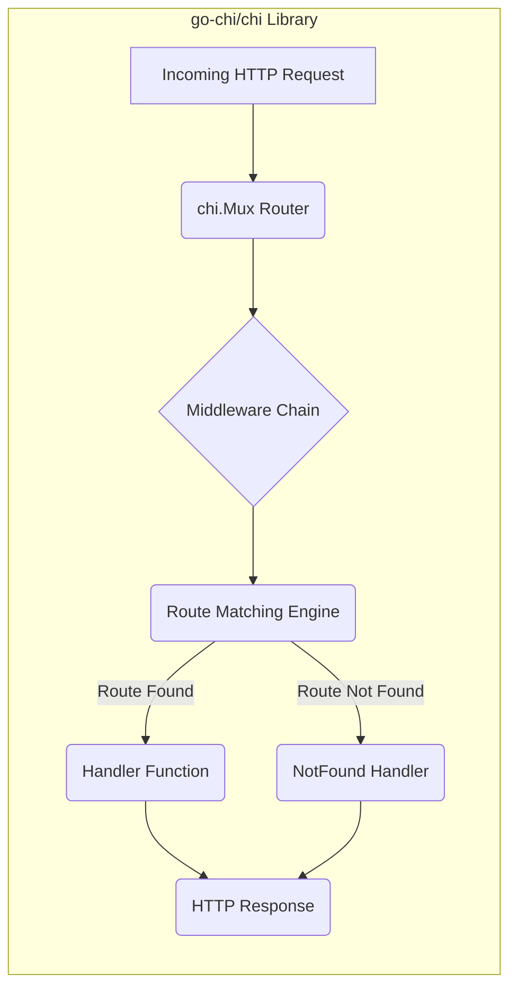
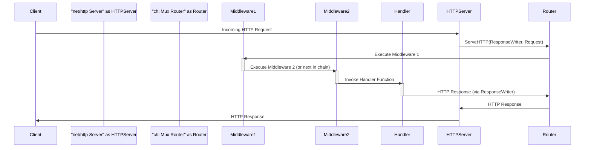

# Project Design Document: go-chi/chi Routing Library

**Version:** 1.1
**Date:** October 26, 2023
**Author:** AI Software Architect

## 1. Introduction

This document provides an enhanced and detailed design overview of the `go-chi/chi` routing library for Go. It elaborates on the core architectural elements, elucidates the data flow, and clarifies key design decisions. This refined document is intended to serve as a robust foundation for subsequent threat modeling activities, offering a deeper understanding of the system's inner workings.

`go-chi/chi` stands out as a lightweight, idiomatic, and highly composable HTTP router specifically designed for building robust Go web applications and APIs. Its focus on flexibility and efficiency makes it a popular choice for developers seeking a clean and powerful routing solution.

## 2. Goals and Objectives

The fundamental goals of the `go-chi/chi` library are to:

*   Deliver a high-performance and memory-efficient HTTP request router.
*   Present a clear, concise, and idiomatic Go API that feels natural to use.
*   Provide robust support for middleware to facilitate request processing and manipulation.
*   Enable highly composable and modular route definitions for complex applications.
*   Streamline the development of RESTful APIs with features like route parameters and method handling.
*   Maintain a lean and focused codebase to ensure maintainability and reduce potential attack surface.

## 3. Architectural Overview

`go-chi/chi` employs a layered architecture centered around the `Router` component. Incoming HTTP requests are channeled through an ordered sequence of middleware functions before reaching the designated handler function responsible for generating a response.

## 4. Component Design

This section provides a more in-depth examination of the core components within the `go-chi/chi` library.

### 4.1. Router (`chi.Mux`)

*   **Description:** The central orchestrator within `go-chi/chi`, responsible for managing the defined routes and efficiently dispatching incoming requests to the appropriate handlers. It typically manifests as a `chi.Mux` instance.
*   **Responsibilities:**
    *   Maintaining an organized structure of registered routes, typically using a tree-based data structure (like a radix tree or a variation) for optimized lookups.
    *   Performing efficient matching of incoming request paths and HTTP methods against the registered route patterns.
    *   Orchestrating the execution of the middleware chain associated with a successfully matched route, ensuring they are invoked in the correct order.
    *   Invoking the designated handler function for the matched route to process the request and generate a response.
    *   Providing a mechanism for handling scenarios where no matching route is found, typically through a customizable "not found" handler.
*   **Key Attributes:**
    *   Internally utilizes an efficient route matching algorithm, often based on a radix tree, to achieve optimal performance even with a large number of routes.
    *   Stores routes as a collection of path patterns associated with specific HTTP methods and their corresponding handler functions.
    *   Manages a stack (or slice) of middleware functions that are executed sequentially before reaching the route handler.
    *   Offers a fluent API for defining new routes using methods like `Get`, `Post`, `Put`, `Delete`, and `HandleFunc`, allowing for clear and concise route declarations.
    *   Provides powerful grouping mechanisms (`Route`, `Group`) to organize routes under common prefixes or apply shared middleware stacks, enhancing code organization and reusability.

### 4.2. Middleware

*   **Description:**  Interceptor functions that form a pipeline through which HTTP requests pass before reaching their final destination handler. Middleware allows for the application of cross-cutting concerns in a modular and reusable manner.
*   **Responsibilities:**
    *   Implementing functionalities that are common across multiple routes, such as logging request details, enforcing authentication and authorization policies, modifying request headers or bodies, and manipulating response headers.
    *   Having the ability to short-circuit the request processing pipeline by not invoking the next middleware in the chain or the final handler, effectively terminating the request early (e.g., in case of authentication failure).
*   **Key Attributes:**
    *   Implemented as functions (or closures) that adhere to a specific signature, typically accepting an `http.Handler` as input and returning another `http.Handler`. This pattern enables the creation of a chain of responsibility.
    *   Executed in the precise order in which they are added to the router or a specific route group, allowing for fine-grained control over the request processing flow.
    *   Have access to both the incoming `http.Request` and the `http.ResponseWriter`, enabling them to inspect and modify request details and influence the outgoing response.
    *   Common examples include: request logging middleware, authentication middleware, CORS (Cross-Origin Resource Sharing) handling middleware, compression middleware, and error recovery middleware.

### 4.3. Handler

*   **Description:** The ultimate recipient of a processed HTTP request, responsible for executing the specific business logic associated with the matched route and generating the appropriate HTTP response.
*   **Responsibilities:**
    *   Implementing the core logic required to fulfill the request, such as fetching data from a database, performing calculations, or interacting with external services.
    *   Accessing and processing data from the incoming `http.Request`, including headers, request body, and route parameters extracted by the router.
    *   Constructing and sending the HTTP response back to the client, including setting the appropriate status code, headers, and response body.
*   **Key Attributes:**
    *   Typically implemented as standard `http.HandlerFunc` functions in Go, providing a familiar and consistent interface.
    *   Receive the `http.ResponseWriter` (for writing the response) and a pointer to the `http.Request` (containing request details) as arguments.
    *   Can leverage values stored in the request context (using `context.Context`), which may have been set by preceding middleware, to access request-scoped information.

### 4.4. Context (`context.Context`)

*   **Description:**  A crucial mechanism for propagating request-scoped values and cancellation signals throughout the request processing pipeline, from middleware to handlers.
*   **Responsibilities:**
    *   Serving as a container for storing and retrieving values that are specific to a particular HTTP request. This allows middleware to share information with subsequent middleware or the final handler without relying on global variables.
    *   Providing a standardized way to manage request cancellation, allowing for graceful termination of long-running operations if the client disconnects or a timeout occurs.
*   **Key Attributes:**
    *   Based on Go's built-in `context.Context` type, ensuring compatibility with other Go libraries and frameworks.
    *   Values are typically set by middleware functions and can be accessed by subsequent middleware or the final handler using context-aware functions.
    *   Common use cases include storing authentication information, request identifiers for logging and tracing, deadlines for operations, and user-defined values.

## 5. Data Flow

The following sequence diagram provides a more detailed visualization of the data flow for an incoming HTTP request processed by `go-chi/chi`:

**Detailed Steps:**

1. **Incoming HTTP Request:** A client initiates an HTTP request, which is received by the `net/http` server.
2. **Router Invocation:** The `net/http` server's registered handler function (typically the `chi.Mux` instance's `ServeHTTP` method) is invoked, passing the `ResponseWriter` and `Request` objects.
3. **Middleware Chain Execution:** The router begins iterating through the registered middleware functions in the order they were added to the `chi.Mux` instance or the specific route group.
4. **Middleware Processing:** Each middleware function in the chain executes its defined logic. This may involve inspecting or modifying the request, setting values in the request context, or writing to the `ResponseWriter`.
5. **Route Matching:** After the middleware chain has been processed (or if there is no middleware), the router's route matching engine attempts to find a route that matches the incoming request's path and HTTP method.
6. **Handler Invocation:** If a matching route is found, the router invokes the associated handler function. The handler receives the `ResponseWriter` and `Request` objects, allowing it to generate the response.
7. **Handler Processing:** The handler function executes the specific business logic for the matched route, potentially interacting with other parts of the application.
8. **Response Transmission:** The handler writes the HTTP response (status code, headers, and body) to the `ResponseWriter`.
9. **Response Sent:** The `net/http` server takes the response written to the `ResponseWriter` and sends it back to the client.
10. **Not Found Handling:** If no matching route is found during the route matching step, the router's configured "not found" handler is invoked instead of a regular route handler.

## 6. Security Considerations (Detailed for Threat Modeling)

This section provides a more granular breakdown of potential security considerations relevant to `go-chi/chi`, specifically tailored for threat modeling exercises.

*   **Route Definition Vulnerabilities:**
    *   **Parameter Pollution:**  Improper handling of route parameters can lead to unexpected behavior or information disclosure if multiple parameters with the same name are allowed and not correctly processed.
    *   **Catch-All Routes:** Overly broad catch-all routes (e.g., `/{path:.*}`) can unintentionally handle requests that should be explicitly defined, potentially bypassing security checks on more specific routes.
    *   **Route Hijacking:**  Conflicting route definitions, especially with dynamic segments, could allow a more permissive route to handle requests intended for a more restrictive one.
*   **Middleware Security:**
    *   **Bypass Vulnerabilities:**  Flaws in middleware logic might allow attackers to bypass intended security measures (e.g., authentication or authorization checks) if the middleware doesn't correctly handle certain edge cases or malformed requests.
    *   **Information Leakage:** Middleware that logs excessive request or response data could inadvertently expose sensitive information.
    *   **Denial of Service (DoS):**  Resource-intensive middleware (e.g., complex authentication schemes or inefficient data processing) can be exploited to cause DoS attacks by overloading the server.
    *   **Injection Vulnerabilities in Middleware:** If middleware manipulates request data without proper sanitization, it could introduce injection vulnerabilities (e.g., header injection).
*   **Handler Security:**
    *   **Insufficient Input Validation:** Failure to thoroughly validate and sanitize user input within handlers is a major source of vulnerabilities like SQL injection, cross-site scripting (XSS), and command injection.
    *   **Broken Authentication and Authorization:**  Handlers must correctly implement and enforce authentication and authorization mechanisms to prevent unauthorized access to resources.
    *   **Insecure Direct Object References (IDOR):** Handlers that directly use user-provided input to access data without proper validation can be vulnerable to IDOR attacks.
    *   **Exposure of Sensitive Data:** Handlers should avoid including sensitive information in error messages or responses intended for the client.
    *   **Cross-Site Request Forgery (CSRF):**  Handlers that perform state-changing operations should implement CSRF protection mechanisms.
*   **Context Security:**
    *   **Information Disclosure via Context:** Storing sensitive information directly in the request context without appropriate safeguards could lead to information disclosure if the context is not properly managed or if vulnerabilities exist in middleware that can access or log context values.
    *   **Context Confusion:** In complex applications with nested contexts or improperly managed context propagation, there's a risk of accessing incorrect context values, potentially leading to unexpected behavior or security issues.
*   **Denial of Service (DoS) Attacks Targeting the Router:**
    *   **Route Table Exhaustion:**  While less likely with `chi`'s efficient routing, an extremely large number of dynamically generated or maliciously crafted routes could potentially strain server resources.
    *   **Regular Expression DoS (ReDoS):** If route patterns involve complex regular expressions, attackers might craft requests that cause excessive backtracking in the regex engine, leading to performance degradation or DoS.

## 7. Deployment Considerations

Deploying applications built with `go-chi/chi` involves standard Go application deployment practices. Key considerations include:

*   **Integration with `net/http`:** `chi.Mux` seamlessly integrates with the standard `net/http` package, allowing for straightforward setup and deployment using the `http.ListenAndServe` function or similar methods.
*   **Reverse Proxies and Load Balancers:** When deployed in production environments, `go-chi/chi` applications are typically placed behind reverse proxies (like Nginx or Apache) and load balancers. Ensure these proxies are configured to forward necessary headers such as `X-Forwarded-For` (for client IP) and `X-Forwarded-Proto` (for protocol).
*   **Containerization (Docker, Kubernetes):**  `go-chi/chi` applications are well-suited for containerization using Docker and orchestration with Kubernetes, facilitating scalable and reproducible deployments.
*   **Cloud Platform Deployments:**  Compatible with various cloud platforms like AWS (using services like EC2, ECS, Fargate, Lambda with API Gateway), Azure (using Azure App Service, Azure Container Instances, Azure Kubernetes Service), and GCP (using Compute Engine, Cloud Run, Google Kubernetes Engine).
*   **Serverless Deployments:** `go-chi/chi` can be adapted for serverless environments by integrating with platforms like AWS Lambda or Google Cloud Functions, often requiring an adapter to translate serverless events into standard HTTP requests.

## 8. Technologies Used

*   **Go Programming Language:** The core language in which the `go-chi/chi` library is developed.
*   **`net/http` Package:** The foundation upon which `go-chi/chi` is built, providing the fundamental HTTP handling capabilities in Go.
*   **`context` Package:** Utilized for managing request-scoped values and cancellation signals.
*   **Potentially other Go standard library packages:** Depending on the specific features used, other standard library packages might be involved.

## 9. Future Considerations

*   **Enhanced Route Grouping Capabilities:** Exploring more advanced features for organizing and managing routes, potentially including nested groups with independent middleware stacks.
*   **Improved Observability Features:**  Deeper integration with tracing and metrics libraries (e.g., OpenTelemetry) to provide better insights into request flow and performance.
*   **More Sophisticated Route Matching:**  Investigating options for more complex route matching scenarios, such as support for regular expression constraints or typed parameters with built-in validation.
*   **Standardized Error Handling:**  Potentially providing more opinionated or utility functions for handling errors consistently across the application.
*   **Performance Benchmarking and Optimization:**  Continuous efforts to identify and address potential performance bottlenecks within the routing logic.