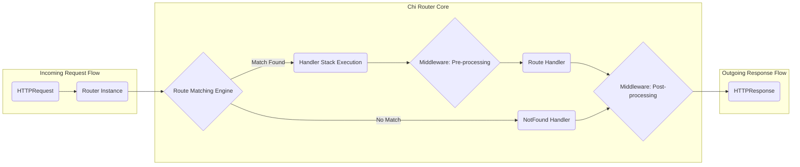

## Project Design Document: go-chi/chi HTTP Router

**Version:** 1.1
**Date:** October 26, 2023
**Author:** AI Software Architect

### 1. Project Overview

This document provides an enhanced design overview of the `go-chi/chi` project, a lightweight, idiomatic HTTP router for building Go web applications. This detailed design serves as a crucial foundation for understanding the system's architecture and will be used as a primary input for subsequent threat modeling activities.

`chi` distinguishes itself by offering a composable and flexible routing solution, empowering developers to construct intricate routing structures through the use of middleware and nested routers. Its design prioritizes performance and ease of use, closely aligning with Go's standard library conventions.

### 2. Goals

* Deliver a clear, concise, and more detailed explanation of the `go-chi/chi` architecture.
* Provide a deeper understanding of the key components and their interactions within the routing process.
* Offer a more granular description of the data flow as requests are processed.
* Expand on the initial security considerations, providing more specific examples of potential vulnerabilities for future threat modeling.
* Introduce deployment considerations relevant to the security of applications using `chi`.

### 3. Architecture Diagram

### 4. Key Components

* **Router Instance:**
    * The central orchestrator, implementing the `http.Handler` interface, making it directly usable with Go's `net/http` package.
    * Manages a tree-like structure of routes and associated middleware.
    * Responsible for receiving incoming `http.Request` objects and initiating the routing process.
    * Employs an efficient route matching algorithm (often a form of a trie or radix tree) to quickly find the appropriate handler.
* **Routes:**
    * Definitions of URL patterns that the router can recognize.
    * Associated with specific handlers to be executed when a request's path matches the pattern.
    * Can include:
        * **Static Routes:** Exact path matches (e.g., `/about`).
        * **Dynamic Routes:** Paths with parameters (e.g., `/users/{userID}`).
        * **Wildcard Routes:** Catch-all paths (e.g., `/static/*`).
    * Organized hierarchically, allowing for nested routers and grouped middleware.
* **Handlers:**
    * Functions that contain the core business logic for a specific route.
    * Receive an `http.ResponseWriter` and an `*http.Request` as arguments, enabling them to process the request and generate a response.
    * Responsible for tasks such as:
        * Data retrieval and manipulation.
        * Rendering responses (JSON, HTML, etc.).
        * Interacting with other services.
* **Middleware:**
    * Functions that intercept HTTP requests and responses, operating as pre-processors and post-processors.
    * Executed in a defined order, forming a chain of responsibility.
    * Can perform various tasks, including:
        * **Request Modification:** Altering request headers or body.
        * **Authentication and Authorization:** Verifying user identity and permissions.
        * **Logging:** Recording request details.
        * **Compression:** Compressing response bodies.
        * **CORS Handling:** Managing Cross-Origin Resource Sharing.
        * **Error Handling:** Catching and processing errors.
* **Handler Stack:**
    * The ordered sequence of middleware functions and the final route handler that will be executed for a matching request.
    * Constructed during route definition, determining the flow of execution.
* **NotFound Handler:**
    * A specific handler function that is invoked when the router cannot find a matching route for the incoming request's URL.
    * Typically returns a 404 Not Found error.
    * Customizable to provide specific error responses or redirect users.
* **Method Not Allowed Handler:**
    * A specific handler function executed when a route matches the request's path, but the HTTP method (e.g., GET, POST) does not match the allowed methods for that route.
    * Typically returns a 405 Method Not Allowed error.
* **Context:**
    * A request-scoped data store that allows sharing values between middleware and handlers throughout the request lifecycle.
    * `chi` provides a custom context implementation built on top of Go's standard `context.Context`.
    * Used for passing request-specific information, such as authentication details or request IDs.
* **Route Context:**
    * Information specifically associated with the matched route.
    * Includes extracted path parameters from dynamic routes.
    * Accessible within handlers to retrieve parameter values.

### 5. Data Flow

The following steps detail the typical flow of an HTTP request as it is processed by the `chi` router:

1. **Receive HTTP Request:** The `chi` router instance, acting as an `http.Handler`, receives an incoming `http.Request` from the Go HTTP server.
2. **Route Matching Engine:**
    * The router utilizes its internal route matching engine to find the best matching route based on the request's URL path and HTTP method.
    * This involves traversing the router's route tree and comparing the request path against defined route patterns.
3. **Match Found:**
    * If a matching route is found:
        * The router identifies the associated handler stack for that route.
        * **Middleware (Pre-processing):** The middleware functions in the handler stack are executed sequentially in the order they were defined.
            * Each middleware function receives the `http.ResponseWriter` and `*http.Request` and can:
                * Process or modify the request before it reaches the handler.
                * Write to the `ResponseWriter` to send a response and short-circuit the remaining stack.
                * Pass control to the next middleware in the chain by calling the next handler in the stack.
        * **Route Handler Execution:** Once all pre-processing middleware has been executed (or if there is no pre-processing middleware), the route's designated handler function is invoked.
            * The handler performs the core business logic for the request.
        * **Middleware (Post-processing):** After the route handler has completed its execution, any middleware that was defined *after* the handler in the route definition is executed in reverse order.
            * This allows for operations on the response, such as adding headers or logging response details.
4. **No Match Found:**
    * If the route matching engine does not find a matching route for the request's path, the configured `NotFound` handler is executed.
    * This typically results in a 404 Not Found response being sent to the client.
5. **Method Not Allowed:**
    * If a route matches the request's path, but the HTTP method of the request does not match the allowed methods for that route, the configured `MethodNotAllowed` handler is executed.
    * This typically results in a 405 Method Not Allowed response being sent to the client.
6. **Send HTTP Response:** The final handler in the chain (either a middleware that short-circuited the request, the route handler, or the `NotFound`/`MethodNotAllowed` handler) writes the `http.Response` back to the client through the `http.ResponseWriter`.

### 6. Security Considerations (Pre-Threat Modeling)

This section expands on potential security concerns, providing more specific examples to guide the threat modeling process:

* **Input Validation Vulnerabilities:**
    * **Path Parameter Injection:** Malicious input in dynamic route parameters could be used to access unintended resources or trigger errors if not properly validated and sanitized within handlers. *Example: A handler accessing a file based on a `filename` path parameter without validating that the parameter doesn't contain ".." to traverse directories.*
    * **Query Parameter Manipulation:**  Handlers relying on query parameters without validation are susceptible to attacks like SQL injection or cross-site scripting (XSS) if these parameters are used in database queries or rendered in HTML.
    * **Request Body Exploits:**  Handlers processing request bodies (e.g., JSON, XML) are vulnerable to injection attacks or denial-of-service if the input is not validated against expected schemas and data types.
* **Middleware Security Flaws:**
    * **Authentication/Authorization Bypasses:**  Vulnerabilities in custom authentication or authorization middleware could allow unauthorized access to protected resources. *Example: A middleware that incorrectly verifies JWT signatures or has flaws in its role-based access control logic.*
    * **Information Leakage through Middleware:** Middleware might inadvertently expose sensitive information in logs, headers, or error messages. *Example: A logging middleware that logs full request bodies containing passwords or API keys.*
    * **Cross-Site Scripting (XSS) via Middleware:** Middleware that manipulates or adds headers without proper encoding could introduce XSS vulnerabilities. *Example: A middleware that sets a cookie with user-provided data without escaping HTML characters.*
    * **SQL Injection in Middleware:** Middleware that interacts with databases based on request data without proper sanitization is susceptible to SQL injection.
* **Denial of Service (DoS) Risks:**
    * **Complex Route Definitions:**  Overlapping or excessively complex route patterns could lead to increased CPU usage during route matching, potentially causing performance degradation under high load.
    * **Resource Exhaustion in Handlers/Middleware:** Handlers or middleware performing computationally expensive operations, making excessive external calls, or allocating large amounts of memory without proper limits can be exploited for DoS attacks.
    * **Slowloris Attacks:** While `chi` itself doesn't directly prevent Slowloris, handlers that don't implement timeouts or proper connection handling could be vulnerable.
* **Error Handling Weaknesses:**
    * **Verbose Error Messages:**  Default or poorly configured error handlers might reveal sensitive internal system details (e.g., file paths, database schema) to attackers.
    * **Lack of Centralized Error Handling:** Inconsistent error handling across different handlers and middleware can make it difficult to track and respond to errors securely.
* **Path Traversal Vulnerabilities:** Handlers that directly use path parameters to access local files or resources without proper validation can be exploited to access files outside the intended directory.
* **CORS Misconfiguration:** Incorrectly configured CORS middleware can allow unauthorized cross-origin requests, potentially exposing sensitive data or functionality.
* **Request Smuggling Potential:** While less common in routing libraries, vulnerabilities in upstream proxies or the underlying HTTP server could be exploited if `chi` doesn't handle certain edge cases in request parsing or forwarding.
* **Session Management Issues (if implemented within handlers/middleware):**
    * **Session Fixation:** Allowing attackers to force a user to use a specific session ID.
    * **Insecure Session Storage:** Storing session data in a way that is easily accessible to attackers.
    * **Lack of Session Expiration:** Sessions that don't expire properly can be hijacked.

### 7. Deployment Considerations

Security considerations extend beyond the `chi` library itself and include how applications using `chi` are deployed:

* **Exposure to the Internet:** Applications directly exposed to the internet require robust security measures, including proper TLS configuration, protection against common web attacks (OWASP Top 10), and regular security updates.
* **Reverse Proxies and Load Balancers:** When deployed behind reverse proxies or load balancers, it's crucial to configure these components correctly to prevent header manipulation or other attacks. Ensure that the `chi` application is configured to trust headers forwarded by the proxy (e.g., `X-Forwarded-For`, `X-Forwarded-Proto`).
* **TLS Termination:**  Ensure TLS termination is handled correctly, either by the reverse proxy or the application itself. Insecure TLS configurations can expose sensitive data.
* **Containerization and Orchestration:** When deploying in containers (e.g., Docker, Kubernetes), follow security best practices for container image security, network policies, and resource limits.
* **Monitoring and Logging:** Implement comprehensive monitoring and logging to detect and respond to security incidents. Logs should be securely stored and analyzed.
* **Security Updates:** Regularly update the `chi` library and all other dependencies to patch known vulnerabilities.

### 8. Assumptions and Constraints

* This design document focuses specifically on the `go-chi/chi` routing library and its core functionalities. It does not delve into the intricacies of the underlying Go HTTP server (`net/http`) or external services.
* It is assumed that developers utilizing `chi` will adhere to general secure coding practices within their handlers and middleware implementations.
* The subsequent threat modeling process will leverage this design document to systematically identify specific threats, vulnerabilities, and potential attack vectors.

### 9. Future Considerations

* In-depth analysis of common middleware patterns and their associated security implications.
* Examination of integration points with popular Go web development libraries and frameworks and their potential security interactions.
* Performance benchmarking and analysis of route matching efficiency under various load scenarios, considering potential DoS implications.
* Exploration of advanced routing features and their security considerations.