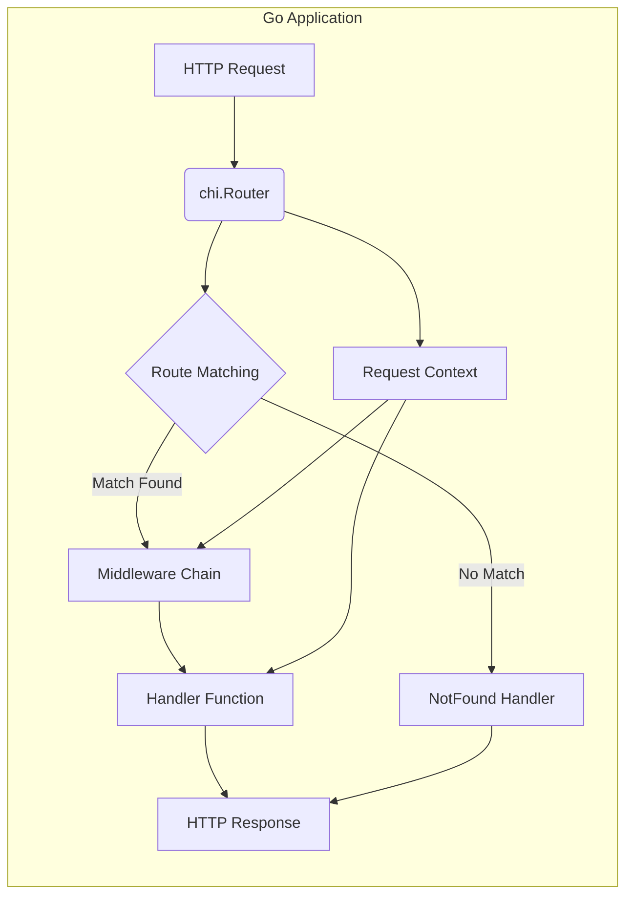
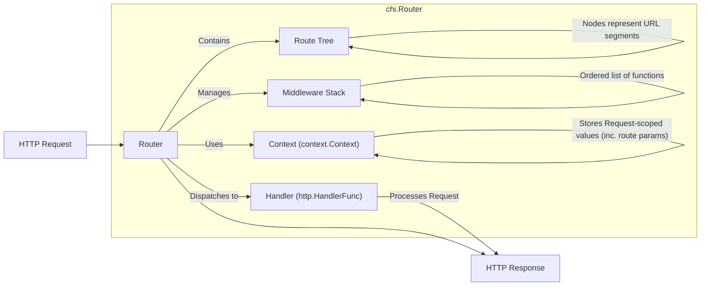
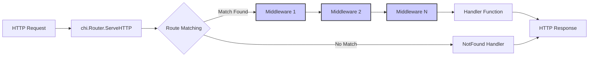

# Project Design Document: go-chi/chi HTTP Router

**Version:** 1.1
**Date:** 2023-10-27
**Author:** Gemini (AI Expert)
**Project:** go-chi/chi - Lightweight HTTP Router for Go
**GitHub Repository:** [https://github.com/go-chi/chi](https://github.com/go-chi/chi)

## 1. Introduction

This document details the design of the `go-chi/chi` project, a lightweight and idiomatic HTTP router for Go. It serves as a basis for threat modeling and security analysis of applications using `chi`. The document outlines the architecture, core components, request flow, and security considerations of the `chi` router.

## 2. Project Overview

`go-chi/chi` is a Go library providing a fast and composable HTTP routing solution. Designed for minimalism, it focuses on essential routing functionalities and extensibility through middleware. `chi` is widely used in Go web applications to efficiently route incoming HTTP requests to appropriate handlers based on URL patterns and HTTP methods.

**Key Features:**

*   **URL Routing:**  Pattern-based URL path matching, supporting parameters and wildcards.
*   **Middleware Support:**  Chainable middleware functions for request processing, enabling functionalities like logging, authentication, and request modification.
*   **Context Integration:**  Leverages Go's `context.Context` for request-scoped data and cancellation signals.
*   **HTTP Method Routing:**  Specific route definitions for different HTTP methods (GET, POST, PUT, DELETE, etc.).
*   **Sub-router Mounting:**  Modular application design through mounting routers at path prefixes.
*   **Route Grouping:**  Organization of routes under shared middleware or path prefixes.
*   **URL Parameter Extraction:**  Simplified access to URL parameters within handler functions.

## 3. Architecture Overview

`chi`'s architecture revolves around a central **Router**, implemented as a tree-like structure (optimized trie) for efficient route matching. Incoming requests are processed through a middleware pipeline and then dispatched to the handler associated with the matched route.

### 3.1. High-Level Architecture Diagram (Mermaid)

**Diagram Explanation:**

1.  **HTTP Request:** An HTTP request enters the Go application.
2.  **chi.Router:** The request is received by the `chi.Router` instance.
3.  **Route Matching:** `chi` matches the request path and method against its defined routes.
4.  **Match Found:** If a route is found:
    *   **Middleware Chain:** The request is processed sequentially by the middleware associated with the route.
    *   **Handler Function:** The request is then passed to the handler function for the route.
5.  **No Match:** If no route matches:
    *   **NotFound Handler:** The request is handled by the `chi` router's `NotFound` handler.
6.  **HTTP Response:** The handler or `NotFound` handler generates the HTTP response.
7.  **Request Context:**  `chi` manages a `context.Context` throughout the request lifecycle, accessible to middleware and handlers.

### 3.2. Component-Level Architecture

Key components of `chi` include:

*   **Router (chi.Router):** The core component for route storage, request matching, and handler dispatch. It utilizes a tree-based routing algorithm for performance.
*   **Route (chi.Route):** Represents a route definition, linking a URL pattern, HTTP method(s), middleware stack, and a handler function.
*   **Middleware (func(http.Handler) http.Handler):** Functions that intercept and process requests before handlers. Middleware enables cross-cutting concerns like logging, authentication, and request modification. They are executed in a defined order.
*   **Handler (http.HandlerFunc):** Standard Go HTTP handler functions that implement request processing logic and generate responses.
*   **Context (context.Context):** Go's context is central to request management in `chi`. Middleware and handlers use it to access request-scoped values, including route parameters extracted by `chi`.
*   **Mux (http.ServeMux) Compatibility:** While `chi` has its own routing, it can integrate with `http.ServeMux` or operate independently. `chi.Router` implements `http.Handler`, allowing direct use with `http.ListenAndServe`.

### 3.3. Component Diagram (Mermaid)

**Diagram Explanation:**

*   **chi.Router:** The central routing component.
    *   **Route Tree:**  A tree structure for efficient route matching based on URL segments.
    *   **Middleware Stack:**  A stack of middleware functions applied to matched routes.
    *   **Handler (http.HandlerFunc):**  The final request handler.
    *   **Context (context.Context):**  Used for request lifecycle management and data sharing.
*   **HTTP Request:** Input to the `chi.Router`.
*   **HTTP Response:** Output from the `chi.Router`.

## 4. Data Flow

The data flow for an HTTP request in `chi` is as follows:

1.  **Request Reception:** The Go HTTP server receives an HTTP request.
2.  **Router Invocation:** The request is passed to `chi.Router`'s `ServeHTTP` method.
3.  **Route Matching:** `chi` traverses its route tree to find a matching route based on the request path and method.
4.  **Middleware Pipeline:** If a route is matched, `chi` executes the associated middleware stack sequentially. Each middleware function receives the `http.ResponseWriter`, `*http.Request`, and the context. Middleware can:
    *   Modify the request or response.
    *   Terminate request processing and return a response.
    *   Pass control to the next middleware or handler.
5.  **Handler Invocation:** After middleware execution, the handler function for the matched route is invoked. It receives the `http.ResponseWriter` and `*http.Request` and generates the HTTP response.
6.  **Response Writing:** The handler writes the HTTP response to the `http.ResponseWriter`.
7.  **Response Transmission:** The HTTP server sends the response to the client.
8.  **NotFound Handling:** If no route matches, the `Router`'s `NotFound` handler is invoked, typically returning a 404 response.

### 4.1. Data Flow Diagram (Mermaid)

**Diagram Explanation:**

*   **HTTP Request:**  Initiates the request flow.
*   **chi.Router.ServeHTTP:** Entry point for request processing.
*   **Route Matching:**  Core routing logic.
*   **Middleware 1, Middleware 2, ..., Middleware N:**  Sequential middleware execution.
*   **Handler Function:**  The route's handler.
*   **NotFound Handler:**  Handles unmatched routes.
*   **HTTP Response:**  The final response.

## 5. Key Components in Detail

*   **Router (chi.Router):**
    *   **Efficient Route Tree:** Optimized for rapid route lookups, supporting path parameters, wildcards, and method-specific routing.
    *   **Flexible Middleware Stack:** Allows global and route-specific middleware application in a defined order.
    *   **Modular Mounting:** Enables building modular applications by mounting sub-routers at path prefixes.
    *   **Route Groups for Organization:** Simplifies route definitions by grouping routes under common middleware or prefixes.
    *   **Context-Aware:** Leverages `context.Context` for request-scoped data and parameter passing to handlers and middleware.

*   **Middleware (func(http.Handler) http.Handler):**
    *   **Request Pre-processing:** Modifies incoming requests (e.g., headers, body parsing).
    *   **Authentication and Authorization:** Implements access control and user authentication.
    *   **Request Logging:** Records request details for monitoring and debugging.
    *   **Error Handling:** Catches and handles errors, providing custom error responses.
    *   **Response Post-processing:** Modifies outgoing responses (e.g., security headers).
    *   **Rate Limiting:** Protects against abuse by limiting request frequency.

*   **Handler (http.HandlerFunc):**
    *   **Core Application Logic:** Implements the business logic for request processing.
    *   **Data Interaction:** Interacts with databases, services, and external systems.
    *   **Response Generation:** Constructs and writes HTTP responses.

## 6. Security Considerations

This section details security considerations for `chi` and applications built upon it, forming the basis for threat modeling.

*   **Input Validation & Sanitization:** `chi` does not inherently validate URL paths or parameters. Applications must implement input validation in middleware or handlers to prevent injection attacks (SQL, command, path traversal, etc.). Sanitize user inputs before using them in backend operations.
*   **Middleware Security Vulnerabilities:** Custom middleware can introduce security flaws. Ensure middleware is securely implemented to avoid vulnerabilities like:
    *   **Authentication Bypass:** Flawed authentication logic in middleware.
    *   **Session Fixation/Hijacking:** Insecure session management in session middleware.
    *   **Cross-Site Scripting (XSS):** If middleware directly renders responses, ensure proper output encoding to prevent XSS.
    *   **CSRF (Cross-Site Request Forgery):** If middleware handles state-changing requests, CSRF protection should be implemented.
*   **Route Definition Security (Authorization & Access Control):** Define route patterns precisely to prevent unintended resource exposure. Avoid overly broad wildcards that might grant unauthorized access. Implement authorization checks in middleware or handlers to control access to specific routes based on user roles or permissions.
*   **Error Handling and Information Disclosure:**  Error handlers (including `NotFound`) should not reveal sensitive information in error responses (e.g., internal paths, stack traces, configuration details). Implement custom error pages and logging for errors without exposing internal details to users.
*   **Denial of Service (DoS) Attacks:** While `chi` is performant, applications can be vulnerable to DoS. Consider:
    *   **Rate Limiting Middleware:** Implement middleware to limit requests from specific IPs or users to mitigate brute-force and DoS attempts.
    *   **Request Size Limits:** Limit the size of request bodies to prevent resource exhaustion from large uploads.
    *   **Complex Route Patterns:** While `chi` handles complex routes efficiently, extremely complex regex-based routes *could* theoretically be exploited for ReDoS (Regular Expression Denial of Service). Review complex route definitions.
*   **URL Parameter Handling Vulnerabilities:** Improper handling of URL parameters can lead to vulnerabilities:
    *   **Injection Attacks:**  As mentioned above, parameters used in database queries, system commands, or file paths without sanitization can lead to injection vulnerabilities.
    *   **Parameter Tampering:**  Applications should validate and not blindly trust URL parameter values, as they can be manipulated by users.
*   **Context Security:**  Avoid storing sensitive data directly in the request context unless necessary and ensure it's handled securely. Be aware that context values are passed through the middleware and handler chain.
*   **Dependency Management:** Regularly audit and update `chi`'s dependencies to patch known security vulnerabilities in underlying libraries. Use dependency management tools to track and update dependencies.
*   **Logging Security:** Implement secure logging practices. Avoid logging sensitive data (passwords, API keys, personal information) in logs. Secure log storage and access to prevent unauthorized access to log data.

## 7. Technologies Used

*   **Go Programming Language:**  `chi` is implemented in Go.
*   **Go Standard Library (`net/http`, `context`):** `chi` is built upon and integrates with Go's standard HTTP and context packages.

## 8. Deployment Model

`chi` is a library integrated into Go applications. Deployment typically involves:

1.  **Go Application Development:** Building a Go application utilizing `chi` for routing and request handling.
2.  **Compilation:** Compiling the Go application into an executable binary.
3.  **Server Environment Deployment:** Deploying the binary to a server (cloud instance, container, serverless environment).
4.  **Web Server/Reverse Proxy (Optional but Recommended):**  Deploying behind a web server (Nginx, Apache) or reverse proxy (cloud load balancer) for TLS termination, load balancing, and static asset serving.
5.  **Port Binding:** The Go application listens on a designated port for HTTP requests, which are then processed by `chi`.

This improved design document provides a more detailed and security-focused overview of `go-chi/chi`, suitable for comprehensive threat modeling and security assessments. The expanded security considerations section highlights potential vulnerabilities and mitigation strategies for applications using `chi`.