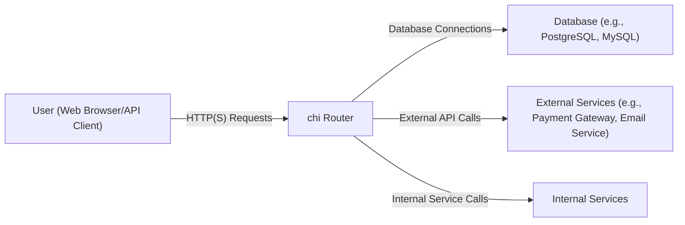
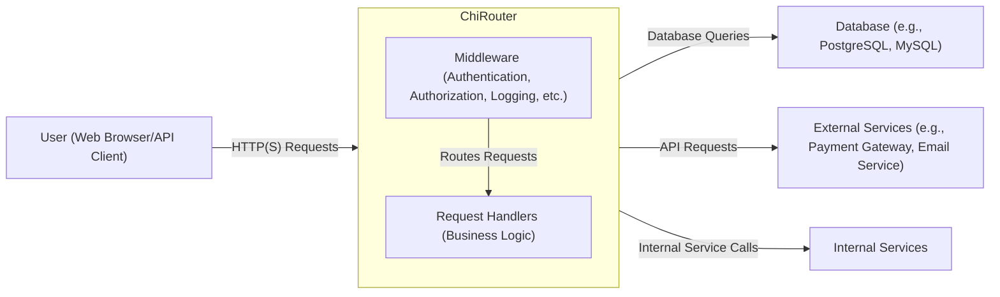
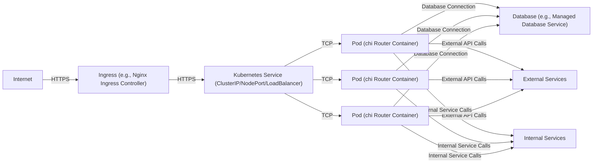
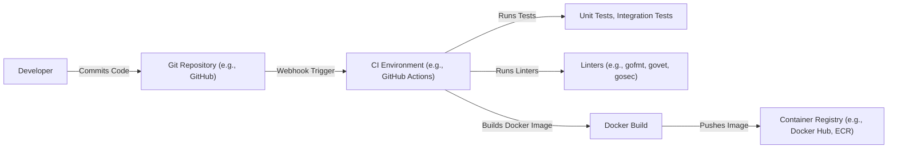

Okay, let's create a design document for the `go-chi/chi` project.

# BUSINESS POSTURE

Business Priorities and Goals:

*   Provide a lightweight and fast HTTP router for Go applications.
*   Offer a flexible and composable API for building RESTful APIs.
*   Maintain high performance and minimal overhead.
*   Ensure ease of use and a low learning curve for developers.
*   Foster a strong community and ecosystem around the project.
*   Be a reliable and stable dependency for other Go projects.

Business Risks:

*   Performance degradation: Any changes that significantly impact the router's performance could negatively affect applications using it.
*   Compatibility issues: Breaking changes or incompatibilities with existing middleware or Go versions could disrupt users.
*   Security vulnerabilities: Vulnerabilities in the router could expose applications to attacks, especially since it handles HTTP requests directly.
*   Lack of adoption: If the project fails to attract and retain users, it may become obsolete or unsupported.
*   Community fragmentation: Competing routers or forks could dilute the community and resources.
*   Maintainability issues: If the codebase becomes complex or difficult to maintain, it could hinder future development and bug fixes.

# SECURITY POSTURE

Existing Security Controls:

*   security control: Input sanitization: The project documentation emphasizes the importance of validating and sanitizing user input, although the router itself doesn't automatically perform sanitization. This is left to the application logic or middleware. (Described in project documentation and examples).
*   security control: Middleware support: `chi`'s design encourages the use of middleware for implementing security controls like authentication, authorization, and rate limiting. (Described in project documentation and examples).
*   security control: Regular updates: The project maintainers actively address reported issues and vulnerabilities, releasing updates as needed. (Visible in GitHub repository activity).
*   security control: Community scrutiny: As an open-source project, `chi` benefits from community review and contributions, which can help identify and address security concerns. (Visible in GitHub repository activity).
*   security control: Context handling: `chi` uses Go's `context` package extensively, which can be used to pass security-related information (e.g., user identity) through the request lifecycle. (Described in project documentation and examples).
*   security control: Tests: Project has unit tests. (Visible in GitHub repository).

Accepted Risks:

*   accepted risk: Reliance on middleware for core security: `chi` itself provides minimal built-in security features, relying heavily on middleware for authentication, authorization, and other critical security controls. This means that the security of an application using `chi` is largely dependent on the correct implementation and configuration of middleware.
*   accepted risk: Potential for misconfiguration: While `chi` is flexible, this flexibility also means that it's possible to configure it in insecure ways, especially if developers are not familiar with best practices for web security.

Recommended Security Controls:

*   security control: Integrate with security-focused linters: Incorporate linters like `gosec` into the build process to automatically detect potential security issues in the codebase.
*   security control: Provide security hardening guidelines: Offer specific recommendations and examples in the documentation for securely configuring `chi` and common middleware.
*   security control: Conduct regular security audits: Perform periodic security audits and penetration testing to identify and address potential vulnerabilities.

Security Requirements:

*   Authentication:
    *   The router should facilitate the integration of various authentication mechanisms (e.g., JWT, OAuth 2.0, API keys) through middleware.
    *   The router should not store or manage user credentials directly.
*   Authorization:
    *   The router should support role-based access control (RBAC) or other authorization models through middleware.
    *   It should be possible to define granular access control rules based on routes and HTTP methods.
*   Input Validation:
    *   The router should encourage the use of input validation libraries or middleware to prevent common vulnerabilities like cross-site scripting (XSS) and SQL injection.
    *   The documentation should provide clear guidance on how to implement input validation effectively.
*   Cryptography:
    *   The router should support HTTPS and encourage its use for all communication.
    *   If the router handles any sensitive data (e.g., session tokens), it should use appropriate cryptographic algorithms and key management practices.

# DESIGN

## C4 CONTEXT

C4 Context Element List:

*   Element:
    *   Name: User (Web Browser/API Client)
    *   Type: Person
    *   Description: Represents a user interacting with the application through a web browser or API client.
    *   Responsibilities: Initiates HTTP(S) requests to the application.
    *   Security controls: Browser security features (e.g., same-origin policy, content security policy), TLS encryption (for HTTPS).

*   Element:
    *   Name: chi Router
    *   Type: Software System
    *   Description: The core component, a lightweight and fast HTTP router for Go applications.
    *   Responsibilities: Handles incoming HTTP(S) requests, routes them to the appropriate handlers, and manages middleware execution.
    *   Security controls: Relies on middleware for most security features (authentication, authorization, rate limiting, etc.). Input sanitization is encouraged but not enforced.

*   Element:
    *   Name: Database (e.g., PostgreSQL, MySQL)
    *   Type: Software System
    *   Description: Represents a database used by the application to store data.
    *   Responsibilities: Stores and retrieves data as requested by the application.
    *   Security controls: Database access controls (users, roles, permissions), encryption at rest and in transit, regular backups.

*   Element:
    *   Name: External Services (e.g., Payment Gateway, Email Service)
    *   Type: Software System
    *   Description: Represents external services that the application interacts with.
    *   Responsibilities: Provides specific functionalities (e.g., processing payments, sending emails).
    *   Security controls: API keys, authentication tokens, TLS encryption, rate limiting.

*   Element:
    *   Name: Internal Services
    *   Type: Software System
    *   Description: Represents internal services that the application interacts with.
    *   Responsibilities: Provides specific functionalities.
    *   Security controls: API keys, authentication tokens, TLS encryption, rate limiting, service mesh.

## C4 CONTAINER

C4 Container Element List:

*   Element:
    *   Name: User (Web Browser/API Client)
        * Same as in C4 Context.

*   Element:
    *   Name: chi Router (Go Application)
        * Same as in C4 Context, but now showing internal components.

*   Element:
    *   Name: Middleware (Authentication, Authorization, Logging, etc.)
    *   Type: Component
    *   Description: A collection of middleware functions that intercept and process HTTP requests before they reach the request handlers.
    *   Responsibilities: Implements cross-cutting concerns like authentication, authorization, logging, rate limiting, and request/response transformations.
    *   Security controls: Implements most of the application's security features (authentication, authorization, input validation, etc.).

*   Element:
    *   Name: Request Handlers (Business Logic)
    *   Type: Component
    *   Description: Functions that handle specific HTTP requests based on the defined routes.
    *   Responsibilities: Executes the core business logic of the application, interacts with the database and external services, and generates responses.
    *   Security controls: Input validation, data sanitization, access control checks (if not handled by middleware).

*   Element:
    *   Name: Database (e.g., PostgreSQL, MySQL)
        * Same as in C4 Context.

*   Element:
    *   Name: External Services (e.g., Payment Gateway, Email Service)
        * Same as in C4 Context.

*   Element:
    *   Name: Internal Services
        * Same as in C4 Context.

## DEPLOYMENT

Possible Deployment Solutions:

1.  Traditional Server Deployment (e.g., Virtual Machines, Bare Metal)
2.  Containerized Deployment (e.g., Docker, Kubernetes)
3.  Serverless Deployment (e.g., AWS Lambda, Google Cloud Functions)

Chosen Solution: Containerized Deployment (Kubernetes)

Deployment Element List:

*   Element:
    *   Name: Internet
    *   Type: External
    *   Description: The public internet.
    *   Responsibilities: Routes traffic to the application's ingress.
    *   Security controls: Firewall, DDoS protection.

*   Element:
    *   Name: Ingress (e.g., Nginx Ingress Controller)
    *   Type: Software System
    *   Description: A Kubernetes resource that manages external access to the services in a cluster, typically HTTP.
    *   Responsibilities: Terminates TLS, routes traffic to the appropriate Kubernetes service based on hostnames and paths.
    *   Security controls: TLS termination, SSL certificates, web application firewall (WAF) integration.

*   Element:
    *   Name: Kubernetes Service (ClusterIP/NodePort/LoadBalancer)
    *   Type: Software System
    *   Description: An abstraction which defines a logical set of Pods and a policy by which to access them.
    *   Responsibilities: Provides a stable IP address and DNS name for accessing the application pods.
    *   Security controls: Network policies, service-level access control.

*   Element:
    *   Name: Pod (chi Router Container)
    *   Type: Container
    *   Description: A Kubernetes pod running a container with the `chi` router application.
    *   Responsibilities: Handles incoming HTTP requests, executes middleware and request handlers.
    *   Security controls: Container security context (e.g., read-only root filesystem, non-privileged user), resource limits.

*   Element:
    *   Name: Database (e.g., Managed Database Service)
    *   Type: Software System
    *   Description: A managed database service (e.g., AWS RDS, Google Cloud SQL).
    *   Responsibilities: Provides a managed database instance for the application.
    *   Security controls: Database access controls, encryption at rest and in transit, regular backups, automated patching.

*   Element:
    *   Name: External Services
        * Same as in C4 Context.

*   Element:
    *   Name: Internal Services
        * Same as in C4 Context.

## BUILD

Build Process Description:

1.  Developer commits code to the Git repository (e.g., GitHub).
2.  A webhook triggers the CI environment (e.g., GitHub Actions).
3.  The CI environment runs unit and integration tests.
4.  The CI environment runs linters (e.g., `gofmt`, `govet`, `gosec`).
5.  If all tests and linters pass, the CI environment builds a Docker image.
6.  The Docker image is pushed to a container registry (e.g., Docker Hub, Amazon ECR).

Security Controls:

*   security control: Code review: All code changes are reviewed by other developers before being merged.
*   security control: Static analysis: Linters like `gosec` are used to detect potential security vulnerabilities in the code.
*   security control: Dependency management: Dependencies are managed using Go modules, and their versions are pinned to prevent supply chain attacks.
*   security control: Container image scanning: The container image is scanned for vulnerabilities before being pushed to the registry.
*   security control: Signed commits: Developers are encouraged to sign their commits to ensure code integrity.
*   security control: Least privilege: CI/CD pipelines are configured with the least privilege necessary to perform their tasks.

# RISK ASSESSMENT

Critical Business Processes:

*   Serving HTTP requests: The primary function of the `chi` router is to handle HTTP requests. Any disruption to this process would directly impact the availability of applications using it.
*   Routing requests to handlers: Correctly routing requests to the appropriate handlers is essential for the application to function as expected.
*   Middleware execution: Middleware is crucial for implementing cross-cutting concerns, including security. Failures in middleware execution could compromise security or functionality.

Data Sensitivity:

*   `chi` itself does not directly handle or store sensitive data. However, it acts as a gateway for HTTP requests, which may contain sensitive data such as:
    *   Personally Identifiable Information (PII) in request bodies or headers.
    *   Authentication tokens (e.g., JWTs) in headers.
    *   Session identifiers in cookies.
    *   API keys in headers or query parameters.
*   The sensitivity of this data depends on the specific application using `chi`. Applications handling highly sensitive data (e.g., financial transactions, healthcare information) require stricter security controls.

# QUESTIONS & ASSUMPTIONS

Questions:

*   Are there any specific compliance requirements (e.g., PCI DSS, HIPAA) that the applications using `chi` must adhere to?
*   What is the expected traffic volume and performance requirements for applications using `chi`?
*   What are the existing security policies and procedures for the development team and infrastructure?
*   What types of external services will applications using `chi` typically interact with?
*   What is the level of expertise of the developers who will be using and configuring `chi`?

Assumptions:

*   BUSINESS POSTURE: The primary goal is to provide a fast, flexible, and reliable HTTP router. Security is a high priority, but performance and ease of use are also important considerations.
*   SECURITY POSTURE: Developers using `chi` are responsible for implementing appropriate security controls in their applications and middleware. The `chi` project provides the necessary tools and flexibility, but it does not enforce specific security practices.
*   DESIGN: The deployment environment will be a containerized platform like Kubernetes. The build process will involve automated testing and linting. The application will interact with a database and potentially other external services.