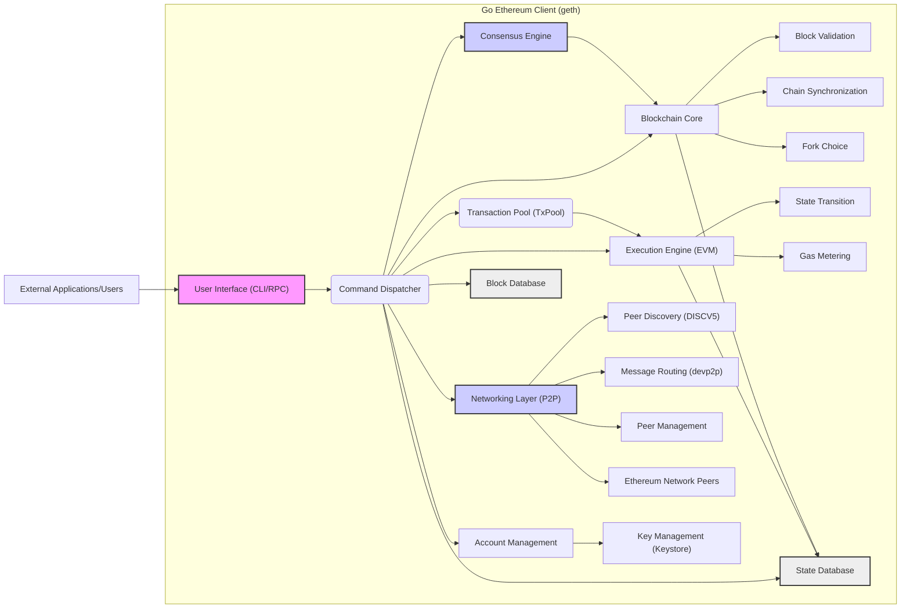
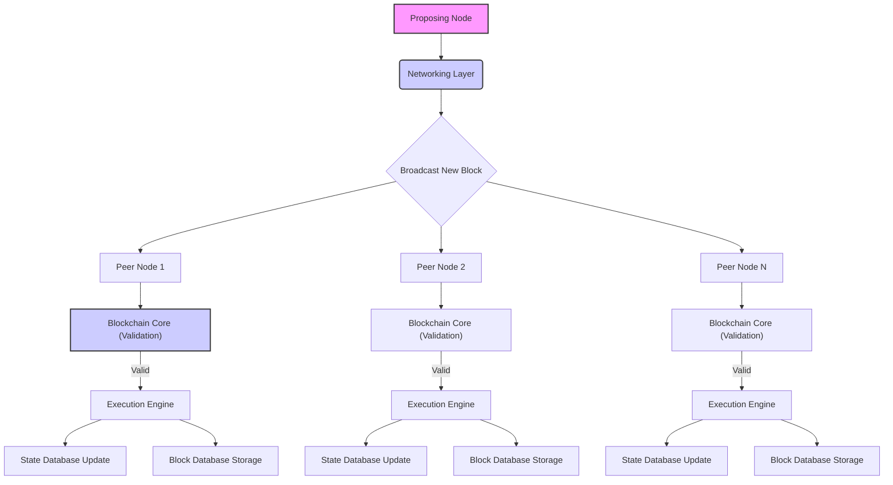

# Project Design Document: Go Ethereum (geth) - Improved

**Version:** 1.1
**Date:** October 26, 2023
**Author:** AI Software Architect

## 1. Introduction

This document provides an enhanced architectural overview of the Go Ethereum client (geth), an official implementation of the Ethereum protocol written in Go. This improved version aims to provide greater clarity and detail, specifically for use in subsequent threat modeling activities. It elaborates on the key components, their interactions, and the overall system architecture, offering a more granular perspective.

## 2. Project Overview

The Go Ethereum client (geth) is a versatile command-line interface (CLI) application enabling interaction with the Ethereum network. Its core functionalities include:

*   Operating as a full Ethereum node, actively participating in block validation and network consensus.
*   Functioning as a light Ethereum node, relying on full nodes for blockchain data retrieval.
*   Performing mining operations (on proof-of-work chains, if applicable).
*   Facilitating the deployment and interaction with smart contracts.
*   Enabling the sending and receiving of Ether and other ERC-20 tokens.
*   Providing capabilities to inspect blockchain data and account states.
*   Managing Ethereum accounts and associated private keys securely.
*   Offering programmatic interaction with the Ethereum network through a JSON-RPC API.

The project's primary objectives are to deliver a robust, secure, and highly efficient implementation of the Ethereum protocol.

## 3. High-Level Architecture

The following diagram presents a more detailed high-level architecture of the Go Ethereum client, breaking down some core components further:

## 4. Component Description

The Go Ethereum client is composed of the following key components, with more detailed descriptions:

*   **User Interface (CLI/RPC):** Provides the primary interfaces for interacting with geth.
    *   **Command-Line Interface (CLI):** Enables direct command execution within a terminal environment for user interaction and node management.
    *   **JSON-RPC API:** Facilitates programmatic interaction from external applications over HTTP or WebSockets, allowing for integration and automation.
*   **Command Dispatcher:** Acts as a central router, directing user commands and API requests to the appropriate internal components for processing.
*   **Blockchain Core:** Manages the local representation of the Ethereum blockchain.
    *   **Block Validation:** Verifies the validity of incoming blocks based on Ethereum protocol rules.
    *   **Chain Synchronization:**  Responsible for synchronizing the local blockchain with the network by downloading new blocks and headers from peers.
    *   **Fork Choice:** Implements the logic to select the canonical chain in the event of forks, ensuring consistency with the network.
*   **Transaction Pool (TxPool):**  A temporary holding area for pending transactions before their inclusion in a block.
    *   Transaction validation (signature, nonce, gas limit, sender balance).
    *   Transaction prioritization based on gas price and fees.
    *   Management of unconfirmed transactions and rebroadcasting.
*   **Execution Engine (EVM):** The core component responsible for executing smart contract bytecode within the Ethereum Virtual Machine.
    *   **State Transition:** Executes the instructions within a transaction, leading to changes in the Ethereum state (account balances, contract storage).
    *   **Gas Metering:** Accurately tracks and limits the computational resources consumed by transaction execution, preventing denial-of-service attacks.
*   **Networking Layer (P2P):** Handles all communication with other Ethereum nodes on the network.
    *   **Peer Discovery (DISCV5):** Utilizes the Discovery Protocol to find and connect to other peers on the network.
    *   **Message Routing (devp2p):** Implements the devp2p protocol suite for secure and efficient communication between peers, including message multiplexing and encryption.
    *   **Peer Management:** Manages connections to peers, including establishing new connections, maintaining existing ones, and disconnecting from unresponsive or malicious peers.
*   **Consensus Engine:** Implements the specific consensus mechanism of the Ethereum network (e.g., Proof-of-Stake).
    *   Block proposal and attestation/voting logic.
    *   Finality gadget implementation.
    *   Management of validator keys and responsibilities.
*   **Account Management:**  Responsible for managing Ethereum accounts and their associated cryptographic keys.
    *   Key generation (private and public key pairs).
    *   Key storage and retrieval from the keystore.
    *   Transaction signing using private keys.
*   **State Database:** Persistently stores the current state of the Ethereum blockchain.
    *   Stores account balances, contract code, contract storage, and other relevant state information.
    *   Utilizes an efficient key-value store (e.g., LevelDB or RocksDB) for fast read and write operations.
*   **Block Database:** Stores the historical blocks of the Ethereum blockchain in a persistent manner.
    *   Provides efficient access to past blocks and transaction data.
*   **Key Management (Keystore):** Securely stores private keys, typically encrypted with a user-provided passphrase for protection.

## 5. Data Flow

The following outlines the typical data flow for critical operations within geth:

*   **Transaction Submission and Propagation:**
    1. A user or application initiates a transaction via the CLI or RPC API.
    2. The User Interface passes the transaction to the Command Dispatcher.
    3. The Command Dispatcher forwards the transaction to the Transaction Pool (TxPool).
    4. The TxPool performs initial validation checks (signature, nonce, gas limit, sender balance).
    5. Valid transactions are added to the pool of pending transactions.
    6. The Networking Layer propagates the new transaction to connected peers.
*   **Block Reception and Processing:**
    1. The Networking Layer receives a new block from a peer.
    2. The block is passed to the Blockchain Core for validation.
    3. **Block Validation:** Checks the block's structure, signatures, transactions, and adherence to consensus rules.
    4. If valid, the block's transactions are executed by the Execution Engine (EVM), resulting in state transitions.
    5. The State Database is updated to reflect the changes caused by the executed transactions.
    6. The Block Database stores the newly validated and processed block.
*   **State Query Processing:**
    1. A user or application requests blockchain state information (e.g., account balance, contract data) through the CLI or RPC API.
    2. The Command Dispatcher routes the request to the Blockchain Core.
    3. The Blockchain Core retrieves the requested data from the State Database.
    4. The retrieved data is formatted and returned to the user or application.
*   **Smart Contract Interaction:**
    1. A transaction intended to interact with a smart contract is submitted and included in a block.
    2. During block processing, the Execution Engine (EVM) identifies the contract call.
    3. The EVM executes the bytecode of the target smart contract, following the instructions and modifying the state accordingly.
    4. Changes to the contract's storage are persisted in the State Database.

## 6. Security Considerations (Detailed)

This section provides a more detailed overview of security considerations relevant to geth, categorized for clarity:

*   **Network Security:**
    *   **Denial-of-Service (DoS) Prevention:** Mechanisms to limit resource consumption from malicious peers attempting to overload the node.
    *   **Secure Peer Communication:** Encryption and authentication of peer-to-peer communication to prevent eavesdropping and tampering.
    *   **Sybil Attack Resistance:** Strategies to mitigate attacks where a single entity controls multiple identities to gain undue influence.
    *   **Eclipse Attack Prevention:** Measures to avoid being isolated from the legitimate network by malicious peers.
*   **Consensus Security:**
    *   **Integrity of Consensus Mechanism:** Ensuring the robustness and reliability of the chosen consensus algorithm against attacks (e.g., byzantine faults).
    *   **Protection Against 51% Attacks:** Safeguards to prevent a single entity or coalition from controlling a majority of the network's voting power.
    *   **Resistance to Long-Range Attacks:** Mechanisms to prevent attackers from rewriting historical blockchain data.
*   **Transaction Pool Security:**
    *   **Spam Prevention:** Limiting the acceptance of low-fee or invalid transactions to prevent resource exhaustion.
    *   **Front-Running Mitigation:** Techniques to reduce the possibility of malicious actors exploiting pending transactions.
*   **Execution Engine Security:**
    *   **EVM Vulnerability Prevention:** Ensuring the EVM implementation is free from bugs that could lead to unexpected behavior or security breaches.
    *   **Gas Limit Enforcement:** Strict enforcement of gas limits to prevent infinite loops and excessive resource consumption by smart contracts.
*   **Account and Key Management Security:**
    *   **Secure Key Storage:** Employing robust encryption and access controls for storing private keys in the keystore.
    *   **Protection Against Key Theft:** Implementing measures to prevent unauthorized access to private keys.
    *   **Secure Passphrase Handling:** Best practices for managing and protecting user-provided passphrases used for key encryption.
*   **API Security:**
    *   **Authentication and Authorization:** Requiring proper credentials for accessing sensitive RPC API endpoints.
    *   **Input Validation:** Thoroughly validating all inputs to the RPC API to prevent injection attacks.
    *   **Rate Limiting:** Restricting the number of requests from a single source to prevent abuse and DoS attacks.
*   **Database Security:**
    *   **Access Control:** Limiting access to the State and Block Databases to authorized processes only.
    *   **Data Integrity:** Ensuring the consistency and correctness of data stored in the databases.
*   **Dependency Management:**
    *   **Vulnerability Scanning:** Regularly scanning third-party libraries for known vulnerabilities.
    *   **Supply Chain Security:** Ensuring the integrity and trustworthiness of dependencies.
*   **Software Updates:**
    *   **Secure Update Mechanism:** Implementing a secure and reliable process for distributing and applying software updates to mitigate known vulnerabilities.

## 7. Deployment Considerations

The Go Ethereum client offers various deployment options, each with different resource requirements and functionalities:

*   **Full Node:** Downloads and validates the entire blockchain, participating fully in consensus. Requires substantial disk space, bandwidth, and processing power. Offers the highest level of security and autonomy.
*   **Light Node:** Downloads only block headers and requests blockchain data from full nodes as needed. Requires significantly fewer resources but relies on the availability and honesty of full nodes.
    *   **Snap Synchronization:** A faster initial synchronization method for light clients.
*   **Archive Node:** Retains all historical states of the blockchain, in addition to the full blockchain data. Requires extremely large storage capacity. Useful for historical data analysis and certain API queries.
*   **Miner Node:** Configured to participate in block production (if applicable to the network's consensus mechanism). Requires specific hardware and configuration depending on the consensus algorithm.

Deployment environments commonly include:

*   **Personal Computers:** Suitable for development, testing, and running light nodes.
*   **Virtual Private Servers (VPS):** A common choice for running full nodes due to their dedicated resources and uptime.
*   **Cloud Platforms (AWS, Azure, GCP):** Offer scalable and managed infrastructure for deploying various node types.
*   **Bare Metal Servers:** Provide maximum performance and control for resource-intensive deployments.
*   **Containerized Environments (Docker, Kubernetes):** Facilitate scalable and reproducible deployments, simplifying management and orchestration.

Key configuration options include:

*   **Network ID:** Specifies the Ethereum network to connect to (e.g., mainnet, Goerli, Sepolia).
*   **Data Directory:** Defines the location for storing blockchain data, keystore files, and other node-specific information.
*   **Port Configurations:** Configures the ports used for P2P networking (discovery and data transfer) and the RPC API.
*   **Synchronization Mode:** Selects the desired synchronization strategy (full, light, snap).
*   **Mining Parameters:** Configures settings related to mining operations, such as CPU/GPU usage and coinbase address.
*   **Gas Price and Limit Settings:** Allows customization of transaction fees and gas limits.

## 8. Data Flow Diagram (Detailed Block Propagation)

## 9. Conclusion

This improved design document provides a more detailed and structured overview of the Go Ethereum client's architecture, components, and data flow. By elaborating on key functionalities and security considerations, this document serves as a more robust foundation for subsequent threat modeling activities. The enhanced information presented here will facilitate a deeper understanding of the attack surface and potential vulnerabilities within the Go Ethereum client and its interactions within the broader Ethereum network.