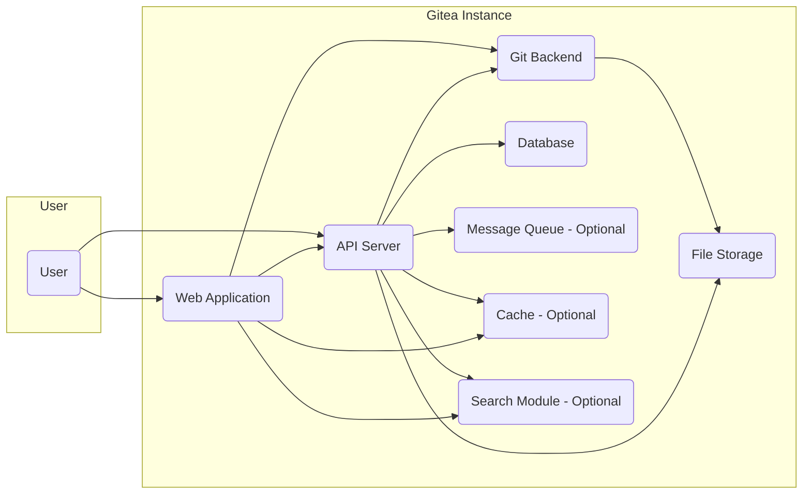
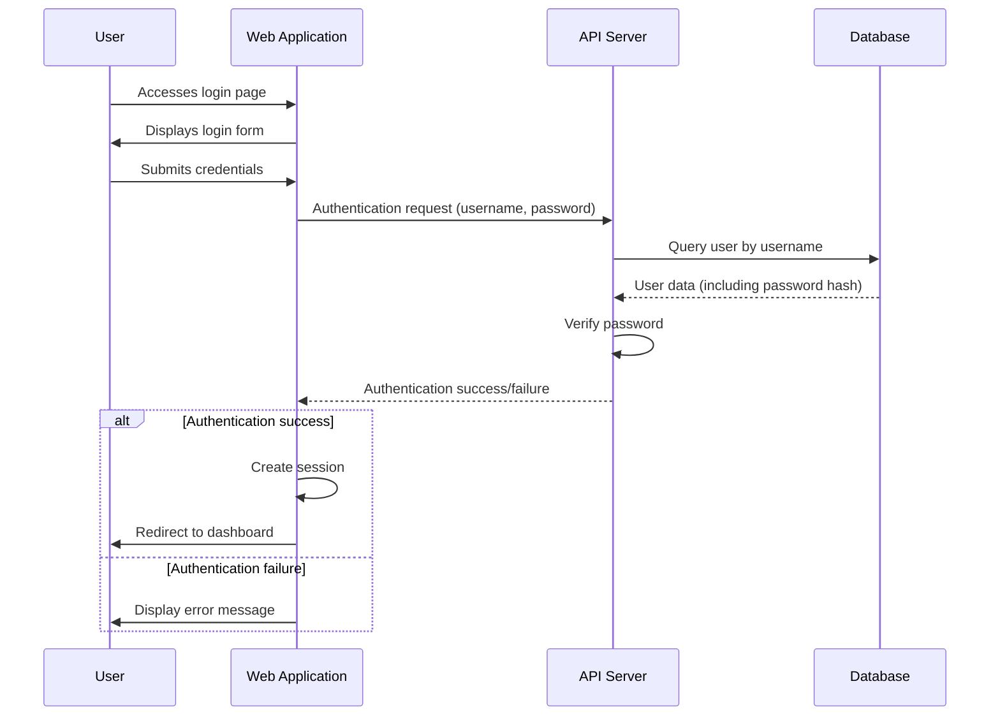
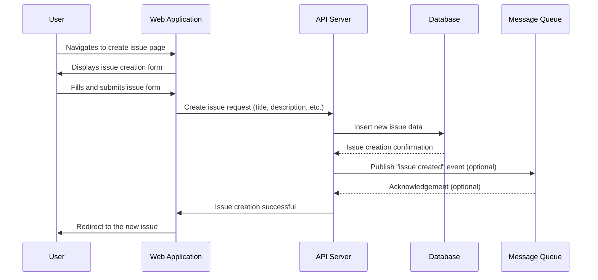
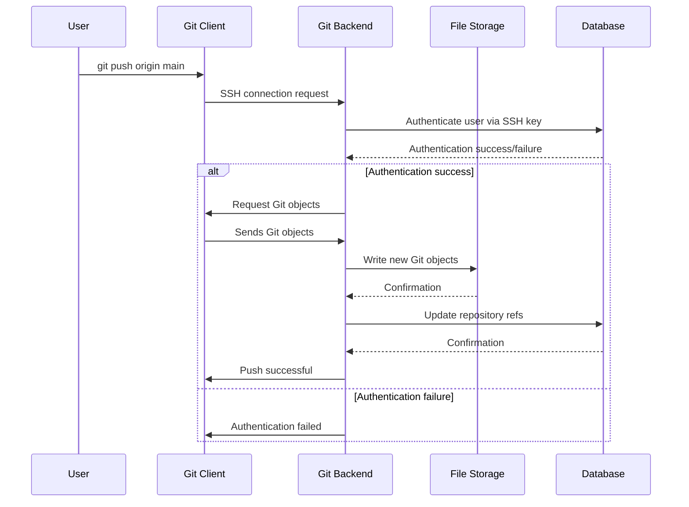

# Project Design Document: Gitea

**Version:** 1.1
**Date:** October 26, 2023
**Author:** AI Software Architect

## 1. Introduction

This document provides an enhanced and more detailed design overview of the Gitea project. Gitea is a self-hosted Git service written in Go, aiming to be a simple, stable, and extensible platform for software development collaboration. This document elaborates on the key architectural components, data flows, and security considerations of Gitea, providing a stronger foundation for subsequent threat modeling activities.

## 2. Project Goals

* Provide a self-hosted, open-source alternative to platforms like GitHub and GitLab.
* Offer a lightweight and efficient Git service with minimal resource consumption, suitable for resource-constrained environments.
* Support core Git functionalities comprehensively for code hosting, version control, and collaboration.
* Enable robust user and organization management with fine-grained access control mechanisms.
* Facilitate comprehensive issue tracking, pull requests with code review features, and project management capabilities.
* Offer a well-defined and accessible platform for extension through plugins, APIs, and webhooks.

## 3. High-Level Architecture

* **User:** Represents any individual or automated system interacting with the Gitea instance through the web interface, API, or Git protocols.
* **Web Application:** The primary interface for users, responsible for user authentication, rendering dynamic web pages, handling user interactions, and presenting information.
* **API Server:** Provides a programmatic interface (typically RESTful) for interacting with Gitea's features, enabling integrations and automation.
* **Git Backend:** The core component managing Git repositories, directly handling Git commands and interacting with the file system for repository data.
* **Database:** Stores persistent application data, including user accounts, repository metadata, issues, pull requests, organizations, and system settings.
* **File Storage:** Stores the raw Git repository data (objects, packfiles) on the server's file system. It may also store user-uploaded attachments and other assets.
* **Message Queue (Optional):** Facilitates asynchronous task processing and event handling, improving responsiveness and enabling decoupled operations (e.g., sending notifications).
* **Cache (Optional):** Improves performance by storing frequently accessed data in memory or a dedicated caching service, reducing database load.
* **Search Module (Optional):** Provides indexing and search capabilities for code, issues, and other content within Gitea.

## 4. Detailed Component Design

### 4.1. Web Application

* **Technology:** Primarily built using Go's standard library, leveraging templating engines (like `html/template`) for rendering HTML, and potentially using JavaScript frameworks for enhanced UI interactions.
* **Responsibilities:**
    * User authentication and session management using cookies or other session mechanisms.
    * Rendering the user interface dynamically based on data retrieved from the API and database.
    * Handling user input from forms and UI elements, forwarding requests to the API server.
    * Displaying repository content (code, commits, branches, tags), issues, pull requests, and project-related information.
    * Managing user profiles, settings, and notification preferences.
    * Providing an administration panel for system-level configuration and management.
* **Key Features:**
    * Interactive user dashboards displaying activity feeds and relevant information.
    * Feature-rich repository browsing with syntax highlighting and file history.
    * Comprehensive issue tracking with labels, milestones, assignees, and commenting.
    * Collaborative pull request workflows with code review, diff viewing, and merging capabilities.
    * User and organization management with role-based access control.
    * Built-in code editor for making quick changes.
    * Support for various notification mechanisms (email, web notifications).

### 4.2. API Server

* **Technology:** Built using Go's standard library and potentially a routing library (like `chi` or `mux`) for defining and handling API endpoints. Often utilizes middleware for authentication, logging, and request processing.
* **Responsibilities:**
    * Providing a well-defined and documented programmatic interface (typically RESTful) for interacting with Gitea's functionalities.
    * Handling authentication and authorization for API requests using tokens, OAuth, or other methods.
    * Processing requests from the web application, command-line tools, and external integrations.
    * Interacting with the database, Git backend, file storage, message queue, and cache as needed.
    * Returning data in structured formats like JSON or XML.
* **Key Endpoints (Examples):**
    * `/api/v1/users`: Managing user accounts (creation, retrieval, modification).
    * `/api/v1/repos`: Managing repositories (creation, deletion, access control).
    * `/api/v1/issues`: Managing issues (creation, retrieval, updates, comments).
    * `/api/v1/pulls`: Managing pull requests (creation, review, merging).
    * `/api/v1/orgs`: Managing organizations and team memberships.
    * `/api/v1/admin`: Administrative functions (user management, system settings).
    * `/api/v1/notifications`: Accessing and managing user notifications.
    * `/api/v1/git/`: Endpoints for interacting with Git repositories programmatically.

### 4.3. Git Backend

* **Technology:** Primarily relies on interacting with the `git` command-line tool. Gitea may also utilize Go libraries for parsing Git output or performing specific Git operations.
* **Responsibilities:**
    * Handling Git commands initiated by users through SSH or HTTP(S) protocols (e.g., `git push`, `git pull`, `git clone`).
    * Managing repository access control based on user permissions stored in the database.
    * Interacting with the file system to read and write Git repository data (objects, refs, packfiles).
    * Enforcing repository settings and configurations (e.g., branch protection rules).
    * Potentially executing Git hooks (server-side) triggered by Git events.
* **Key Interactions:**
    * Receives Git commands over SSH (authenticated via SSH keys) or HTTPS (authenticated via username/password or tokens).
    * Authenticates users based on provided credentials against the database.
    * Authorizes access to specific repositories and branches based on user roles and permissions.
    * Executes `git` commands on the server's file system on behalf of the user.
    * Manages Git LFS (Large File Storage) if enabled.

### 4.4. Database

* **Technology:** Supports various relational database management systems (e.g., SQLite, MySQL, PostgreSQL, TiDB), allowing users to choose based on their needs and infrastructure.
* **Responsibilities:**
    * Storing persistent data critical for Gitea's operation.
    * Managing user accounts, including authentication credentials (hashed passwords).
    * Storing metadata about repositories, including names, descriptions, owners, and settings.
    * Storing issue and pull request data, including titles, descriptions, comments, status, and relationships.
    * Managing organization and team information, including memberships and permissions.
    * Storing system-wide settings and configurations.
* **Key Data Entities:**
    * `user`: Stores user account details (username, email, password hash, public keys, etc.).
    * `repository`: Stores repository metadata (name, description, owner ID, private/public status, etc.).
    * `issue`: Stores issue details (title, content, author ID, assignee ID, labels, milestones, etc.).
    * `pull_request`: Stores pull request details (head branch, base branch, status, merge information, reviewers, etc.).
    * `organization`: Stores organization details and membership information.
    * `access`: Stores permissions mapping users and teams to repositories.

### 4.5. File Storage

* **Technology:**  Typically the local file system of the server hosting Gitea. Can potentially be configured to use network-attached storage or cloud storage solutions.
* **Responsibilities:**
    * Storing the core Git repository data in a structured format (typically under a `repositories` directory).
    * Storing user-uploaded files associated with issues, pull requests, or releases.
    * Managing disk space usage for repositories.
    * Potentially handling Git LFS object storage.
* **Key Considerations:**
    * Ensuring adequate disk space and performance for Git operations.
    * Implementing robust backup and recovery strategies for repository data.
    * Setting appropriate file system permissions to protect repository data from unauthorized access.

### 4.6. Message Queue (Optional)

* **Technology:** Supports various message queue systems like Redis, RabbitMQ, or Kafka.
* **Responsibilities:**
    * Facilitating asynchronous processing of tasks that don't need immediate execution.
    * Decoupling different components of Gitea, improving resilience and scalability.
    * Managing background jobs, such as sending email notifications, processing webhooks, or updating search indexes.
* **Example Use Cases:**
    * Sending email notifications for new issues, pull requests, or comments.
    * Triggering CI/CD pipelines based on Git push events.
    * Asynchronously updating the search index when code or issues are modified.

### 4.7. Cache (Optional)

* **Technology:** Supports various caching mechanisms, including in-memory caching (using libraries like `golang/groupcache`), Redis, or Memcached.
* **Responsibilities:**
    * Storing frequently accessed data in a faster medium (like memory) to reduce database load and improve response times.
    * Caching database query results, rendered HTML fragments, or API responses.
* **Example Use Cases:**
    * Caching repository metadata (name, description, owner).
    * Caching user session data to avoid frequent database lookups.
    * Caching rendered views of popular repository pages.

### 4.8. Search Module (Optional)

* **Technology:** Can integrate with dedicated search engines like Elasticsearch or utilize built-in indexing libraries.
* **Responsibilities:**
    * Indexing repository code, issues, pull requests, and other searchable content.
    * Providing efficient search capabilities for users to find relevant information within Gitea.
* **Example Use Cases:**
    * Searching for specific code snippets within repositories.
    * Searching for issues based on keywords in the title or description.
    * Searching for users or organizations.

## 5. Data Flow

### 5.1. User Authentication (Web)

### 5.2. Creating a New Issue

### 5.3. Pushing Code (SSH)

## 6. Security Considerations (Pre-Threat Modeling)

This section elaborates on potential security areas and specific threats that will be crucial during threat modeling:

* **Authentication and Authorization:**
    * **Threats:** Brute-force attacks on login forms, credential stuffing, compromised credentials, insecure storage of password hashes, privilege escalation, unauthorized API access.
    * **Considerations:** Strength of password hashing algorithms (e.g., Argon2), use of salt, protection against timing attacks, multi-factor authentication (MFA), robust session management, API key management, OAuth 2.0 implementation details, role-based access control (RBAC) effectiveness.
* **Data Security:**
    * **Threats:** Database injection attacks (SQLi), cross-site scripting (XSS), stored XSS in user-generated content, exposure of sensitive data in logs or error messages, insecure file uploads (malware), unauthorized access to file storage.
    * **Considerations:** Input validation and sanitization, output encoding, parameterized queries, content security policy (CSP), secure handling of user-uploaded files, encryption of sensitive data at rest and in transit (HTTPS), file system permissions, secure storage of Git LFS objects.
* **Input Validation:**
    * **Threats:** Various injection attacks (SQLi, command injection, LDAP injection), cross-site scripting (XSS), path traversal vulnerabilities, denial-of-service through malformed input.
    * **Considerations:** Strict validation of user input on both client-side and server-side, whitelisting allowed characters and formats, proper handling of special characters, protection against command injection when interacting with the `git` command.
* **Session Management:**
    * **Threats:** Session hijacking, session fixation, insecure session cookie attributes (e.g., `HttpOnly`, `Secure`), predictable session IDs.
    * **Considerations:** Use of strong, randomly generated session IDs, secure cookie attributes (`HttpOnly`, `Secure`, `SameSite`), proper session expiration and logout mechanisms, protection against cross-site request forgery (CSRF).
* **Rate Limiting:**
    * **Threats:** Denial-of-service attacks, brute-force attacks, API abuse.
    * **Considerations:** Implementing rate limits for API endpoints, login attempts, Git operations, and other resource-intensive actions.
* **Vulnerability Management:**
    * **Threats:** Exploitation of known vulnerabilities in dependencies or Gitea's codebase.
    * **Considerations:** Regularly updating dependencies, security audits, penetration testing, vulnerability scanning, having a process for addressing security vulnerabilities.
* **Git Hook Security:**
    * **Threats:** Malicious code execution through compromised or poorly written Git hooks.
    * **Considerations:** Securely managing and validating Git hooks, limiting the ability to install server-side hooks, sandboxing hook execution.
* **Admin Panel Security:**
    * **Threats:** Unauthorized access to administrative functions, leading to full system compromise.
    * **Considerations:** Strong authentication for admin accounts, logging of administrative actions, limiting access to the admin panel to authorized users.
* **Third-Party Integrations:**
    * **Threats:** Security vulnerabilities in integrated services, insecure communication with third-party services, exposure of sensitive data to third parties.
    * **Considerations:** Securely configuring and managing integrations, using secure communication protocols (HTTPS), validating data received from third-party services, carefully reviewing permissions granted to third-party applications.

## 7. Deployment Considerations

* **Deployment Environment:** Gitea can be deployed on various platforms, including bare metal servers, virtual machines, and containerized environments (e.g., Docker, Kubernetes). Containerization offers benefits for isolation and reproducibility.
* **Network Security:** Implementing firewalls to restrict access to necessary ports, using network segmentation to isolate Gitea components, and protecting against common network attacks.
* **Reverse Proxy:** Utilizing a reverse proxy (e.g., Nginx, Apache) for SSL termination, load balancing, request filtering, and adding an extra layer of security. Properly configuring the reverse proxy is crucial.
* **Database Security:** Securing the database server by restricting access, using strong authentication, encrypting data at rest, and regularly patching the database software.
* **File System Permissions:**  Setting appropriate file system permissions for the Git repositories directory to prevent unauthorized read or write access.
* **Regular Backups:** Implementing a reliable backup strategy for both the database and the Git repository data to ensure data recovery in case of failure.

## 8. Non-Functional Requirements

* **Scalability:** The system should be designed to handle a growing number of users, repositories, and requests. Consider horizontal scaling options for web and API servers and database clustering.
* **Performance:** The system should provide fast response times for user interactions and Git operations. Caching, efficient database queries, and optimized Git operations are important.
* **Reliability:** The system should be stable and available with minimal downtime. Implementing redundancy and failover mechanisms is crucial.
* **Maintainability:** The codebase should be well-structured, documented, and follow coding best practices for easy maintenance and updates.
* **Extensibility:** The system should be designed to be extensible through plugins, APIs, and webhooks to support additional features and integrations.

This improved design document provides a more detailed and security-focused overview of the Gitea project architecture. It offers a stronger foundation for understanding the system's intricacies and potential vulnerabilities, making it more effective for subsequent threat modeling activities.