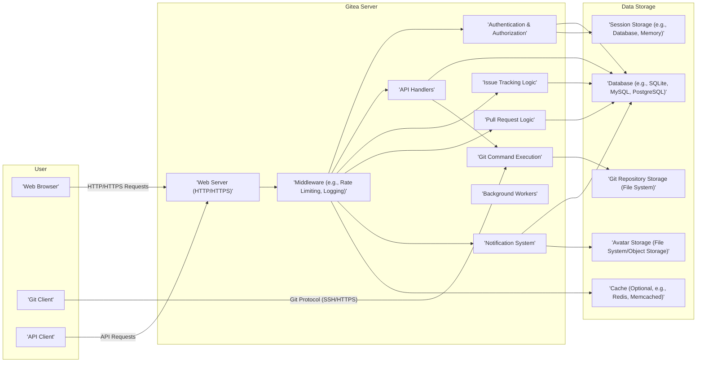
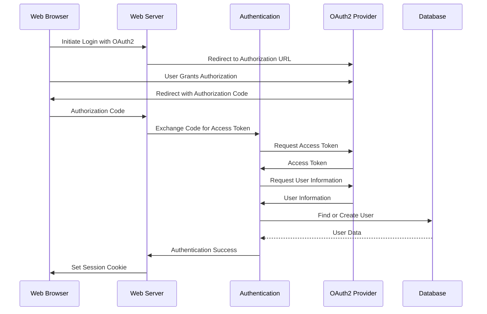
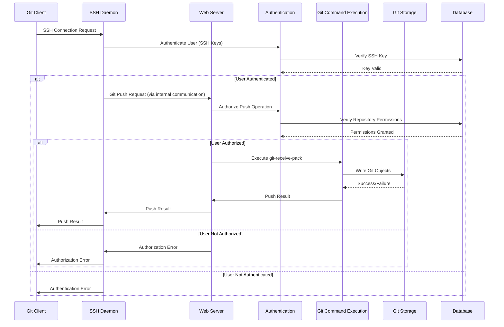
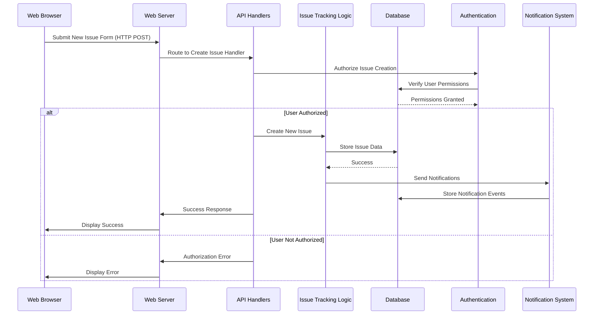

# Project Design Document: Gitea

**Version:** 1.1
**Date:** October 26, 2023
**Author:** AI Software Architect

## 1. Introduction

This document provides an enhanced architectural design of the Gitea project, an open-source, self-hosted Git service written in Go. This iteration builds upon the previous version, offering more granular details and focusing on aspects crucial for effective threat modeling. The aim is to provide a comprehensive understanding of Gitea's components, their interactions, and the overall system architecture, specifically highlighting potential security implications.

## 2. Goals and Objectives

Gitea aims to provide a lightweight, fast, and self-hosted alternative to popular Git hosting platforms. Key objectives include:

*   Providing core Git hosting functionalities (repositories, branches, commits).
*   Offering collaborative features like pull requests, issue tracking, and wikis.
*   Being easy to install and configure on various platforms.
*   Maintaining a low resource footprint.
*   Supporting a wide range of database backends.
*   Providing a user-friendly web interface.
*   Offering a comprehensive API for programmatic interaction.

## 3. High-Level Architecture

Gitea follows a traditional three-tier architecture, with a clear separation of concerns:

*   **Presentation Tier:**  Handles user interaction, primarily through a web application accessed via web browsers. This tier also includes API endpoints for programmatic access.
*   **Application Tier:** Contains the core Gitea application logic, responsible for processing user requests, enforcing business rules, and managing data interactions.
*   **Data Tier:** Provides persistent storage for all application data, encompassing Git repositories and associated metadata.

## 4. Key Components

This section provides a more detailed breakdown of Gitea's major components, highlighting their functionalities and potential security considerations.

*   **Web Server (HTTP/HTTPS):**
    *   **Functionality:** Listens for and handles incoming HTTP/HTTPS requests. Manages TLS/SSL termination, routing, and basic request processing.
    *   **Security Considerations:** Vulnerable to web server exploits if not properly configured and patched. Misconfigured TLS/SSL can lead to man-in-the-middle attacks.

*   **Authentication & Authorization:**
    *   **Functionality:** Verifies user identities using various methods (local accounts, OAuth2, LDAP, SAML). Enforces access control policies based on user roles and permissions. Manages API token generation and validation. Handles session management.
    *   **Security Considerations:** Weak authentication mechanisms can be bypassed. Insufficient authorization can lead to privilege escalation. Stored credentials must be securely hashed and salted. Session fixation and hijacking are potential threats.

*   **API Handlers:**
    *   **Functionality:** Implement the logic for Gitea's RESTful API endpoints. Handle requests for managing resources like repositories, issues, and users. Perform input validation and output sanitization.
    *   **Security Considerations:** Susceptible to injection attacks (SQL, command, XSS) if input validation is inadequate. API endpoints without proper authorization can be exploited. Rate limiting is crucial to prevent abuse.

*   **Git Command Execution:**
    *   **Functionality:** Executes Git commands on the server in response to user actions (e.g., `git push`, `git pull`). Manages interactions with the Git repository storage.
    *   **Security Considerations:**  Critical component for security. Command injection vulnerabilities are a major risk if user-provided data is not carefully sanitized before being passed to Git commands. Access control to Git commands is essential.

*   **Issue Tracking Logic:**
    *   **Functionality:** Manages the lifecycle of issues within repositories, including creation, updates, assignments, and labels. Stores issue data and facilitates commenting and collaboration.
    *   **Security Considerations:** Potential for XSS attacks through issue descriptions and comments if not properly sanitized. Authorization checks are needed to control who can create, modify, and close issues.

*   **Pull Request Logic:**
    *   **Functionality:** Facilitates code review and merging through pull requests. Manages the creation, review, commenting, and merging of pull requests. Integrates with Git command execution for merging.
    *   **Security Considerations:** Similar XSS risks as issue tracking. Authorization is crucial to control who can create, review, and merge pull requests. Spoofing of pull request authors is a potential concern.

*   **Notification System:**
    *   **Functionality:** Sends notifications to users about relevant events via web UI, email, and potentially other integrations. Manages notification subscriptions and delivery.
    *   **Security Considerations:**  Email injection vulnerabilities if email content is not properly sanitized. Exposure of sensitive information through notifications needs to be considered.

*   **Background Workers:**
    *   **Functionality:** Executes asynchronous tasks such as sending emails, processing webhooks, and garbage collecting repositories. Prevents blocking of user-facing requests.
    *   **Security Considerations:**  If background workers have elevated privileges, vulnerabilities in their execution could be exploited. Careful handling of sensitive data within background tasks is necessary.

*   **Middleware (e.g., Rate Limiting, Logging):**
    *   **Functionality:** Intercepts requests and responses to perform cross-cutting concerns. Examples include rate limiting to prevent abuse, logging for auditing, and security headers for browser protection.
    *   **Security Considerations:**  Properly configured middleware is essential for security. Misconfigured rate limiting can be bypassed. Insufficient logging hinders incident response.

*   **Database (e.g., SQLite, MySQL, PostgreSQL):**
    *   **Functionality:** Provides persistent storage for Gitea's metadata, including user accounts, repository information, issues, and pull requests.
    *   **Security Considerations:**  Susceptible to SQL injection attacks if queries are not parameterized. Database credentials must be securely managed. Access control to the database is critical. Regular backups are essential.

*   **Git Repository Storage (File System):**
    *   **Functionality:** Stores the actual Git repository data (objects, refs, etc.) as files on the server's file system.
    *   **Security Considerations:**  File system permissions must be carefully configured to prevent unauthorized access or modification of repository data. Hard links and symbolic links need careful handling to avoid security issues.

*   **Session Storage (e.g., Database, Memory):**
    *   **Functionality:** Stores user session data, such as authentication status and temporary information.
    *   **Security Considerations:**  Session data must be protected against unauthorized access. Secure session ID generation and management are crucial to prevent session hijacking.

*   **Avatar Storage (File System/Object Storage):**
    *   **Functionality:** Stores user and organization avatars.
    *   **Security Considerations:**  Potential for storing malicious files if not properly validated. Access control to avatar storage is important.

*   **Cache (Optional, e.g., Redis, Memcached):**
    *   **Functionality:**  Temporarily stores frequently accessed data to improve performance.
    *   **Security Considerations:**  Cached data might contain sensitive information. Access control to the cache is necessary. Cache poisoning is a potential threat.

## 5. Data Flow Diagrams

This section provides more detailed data flow diagrams for key user interactions, highlighting the components involved and data exchanged.

### 5.1. User Authentication (with OAuth2)

### 5.2. Pushing Changes to a Repository (via SSH)

### 5.3. Creating a New Issue

## 6. Security Considerations (Detailed)

This section expands on the security considerations for each component, providing more specific examples of potential threats and mitigation strategies.

*   **Web Server (HTTP/HTTPS):**
    *   **Threats:**  DDoS attacks, web server vulnerabilities (e.g., buffer overflows), misconfiguration leading to information disclosure.
    *   **Mitigations:** Keep the web server software up-to-date, implement rate limiting, use a web application firewall (WAF), enforce strong TLS/SSL configurations (e.g., HSTS).

*   **Authentication & Authorization:**
    *   **Threats:** Brute-force attacks, credential stuffing, session hijacking, privilege escalation, insecure API token storage.
    *   **Mitigations:** Implement strong password policies, use multi-factor authentication (MFA), secure session management (e.g., HTTP-only and secure cookies), principle of least privilege, securely store API tokens (e.g., hashed and salted).

*   **API Handlers:**
    *   **Threats:** SQL injection, command injection, cross-site scripting (XSS), cross-site request forgery (CSRF), insecure direct object references (IDOR).
    *   **Mitigations:** Parameterized queries, input validation and sanitization, output encoding, anti-CSRF tokens, proper authorization checks before accessing resources.

*   **Git Command Execution:**
    *   **Threats:** Command injection vulnerabilities if user-provided data is used in Git commands without proper sanitization.
    *   **Mitigations:**  Avoid direct execution of Git commands with user input. If necessary, carefully sanitize and validate all input. Use Git libraries where possible to avoid shell execution. Implement strict access control to Git commands.

*   **Issue Tracking Logic:**
    *   **Threats:** XSS through issue descriptions and comments.
    *   **Mitigations:**  Sanitize user-provided content before rendering it in the UI. Use a Content Security Policy (CSP) to mitigate XSS risks.

*   **Pull Request Logic:**
    *   **Threats:** Similar XSS risks as issue tracking. Potential for malicious code injection through pull request content.
    *   **Mitigations:**  Sanitize user-provided content. Implement code review processes.

*   **Notification System:**
    *   **Threats:** Email injection, exposure of sensitive information in notifications.
    *   **Mitigations:** Sanitize email content. Avoid including sensitive information in notifications unless necessary and ensure secure delivery.

*   **Background Workers:**
    *   **Threats:**  If compromised, background workers with elevated privileges could be used for malicious activities.
    *   **Mitigations:**  Apply the principle of least privilege to background workers. Securely manage any credentials used by background workers.

*   **Middleware (e.g., Rate Limiting, Logging):**
    *   **Threats:**  Bypassing rate limiting, insufficient logging hindering incident response.
    *   **Mitigations:**  Properly configure and test middleware. Ensure comprehensive logging of security-relevant events.

*   **Database (e.g., SQLite, MySQL, PostgreSQL):**
    *   **Threats:** SQL injection, unauthorized access to sensitive data.
    *   **Mitigations:** Use parameterized queries, enforce strong database access controls, encrypt sensitive data at rest, regularly back up the database.

*   **Git Repository Storage (File System):**
    *   **Threats:** Unauthorized access or modification of repository data.
    *   **Mitigations:**  Configure appropriate file system permissions. Regularly audit file system permissions.

*   **Session Storage (e.g., Database, Memory):**
    *   **Threats:** Session hijacking, session fixation.
    *   **Mitigations:**  Use secure session ID generation, implement HTTP-only and secure cookies, regenerate session IDs after login.

*   **Avatar Storage (File System/Object Storage):**
    *   **Threats:** Storage of malicious files.
    *   **Mitigations:**  Validate file types and sizes upon upload. Implement access controls to avatar storage.

*   **Cache (Optional, e.g., Redis, Memcached):**
    *   **Threats:** Cache poisoning, unauthorized access to cached data.
    *   **Mitigations:**  Implement access controls to the cache. Use secure communication channels to the cache.

## 7. Deployment Scenarios (with Security Implications)

This section elaborates on common deployment scenarios and their associated security considerations.

*   **Single Server:**
    *   **Description:** All components reside on a single server.
    *   **Security Implications:**  A single point of failure. If the server is compromised, all components are affected. Resource contention can impact performance and security.
    *   **Considerations:**  Implement strong host-level security measures, including firewalls and intrusion detection systems.

*   **Clustered Deployment:**
    *   **Description:** Components are distributed across multiple servers for scalability and high availability.
    *   **Security Implications:** Increased complexity in managing security across multiple servers. Secure communication between components is crucial.
    *   **Considerations:**  Implement network segmentation, use secure communication protocols (e.g., TLS) between components, manage access control for inter-component communication.

*   **Containerized Deployment (e.g., Docker, Kubernetes):**
    *   **Description:** Gitea is deployed within containers.
    *   **Security Implications:** Container security is paramount. Vulnerabilities in container images or the container runtime can be exploited.
    *   **Considerations:**  Use trusted base images, regularly scan container images for vulnerabilities, implement container security best practices (e.g., least privilege for containers).

*   **Cloud-Based Deployment:**
    *   **Description:** Gitea is deployed on cloud platforms using managed services.
    *   **Security Implications:** Reliance on the cloud provider's security measures. Misconfiguration of cloud services can lead to vulnerabilities.
    *   **Considerations:**  Follow cloud provider's security best practices, properly configure access controls for cloud resources, utilize cloud security services (e.g., security groups, IAM).

## 8. Technologies Used

*   **Programming Language:** Go
*   **Web Framework:**  Built-in `net/http` or a lightweight router (e.g., Chi, Gin).
*   **Database:** Supports SQLite, MySQL, PostgreSQL, TiDB.
*   **Git Implementation:** Uses the `go-git` library or calls the `git` command-line tool.
*   **Frontend:** HTML, CSS, JavaScript (often using frameworks like jQuery, potentially moving towards more modern frameworks).
*   **Templating Engine:** Go's `html/template` package.
*   **Authentication Libraries:**  Potentially custom implementations or standard Go libraries (e.g., `golang.org/x/oauth2`).
*   **Logging:** Standard Go logging libraries or third-party libraries (e.g., Zap, Logrus).
*   **Caching (Optional):** Redis, Memcached.

## 9. Future Considerations

*   **Enhanced Security Features:** Implementing more robust security features like security scanning integrations, dependency vulnerability scanning, and improved audit logging.
*   **Improved Scalability and Performance:** Further optimizing the application for handling larger workloads and improving response times.
*   **More Integrations:** Expanding integrations with CI/CD tools, issue trackers, and other development platforms.
*   **Advanced Search Functionality:** Implementing more sophisticated code search and indexing capabilities.
*   **Plugin System:** Developing a robust plugin system to allow for community-driven extensions and customizations.

This improved document provides a more detailed and security-focused architectural overview of the Gitea project, making it a more effective foundation for subsequent threat modeling activities.