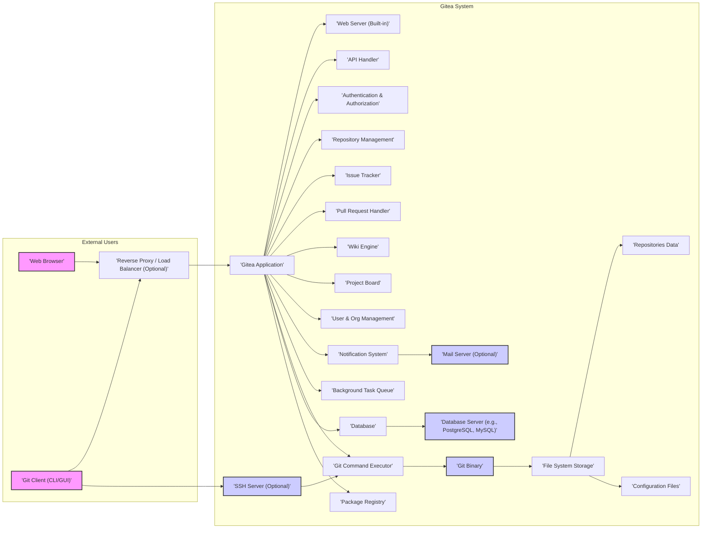

# Project Design Document: Gitea

## 1. Project Overview

### 1.1. Project Description

Gitea is a community-driven, lightweight, open-source Git service written in Go. It provides a self-hosted alternative to platforms like GitHub, GitLab, and Bitbucket, emphasizing ease of installation, speed, and minimal resource consumption. Gitea aims to be the easiest, fastest, and most painless way to set up a self-hosted Git service.  It offers a comprehensive suite of features for software development teams, including:

*   **Repository Management:** Full Git repository hosting with features like forking, mirroring, and access control.
*   **Issue Tracking:** Robust issue tracking system with labels, milestones, assignees, and project boards integration.
*   **Pull Requests (Merge Requests):** Collaborative code review workflows with diff views, comments, and merge conflict resolution.
*   **Wikis:** Built-in wiki system for project documentation, supporting Markdown and other formats.
*   **Project Boards:** Kanban-style project boards for agile project management and task visualization.
*   **User and Organization Management:** Flexible user and organization management with teams, roles, and permissions.
*   **Authentication and Authorization:** Supports multiple authentication methods including local accounts, LDAP, OAuth2, SAML, and more, with fine-grained authorization controls.
*   **API:** Comprehensive RESTful API for automation, scripting, and integration with external services and tools.
*   **Webhooks:**  Extensive webhook support for triggering actions in external systems based on Gitea events.
*   **Packages:** Package registry support for various package formats (e.g., npm, Maven, Go modules).

Gitea is designed for cross-platform compatibility and can be deployed on various operating systems and architectures. It supports multiple database backends, offering flexibility in infrastructure choices. The project is actively developed and maintained by a vibrant open-source community.

### 1.2. Target Audience

This document is intended for a diverse audience involved in the Gitea project and its deployment:

*   **Security Engineers:** To gain a deep understanding of the system architecture for conducting thorough threat modeling, vulnerability assessments, and penetration testing.
*   **Software Developers:** To understand the internal components, data flow, and APIs for contributing to Gitea development, debugging issues, and extending functionality.
*   **System Administrators/DevOps Engineers:** To understand the deployment architecture, infrastructure requirements, dependencies, and configuration options for setting up, managing, and maintaining Gitea instances.
*   **Project Managers/Stakeholders:** To obtain a high-level overview of the system design, key features, security considerations, and deployment options for making informed decisions about using and managing Gitea.
*   **Community Members:** To understand the project's technical design and contribute to discussions, documentation, and development efforts.

## 2. System Architecture

### 2.1. Architecture Diagram

### 2.2. Component Description

*   **"'Web Browser'"**: Represents users accessing Gitea through a graphical web interface for repository browsing, issue tracking, pull request management, and other web-based functionalities.
*   **"'Git Client (CLI/GUI)'"**: Represents users interacting with Git repositories using command-line tools (e.g., `git`) or graphical Git clients (e.g., SourceTree, GitKraken) for version control operations.
*   **"'Reverse Proxy / Load Balancer (Optional)'"**: An optional but highly recommended component, typically Nginx, Apache HTTP Server, or HAProxy, deployed in front of Gitea for:
    *   **SSL/TLS Termination:** Handling HTTPS encryption and decryption, securing web traffic.
    *   **Load Balancing:** Distributing incoming traffic across multiple Gitea application instances for improved performance, scalability, and high availability in clustered deployments.
    *   **Static Content Serving:** Efficiently serving static assets (images, CSS, JavaScript files) to reduce load on the Gitea application.
    *   **Security Enhancement:** Providing an additional layer of security by filtering malicious requests, implementing rate limiting, and hiding the internal Gitea application architecture.
    *   **URL Rewriting and Routing:** Managing URL structures and routing requests to appropriate Gitea instances or backend services.
*   **"'Gitea Application'"**: The core application logic of Gitea, written in Go. It encompasses all the functional components and business logic of the Git service:
    *   **"'Web Server (Built-in)'"**: Gitea includes an embedded web server (based on Go's `net/http` package) to handle HTTP/HTTPS requests directly if a reverse proxy is not used.  This simplifies single-server deployments.
    *   **"'API Handler'"**: Processes requests to the RESTful API, enabling programmatic access to Gitea functionalities for automation, integrations, and third-party tools. The API covers most of Gitea's features.
    *   **"'Authentication & Authorization'"**: Manages user identity verification (authentication) and access control (authorization). Supports various authentication backends (local database, LDAP, Active Directory, OAuth2 providers like GitHub/Google, SAML, OpenID Connect, PAM) and defines permissions for users, organizations, and teams to access repositories, issues, wikis, and other resources.
    *   **"'Repository Management'"**: Handles all operations related to Git repositories: creation, deletion, forking, mirroring, archiving, renaming, transfer, and access control management (permissions, collaborators, teams). It interacts with the "'Git Command Executor'" to perform Git operations.
    *   **"'Issue Tracker'"**: Provides a comprehensive issue tracking system for bug reports, feature requests, tasks, and discussions. Features include labels, milestones, assignees, comments, issue templates, search, and integration with project boards and pull requests.
    *   **"'Pull Request Handler'"**: Manages the code review and merging workflow using pull requests (or merge requests in GitLab terminology). Features include diff views, inline comments, commit history, merge conflict resolution, status checks, and merge strategies.
    *   **"'Wiki Engine'"**: Provides a built-in wiki system for project documentation, knowledge bases, and collaborative content creation. Supports Markdown, AsciiDoc, and potentially other markup formats. Wikis are stored as Git repositories.
    *   **"'Project Board'"**: Implements Kanban-style project boards for visual project management, task tracking, and workflow organization. Boards can be associated with repositories and issues.
    *   **"'User & Org Management'"**: Manages user accounts, profiles, organizations, teams, and permissions. Handles user registration, login, password management, profile settings, organization creation, team membership, and role-based access control.
    *   **"'Notification System'"**: Generates and delivers notifications to users about events within Gitea, such as new issues, pull request updates, comments, mentions, and repository changes. Notifications can be delivered via email, web UI, and webhooks.
    *   **"'Background Task Queue'"**: Manages asynchronous tasks that are not time-critical and can be processed in the background. Examples include sending emails, processing webhooks, repository indexing for search, and performing maintenance tasks.  Uses task queue systems like Celery or similar Go-based solutions internally.
    *   **"'Git Command Executor'"**:  Acts as an intermediary between the Gitea application logic and the "'Git Binary'". It securely executes Git commands on behalf of the application, handling input sanitization and output processing. This component is crucial for security and abstraction.
    *   **"'Package Registry'"**:  Provides a platform for hosting and managing software packages (e.g., npm, Maven, Go modules) associated with repositories. Allows users to publish and consume packages within their Gitea instance.
*   **"'Git Binary'"**: The underlying Git executable (`git`), a fundamental dependency for Gitea. It is responsible for all core Git operations, including repository creation, cloning, pushing, pulling, branching, merging, and diffing. Gitea relies on the `git` command-line interface.
*   **"'Database'"**:  Stores persistent data for Gitea, including:
    *   User accounts, organizations, teams, repositories, issues, pull requests, wikis, project boards, packages, access tokens, sessions, and configuration settings.
    *   Metadata about Git repositories, but not the raw Git repository data itself (which is stored in "'File System Storage'").
    *   Supports various relational database systems through the "'Database Server'".
*   **"'Database Server (e.g., PostgreSQL, MySQL)'"**: The chosen database management system to store Gitea's structured data. Gitea officially supports PostgreSQL, MySQL, SQLite (primarily for testing or very small setups), TiDB (TiDB is a MySQL-compatible distributed SQL database), and MSSQL (Microsoft SQL Server). PostgreSQL and MySQL are the recommended choices for production environments.
*   **"'File System Storage'"**:  The file system on the server where Gitea stores:
    *   **"'Repositories Data'"**: The actual Git repository data (objects, packfiles, refs, loose objects) on disk in standard Git repository format (typically "bare" repositories). Gitea manages repository paths and storage locations.
    *   **"'Configuration Files'"**: Gitea's configuration files (e.g., `app.ini`, or configuration via environment variables). These files define database settings, server settings, security settings, and other application parameters.
*   **"'Mail Server (Optional)'"**: An external SMTP (Simple Mail Transfer Protocol) server used by the "'Notification System'" to send email notifications to users. Gitea needs SMTP server details (host, port, authentication) configured to enable email functionality.
*   **"'SSH Server (Optional)'"**: An SSH server (typically OpenSSH) used for Git operations over SSH protocol. It provides secure, authenticated access for Git commands like `git clone`, `git push`, and `git pull` via SSH keys. Gitea integrates with the SSH server for authentication and authorization, delegating repository access control to Gitea's internal permission system.

## 3. Data Flow

This section describes key data flow scenarios within Gitea, illustrating how different components interact to fulfill user requests and system operations.

1.  **User Authentication (Web UI - Local Accounts):**
    *   "'Web Browser'" sends a login request (username/password) to "'Reverse Proxy / Load Balancer (Optional)'" via HTTPS.
    *   "'Reverse Proxy / Load Balancer (Optional)'" forwards the request to "'Gitea Application'".
    *   "'Gitea Application'" -> "'Authentication & Authorization'" component receives the credentials.
    *   "'Authentication & Authorization'" component queries the "'Database'" (via "'Database Server'") to verify the username and password against stored user credentials.
    *   Upon successful authentication, "'Authentication & Authorization'" creates a session, stores session data (typically in the "'Database'" or in-memory cache), and sets a session cookie in the response.
    *   "'Gitea Application'" sends a successful login response (including session cookie) back to "'Reverse Proxy / Load Balancer (Optional)'", which forwards it to "'Web Browser'".
    *   "'Web Browser'" stores the session cookie for subsequent requests, maintaining the authenticated session.

2.  **Browse Repository Files (Web UI):**
    *   "'Web Browser'" sends a request to view files in a specific repository path to "'Reverse Proxy / Load Balancer (Optional)'" (HTTPS), including the session cookie for authentication.
    *   "'Reverse Proxy / Load Balancer (Optional)'" forwards the request to "'Gitea Application'".
    *   "'Gitea Application'" -> "'Authentication & Authorization'" component verifies the user's session cookie and retrieves user permissions.
    *   "'Authentication & Authorization'" checks if the authenticated user has read access to the requested repository.
    *   If authorized, "'Gitea Application'" -> "'Repository Management'" component is invoked.
    *   "'Repository Management'" uses "'Git Command Executor'" to execute `git ls-tree` or similar Git commands via "'Git Binary'" to retrieve the file list and metadata from "'Repositories Data'" in "'File System Storage'".
    *   "'Repository Management'" retrieves repository metadata (e.g., description, settings) from the "'Database'".
    *   "'Gitea Application'" renders the web page with the file listing, using data from "'Repositories Data'" and "'Database'", and sends the HTML response to "'Web Browser'" via "'Reverse Proxy / Load Balancer (Optional)'".

3.  **Git Push (SSH):**
    *   "'Git Client (CLI/GUI)'" initiates a `git push` command to "'SSH Server (Optional)'" using SSH protocol.
    *   "'SSH Server (Optional)'" authenticates the user based on SSH keys configured in Gitea.
    *   "'SSH Server (Optional)'" forwards the authenticated Git command and data stream to "'Gitea Application'".
    *   "'Gitea Application'" -> "'Authentication & Authorization'" component verifies the user's permissions for the target repository (push access).
    *   If authorized, "'Gitea Application'" -> "'Git Command Executor'" executes the `git receive-pack` command via "'Git Binary'".
    *   "'Git Binary'" receives the pushed Git objects and updates the "'Repositories Data'" in "'File System Storage'".
    *   "'Git Command Executor'" informs "'Gitea Application'" about the success or failure of the push operation.
    *   "'Gitea Application'" updates repository metadata in the "'Database'" (e.g., last commit, branch updates).
    *   "'Gitea Application'" triggers the "'Notification System'" to send notifications (e.g., email, webhooks) about the push event to relevant users and services.
    *   "'Gitea Application'" sends a response back to "'SSH Server (Optional)'", which relays it to "'Git Client (CLI/GUI)'".

4.  **Create Issue via API:**
    *   An external application sends an API request (e.g., HTTP POST with JSON payload) to create a new issue to "'Reverse Proxy / Load Balancer (Optional)'" (HTTPS). The request includes an API token or other authentication credentials.
    *   "'Reverse Proxy / Load Balancer (Optional)'" forwards the request to "'Gitea Application'".
    *   "'Gitea Application'" -> "'API Handler'" receives and processes the API request.
    *   "'API Handler'" -> "'Authentication & Authorization'" component verifies the API token or credentials and checks if the authenticated user/application has permission to create issues in the specified repository.
    *   If authorized, "'API Handler'" forwards the request data to the "'Issue Tracker'" component.
    *   "'Issue Tracker'" component validates the input data (title, description, etc.) and creates a new issue record in the "'Database'" (via "'Database Server'").
    *   "'Issue Tracker'" associates the issue with the repository and potentially assigns labels, milestones, etc.
    *   "'Issue Tracker'" triggers the "'Notification System'" to send notifications about the new issue creation.
    *   "'API Handler'" constructs an API response (e.g., JSON with issue details) and sends it back to the external application via "'Reverse Proxy / Load Balancer (Optional)'".

## 4. Technology Stack

This section details the primary technologies used in Gitea's development and deployment.

*   **Programming Language:** Go (Golang) - chosen for its performance, concurrency, and ease of deployment.
*   **Database Support:**
    *   **Officially Supported:** PostgreSQL (recommended for production), MySQL/MariaDB (recommended for production), SQLite3 (for testing/small setups), TiDB (distributed MySQL compatible), MSSQL (Microsoft SQL Server).
    *   **Database Driver:**  Uses Go database/sql package and specific drivers for each database (e.g., `github.com/lib/pq` for PostgreSQL, `github.com/go-sql-driver/mysql` for MySQL).
*   **Web Framework:**  Gitea uses its own lightweight web framework built on top of Go's `net/http` package. It follows principles similar to frameworks like Macaron but is custom-built for Gitea's needs, providing routing, middleware, and template rendering.
*   **Git Binary Interaction:**  Relies on the standard `git` command-line tool (`git`) executable. Gitea interacts with Git by executing `git` commands via system calls.
*   **Frontend Technologies:**
    *   **HTML:**  Standard HTML for structuring web pages.
    *   **CSS:**  Cascading Style Sheets for styling and layout (using Semantic UI framework and custom styles).
    *   **JavaScript:** Primarily jQuery for DOM manipulation and AJAX, along with other libraries for specific UI components and functionalities.  Modern frontend frameworks (like Vue.js or React) are being gradually adopted in newer versions for enhanced interactivity and maintainability.
*   **Template Engine:**  Go's built-in `html/template` package for server-side rendering of HTML pages.
*   **Caching:**
    *   **In-Memory Caching:** Uses Go's `sync.Map` and other in-memory data structures for caching frequently accessed data within the Gitea application instances (e.g., user sessions, configuration).
    *   **External Caching (Optional):**  Can be configured to use external caching systems like Redis or Memcached for distributed caching in clustered deployments to improve performance and reduce database load.
*   **Operating System Compatibility:** Linux, macOS, Windows, and other Unix-like systems due to Go's cross-platform nature. Gitea binaries are typically distributed for common operating systems and architectures.
*   **Reverse Proxy/Load Balancer (Optional):** Nginx (highly recommended), Apache HTTP Server, HAProxy, Caddy, or cloud-based load balancers (e.g., AWS ELB, Azure Load Balancer, GCP Load Balancer).
*   **SSH Server (Optional):** OpenSSH (most common), or any SSH server compatible with public key authentication and Git's SSH protocol.
*   **Mail Server (Optional):** Any SMTP server (e.g., Postfix, Sendmail, Exim, cloud-based SMTP services like SendGrid, Mailgun, AWS SES).

## 5. Deployment Model

Gitea offers flexible deployment options to suit various scales and infrastructure preferences.

*   **Single Server Deployment (Simplest):**
    *   **Description:** All Gitea components (Application, Web Server, Git Binary, Database Server, optional SSH Server) are installed and run on a single physical or virtual server.
    *   **Pros:** Easiest to set up and manage, minimal infrastructure requirements, suitable for small teams, personal use, or development/testing environments.
    *   **Cons:** Limited scalability and high availability, single point of failure, resource contention if workload increases significantly.
    *   **Use Cases:** Personal Git server, small teams, development/testing, learning Gitea.
    *   **Example:** Installing Gitea binary, PostgreSQL, and OpenSSH on a single Ubuntu server.

*   **Clustered Deployment (High Availability & Scalability):**
    *   **Description:** Multiple instances of the "'Gitea Application'" are deployed behind a "'Reverse Proxy / Load Balancer'". A dedicated, clustered "'Database Server'" (e.g., PostgreSQL cluster, MySQL cluster) is used. "'File System Storage'" for repositories is shared across all Gitea application instances (e.g., using NFS, GlusterFS, Ceph, or object storage like AWS S3 for Git repositories - though object storage for Git is less common and requires specific configurations).  Separate or load-balanced "'SSH Server'" instances can be used.
    *   **Pros:** High availability (fault tolerance), horizontal scalability (handle increased load by adding more application instances), improved performance, redundancy.
    *   **Cons:** More complex to set up and manage, requires more infrastructure resources, shared storage can be a bottleneck if not properly designed.
    *   **Use Cases:** Medium to large teams, production environments requiring high uptime and performance, organizations with growing Git repository needs.
    *   **Example:** Deploying multiple Gitea Docker containers behind Nginx load balancer, using a PostgreSQL cluster for the database, and NFS for shared repository storage.

*   **Containerized Deployment (Docker, Kubernetes - Modern & Scalable):**
    *   **Description:** Gitea and its dependencies are packaged into Docker containers. Orchestration platforms like Kubernetes or Docker Compose are used to manage and deploy these containers. This approach facilitates scalability, portability, and easier management through containerization.
    *   **Pros:** Highly scalable and resilient (especially with Kubernetes), portable across different environments (cloud, on-premise), simplified deployment and updates, efficient resource utilization, easier to manage using container orchestration tools.
    *   **Cons:** Requires familiarity with containerization and orchestration technologies, initial setup can be more complex than single-server deployment.
    *   **Use Cases:** Production environments, cloud deployments, organizations adopting DevOps practices, teams requiring rapid scaling and updates.
    *   **Example:** Deploying Gitea using official Gitea Docker image on Kubernetes, using persistent volumes for database and repository data, and a Kubernetes Service for load balancing.

*   **Cloud Deployment (AWS, Azure, GCP - Managed Services):**
    *   **Description:** Deploying Gitea on cloud platforms leveraging cloud-managed services. This can involve using cloud VMs (EC2, Azure VMs, Compute Engine), container services (ECS, AKS, GKE), managed database services (RDS, Azure Database for PostgreSQL, Cloud SQL), and cloud storage (S3, Azure Blob Storage, Google Cloud Storage).
    *   **Pros:** Scalability, reliability, and availability provided by cloud infrastructure, reduced operational overhead by using managed services, integration with other cloud services, pay-as-you-go pricing.
    *   **Cons:** Vendor lock-in, potential cost implications depending on cloud service usage, security considerations related to cloud environments, requires understanding of cloud platform services.
    *   **Use Cases:** Organizations already using cloud platforms, teams seeking to offload infrastructure management, deployments requiring cloud-native scalability and resilience.
    *   **Example:** Deploying Gitea on AWS EC2 instances with an RDS PostgreSQL database, using S3 for repository backups, and AWS ELB for load balancing. Alternatively, deploying Gitea containers on AWS ECS or EKS.

## 6. Security Considerations

Security is paramount for a Git hosting platform like Gitea. This section outlines key security considerations for Gitea deployments, categorized for clarity. These points will serve as a basis for detailed threat modeling and security assessments.

**6.1. Authentication and Authorization Security:**

*   **Strong Authentication Mechanisms:**
    *   **Multi-Factor Authentication (MFA):** Enforce MFA (e.g., TOTP, WebAuthn) for user accounts to add an extra layer of security beyond passwords.
    *   **Password Policies:** Implement strong password policies (complexity, length, expiration) and enforce password resets.
    *   **Secure Authentication Backends:** Properly configure and secure authentication backends (LDAP/AD, OAuth2, SAML) and ensure secure communication protocols (LDAPS, HTTPS).
    *   **Disable Default Accounts:** Remove or disable any default administrator accounts or test accounts after installation.
*   **Robust Authorization Controls:**
    *   **Role-Based Access Control (RBAC):** Utilize Gitea's RBAC system to define roles and permissions for users, organizations, and teams, ensuring least privilege access.
    *   **Repository-Level Permissions:** Configure granular permissions at the repository level (read, write, admin) to control access to code and project resources.
    *   **Branch Protection:** Implement branch protection rules to prevent direct pushes to critical branches, enforce code reviews via pull requests, and restrict force pushes.
    *   **API Token Security:** Securely manage API tokens, use short-lived tokens where possible, and restrict token scopes to the minimum required permissions.

**6.2. Application Security:**

*   **Input Validation and Output Encoding:**
    *   **Input Sanitization:** Implement rigorous input validation on all user inputs, API requests, and data from external sources to prevent injection attacks (SQL injection, command injection, XSS). Use parameterized queries for database interactions.
    *   **Output Encoding:** Properly encode all outputs rendered in the web UI to prevent Cross-Site Scripting (XSS) vulnerabilities. Use context-aware encoding based on the output context (HTML, JavaScript, URL).
*   **Session Management Security:**
    *   **Secure Session Cookies:** Use HTTP-only and Secure flags for session cookies to prevent client-side JavaScript access and transmission over insecure HTTP.
    *   **Session Timeouts:** Configure appropriate session timeouts to limit the duration of active sessions and reduce the risk of session hijacking.
    *   **Session Regeneration:** Regenerate session IDs after successful login to mitigate session fixation attacks.
    *   **HTTP Strict Transport Security (HSTS):** Enable HSTS to force browsers to always connect to Gitea over HTTPS, preventing protocol downgrade attacks.
*   **Cross-Site Request Forgery (CSRF) Protection:**
    *   **CSRF Tokens:** Implement CSRF protection using anti-CSRF tokens in forms and API requests to prevent CSRF attacks. Gitea should have built-in CSRF protection mechanisms.
*   **Dependency Management and Vulnerability Scanning:**
    *   **Dependency Updates:** Regularly update Gitea dependencies (Go libraries, frontend libraries) and the Git binary to patch known vulnerabilities.
    *   **Dependency Scanning Tools:** Use dependency scanning tools to identify and remediate vulnerabilities in Gitea's dependencies.
*   **Error Handling and Logging:**
    *   **Secure Error Handling:** Avoid exposing sensitive information in error messages. Log detailed error information securely for debugging and security analysis.
    *   **Comprehensive Logging:** Implement comprehensive logging of authentication attempts, authorization decisions, API requests, errors, and security-related events for auditing and incident response.

**6.3. Infrastructure Security:**

*   **Database Security:**
    *   **Database Access Control:** Restrict database access to only the Gitea application and authorized administrators. Use strong database authentication.
    *   **Database Hardening:** Follow database security best practices: strong passwords, disable unnecessary features, regular patching, and consider encryption at rest and in transit.
    *   **Principle of Least Privilege for Database User:** Grant the Gitea database user only the necessary permissions required for its operation.
*   **File System Security:**
    *   **Repository Data Protection:** Secure the file system where Git repositories are stored. Restrict access to repository data to the Gitea application and authorized system administrators.
    *   **Configuration File Protection:** Protect Gitea configuration files from unauthorized access. Store sensitive configuration data (database passwords, secrets) securely (e.g., using environment variables or secrets management systems).
*   **Network Security:**
    *   **HTTPS Enforcement:** Enforce HTTPS for all web traffic to protect data in transit. Use TLS 1.2 or higher.
    *   **SSH Security:** Secure SSH access for Git operations. Disable password-based SSH authentication and enforce SSH key-based authentication.
    *   **Firewall Configuration:** Configure firewalls to restrict network access to Gitea components. Only allow necessary ports and protocols. Consider network segmentation to isolate Gitea components.
    *   **Regular Security Audits and Penetration Testing:** Conduct periodic security audits and penetration testing to identify and address potential vulnerabilities in the Gitea deployment and infrastructure.

**6.4. Operational Security:**

*   **Regular Security Updates and Patching:** Establish a process for regularly updating Gitea, its dependencies, the operating system, and other infrastructure components with security patches.
*   **Security Monitoring and Incident Response:** Implement security monitoring and alerting to detect suspicious activity and security incidents. Establish an incident response plan to handle security breaches effectively.
*   **Backup and Recovery:** Implement regular backups of Gitea data (database and repositories) and test the recovery process to ensure data integrity and availability in case of failures or attacks.
*   **Security Awareness Training:** Provide security awareness training to Gitea users and administrators to promote secure practices and reduce the risk of human error.

This improved design document provides a more comprehensive and detailed overview of Gitea's architecture, data flow, technology stack, deployment models, and security considerations. It serves as a solid foundation for threat modeling and further security analysis.