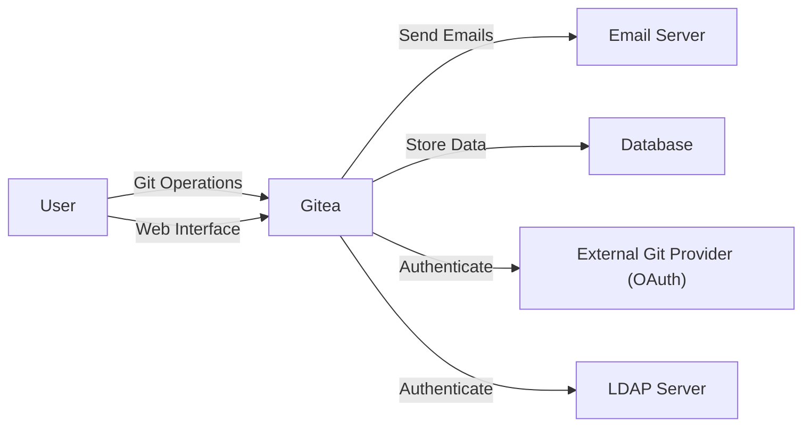
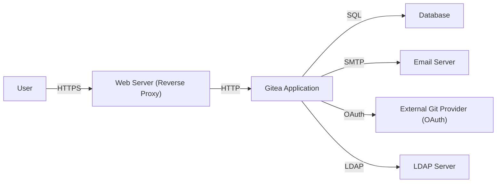
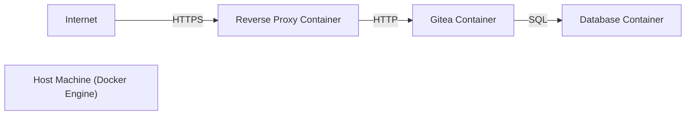
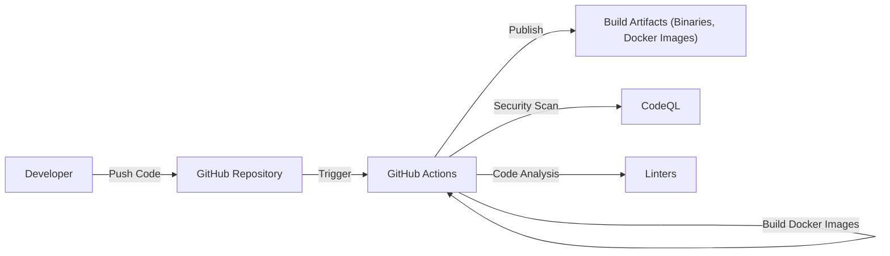

Okay, let's create a design document for the Gitea project, focusing on aspects relevant for threat modeling.

# BUSINESS POSTURE

Gitea is a self-hosted Git service, similar to GitHub, GitLab, or Bitbucket.  It's open-source and written in Go.  The primary business goals and priorities revolve around providing a lightweight, easy-to-install, and maintain Git server solution.  It caters to individuals, teams, and organizations who prefer or require on-premises code hosting for reasons of control, compliance, or cost.

Business Priorities:

*   Provide a stable and reliable Git hosting service.
*   Ensure ease of installation and maintenance.
*   Offer a user-friendly interface and experience.
*   Maintain a lightweight footprint to run on low-resource systems.
*   Support a wide range of operating systems and architectures.
*   Foster a strong open-source community.
*   Provide features comparable to popular hosted Git services.

Business Goals:

*   Become a leading self-hosted Git solution.
*   Attract a large and active user and contributor base.
*   Offer a viable alternative to commercial Git hosting platforms.
*   Enable secure and private code collaboration.

Most Important Business Risks:

*   Data breaches leading to unauthorized access to source code repositories.
*   Service downtime or unavailability impacting user workflows.
*   Vulnerabilities that could be exploited to compromise user accounts or the server itself.
*   Loss of user data due to hardware failure, software bugs, or malicious attacks.
*   Failure to keep up with security best practices and emerging threats.
*   Reputational damage due to security incidents or poor user experience.
*   Inability to scale to meet the needs of growing organizations.

# SECURITY POSTURE

Gitea incorporates several security controls and addresses various risks.  However, as with any complex software, there are always areas for improvement and ongoing vigilance.

Existing Security Controls:

*   security control: Authentication: Gitea supports multiple authentication methods, including built-in user accounts, LDAP, OAuth (GitHub, GitLab, Google, etc.), and PAM. Described in documentation and implemented in code.
*   security control: Authorization: Gitea provides role-based access control (RBAC) to manage user permissions on repositories and organizations. Described in documentation and implemented in code.
*   security control: SSH Key Management: Users can manage their SSH keys for secure Git operations. Described in documentation and implemented in code.
*   security control: Two-Factor Authentication (2FA): Gitea supports 2FA for enhanced account security. Described in documentation and implemented in code.
*   security control: Web Application Firewall (WAF) (Recommended to be used externally): While not built-in, Gitea is often deployed behind a reverse proxy that can act as a WAF (e.g., Nginx, Apache, Caddy).
*   security control: Regular Security Updates: The Gitea project releases regular updates to address security vulnerabilities and improve overall security.
*   security control: Input Validation: Gitea performs input validation to mitigate risks like Cross-Site Scripting (XSS) and SQL Injection. Implemented in code.
*   security control: CSRF Protection: Gitea implements measures to prevent Cross-Site Request Forgery (CSRF) attacks. Implemented in code.
*   security control: Content Security Policy (CSP): Gitea uses CSP headers to mitigate XSS and other code injection attacks. Implemented in code.

Accepted Risks:

*   accepted risk: Reliance on External Authentication Providers: When using OAuth or LDAP, the security of user accounts partially depends on the security of the external provider.
*   accepted risk: Self-Hosting Responsibility: Users who self-host Gitea are responsible for securing the underlying server infrastructure and operating system.
*   accepted risk: Potential for Zero-Day Exploits: Like all software, Gitea is susceptible to undiscovered vulnerabilities (zero-days).
*   accepted risk: Supply Chain Vulnerabilities: Gitea depends on third-party libraries and dependencies, which could introduce vulnerabilities.

Recommended Security Controls (High Priority):

*   Implement a robust vulnerability scanning and management process, including regular penetration testing.
*   Integrate with a Security Information and Event Management (SIEM) system for centralized logging and threat detection.
*   Provide more granular permission controls beyond the current RBAC model.
*   Implement stricter password policies and account lockout mechanisms.
*   Offer built-in support for WebAuthn/FIDO2 for passwordless authentication.
*   Implement signed commits and releases by default.

Security Requirements:

*   Authentication:
    *   Support strong password policies.
    *   Enforce 2FA for all users or specific roles.
    *   Provide secure session management.
    *   Log all authentication attempts (success and failure).

*   Authorization:
    *   Implement fine-grained access control to repositories, branches, and specific actions.
    *   Regularly review and audit user permissions.
    *   Provide a clear and understandable permission model.

*   Input Validation:
    *   Validate all user inputs on both the client-side and server-side.
    *   Use a whitelist approach to input validation whenever possible.
    *   Sanitize output to prevent XSS attacks.

*   Cryptography:
    *   Use strong, industry-standard cryptographic algorithms for storing passwords and sensitive data.
    *   Use HTTPS for all communication.
    *   Support secure key management practices.
    *   Regularly review and update cryptographic implementations.

# DESIGN

## C4 CONTEXT

C4 Context Element Descriptions:

*   Element:
    *   Name: User
    *   Type: Person
    *   Description: A developer or user interacting with the Gitea instance.
    *   Responsibilities: Accessing repositories, managing code, collaborating with others.
    *   Security controls: Strong passwords, 2FA, SSH keys.

*   Element:
    *   Name: Gitea
    *   Type: Software System
    *   Description: The self-hosted Git service.
    *   Responsibilities: Hosting Git repositories, managing user accounts, providing a web interface.
    *   Security controls: Authentication, authorization, input validation, CSRF protection, CSP.

*   Element:
    *   Name: Email Server
    *   Type: External System
    *   Description: An external email server used for sending notifications.
    *   Responsibilities: Delivering emails to users.
    *   Security controls: Secure connection (TLS), authentication.

*   Element:
    *   Name: Database
    *   Type: External System
    *   Description: A database server used to store Gitea's data (users, repositories, settings).
    *   Responsibilities: Persisting data.
    *   Security controls: Database access controls, encryption at rest (recommended).

*   Element:
    *   Name: External Git Provider (OAuth)
    *   Type: External System
    *   Description: An external Git provider (e.g., GitHub, GitLab) used for OAuth authentication.
    *   Responsibilities: Authenticating users.
    *   Security controls: OAuth protocol security.

*   Element:
    *   Name: LDAP Server
    *   Type: External System
    *   Description: An LDAP server used for user authentication and directory services.
    *   Responsibilities: Authenticating users, providing user information.
    *   Security controls: Secure connection (LDAPS), access controls.

## C4 CONTAINER

C4 Container Element Descriptions:

*   Element:
    *   Name: User
    *   Type: Person
    *   Description: A developer or user interacting with the Gitea instance.
    *   Responsibilities: Accessing repositories, managing code, collaborating with others.
    *   Security controls: Strong passwords, 2FA, SSH keys.

*   Element:
    *   Name: Web Server (Reverse Proxy)
    *   Type: Container (e.g., Nginx, Apache)
    *   Description: A reverse proxy server that handles incoming requests and forwards them to the Gitea application.
    *   Responsibilities: TLS termination, load balancing, caching, WAF (optional).
    *   Security controls: TLS configuration, WAF rules, access controls.

*   Element:
    *   Name: Gitea Application
    *   Type: Container (Go application)
    *   Description: The core Gitea application that handles Git operations, user management, and web interface rendering.
    *   Responsibilities: Processing Git requests, managing user accounts, rendering web pages.
    *   Security controls: Authentication, authorization, input validation, CSRF protection, CSP.

*   Element:
    *   Name: Database
    *   Type: Container (e.g., PostgreSQL, MySQL, SQLite)
    *   Description: The database server that stores Gitea's data.
    *   Responsibilities: Persisting data.
    *   Security controls: Database access controls, encryption at rest (recommended).

*   Element:
    *   Name: Email Server
    *   Type: External System
    *   Description: An external email server used for sending notifications.
    *   Responsibilities: Delivering emails to users.
    *   Security controls: Secure connection (TLS), authentication.

*   Element:
    *   Name: External Git Provider (OAuth)
    *   Type: External System
    *   Description: An external Git provider (e.g., GitHub, GitLab) used for OAuth authentication.
    *   Responsibilities: Authenticating users.
    *   Security controls: OAuth protocol security.

*   Element:
    *   Name: LDAP Server
    *   Type: External System
    *   Description: An LDAP server used for user authentication and directory services.
    *   Responsibilities: Authenticating users, providing user information.
    *   Security controls: Secure connection (LDAPS), access controls.

## DEPLOYMENT

Gitea can be deployed in various ways:

1.  Bare Metal: Directly installed on a physical or virtual server.
2.  Docker: Using the official Gitea Docker image.
3.  Kubernetes: Deploying Gitea on a Kubernetes cluster using Helm charts or manifests.
4.  Cloud Providers: Deploying on cloud platforms like AWS, Azure, or GCP using their respective services (e.g., VMs, container services).

Chosen Deployment: Docker

Deployment Element Descriptions:

*   Element:
    *   Name: Internet
    *   Type: External
    *   Description: The public internet.
    *   Responsibilities: Providing access to the Gitea instance.
    *   Security controls: Firewall, intrusion detection/prevention systems.

*   Element:
    *   Name: Host Machine (Docker Engine)
    *   Type: Infrastructure Node
    *   Description: The physical or virtual server running Docker Engine.
    *   Responsibilities: Hosting the Docker containers.
    *   Security controls: OS hardening, firewall, regular security updates.

*   Element:
    *   Name: Gitea Container
    *   Type: Container
    *   Description: The Docker container running the Gitea application.
    *   Responsibilities: Running the Gitea application.
    *   Security controls: Container security best practices (e.g., minimal base image, non-root user).

*   Element:
    *   Name: Database Container
    *   Type: Container
    *   Description: The Docker container running the database server (e.g., PostgreSQL, MySQL).
    *   Responsibilities: Running the database server.
    *   Security controls: Container security best practices, database access controls.

*   Element:
      * Name: Reverse Proxy Container
      * Type: Container
      * Description: Container that runs reverse proxy, e.g. nginx.
      * Responsibilities: Provides secure access to Gitea application.
      * Security controls: TLS termination, WAF rules, access controls.

## BUILD

Gitea's build process is automated using GitHub Actions. The process involves several steps, including building the binaries, running tests, and creating releases.

Build Process Security Controls:

*   security control: GitHub Actions: Uses GitHub Actions for automated builds and CI/CD.
*   security control: CodeQL: Integrates CodeQL for static code analysis to identify security vulnerabilities.
*   security control: Linters: Employs linters to enforce code style and identify potential issues.
*   security control: Dependency Management: Uses Go modules for dependency management, allowing for auditing and vulnerability scanning of dependencies.
*   security control: Signed Releases: Gitea releases are digitally signed to ensure authenticity and integrity.
*   security control: Automated Testing: Includes unit tests, integration tests, and end-to-end tests to ensure code quality and prevent regressions.

# RISK ASSESSMENT

Critical Business Processes to Protect:

*   Code Repository Management: Ensuring the confidentiality, integrity, and availability of source code repositories.
*   User Authentication and Authorization: Protecting user accounts and ensuring proper access control.
*   Continuous Integration and Delivery (CI/CD): Maintaining a secure and reliable build and deployment pipeline.
*   Collaboration and Communication: Enabling secure collaboration among developers.

Data to Protect and Sensitivity:

*   Source Code: Highly sensitive; unauthorized access could lead to intellectual property theft, competitive disadvantage, or the introduction of malicious code.
*   User Account Information (Passwords, Email Addresses, SSH Keys): Sensitive; requires strong protection to prevent account compromise. Passwords are cryptographically hashed.
*   Repository Metadata (Commit History, Issues, Pull Requests): Moderately sensitive; could reveal information about development activities and potential vulnerabilities.
*   Configuration Data: Sensitive; could expose internal system details and credentials.

# QUESTIONS & ASSUMPTIONS

Questions:

*   What is the specific threat model used by the Gitea development team?
*   What are the procedures for handling security incidents and vulnerability reports?
*   Are there any specific compliance requirements (e.g., GDPR, HIPAA) that need to be considered?
*   What is the frequency and scope of penetration testing performed on Gitea?
*   What are the plans for future security enhancements and features?
*   What is process to report security vulnerabilities?
*   What is the process for managing and updating third-party dependencies?

Assumptions:

*   BUSINESS POSTURE: The primary goal is to provide a secure and reliable self-hosted Git service.
*   SECURITY POSTURE: Gitea follows security best practices, but there's always room for improvement.
*   DESIGN: The deployment will use Docker for ease of management and portability. A reverse proxy will be used for TLS termination and security. The build process is automated and includes security checks.