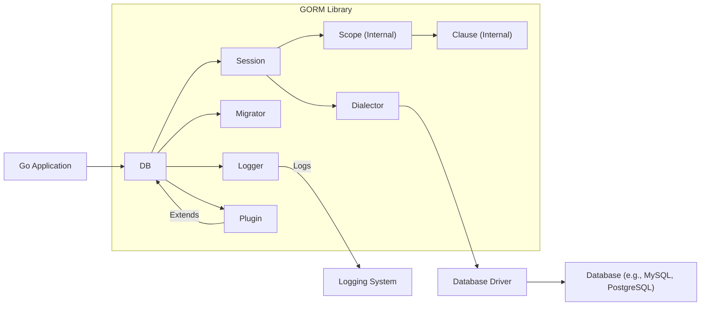

# Project Design Document: Go-ORM (GORM) - Improved

**Document Version:** 1.1
**Date:** October 26, 2023
**Author:** AI Software Architect

## 1. Introduction

This document provides an enhanced and more detailed design overview of the Go-ORM (GORM) library, specifically tailored for threat modeling purposes. Building upon the previous version, this document further elaborates on the architectural components, data flow, and security considerations relevant to GORM. The aim is to provide a comprehensive understanding of GORM's internals to facilitate effective threat identification and mitigation strategies.

## 2. Project Overview

Go-ORM (GORM) simplifies database interactions in Go applications by providing an Object-Relational Mapping layer. It abstracts away raw SQL, enabling developers to work with database records as Go objects. Key features include:

*   Comprehensive CRUD (Create, Read, Update, Delete) operations with a fluent API.
*   Advanced relationship management:
    *   `Has One`
    *   `Belongs To`
    *   `Has Many`
    *   `Many To Many`
    *   Polymorphic Associations
*   Database transaction management with support for nested transactions.
*   Schema migration capabilities for evolving database structures.
*   Extensible callback (hook) system for intercepting database operations.
*   Eager loading (preloading) of associated data to optimize query performance.
*   Customizable logging mechanisms for monitoring database interactions.
*   Plugin architecture for extending and customizing GORM's behavior.
*   Support for various database systems through database-specific dialectors.

## 3. Architectural Design

GORM's architecture revolves around the central `DB` object, which acts as the primary interface for database interactions. The following components contribute to its functionality:

*   **`DB` (Database Object):**
    *   The core object representing a pool of connections to the underlying database.
    *   Manages the lifecycle of database connections, including opening, closing, and reusing connections.
    *   Serves as the entry point for most GORM operations initiated by the application.
    *   Holds crucial configuration details such as the database dialect, connection string, maximum idle connections, and the configured logger.

*   **`Session`:**
    *   Represents a single, isolated unit of work with the database.
    *   Used for executing queries, managing transactions (including ACID properties), and ensuring data consistency within an operation.
    *   Sessions can be derived from the `DB` object, allowing for concurrent and isolated database operations.
    *   Maintains contextual state relevant to the current operation, such as preloading directives, query scopes, and transaction status.

*   **`Dialector`:**
    *   An interface responsible for abstracting database-specific SQL generation and connection details.
    *   Concrete implementations exist for various relational databases (e.g., `github.com/go-sql-driver/mysql` for MySQL, `github.com/lib/pq` for PostgreSQL, `modernc.org/sqlite` for SQLite, `github.com/microsoft/go-mssqldb` for SQL Server).
    *   Handles the nuances of SQL syntax, data type mappings, and connection parameters specific to each database system.

*   **`Migrator`:**
    *   A component dedicated to managing database schema changes in a controlled and versioned manner.
    *   Allows developers to define migrations in Go code, specifying the creation, modification, and deletion of tables, columns, and indexes.
    *   Tracks applied migrations in a dedicated table, ensuring that migrations are applied only once and in the correct order, providing idempotency.

*   **`Logger`:**
    *   An interface defining how GORM logs SQL queries, errors, and other relevant events.
    *   Allows for customization of logging output format, destination (e.g., console, file), and severity levels.
    *   Crucial for debugging database interactions and monitoring application behavior. GORM provides a default logger, and users can implement custom loggers.

*   **`Scope` (Internal):**
    *   An internal structure that holds the context of a query being constructed.
    *   Manages various aspects of the query, including `WHERE` conditions, `ORDER BY` clauses, `LIMIT` and `OFFSET` values, and selected fields.
    *   Provides methods for programmatically building SQL queries based on GORM's API calls.

*   **`Clause` (Internal):**
    *   Represents individual components of a SQL query, such as `SELECT`, `FROM`, `JOIN`, `WHERE`, etc.
    *   Used by the `Scope` to assemble the complete SQL statement. Each clause has its own structure and logic for SQL generation.

*   **`Plugin`:**
    *   A mechanism for extending GORM's functionality by hooking into its lifecycle events.
    *   Plugins can intercept and modify GORM's behavior at various stages of database operations (e.g., before saving a record, after querying data).
    *   Allows developers to add custom logic for auditing, data encryption, or other cross-cutting concerns.

## 4. Data Flow

Understanding the data flow within GORM is crucial for identifying potential threat vectors. Here's a breakdown of typical operations:

**Data Retrieval (Read):**

1. **Application Request:** The Go application initiates a data retrieval operation using GORM's API (e.g., `db.First(&user, "id = ?", 1)`).
2. **Session Handling:** A `Session` is either implicitly created or explicitly used for the operation.
3. **Query Construction:** GORM's query builder (`Scope` and `Clause`) translates the API call into an internal query representation.
4. **Dialect Translation:** The appropriate `Dialector` converts the internal representation into a database-specific SQL `SELECT` statement, including parameterization for security.
5. **Driver Interaction:** The `Dialector` uses the underlying database driver to execute the SQL query against the database.
6. **Database Response:** The database returns the result set.
7. **Data Mapping:** GORM maps the database rows back to Go structs, populating the fields of the provided model.
8. **Application Response:** The retrieved data is returned to the Go application.

**Data Creation (Create):**

1. **Application Request:** The Go application creates a new Go struct representing the data to be inserted and calls GORM's `Create` method (e.g., `db.Create(&newUser)`).
2. **Session Handling:** A `Session` manages the transaction for the create operation.
3. **SQL Generation:** GORM generates an `INSERT` SQL statement based on the struct's fields and the database schema, utilizing the `Dialector` for database-specific syntax.
4. **Driver Interaction:** The database driver executes the `INSERT` statement.
5. **Database Response:** The database confirms the successful insertion, potentially returning auto-generated IDs.
6. **Data Population:** GORM updates the Go struct with any auto-generated values (e.g., primary keys).
7. **Application Response:** The updated Go struct is returned to the application.

**Data Update (Update):**

1. **Application Request:** The Go application modifies an existing Go struct and calls GORM's `Save` or `Update` methods (e.g., `db.Save(&updatedUser)` or `db.Model(&user).Update("name", "New Name")`).
2. **Session Handling:** A `Session` manages the transaction for the update operation.
3. **SQL Generation:** GORM generates an `UPDATE` SQL statement, identifying the record to update (typically using the primary key) and setting the modified fields. The `Dialector` ensures database-specific syntax.
4. **Driver Interaction:** The database driver executes the `UPDATE` statement.
5. **Database Response:** The database confirms the successful update.
6. **Application Response:** The updated Go struct or confirmation is returned.

**Data Deletion (Delete):**

1. **Application Request:** The Go application calls GORM's `Delete` method to remove a record (e.g., `db.Delete(&user)` or `db.Where("name = ?", "Old Name").Delete(&User{})`).
2. **Session Handling:** A `Session` manages the transaction for the delete operation.
3. **SQL Generation:** GORM generates a `DELETE` SQL statement, identifying the record(s) to delete based on the provided model or conditions. The `Dialector` handles database-specific syntax.
4. **Driver Interaction:** The database driver executes the `DELETE` statement.
5. **Database Response:** The database confirms the successful deletion.
6. **Application Response:** Confirmation of deletion is returned.

```mermaid
graph TD
    subgraph "Data Retrieval Flow"
        A1["Go Application (Read Request)"] --> B1["GORM Session"]
        B1 --> C1["Query Builder (Scope/Clause)"]
        C1 --> D1["Dialector"]
        D1 --> E1["Database Driver"]
        E1 --> F1["Database"]
        F1 --> G1["Database Driver (Response)"]
        G1 --> H1["GORM Data Mapping"]
        H1 --> I1["Go Application (Data Response)"]
    end

    subgraph "Data Creation Flow"
        A2["Go Application (Create Request)"] --> B2["GORM Session"]
        B2 --> C2["SQL Generator"]
        C2 --> D2["Dialector"]
        D2 --> E2["Database Driver"]
        E2 --> F2["Database"]
        F2 --> G2["Database Driver (Response)"]
        G2 --> H2["GORM (Update Struct)"]
        H2 --> I2["Go Application (Confirmation)"]
    end

    subgraph "Data Update Flow"
        A3["Go Application (Update Request)"] --> B3["GORM Session"]
        B3 --> C3["SQL Generator"]
        C3 --> D3["Dialector"]
        D3 --> E3["Database Driver"]
        E3 --> F3["Database"]
        F3 --> G3["Database Driver (Response)"]
        G3 --> I3["Go Application (Confirmation)"]
    end

    subgraph "Data Deletion Flow"
        A4["Go Application (Delete Request)"] --> B4["GORM Session"]
        B4 --> C4["SQL Generator"]
        C4 --> D4["Dialector"]
        D4 --> E4["Database Driver"]
        E4 --> F4["Database"]
        F4 --> G4["Database Driver (Response)"]
        G4 --> I4["Go Application (Confirmation)"]
    end
```

## 5. Key Security Considerations

Security vulnerabilities can arise at various points in the GORM lifecycle. Understanding these potential issues is crucial for building secure applications:

*   **SQL Injection Vulnerabilities:**
    *   **Risk:**  Improperly constructed SQL queries, especially when incorporating user-supplied input without proper sanitization or parameterization, can lead to SQL injection attacks. Attackers can inject malicious SQL code to bypass security controls, access sensitive data, modify data, or even execute arbitrary commands on the database server.
    *   **Mitigation:**
        *   **Always use parameterized queries:** GORM's default behavior with its query builder methods inherently uses parameterized queries, which prevent SQL injection by treating user input as data, not executable code.
        *   **Avoid raw SQL queries where possible:** If raw SQL is necessary, use GORM's `Exec` or `Raw` methods with placeholder arguments to ensure proper parameterization.
        *   **Be cautious with dynamic query construction:** When building queries dynamically, ensure that all user-provided values are properly escaped or parameterized.

*   **Data Exposure through Logging:**
    *   **Risk:**  Logging SQL queries with sensitive data (e.g., passwords, API keys, personal information) can inadvertently expose this information to unauthorized individuals if the logs are not properly secured.
    *   **Mitigation:**
        *   **Configure logging carefully:** Review the logging configuration and ensure that sensitive data is not being logged.
        *   **Implement custom loggers:** Create custom `Logger` implementations that redact or mask sensitive information before logging.
        *   **Secure log storage:** Ensure that log files are stored securely with appropriate access controls.

*   **Insecure Deserialization (Less Direct, but Potential with Custom Types):**
    *   **Risk:** If GORM is used with custom data types that involve deserialization of data from the database, vulnerabilities related to insecure deserialization could arise if the deserialization process is not handled carefully.
    *   **Mitigation:**
        *   **Validate deserialized data:** Implement robust validation of data retrieved from the database, especially if custom types or complex data structures are involved.
        *   **Avoid deserializing untrusted data:** Be cautious when deserializing data from external sources or user input.

*   **Authorization and Access Control Bypass:**
    *   **Risk:** GORM itself does not handle application-level authorization. If authorization checks are not implemented correctly in the application logic before GORM operations, attackers might be able to bypass access controls and perform unauthorized actions.
    *   **Mitigation:**
        *   **Implement robust authorization checks:** Enforce authorization rules at the application layer before invoking GORM methods.
        *   **Leverage database-level security:** Utilize the database's built-in access control mechanisms to restrict access to tables and operations based on user roles and permissions.

*   **Vulnerabilities in Database Drivers:**
    *   **Risk:** Security vulnerabilities in the underlying database drivers used by GORM can directly impact the security of the application.
    *   **Mitigation:**
        *   **Keep drivers up-to-date:** Regularly update the database drivers to the latest versions to patch known vulnerabilities.
        *   **Use official and reputable drivers:** Rely on officially maintained and well-vetted database drivers.

*   **Security Risks in Plugins and Callbacks:**
    *   **Risk:** Custom plugins or callbacks might introduce security vulnerabilities if they are not developed with security in mind. For example, a poorly written callback could introduce SQL injection or authorization bypass issues.
    *   **Mitigation:**
        *   **Thoroughly review and test custom plugins and callbacks:** Conduct security reviews and penetration testing of any custom logic added to GORM.
        *   **Follow secure coding practices:** Ensure that plugins and callbacks adhere to secure coding principles to prevent common vulnerabilities.

*   **Mass Assignment Vulnerabilities:**
    *   **Risk:** If GORM models are directly populated with user input without careful control over which fields can be updated, attackers might be able to modify unintended fields, including sensitive ones.
    *   **Mitigation:**
        *   **Use `Select` for controlled updates:** When updating records, use GORM's `Select` method to explicitly specify which fields can be updated, preventing mass assignment vulnerabilities.
        *   **Define fillable/guarded attributes:** Some ORM patterns involve defining which model attributes are "fillable" (can be mass-assigned) or "guarded" (protected from mass assignment). While GORM doesn't have explicit built-in features for this, the concept can be applied in application logic.

## 6. Deployment Scenarios

GORM's deployment context influences the potential attack surface. Common scenarios include:

*   **Web Applications (Backend API):**
    *   GORM is commonly used in the backend of web applications to handle data persistence.
    *   **Security Considerations:**  Vulnerable endpoints interacting with GORM could be targets for SQL injection or mass assignment attacks. Secure coding practices in API handlers are crucial.

*   **Command-Line Interfaces (CLIs):**
    *   CLIs using GORM might interact with databases based on user commands.
    *   **Security Considerations:** Input validation for CLI arguments that influence GORM queries is essential to prevent malicious commands.

*   **Background Services and Workers:**
    *   Services performing background data processing often use GORM.
    *   **Security Considerations:** Secure configuration and credential management are vital, as these services might operate without direct user interaction.

*   **Microservices Architecture:**
    *   Individual microservices might use GORM to manage their dedicated data stores.
    *   **Security Considerations:**  Proper authentication and authorization between microservices are important, especially when data accessed via GORM is involved.

## 7. Technology Stack

*   **Core Library:** `gorm.io/gorm`
*   **Programming Language:** Go (version 1.13 or higher recommended)
*   **Supported Database Systems (via Dialectors):**
    *   MySQL (`github.com/go-sql-driver/mysql`)
    *   PostgreSQL (`github.com/lib/pq`)
    *   SQLite (`modernc.org/sqlite`)
    *   SQL Server (`github.com/microsoft/go-mssqldb`)
    *   TiDB (`github.com/pingcap/tidb/pkg/store/driver/mysql`)
    *   ClickHouse (`github.com/ClickHouse/clickhouse-go/v2`)
    *   And many other community-supported dialects.
*   **Database Drivers:**  Specific database drivers are used by the `Dialector` implementations to communicate with the respective database systems. The choice of driver can impact performance and security.

## 8. Future Considerations

*   Detailed analysis of specific GORM middleware or extension points that could be leveraged for security enhancements (e.g., query rewriting, audit logging).
*   Exploration of integration with security scanning tools to identify potential vulnerabilities in GORM usage.
*   Best practices for using GORM in conjunction with other security libraries or frameworks in Go.

This improved design document provides a more in-depth understanding of GORM's architecture and potential security considerations. This information is critical for conducting thorough threat modeling exercises and implementing appropriate security measures when using GORM in Go applications.
