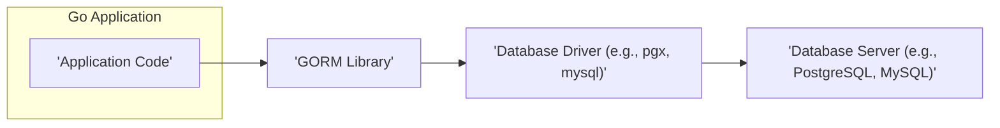

# Project Design Document: Go-GORM (Object-Relational Mapper for Go)

**Version:** 1.1
**Date:** October 26, 2023
**Author:** AI Software Architect

## 1. Introduction

This document provides a detailed architectural design of the Go-GORM library, a widely used Object-Relational Mapper (ORM) for the Go programming language. This document aims to provide a comprehensive understanding of GORM's internal structure, data flow, and key components. It will serve as the foundation for subsequent threat modeling activities, enabling a thorough assessment of potential security vulnerabilities.

## 2. Goals

*   Provide a clear and concise overview of GORM's architecture and its internal workings.
*   Describe the key components of GORM, detailing their responsibilities and interactions.
*   Illustrate the typical data flow during common database operations with a focus on potential security implications.
*   Identify potential areas of security concern and common pitfalls for developers using GORM, facilitating effective threat modeling.

## 3. Non-Goals

*   Detailed, line-by-line code-level implementation specifics within the GORM library.
*   Performance benchmarking or in-depth optimization strategies for GORM usage.
*   A comparative analysis of GORM against other ORM libraries available in the Go ecosystem.
*   Specific deployment configurations or infrastructure setup details for applications utilizing GORM.

## 4. Architecture and Design

### 4.1. High-Level Architecture



The Go application interacts with the GORM library to abstract database interactions. GORM then leverages specific database drivers to translate these interactions into commands understood by the underlying database server.

### 4.2. Key Components

*   **`gorm.DB`:** This is the central and primary entry point for any interaction with the GORM library. It acts as a factory and manager, holding the database connection pool, managing transaction states, providing access to the logger, and storing global configuration settings for GORM.
*   **`Model`:** Represents a Go struct that is intended to be mapped to a database table. GORM utilizes Go's reflection capabilities to introspect the structure of these models, understanding their fields, data types, and defined relationships.
*   **`Session` (Implicit):** While not a directly exposed type, GORM internally manages sessions for each database operation. This session holds the context for the current operation, including the database connection, any ongoing transaction, and applied query modifiers.
*   **`Statement`:** Represents the structured representation of an SQL query being built by GORM. It contains information about the SQL clauses (SELECT, WHERE, etc.), the target table, and the parameters to be used in the query.
*   **`Clause`:** Represents individual components or sections of an SQL query. GORM employs a clause-based approach to construct SQL queries, with specific clauses for `WHERE` conditions, `ORDER BY` specifications, `JOIN` operations, and more.
*   **`Dialector`:** An interface defining the contract for database-specific functionalities. Concrete implementations of the `Dialector` interface are provided for different database systems (e.g., `postgres.Dialector`, `mysql.Dialector`, `sqlite.Dialector`). The `Dialector` is responsible for tasks such as generating database-specific connection strings, mapping Go data types to database column types, and adapting SQL syntax to the target database's dialect.
*   **`Migrator`:**  A component dedicated to managing database schema changes. The `Migrator` allows developers to create, alter, and drop tables and columns based on the defined Go models, facilitating database schema evolution alongside application code changes.
*   **`Logger`:**  Responsible for handling the logging of SQL queries executed by GORM, along with other relevant information such as errors and warnings. GORM provides customizable logging interfaces, allowing developers to integrate with various logging solutions and control the level of detail in the logs.
*   **`Callbacks` (Hooks):**  Provide a mechanism for developers to intercept and modify GORM's behavior at specific points during database operations. These callbacks (also known as hooks) can be registered to execute before or after actions like creating, updating, deleting, or querying records, enabling custom logic and auditing.

### 4.3. Data Flow

#### 4.3.1. Creating a Record

```mermaid
graph LR
    A["'Application Code'"] --> B["'gorm.DB.Create(&user)'"]
    B --> C["'Session Initialization'"]
    C --> D["'Model Introspection (Reflection)'"]
    D --> E["'Callback Invocation (Before Create)'"]
    E --> F["'Statement Builder (INSERT)'"]
    F --> G["'Clause Processing'"]
    G --> H["'Dialector (SQL Generation)'"]
    H --> I["'Database Driver'"]
    I --> J["'Database Server'"]
    J --> K["'Database Driver'"]
    K --> L["'Callback Invocation (After Create)'"]
    L --> M["'Return Result'"]
    M --> A
```



1. The application initiates the record creation process by calling the `Create` method on the `gorm.DB` instance, passing a pointer to the model instance to be saved.
2. GORM initializes a new internal session to manage the context of this operation.
3. GORM uses reflection to examine the structure and data of the provided model.
4. Any registered "Before Create" callbacks (hooks) are executed, allowing for pre-processing or validation.
5. The `Statement Builder` constructs the `INSERT` SQL query based on the model's fields and values.
6. Relevant clauses (e.g., specifying columns and values) are processed and added to the statement.
7. The appropriate `Dialector` translates the generic SQL statement into the specific SQL dialect required by the target database.
8. GORM utilizes the configured `Database Driver` to send the generated SQL query to the database server.
9. The `Database Server` executes the `INSERT` query and stores the new record.
10. The `Database Driver` receives the result of the operation from the database server.
11. Any registered "After Create" callbacks (hooks) are executed, allowing for post-processing.
12. GORM processes the result (e.g., updating the model's primary key if auto-increment is used) and returns it to the application.

#### 4.3.2. Querying Records

```mermaid
graph LR
    A["'Application Code'"] --> B["'gorm.DB.Where(\"name = ?\", \"John\").Find(&users)'"]
    B --> C["'Session Initialization'"]
    C --> D["'Model Introspection (Reflection)'"]
    D --> E["'Statement Builder (SELECT)'"]
    E --> F["'Clause Builder (WHERE)'"]
    F --> G["'Clause Processing (e.g., escaping parameters)'"]
    G --> H["'Dialector (SQL Generation)'"]
    H --> I["'Database Driver'"]
    I --> J["'Database Server'"]
    J --> K["'Database Driver'"]
    K --> L["'Data Mapping (Rows to Structs)'"]
    L --> M["'Return Result'"]
    M --> A
```

1. The application initiates a query by calling a method like `Where` and `Find` on the `gorm.DB` instance, specifying query conditions and the target model.
2. GORM initializes a new internal session for this query operation.
3. GORM analyzes the target model to understand its structure and relationships.
4. The `Statement Builder` begins constructing the `SELECT` SQL query.
5. The `Clause Builder` for the `WHERE` clause processes the provided conditions.
6. Crucially, GORM handles parameter binding and escaping to prevent SQL injection vulnerabilities at this stage.
7. The `Dialector` generates the database-specific SQL for the `SELECT` query.
8. GORM uses the `Database Driver` to execute the query against the database server.
9. The `Database Server` processes the `SELECT` query and retrieves the matching records.
10. The `Database Driver` returns the result set (rows of data) to GORM.
11. GORM maps the rows from the result set back into instances of the specified Go struct (the model).
12. GORM returns the populated model instances to the application.

### 4.4. Key Interactions

*   **Application and `gorm.DB`:** This is the primary interface for developers. Applications interact with the database through methods provided by the `gorm.DB` instance.
*   **`gorm.DB` and `Dialector`:** `gorm.DB` delegates database-specific tasks, such as SQL generation and connection management, to the appropriate `Dialector` implementation based on the configured database.
*   **`Dialector` and `Database Driver`:** The `Dialector` utilizes the underlying `Database Driver` to establish connections to the database and execute the generated SQL queries.
*   **`gorm.DB` and `Migrator`:**  `gorm.DB` provides access to the `Migrator` component, allowing developers to manage database schema migrations programmatically.
*   **`Session` and Callbacks:** The internal session manages the execution context for database operations, including the invocation of registered callbacks at relevant stages.

## 5. Security Considerations

This section highlights potential security concerns and common vulnerabilities associated with using GORM, which are crucial for effective threat modeling.

*   **SQL Injection:**  A primary concern. While GORM provides parameterized queries and aims to prevent SQL injection, developers might still introduce vulnerabilities by:
    *   Using `Exec` or `Raw` methods with unsanitized user input.
    *   Dynamically constructing `WHERE` clauses or other query parts without proper escaping.
    *   Misunderstanding how GORM handles complex query conditions.
*   **Authentication and Authorization:** GORM relies on the underlying database driver for authentication. Security risks include:
    *   Hardcoding database credentials in the application code or configuration files.
    *   Using overly permissive database user accounts.
    *   Failing to enforce proper authorization checks within the application logic, even if GORM handles the database connection.
*   **Data Validation and Integrity:** GORM facilitates data mapping but doesn't inherently enforce complex business logic validation. Potential issues:
    *   Insufficient validation at the application level leading to invalid data being persisted.
    *   Lack of server-side validation allowing malicious data to bypass client-side checks.
    *   Reliance solely on database constraints, which might not cover all validation requirements.
*   **Mass Assignment Vulnerabilities:**  If not carefully controlled, allowing users to directly set model fields during creation or updates can lead to unintended or malicious data modification. GORM offers mechanisms like `Omit` and `Select` to mitigate this, but developers need to use them correctly.
*   **Logging Sensitive Information:**  If the GORM logger is configured to log SQL queries, and these queries contain sensitive data (e.g., user credentials, personal information), this information could be exposed in logs. Proper log management and redaction are crucial.
*   **Dependency Vulnerabilities:**  Vulnerabilities in the underlying database drivers or other dependencies used by GORM can indirectly impact the security of applications using GORM. Regularly updating dependencies is essential.
*   **Callback Abuse:**  Malicious or poorly written callbacks can introduce vulnerabilities by:
    *   Bypassing security checks implemented elsewhere.
    *   Performing unauthorized actions.
    *   Introducing performance bottlenecks or denial-of-service conditions.
*   **Information Disclosure through Errors:**  Detailed error messages from GORM or the database driver could inadvertently reveal sensitive information about the database structure, data, or application logic to attackers.
*   **Cross-Site Scripting (XSS) via Database Content:** If data retrieved from the database is directly rendered in web pages without proper sanitization, it could lead to XSS vulnerabilities. This is not a direct GORM vulnerability but a common pitfall when using ORMs.

## 6. Dependencies

*   Specific database driver implementations (e.g., `github.com/jackc/pgx/v5` for PostgreSQL, `github.com/go-sql-driver/mysql` for MySQL, `modernc.org/sqlite` for SQLite, `gorm.io/driver/sqlserver` for SQL Server).
*   Potentially other utility libraries used internally by GORM for tasks like reflection or string manipulation.

## 7. Deployment Considerations

GORM is typically deployed as a library integrated within a Go application. The security posture of the GORM integration is heavily influenced by the overall security of the application, the configuration of the database environment, and the security practices followed by the development team. Secure deployment practices include:

*   Securely managing database credentials.
*   Enforcing network security to restrict access to the database server.
*   Regularly patching and updating the database server and drivers.
*   Implementing proper input validation and output encoding in the application.

## 8. Future Considerations

*   Further enhancements to security documentation and the provision of clear best practices for secure GORM usage.
*   Exploring built-in mechanisms for common security tasks, such as more robust input sanitization helpers (though this might overlap with application-level responsibilities).
*   Development of or integration with static analysis tools specifically designed to detect potential security vulnerabilities in GORM usage patterns.
*   Improved guidance and tooling for secure database migrations.